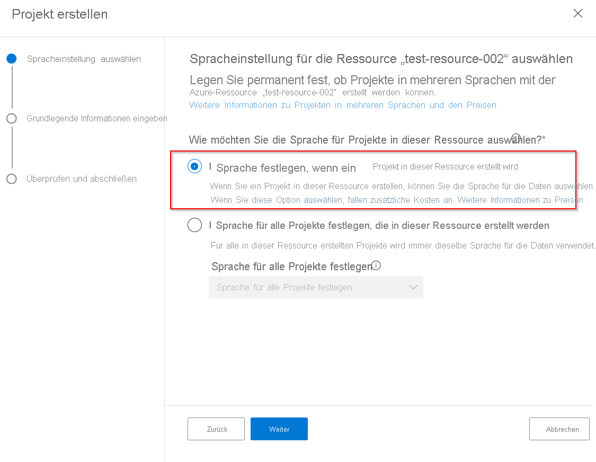
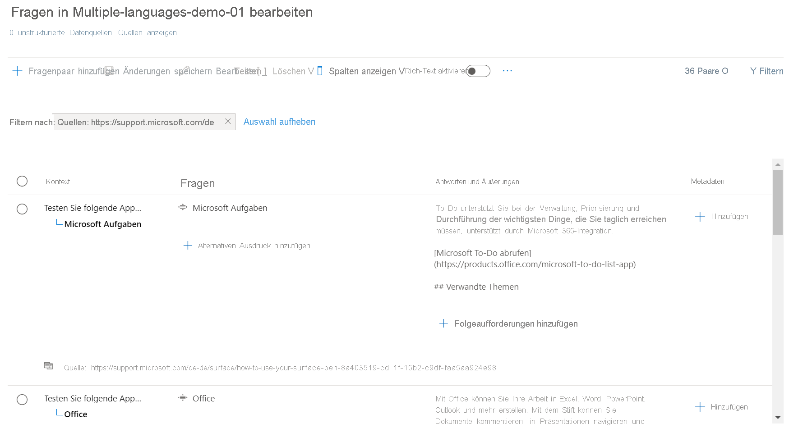

# Erstellen von Projekten in mehreren Sprachen

In diesem Tutorial lernen Sie Folgendes:

<!-- green checkmark -->
> [!div class="checklist"]
> * Erstellen eines Projekts, das Englisch unterstützt
> * Erstellen eines Projekts, das Deutsch unterstützt

In diesem Tutorial werden Sie durch die Schritte zum Erstellen von Projekten/Wissensdatenbanken in mehreren Sprachen geleitet. Zum Erstellen von Projekten in Deutsch und Englisch wird die [FAQ zu Surface Pen](https://support.microsoft.com/surface/how-to-use-your-surface-pen-8a403519-cd1f-15b2-c9df-faa5aa924e98)-URL verwendet. Anschließend stellen wir das Projekt bereit und verwenden die REST-API für Fragen und Antworten, um häufig gestellte Fragen in der gewünschten Sprache abzufragen und Antworten darauf zu erhalten.

## Erstellen eines Projekts in Deutsch

Um ein Projekt in mehr als einer Sprache erstellen zu können, muss bei der Erstellung des ersten Projekts für die Sprachressource die Einstellung für mehrere Sprachen festgelegt werden.

> [!div class="mx-imgBorder"]
> 

1. Wählen Sie auf der Startseite von [Language Studio](https://aka.ms/languageStudio) die Option „Benutzerdefinierte Fragen und Antworten öffnen“ aus. Wählen Sie **Neues Projekt erstellen** > **Ich möchte die Sprache auswählen, wenn ich ein neues Projekt in dieser Ressource erstelle** > **Weiter** aus.

2. Füllen Sie die Seite mit den grundlegenden Informationen aus, und wählen Sie **Weiter** > **Projekt erstellen** aus.

    |Einstellung| Wert|
    |---|----|
    |Name | Eindeutiger Name für Ihr Projekt|
    |BESCHREIBUNG | Eindeutige Beschreibung zur Identifizierung des Projekts |
    |Ausgangssprache | Wählen Sie für dieses Tutorial „Deutsch“ aus. |
    |Standardantwort | Standardantwort, wenn keine Antwort zurückgegeben wird |

    > [!div class="mx-imgBorder"]
    > 

3. **Quelle hinzufügen** > **URLs** > **URL hinzufügen** > **Alle hinzufügen**.

    |Einstellung| Wert |
    |----|------|
    | URL-Name | Surface Pen Deutsch |
    | URL | https://support.microsoft.com/de-de/surface/how-to-use-your-surface-pen-8a403519-cd1f-15b2-c9df-faa5aa924e98 |
    | Dateistruktur klassifizieren | Automatische Erkennung |
    
    „Fragen und Antworten“ liest das Dokument und extrahiert Frage-Antwort-Paare aus der Quell-URL, um das Projekt/die Wissensdatenbank in deutscher Sprache zu erstellen. Wenn Sie den Link zur Quelle auswählen, wird die Wissensdatenbankseite geöffnet, auf der wir den Inhalt bearbeiten können.
    
    > [!div class="mx-imgBorder"]
    > 
    
## Erstellen eines Projekts in Englisch

Wir wiederholen nun die obigen Schritte von oben, wählen dieses Mal aber „Englisch“ aus und geben eine englische URL als Quelle an.

1. Öffnen Sie in [Language Studio](https://aka.ms/languageStudio) die Seite „Fragen und Antworten“ und wählen Sie **Neues Projekt erstellen** aus.

2. Füllen Sie die Seite mit den grundlegenden Informationen aus, und wählen Sie **Weiter** > **Projekt erstellen** aus.

    |Einstellung| Wert|
    |---|----|
    |Name | Eindeutiger Name für Ihr Projekt|
    |BESCHREIBUNG | Eindeutige Beschreibung zur Identifizierung des Projekts |
    |Ausgangssprache | Wählen Sie für dieses Tutorial „Englisch“ aus. |
    |Standardantwort | Standardantwort, wenn keine Antwort zurückgegeben wird |

3. **Quelle hinzufügen** > **URLs** > **URL hinzufügen** > **Alle hinzufügen**.

    |Einstellung| Wert |
    |-----|-----|
    | URL-Name | Surface Pen Deutsch |
    | URL | https://support.microsoft.com/en-us/surface/how-to-use-your-surface-pen-8a403519-cd1f-15b2-c9df-faa5aa924e98 |
    | Dateistruktur klassifizieren | Automatische Erkennung |

## Veröffentlichen und Abfragen der Wissensdatenbank

Wir können jetzt beiden Projekte/Wissensdatenbanken bereitstellen und mithilfe der REST-API für Fragen und Antworten in der gewünschten Sprache abfragen. Nachdem ein Projekt bereitgestellt wurde, wird die folgende Seite mit Details dazu angezeigt, wie Abfragen an die Wissensdatenbank gesendet werden.

> [!div class="mx-imgBorder"]
> 

Die Sprache für die eingehende Benutzerabfrage kann mit der [Sprachenerkennung-API](../../language-detection/how-to/call-api.md) erkannt werden, und der Benutzer kann je nach erkannter Sprache den entsprechenden Endpunkt und die entsprechende Wissensdatenbank aufrufen.
