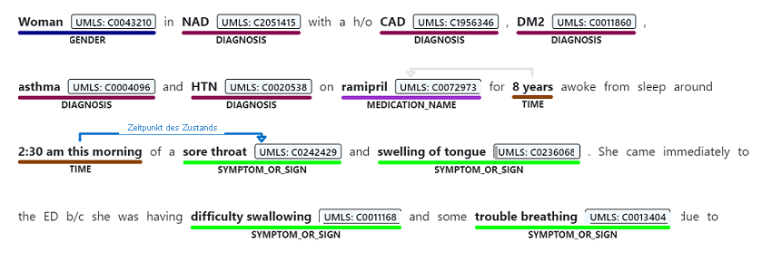

# [Erkennung benannter Entitäten](#tab/ner)

Die Erkennung benannter Entitäten erkennt Wörter und Ausdrücke in unstrukturiertem Text, die einem oder mehr semantischen Typen zugeordnet werden können, wie etwa Diagnose, Namen von Medikamenten, Symptom/Auffälligkeit oder Alter.

> [!div class="mx-imgBorder"]
> 

# [Beziehungsextrahierung](#tab/relation-extraction)

Die Beziehungsextrahierung identifiziert sinnvolle Verbindungen zwischen Begriffen, die im Text erwähnt werden. Beispielsweise wird die Beziehung „Zeit der Erkrankung“ durch Zuordnen eines Erkrankungsnamens zu einer Zeit ermittelt, oder eine Beziehung wird durch Zuordnen einer Abkürzung mit der vollständigen Beschreibung ermittelt.  

> [!div class="mx-imgBorder"]
> 

# [Entitätsverknüpfung](#tab/entity-linking)

Durch Entitätsverknüpfung werden verschiedene Entitäten unterschieden, indem im Text erwähnte benannte Entitäten Konzepten aus einer vordefinierten Konzeptdatenbank, einschließlich des Unified Medical Language System (UMLS), zugeordnet werden. Medizinischen Konzepten wird als zusätzliche Form der Normalisierung auch eine bevorzugte Benennung zugewiesen.

> [!div class="mx-imgBorder"]
> 

Text Analytics for Health unterstützt die Verknüpfung mit den Vokabularen für Gesundheit und Biomedizin in der Metathesaurus Knowledge Source des Unified Medical Language System ([UMLS](https://www.nlm.nih.gov/research/umls/sourcereleasedocs/index.html)).

# [Assertionserkennung](#tab/assertion-detection) 

Die Bedeutung medizinischer Inhalte wird in hohem Maße durch Modifizierer beeinflusst, z. B. negative oder bedingte Assertionen, die bei Fehldarstellung kritische Auswirkungen haben können. Text Analytics for Health unterstützt drei Kategorien der Assertionserkennung für Entitäten im Text: 

* Sicherheit
* Bedingt
* Zuordnung

> [!div class="mx-imgBorder"]
> 

---
