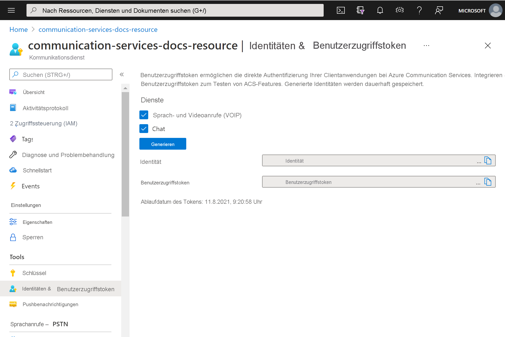

# <a name="quickstart-quickly-create-azure-communication-services-access-tokens-for-testing"></a>Eine Schnellstartanleitung für das schnelle Erstellen von Azure Communication Services Identitäten zum Testen

In der Communication Services-Erweiterung des [Azure-Portal](https://portal.azure.com) können Sie eine Communication Services-Identität und Zugriffstoken generieren. Auf diese Weise können Sie die Erstellung eines Authentifizierungsdiensts überspringen. Das erleichtert Ihnen das Testen der Beispiel-Apps und einfacher Entwicklungsszenarien. Diese Funktion ist für kleinere Überprüfungen und Tests vorgesehen und sollte nicht für die Produktionsszenarien verwendet werden. Produktionscode finden Sie in der [Schnellstartanleitung zum Erstellen von Zugriffstoken](../access-tokens.md).

Das Tool zeigt das Verhalten von ```Identity SDK``` in einer einfachen Benutzeroberfläche. Token und Identitäten, die mit diesem Tool erstellt werden, folgen dem gleichen Verhalten und den gleichen Regeln, als ob sie mit der ```Identity SDK``` erstellt würden.  Beispielsweise laufen Zugriffstoken nach 24 Stunden ab.

## <a name="prerequisites"></a>Voraussetzungen

- Eine [Azure Communication Services-Ressource](../create-communication-resource.md)

## <a name="create-the-access-tokens"></a>Erstellen der Zugriffstoken

Navigieren Sie im [Azure-Portal](https://portal.azure.com) zu dem Blatt **Identitäten und Benutzerzugriffstoken** in Ihrer Communication Services-Ressource. 

Wählen Sie den Umfang der Zugriffstoken aus. Sie können keine, eine oder mehrere auswählen. Klicken Sie auf **Generate (Generieren)** .


Sie werden sehen, dass eine Identität und ein entsprechendes Benutzerzugriffstoken generiert werden. Sie können diese Zeichenfolgen kopieren und in den [Beispiel-Apps](../../samples/overview.md) und anderen Testszenarien verwenden.



## <a name="next-steps"></a>Nächste Schritte


Das könnte Sie auch interessieren:

 - [Informationen zur Authentifizierung](../../concepts/authentication.md)
 - [Erfahren Sie mehr über die Client- und Serverarchitektur](../../concepts/client-and-server-architecture.md)
