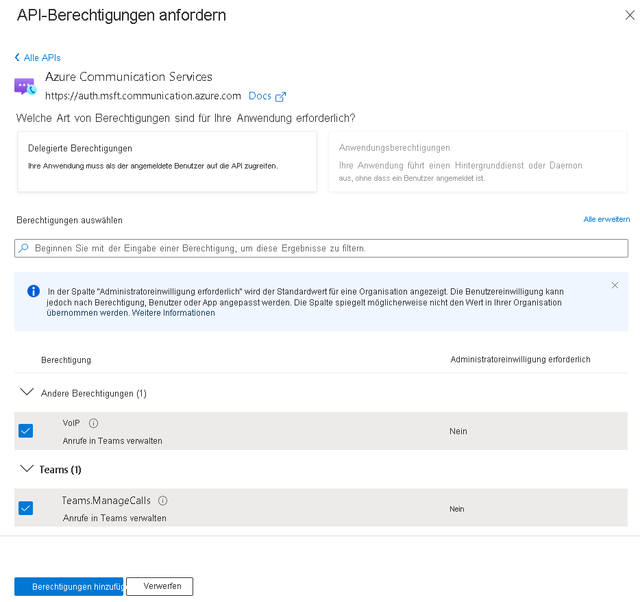

# <a name="quickstart-set-up-and-manage-teams-access-tokens"></a>Schnellstart: Einrichten und Verwalten von Teams-Zugriffstoken

> [!IMPORTANT]
> Dieses Feature ist nur als Vorschau verfügbar. Wenn Sie einen benutzerdefinierten Teams-Endpunkt aktivieren oder deaktivieren möchten, [füllen Sie dieses Formular aus und übermitteln es](https://forms.office.com/r/B8p5KqCH19).

In dieser Schnellstartanleitung erstellen Sie eine .NET-Konsolenanwendung, um einen Microsoft 365-Benutzer mithilfe der Microsoft Authentication Library (MSAL) und durch den Abruf eines Azure Active Directory-Benutzertokens (Azure AD) zu authentifizieren. Dieses Token wird dann mit dem Azure Communication Services-Identitäts-SDK gegen ein Teams-Zugriffstoken ausgetauscht. Das Teams-Zugriffstoken kann dann vom Communication Services-Anruf-SDK verwendet werden, um einen benutzerdefinierten Teams-Endpunkt zu erstellen.

> [!NOTE]
> Wenn Sie sich in einer Produktionsumgebung befinden, wird empfohlen, diesen Austauschmechanismus in Back-End-Diensten zu implementieren, da Anforderungen für einen Austausch mit einem Geheimnis signiert werden.

## <a name="prerequisites"></a>Voraussetzungen
- Ein Azure-Konto mit einem aktiven Abonnement. Sie können [kostenlos ein Konto erstellen](https://azure.microsoft.com/free/?WT.mc_id=A261C142F).
- Eine aktive Azure Communication Services-Ressource und eine Verbindungszeichenfolge. Ausführlichere Informationen hierzu finden Sie unter [Schnellstart: Erstellen und Verwalten einer Communication Services-Ressource](./create-communication-resource.md).
- Aktivieren Sie einen benutzerdefinierte Teams-Endpunkt, indem Sie [dieses Formular ausfüllen und übermitteln](https://forms.office.com/r/B8p5KqCH19).
- Eine Azure Active Directory-Instanz mit Benutzern mit einer Teams-Lizenz.

## <a name="introduction"></a>Einführung

Teams-Identitäten sind an Mandanten in Azure Active Directory gebunden. Ihre Anwendung kann von Benutzern desselben oder eines beliebigen anderen Mandanten verwendet werden. In diesem Schnellstart wird ein Anwendungsfall mit mehreren Mandanten und mehreren Mandanten beschrieben: Benutzer, Entwickler und Administratoren der fiktiven Unternehmen Contoso und Fabrikam. In diesem Fall ist Contoso ein Unternehmen, das eine SaaS-Lösung (Software-as-a-Service) für Fabrikam erstellt. 

Die folgenden Abschnitte führen Sie durch die Schritte für Administratoren, Entwickler und Benutzer. Die Diagramme veranschaulichen den Anwendungsfall mit mehreren Mandanten. Wenn Sie nur einen Mandanten verwenden, führen Sie alle Schritte für Contoso und Fabrikam in diesem Mandanten aus.

## <a name="administrator-actions"></a>Administratoraktionen

Die Administratorrolle verfügt in AAD über erweiterte Berechtigungen. Mitglieder dieser Rolle können Ressourcen einrichten und Informationen im Azure-Portal lesen. Im folgenden Diagramm werden alle Aktionen angezeigt, die von Administratoren ausgeführt werden müssen.


1. Der Administrator von Contoso erstellt eine *Anwendung* in Azure Active Directory oder wählt eine vorhandene aus. Die Eigenschaft *Unterstützte Kontotypen* legt fest, ob Benutzer aus einem anderen Mandanten sich bei der Anwendung authentifizieren können. Die Eigenschaft *Umleitungs-URI* dient zur Umleitung einer erfolgreichen Authentifizierungsanforderung an den *Server* von Contoso.
1. Der Contoso-Administrator erweitert das Anwendungsmanifest mit Communication Services VoIP-Berechtigung. 
1. Der Contoso-Administrator lässt den öffentlichen Clientflow für die Anwendung zu.
1. Der Contoso-Administrator kann optional Aktualisierungen vornehmen.
1. Der Contoso-Administrator aktiviert den Endpunkt, indem er [dieses Formular ausfüllt und übermittelt](https://forms.office.com/r/B8p5KqCH19).
1. Der Administrator von Contoso erstellt die Communication Services-Dienste, die für die Authentifizierung der Austauschanforderungen verwendet werden, oder wählt vorhandene aus. AAD-Benutzertoken werden gegen Teams-Zugriffstoken ausgetauscht. Ausführlichere Informationen hierzu finden Sie unter [Schnellstart: Erstellen und Verwalten einer Communication Services-Ressource](./create-communication-resource.md).
1. Der Fabrikam-Administrator richtet einen neuen Dienstprinzipal für Communication Services im Fabrikam-Mandanten ein. Dieser Schritt ist erforderlich, wenn die Anwendung fehlt.
1. Der Fabrikam-Administrator erteilt Communication Services die VoIP-Berechtigung und/oder die `Teams.ManageCalls`-Berechtigung für die Contoso-Anwendung. Dieser Schritt ist nur erforderlich, wenn die Anwendung von Contoso nicht überprüft wurde. 

### <a name="step-1-create-an-azure-ad-application-registration-or-select-an-azure-ad-application"></a>Schritt 1: Erstellen einer Azure AD Anwendungsregistrierung oder Auswählen einer Azure AD Anwendung 

Benutzer müssen bei AAD-Anwendungen mit der Berechtigung von Azure Communication Service VoIP authentifiziert werden. Wenn Sie nicht über eine Anwendung verfügen, die Sie für diesen Schnellstart verwenden möchten, können Sie eine neue Anwendungsregistrierung erstellen. 

Die folgenden Anwendungseinstellungen haben Einfluss auf die Vorgehensweise:
- Die Eigenschaft *Unterstützte Kontotypen* legt fest, ob die Anwendung einen einzelnen Mandanten („Nur Konten in diesem Organisationsverzeichnis“) oder mehrere Mandanten („Konten in einem beliebigen Organisationsverzeichnis“) unterstützt. In diesem Szenario verwenden Sie mehrere Mandanten.
- Der *Umleitungs-URI* definiert den URI, an den die Authentifizierungsanforderung nach der Authentifizierung umgeleitet wird. In diesem Szenario können Sie **Öffentlicher Client/nativ (mobil und Desktop)** verwenden und als URI **`http://localhost`** eingeben.

Weitere Informationen finden Sie unter [Registrieren einer Anwendung bei Microsoft Identity Platform](../../active-directory/develop/quickstart-register-app.md#register-an-application). 

Wenn die Anwendung registriert ist, wird in der Übersicht ein Bezeichner angezeigt. Dieser Bezeichner *Anwendungs-ID (des Client)* wird in den folgenden Schritten verwendet:

### <a name="step-2-allow-public-client-flows"></a>Schritt 2: Zulassen öffentlicher Clientflows

Im Bereich **Authentifizierung** Ihrer Anwendung wird als konfigurierte Plattform *Öffentlicher Client/nativ (mobil und Desktop)* mit einem auf *localhost* verweisenden Umleitungs-URI angezeigt. Am unteren Rand des Bereichs wird das Umschaltsteuerelement *Öffentliche Clientflows zulassen* angezeigt, das für diesen Schnellstart auf **Ja** gestellt werden sollte.

### <a name="step-3-optional-update-the-publisher-domain"></a>Schritt 3: (Optional) Aktualisieren der Herausgeberdomäne 
Im Bereich **Branding** können Sie Ihre Herausgeberdomäne für die Anwendung aktualisieren. Dies ist nützlich für Anwendungen mit mehreren Mandanten, bei denen die Anwendung als von Azure überprüft gekennzeichnet wird. Weitere Informationen finden Sie unter [Konfigurieren der Herausgeberdomäne einer Anwendung](../../active-directory/develop/howto-configure-publisher-domain.md).

### <a name="step-4-add-the-communication-services-permissions-in-the-application"></a>Schritt 4: Hinzufügen der Communication Services-Berechtigungen in der Anwendung

- Navigieren Sie im Azure-Portal zu Ihrer AAD-App, und wählen Sie **API-Berechtigungen** aus.
- Wählen Sie **Berechtigungen hinzufügen** aus.
- Wählen Sie im Menü **Berechtigungen hinzufügen** die Option **Azure Communication Services** aus.
- Wählen Sie die gewünschten Berechtigungen für **VoIP** und/oder **Teams.ManageCalls** aus, und klicken Sie auf **Berechtigungen hinzufügen**.



### <a name="step-5-create-or-select-a-communication-services-resource"></a>Schritt 5: Erstellen oder Auswählen einer Communication Services-Ressource

Mithilfe Ihrer Communication Services-Ressource werden alle Anforderungen für den Austausch von AAD-Benutzertoken mit Teams-Zugriffstoken authentifiziert. Sie können diesen Austausch mithilfe des Communication Services Identity SDK, das Sie mit einem Zugriffsschlüssel authentifizieren können, oder mithilfe der rollenbasierten Zugriffssteuerung (Role-Based Access Control, RBAC) von Azure auslösen. Sie können den Zugriffsschlüssel entweder im Azure-Portal abrufen oder Azure RBAC über den Bereich **Zugriffssteuerung (IAM)** konfigurieren.

Wenn Sie eine neue Communication Services-Ressource erstellen möchten, finden Sie weitere Informationen unter [Schnellstart: Erstellen und Verwalten einer Communication Services-Ressource](./create-communication-resource.md).

### <a name="step-6-set-up-a-communication-services-service-principal"></a>Schritt 6: Einrichten eines Communication Services-Dienstprinzipals

Um den benutzerdefinierten Teams-Endpunkt im Mandanten von Fabrikam zu aktivieren, muss der AAD-Administrator von Fabrikam einen Dienstprinzipal namens „Azure Communication Services“ mit der Anwendungs-ID *1fd5118e-2576-4263-8130-9503064c837a* einrichten. Wenn diese Anwendung nicht im Bereich für **Unternehmensanwendungen** in Azure Active Directory angezeigt wird, muss sie manuell hinzugefügt werden.

Der AAD-Administrator von Fabrikam stellt über PowerShell eine Verbindung mit dem Azure-Mandanten her. 

> [!NOTE]
> Ersetzen Sie im folgenden Befehl [Tenant_ID] durch die ID Ihres Mandanten, die Sie im Azure-Portal auf der Übersichtsseite der AAD-Instanz finden.

```azurepowershell
Connect-AzureAD -TenantId "[Tenant_ID]"
```

Wenn Sie den Fehler „Befehl wurde nicht gefunden“ erhalten, ist das AAD-Modul nicht in PowerShell installiert. Schließen Sie PowerShell und öffnen Sie es dann erneut als Administrator. Jetzt können Sie das AAD-Paket durch Ausführen des folgenden Befehls installieren:

```azurepowershell
Install-Module AzureAD
```

Nachdem Sie eine Verbindung mit dem Azure-Portal hergestellt und sich authentifiziert haben, richten Sie den Communication Services-Dienstprinzipal ein, indem Sie den folgenden Befehl ausführen: 

> [!NOTE]
> Der Parameter „AppId“ bezieht sich auf die Erstanbieteranwendung Communication Services. Ändern Sie diesen Wert nicht.

```azurepowershell
New-AzureADServicePrincipal -AppId "1fd5118e-2576-4263-8130-9503064c837a"
```

### <a name="step-7-provide-administrator-consent"></a>Schritt 7: Erteilen der Administratoreinwilligung

Wenn die Anwendung von Contoso nicht geprüft ist, muss der AAD-Administrator der Anwendung von Contoso die Berechtigung für Communication Services VoIP gewähren. Der AAD-Administrator von Fabrikam erteilt die Einwilligung über eine eindeutige URL. 

Um eine URL zur Administrator-Einwilligung zu erstellen, führt der AAD-Administrator von Fabrikam folgende Schritte aus:

1. In der *https://login.microsoftonline.com/{Tenant_ID}/adminconsent?client_id={Application_ID}* URL ersetzt der Administrator {Tenant_ID} durch die Mandanten-ID von Fabrikam und {Application_ID} durch die Anwendungs-ID von Contoso.
1. Der Administrator meldet sich an und erteilt Berechtigungen im Namen der Organisation.

Der Dienstprinzipal der Anwendung von Contoso im Mandanten von Fabrikam wird erstellt, sobald die Einwilligung erteilt wurde. Der Administrator von Fabrikam kann die Einwilligung in Azure AD wie folgt überprüfen:

1. Melden Sie sich beim Azure-Portal als Administrator an.
1. Wechseln Sie zu Azure Active Directory.
1. Stellen Sie im Bereich **Unternehmensanwendungen** den Filter **Anwendungstyp** auf **Alle Anwendungen** ein.
1. Geben Sie im Feld zum Filtern der Anwendungen den Namen der Contoso-Anwendung ein.
1. Wählen Sie **Übernehmen**.
1. Wählen Sie den Dienstprinzipal mit dem erforderlichen Namen aus. 
1. Wechseln Sie zum Bereich **Berechtigungen**.

Wie Sie sehen, hat die VoIP-Berechtigung von Communication Services den Status *Gewährt für {Verzeichnisname}* .

## <a name="developer-actions"></a>Entwickleraktionen

Der Entwickler von Contoso muss die *Clientanwendung* für die Authentifizierung von Benutzern einrichten. Anschließend muss er einen Endpunkt auf dem *Back-End-Server* erstellen, um AAD-Benutzertoken nach der Umleitung zu verarbeiten. Wenn ein AAD-Benutzertoken empfangen wurde, wird es gegen ein Teams-Zugriffstoken ausgetauscht und an die *Clientanwendung* zurückgegeben. 

Die erforderlichen Aktionen des Entwicklers sind in der folgenden Abbildung dargestellt:


1. Der Entwickler von Contoso konfiguriert die MSAL-Bibliothek, um den Benutzer für die Anwendung zu authentifizieren, die zuvor vom Administrator für die Communication Services VoIP-Berechtigung erstellt wurde.
1. Der Entwickler von Contoso initialisiert das Communication Services Identitäts-SDK und tauscht das eingehende AAD-Benutzertoken gegen das Teams-Zugriffstoken über das SDK aus. Die Teams-Zugriffstoken werden dann an die *Clientanwendung* zurückgegeben.

Mithilfe der Microsoft Authentication Library können Entwickler AAD-Benutzertoken vom Microsoft Identity Platform-Endpunkt abrufen, um Benutzer zu authentifizieren und auf geschützte Web-APIs zuzugreifen. Sie kann verwendet werden, um sicheren Zugriff auf Communication Services zu gewähren. MSAL unterstützt verschiedene Anwendungsarchitekturen und -plattformen einschließlich .NET, JavaScript, Java, Python, Android und iOS.

Weitere Informationen zum Einrichten von Umgebungen in der öffentlichen Dokumentation finden Sie unter [Übersicht über die Microsoft-Authentifizierungsbibliothek](../../active-directory/develop/msal-overview.md).

> [!NOTE]
> In den folgenden Abschnitten wird beschrieben, wie sie Azure AD-Zugriffstoken für das Teams-Zugriffstoken für die Konsolenanwendung austauschen.

::: zone pivot="programming-language-csharp"
[!INCLUDE [.NET](./includes/manage-teams-identity-net.md)]
::: zone-end

::: zone pivot="programming-language-javascript"
[!INCLUDE [JavaScript](./includes/manage-teams-identity-js.md)]
::: zone-end

::: zone pivot="programming-language-python"
[!INCLUDE [Python](./includes/manage-teams-identity-python.md)]
::: zone-end

::: zone pivot="programming-language-java"
[!INCLUDE [Java](./includes/manage-teams-identity-java.md)]
::: zone-end


## <a name="user-actions"></a>Benutzeraktionen

Der Benutzer stellt die Fabrikam-Benutzer der Contoso-Anwendung dar. Die Benutzeraktionen sind im folgenden Diagramm dargestellt:


1. Der Benutzer von Fabrikam verwendet die *Clientanwendung* von Contoso und wird zur Authentifizierung aufgefordert.
1. Die *Clientanwendung* von Contoso authentifiziert den Benutzer mithilfe der MSAL-Bibliothek und des AAD-Mandanten von Fabrikam mit der VoIP-Berechtigung von Communication Services für die Anwendung von Contoso. 
1. Die Authentifizierung wird an den *Server* umgeleitet, der in der Eigenschaft *Umleitungs-URI* in MSAL und in der Anwendung von Contoso definiert ist.
1. Der *Server* von Contoso tauscht das AAD-Benutzertoken mithilfe des Communication Services Identitäts-SDK gegen das Teams-Zugriffstoken aus und gibt das Teams-Zugriffstoken an die *Clientanwendung* zurück.

Mit einem gültigen Teams-Zugriffstoken in der *Clientanwendung* können Entwickler das Communication Services Anruf-SDK integrieren und einen benutzerdefinierten Teams-Endpunkt erstellen.

## <a name="next-steps"></a>Nächste Schritte

In diesem Schnellstart haben Sie Folgendes gelernt:

> [!div class="checklist"]
> * Erstellen und Konfigurieren einer Anwendung in AAD
> * Verwenden der MSAL-Bibliothek zur Erstellung eines AAD-Benutzertokens.
> * Sie können das Communication Services Identitäts-SDK verwenden, um das AAD-Benutzertoken gegen ein Teams-Zugriffstoken auszutauschen.

Erfahren Sie mehr zu den folgenden Konzepten:

- [Benutzerdefinierter Teams-Endpunkt](../concepts/teams-endpoint.md)
- [Teams-Interoperabilität](../concepts/teams-interop.md)
