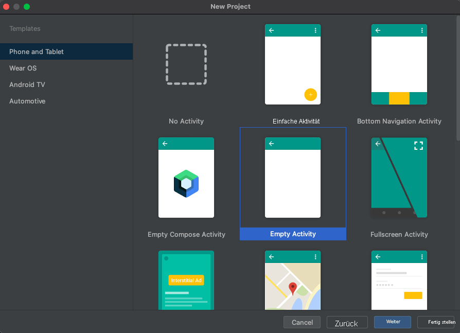
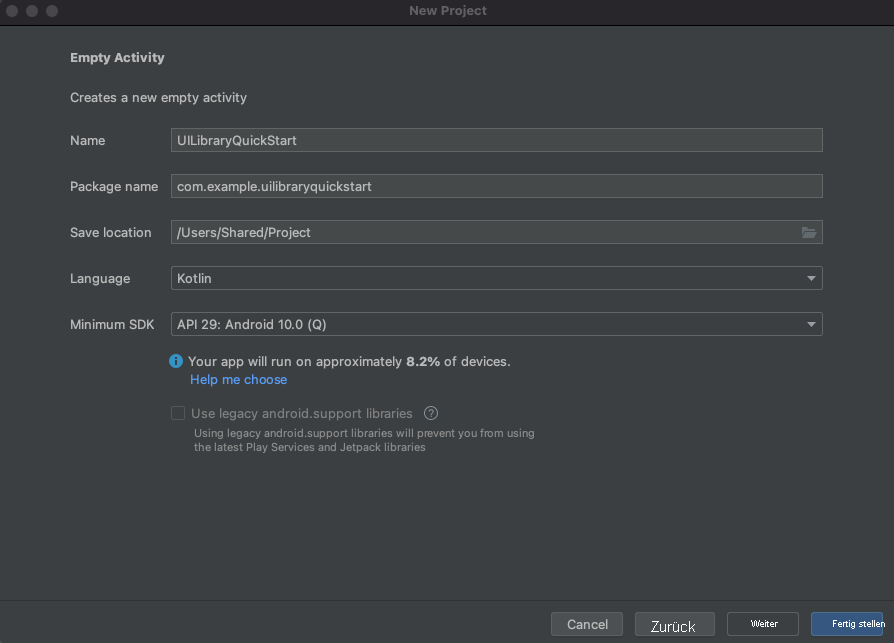

## <a name="prerequisites"></a>Voraussetzungen

- Ein Azure-Konto mit einem aktiven Abonnement. Sie können [kostenlos ein Konto erstellen](https://azure.microsoft.com/free/?WT.mc_id=A261C142F).
- Ein Betriebssystem, unter dem [Android Studio](https://developer.android.com/studio) ausgeführt wird.
- Eine bereitgestellte Communication Services-Ressource. [Erstellen Sie eine Communication Services-Ressource](../../../create-communication-resource.md).
- Azure Communication Services-Token. Siehe das [Beispiel](../../../identity/quick-create-identity.md). 

## <a name="setting-up"></a>Einrichten

### <a name="creating-an-android-app-with-an-empty-activity"></a>Erstellen einer Android-App mit einer leeren Aktivität

Erstellen Sie in Android Studio ein neues Projekt, und wählen Sie `Empty Activity` aus.



Klicken Sie auf die Schaltfläche `Next`, nennen Sie das Projekt `UILibraryQuickStart`, legen Sie die Sprache auf `Java/Kotlin` fest, und wählen Sie als mindestens erforderliches SDK die Option „API 23: Android 6.0 (Marshmallow)“ oder eine höhere Version aus.



Klicken Sie auf `Finish`.

## <a name="maven-repository-credentials"></a>Anmeldeinformationen für das Maven-Repository

- Sie müssen Ihr persönliches Zugriffstoken (Personal Access Token, PAT) angeben, für das der Bereich `read:packages` ausgewählt ist.
- Möglicherweise muss für dieses PAT `SSO enabled` aktiviert sein.
- Stellen Sie außerdem sicher, dass Ihr GitHub-Benutzer Zugriff auf https://github.com/Azure/communication-preview hat.
- Das persönliche Zugriffstoken kann hier generiert werden: https://github.com/settings/tokens

## <a name="install-the-packages"></a>Installieren der Pakete

Fügen Sie in `build.gradle` auf der App-Ebene (**App-Ordner**) die folgenden Zeilen zu den Abschnitten „dependencies“ und „android“ hinzu:

```groovy
android {
    ...
    packagingOptions {
        pickFirst  'META-INF/*'
    }
    ...
}
```

```groovy
dependencies {
    ...
    implementation 'com.azure.android:azure-communication-ui:1.0.0-alpha.2'
    ...
}
```

Fügen Sie in `settings.gradle` auf der Projekteinstellungsebene (**App-Ordner**) die folgenden Zeilen zu den Repositorys hinzu:

```groovy
dependencyResolutionManagement {
    repositoriesMode.set(RepositoriesMode.FAIL_ON_PROJECT_REPOS)
    repositories {
        ...
        maven {
            url "https://pkgs.dev.azure.com/MicrosoftDeviceSDK/DuoSDK-Public/_packaging/Duo-SDK-Feed/maven/v1"
        }
        maven {
            name='github'
            url = 'https://maven.pkg.github.com/Azure/communication-preview'
            credentials {
                username '<your GitHub user name>'
                password '<your personal access token>'
            }
        }
        ...
    }
}
```
Synchronisieren Sie das Projekt mit gradle-Dateien. Navigieren Sie dazu in Android Studio zu „File“ > „Sync Project With Gradle Files“ („Datei“ > „Projekt mit Gradle-Dateien synchronisieren“).

## <a name="add-a-button-to-the-activity_main"></a>Hinzufügen einer Schaltfläche zu „activity_main“

Navigieren Sie zur Layoutdatei (`app/src/main/res/layout/activity_main.xml`). Fügen Sie den folgenden Code ein, um eine Schaltfläche zum Starten der zusammengesetzten Komponenten zu erstellen:

```xml
<?xml version="1.0" encoding="utf-8"?>
<androidx.constraintlayout.widget.ConstraintLayout xmlns:android="http://schemas.android.com/apk/res/android"
    xmlns:app="http://schemas.android.com/apk/res-auto"
    xmlns:tools="http://schemas.android.com/tools"
    android:layout_width="match_parent"
    android:layout_height="match_parent"
    tools:context=".MainActivity">

    <Button
        android:id="@+id/startButton"
        android:layout_width="wrap_content"
        android:layout_height="wrap_content"
        android:text="Launch"
        app:layout_constraintBottom_toBottomOf="parent"
        app:layout_constraintLeft_toLeftOf="parent"
        app:layout_constraintRight_toRightOf="parent"
        app:layout_constraintTop_toTopOf="parent" />

</androidx.constraintlayout.widget.ConstraintLayout>
```

## <a name="initialize-composite"></a>Initialisieren der zusammengesetzten Komponenten 

Gehe zu `MainActivity`. Fügen Sie hier den folgenden Code hinzu, um die zusammengesetzten Komponenten für Anrufe zu initialisieren. Ersetzen Sie `"GROUP_CALL_ID"` durch die Gruppen-ID für Ihren Anruf, `"DISPLAY_NAME"` durch Ihren Namen und `"<USER_ACCESS_TOKEN>"` durch Ihr Token.

#### <a name="kotlin"></a>[Kotlin](#tab/kotlin)

```kotlin
package com.example.uilibraryquickstart

import androidx.appcompat.app.AppCompatActivity
import android.os.Bundle
import android.widget.Button
import com.azure.android.communication.common.CommunicationTokenCredential
import com.azure.android.communication.common.CommunicationTokenRefreshOptions
import com.azure.android.communication.ui.CallCompositeBuilder
import com.azure.android.communication.ui.CallComposite
import com.azure.android.communication.ui.GroupCallOptions
import java.util.UUID

class MainActivity : AppCompatActivity() {
    override fun onCreate(savedInstanceState: Bundle?) {
        super.onCreate(savedInstanceState)
        setContentView(R.layout.activity_main)
        
        val startButton: Button = findViewById(R.id.startButton)
        startButton.setOnClickListener { l -> startCallComposite() }
    }

    private fun startCallComposite() {
        val communicationTokenRefreshOptions = CommunicationTokenRefreshOptions({ fetchToken() }, true)
        val communicationTokenCredential = CommunicationTokenCredential(communicationTokenRefreshOptions)
        val options = GroupCallOptions(
            this,
            communicationTokenCredential,
            UUID.fromString("GROUP_CALL_ID"),
            "DISPLAY_NAME",
        )

        val callComposite: CallComposite = CallCompositeBuilder().build()
        callComposite.launch(options)
    }

    private fun fetchToken(): String? {
        return "USER_ACCESS_TOKEN"
    }
}
```

#### <a name="java"></a>[Java](#tab/java)

```java
package com.example.uilibraryquickstart;

import androidx.appcompat.app.AppCompatActivity;
import android.os.Bundle;
import android.widget.Button;
import com.azure.android.communication.common.CommunicationTokenCredential;
import com.azure.android.communication.common.CommunicationTokenRefreshOptions;
import com.azure.android.communication.ui.CallCompositeBuilder;
import com.azure.android.communication.ui.CallComposite;
import com.azure.android.communication.ui.GroupCallOptions;
import java.util.UUID;

public class MainActivity extends AppCompatActivity {

    @Override
    protected void onCreate(Bundle savedInstanceState) {
        super.onCreate(savedInstanceState);
        setContentView(R.layout.activity_main);

        Button startButton = findViewById(R.id.startButton);

        startButton.setOnClickListener(l -> {
            startCallComposite();
        });
    }

    private void startCallComposite() {
        CallComposite callComposite = new CallCompositeBuilder().build();

        CommunicationTokenRefreshOptions communicationTokenRefreshOptions =
                new CommunicationTokenRefreshOptions(this::fetchToken, true);
        CommunicationTokenCredential communicationTokenCredential = new CommunicationTokenCredential(communicationTokenRefreshOptions);

        GroupCallOptions options = new GroupCallOptions(this,
                communicationTokenCredential,
                UUID.fromString("GROUP_CALL_ID"),
                "DISPLAY_NAME");

        callComposite.launch(options);
    }

    private String fetchToken() {
        return "USER_ACCESS_TOKEN";
    }
}
```

-----
## <a name="run-the-code"></a>Ausführen des Codes

Erstellen und starten Sie die Anwendung über Android Studio.

- Klicken Sie auf `Launch`.
- Akzeptieren Sie die Audioberechtigungen, und wählen Sie Geräte-, Mikrofon- und Videoeinstellungen aus.
- Klicken Sie auf `Join Call`.

## <a name="sample-application-code-can-be-found-here"></a>Beispielanwendungscode finden Sie [hier](https://github.com/Azure-Samples/communication-services-android-quickstarts/tree/ui-library-quickstart/ui-library-quick-start).


## <a name="object-model"></a>Objektmodell

Die folgenden Klassen und Schnittstellen dienen zur Behandlung einiger der wichtigsten Features der Android-Benutzeroberfläche von Azure Communication Services:

| Name                                                               | BESCHREIBUNG                                                                                  |
| ------------------------------------------------------------------ | -------------------------------------------------------------------------------------------- |
| [CallComposite](#create-call-composite)                            | Zusammengesetzte Komponente, von der eine Anrufumgebung mit Teilnehmergalerie und Steuerelementen gerendert wird.    |
| [CallCompositeBuilder](#create-call-composite)                     | Generator zum Erstellen von „CallComposite“ mit Optionen.                                                 |
| [GroupCallOptions](#group-call)                                    | Wird an „callComposite.launch“ übergeben, um einen Gruppenanruf zu starten.                                          |
| [TeamsMeetingOptions](#teams-meeting)                              | Wird an „callComposite.launch“ übergeben, um einer Teams-Besprechung beizutreten.                                |
| [ThemeConfiguration](#apply-theme-configuration)                   | Wird optional in „CallCompositeBuilder“ eingefügt, um die Hauptfarbe der zusammengesetzten Komponente zu ändern.           |

## <a name="ui-library-functionality"></a>Funktionen der UI-Bibliothek

### <a name="create-call-composite"></a>Erstellen einer zusammengesetzten Komponente für Anrufe

Initialisieren Sie innerhalb der Funktion `startCallComposite` eine `CallCompositeBuilder`-Instanz und eine `CallComposite`-Instanz.

#### <a name="kotlin"></a>[Kotlin](#tab/kotlin)

```kotlin
val callComposite: CallComposite = CallCompositeBuilder().build()
```
#### <a name="java"></a>[Java](#tab/java)

```java
CallComposite callComposite = new CallCompositeBuilder().build();
```

-----
### <a name="setup-authentication"></a>Einrichten der Authentifizierung

Initialisieren Sie innerhalb der Funktion `startCallComposite` eine `CommunicationTokenCredential`-Instanz. Ersetzen Sie `"<USER_ACCESS_TOKEN>"` durch Ihr Token.

#### <a name="kotlin"></a>[Kotlin](#tab/kotlin)

```kotlin
val callComposite: CallComposite = CallCompositeBuilder().build()

val communicationTokenRefreshOptions = CommunicationTokenRefreshOptions(this::fetchToken, true)

val communicationTokenCredential = CommunicationTokenCredential(communicationTokenRefreshOptions)
```

#### <a name="java"></a>[Java](#tab/java)

```java
CallComposite callComposite = new CallCompositeBuilder().build();

CommunicationTokenRefreshOptions communicationTokenRefreshOptions =
                new CommunicationTokenRefreshOptions(this::fetchToken, true);

CommunicationTokenCredential communicationTokenCredential = new CommunicationTokenCredential(communicationTokenRefreshOptions);

```

Wenn Sie noch über kein Token verfügen, finden Sie unter [Benutzerzugriffstoken](../../../identity/quick-create-identity.md) weitere Informationen.

-----
### <a name="setup-group-call-or-teams-meeting-options"></a>Einrichten von Optionen für Gruppenanrufe oder Teams-Besprechungen

Verwenden Sie das passende Optionsobjekt für die Art von Anruf/Besprechung, die Sie einrichten möchten.

### <a name="group-call"></a>Gruppenanruf

Initialisieren Sie innerhalb der Funktion `startCallComposite` eine `GroupCallOptions`-Instanz.

Ersetzen Sie `"GROUP_CALL_ID"` durch die Gruppen-ID für Ihren Anruf.

Ersetzen Sie `"DISPLAY_NAME"` durch Ihren eigenen Namen.

#### <a name="kotlin"></a>[Kotlin](#tab/kotlin)

```kotlin
val options = GroupCallOptions(
            this,
            communicationTokenCredential,
            UUID.fromString("GROUP_CALL_ID"),
            "DISPLAY_NAME",
        )
```

#### <a name="java"></a>[Java](#tab/java)

```java
GroupCallOptions options = new GroupCallOptions(
    this,
    communicationTokenCredential,
    UUID.fromString("GROUP_CALL_ID"),
    "DISPLAY_NAME"
);
```
-----
### <a name="teams-meeting"></a>Teams-Besprechung

Initialisieren Sie innerhalb der Funktion `startCallComposite` eine `TeamsMeetingOptions`-Instanz.
Ersetzen Sie `"TEAMS_MEETING_LINK"` durch die Gruppen-ID für Ihren Anruf.

Ersetzen Sie `"DISPLAY_NAME"` durch Ihren eigenen Namen.

#### <a name="kotlin"></a>[Kotlin](#tab/kotlin)

```kotlin
val options = TeamsMeetingOptions(
            this,
            communicationTokenCredential,
            "TEAMS_MEETING_LINK",
            "DISPLAY_NAME",
        )
```

#### <a name="java"></a>[Java](#tab/java)

```java
TeamsMeetingOptions options = new TeamsMeetingOptions(
    this,
    communicationTokenCredential,
    "TEAMS_MEETING_LINK",
    "DISPLAY_NAME"
);
```

-----
### <a name="get-a-microsoft-teams-meeting-link"></a>Abrufen eines Microsoft Teams-Besprechungslinks

Ein Microsoft Teams-Besprechungslink kann mithilfe der Graph-APIs abgerufen werden. Dieser Prozess wird in der [Graph-Dokumentation](/graph/api/onlinemeeting-createorget?preserve-view=true&tabs=http&view=graph-rest-beta) näher erläutert.

Das Communication Services SDK für Anrufe akzeptiert einen vollständigen Microsoft Teams-Besprechungslink. Dieser Link wird als Teil der `onlineMeeting`-Ressource zurückgegeben, auf die Sie über die [`joinWebUrl`-Eigenschaft](/graph/api/resources/onlinemeeting?preserve-view=true&view=graph-rest-beta) zugreifen können. Sie können die erforderlichen Besprechungsinformationen auch aus der URL **Besprechung beitreten** in der Teams-Besprechungseinladung selbst abrufen.

### <a name="launch"></a>Starten

Rufen Sie `launch` für die `CallComposite`-Instanz innerhalb der Funktion `startCallComposite` auf.

#### <a name="kotlin"></a>[Kotlin](#tab/kotlin)

```kotlin
callComposite.launch(options)
```

#### <a name="java"></a>[Java](#tab/java)

```java
callComposite.launch(options);
```

-----

### <a name="subscribe-to-events-from-callcomposite"></a>Abonnieren von Ereignissen aus `CallComposite`

Fügen Sie einen Handler in `CallCompositeBuilder` ein, um Ereignisse zu empfangen.

#### <a name="kotlin"></a>[Kotlin](#tab/kotlin)

```kotlin
val callComposite: CallComposite =
            CallCompositeBuilder()
                .onException { 
                    //...
                }
                .build()
```

#### <a name="java"></a>[Java](#tab/java)

```java
CallComposite callComposite =
                new CallCompositeBuilder()
                        .onException(eventArgs -> {
                            //...
                        })
                        .build();
```

-----

### <a name="apply-theme-configuration"></a>Anwenden der Designkonfiguration

Wenn Sie die Hauptfarbe der zusammengesetzten Komponente ändern möchten, können Sie in `src/main/res/values/themes.xml` und `src/main/res/values-night/themes.xml` einen neuen Designstil erstellen, indem Sie `AzureCommunicationUI.Theme.Calling` als übergeordnetes Design betrachten. Fügen Sie zum Anwenden des Designs die Design-ID in `CallCompositeBuilder` ein.

```xml
<style name="MyCompany.CallComposite" parent="AzureCommunicationUI.Theme.Calling">
    <item name="azure_communication_ui_calling_primary_color">@color/purple_500</item>
</style>
```

#### <a name="kotlin"></a>[Kotlin](#tab/kotlin)

```kotlin
import com.azure.android.communication.ui.configuration.ThemeConfiguration

val communicationCallComposite: CallComposite =
        CallCompositeBuilder()
            .theme(ThemeConfiguration(R.style.MyCompany_CallComposite))
            .build()
```

#### <a name="java"></a>[Java](#tab/java)

```java
import com.azure.android.communication.ui.configuration.ThemeConfiguration;

CallComposite callComposite = 
    new CallCompositeBuilder()
        .theme(new ThemeConfiguration(R.style.MyCompany_CallComposite))
        .build();
```
