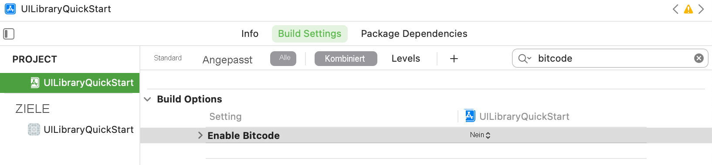

## <a name="prerequisites"></a>Voraussetzungen

- Ein Azure-Konto mit einem aktiven Abonnement. Sie können [kostenlos ein Konto erstellen](https://azure.microsoft.com/free/?WT.mc_id=A261C142F).
- Einen Mac mit [Xcode](https://go.microsoft.com/fwLink/p/?LinkID=266532) zusammen mit einem gültigen in Ihrer Keychain installierten Entwicklerzertifikat. [CocoaPods](https://cocoapods.org/) muss ebenfalls installiert sein, um Abhängigkeiten abrufen zu können.
- Eine bereitgestellte Communication Services-Ressource. [Erstellen Sie eine Communication Services-Ressource](../../../create-communication-resource.md).
- Azure Communication Services-Token. Siehe [Beispiel](../../../identity/quick-create-identity.md)

## <a name="setting-up"></a>Einrichten

### <a name="creating-the-xcode-project"></a>Erstellen des Xcode-Projekts

Erstellen Sie in Xcode ein neues iOS-Projekt, und wählen Sie die Vorlage **App** aus. Wir verwenden UIKit-Storyboards. Im Rahmen dieser Schnellstartanleitung werden keine Tests erstellt. Sie können die Option **Tests einschließen** daher deaktivieren.


Benennen Sie das Projekt mit `UILibraryQuickStart`.


### <a name="install-the-package-and-dependencies-with-cocoapods"></a>Installieren des Pakets und der Abhängigkeiten mit CocoaPods

1. Erstellen Sie eine Podfile für die Anwendung:

```
source 'https://github.com/Azure/AzurePrivatePodspecs'

platform :ios, '13.0'

target 'UILibraryQuickStart' do
    use_frameworks!
    pod 'azure-communication-ui', '1.0.0-alpha.1'
    pod 'AzureCommunicationCalling', '2.0.1-beta.1'
    pod 'MicrosoftFluentUI', '0.3.3'
end
```

2. Führen Sie aus `pod install`.
3. Öffnen Sie die generierte `.xcworkspace` in Xcode.

### <a name="request-access-to-the-microphone-camera-etc"></a>Fordern Sie Zugriff auf das Mikrofon, die Kamera usw. an.

Aktualisieren Sie die Eigenschaftenliste der APP-Informationen, um auf die Hardware des Geräts zuzugreifen. Legen Sie den zugehörigen Wert auf eine Zeichenfolge (`string`) fest. Diese wird in den Dialog aufgenommen, mit dem das System um den Zugriff beim Benutzer anfordert.

Klicken Sie mit der rechten Maustaste auf den Eintrag `Info.plist` der Projektstruktur, und wählen Sie anschließend **Open As** (Öffnen als)  > **Source Code** (Quellcode) aus. Fügen Sie die folgenden Zeilen im Abschnitt `<dict>` der obersten Ebene hinzu, und speichern anschließend Sie die Datei.

```xml
<key>NSCameraUsageDescription</key>
<string></string>
<key>NSMicrophoneUsageDescription</key>
<string></string>
```

### <a name="turn-off-bitcode"></a>Deaktivieren von `Bitcode`
Legen Sie unter `Build Settings` des Projekts die Option `Enable Bitcode` auf `No` fest. Um die Einstellung zu finden, müssen Sie den Filter von `Basic` in `All` ändern. Sie können auch die Suchleiste auf der rechten Seite verwenden.



## <a name="initialize-composite"></a>Initialisieren der zusammengesetzten Komponenten

Wechseln Sie zu „ViewController“. Fügen Sie hier den folgenden Code hinzu, um die zusammengesetzten Komponenten für Anrufe zu initialisieren. Ersetzen Sie `<GROUP_CALL_ID>` durch die Gruppen-ID für Ihren Anruf, `<DISPLAY_NAME>` durch Ihren Namen und `<USER_ACCESS_TOKEN>` durch Ihr Token.

```swift
import UIKit
import AzureCommunicationCalling
import CallingComposite

class ViewController: UIViewController {

    private var callComposite: CallComposite?

    override func viewDidLoad() {
        super.viewDidLoad()

        let button = UIButton(frame: CGRect(x: 100, y: 100, width: 200, height: 50))
        button.contentEdgeInsets = UIEdgeInsets(top: 10.0, left: 20.0, bottom: 10.0, right: 20.0)
        button.layer.cornerRadius = 10
        button.backgroundColor = .systemBlue
        button.setTitle("Start Experience", for: .normal)
        button.addTarget(self, action: #selector(startCallComposite), for: .touchUpInside)

        button.translatesAutoresizingMaskIntoConstraints = false
        self.view.addSubview(button)
        button.centerXAnchor.constraint(equalTo: view.centerXAnchor).isActive = true
        button.centerYAnchor.constraint(equalTo: view.centerYAnchor).isActive = true
    }

    @objc private func startCallComposite() {
        let callCompositeOptions = CallCompositeOptions()

        callComposite = CallComposite(withOptions: callCompositeOptions)

        let communicationTokenCredential = try! CommunicationTokenCredential(token: "<USER_ACCESS_TOKEN>")

        let options = GroupCallOptions(communicationTokenCredential: communicationTokenCredential,
                                       displayName: displayName,
                                       groupId: uuid)
        callComposite?.launch(with: options)
    }
}
```

## <a name="run-the-code"></a>Ausführen des Codes

Sie können Ihre App auf dem iOS-Simulator erstellen und ausführen, indem Sie **Product** (Produkt)  > **Run** (Ausführen) auswählen oder die Tastenkombination (&#8984;-R) verwenden.

1) Tippen Sie auf `Start Experience`.
2) Akzeptieren Sie die Audioberechtigungen, und wählen Sie Geräte-, Mikrofon- und Videoeinstellungen aus.
3) Tippen Sie auf `Start Call`.


## <a name="object-model"></a>Objektmodell

Die folgenden Klassen und Schnittstellen dienen zur Behandlung einiger der wichtigsten Features der Benutzeroberflächen-Clientbibliothek von Azure Communication Services:

| Name                                                                        | BESCHREIBUNG                                                                                  |
| --------------------------------------------------------------------------- | -------------------------------------------------------------------------------------------- |
| CallComposite | Von der zusammengesetzten Komponente wird eine Anrufumgebung mit Teilnehmergalerie und Steuerelementen gerendert. |
| CallCompositeOptions | Beinhaltet Optionen wie die Designkonfiguration und den Ereignishandler. |
| CallCompositeEventsHandler | Ermöglicht das Empfangen von Ereignissen aus der zusammengesetzten Komponente. |
| GroupCallOptions | Die Optionen zum Beitreten zu einem Gruppenanruf, etwa groupId |
| TeamsMeetingOptions | Die Optionen für die Teilnahme an einer Teams-Besprechung, etwa der Link zur Besprechung |
| ThemeConfiguration | Ermöglicht Ihnen das Anpassen des Designs. |

## <a name="ui-library-functionality"></a>Funktionen der UI-Bibliothek

### <a name="create-call-composite-options-and-call-composite"></a>Erstellen von Optionen für die zusammengesetzte Komponente für Anrufe sowie der zusammengesetzten Komponente für Anrufe

Initialisieren Sie innerhalb der Funktion `startCallComposite` eine `CallCompositeOptions`-Instanz und eine `CallComposite`-Instanz.

```swift
@objc private func startCallComposite() {
    let callCompositeOptions = CallCompositeOptions()

    callComposite = CallComposite(withOptions: callCompositeOptions)
}
```

### <a name="setup-authentication"></a>Einrichten der Authentifizierung

Initialisieren Sie innerhalb der Funktion `startCallComposite` eine `CommunicationTokenCredential`-Instanz. Ersetzen Sie `<USER_ACCESS_TOKEN>` durch Ihr Token.

```swift
let communicationTokenCredential = try! CommunicationTokenCredential(token: "<USER_ACCESS_TOKEN>")
```

Wenn Sie noch über kein Token verfügen, finden Sie unter [Benutzerzugriffstoken](../../../identity/quick-create-identity.md) weitere Informationen.

### <a name="setup-group-call-or-teams-meeting-options"></a>Einrichten von Optionen für Gruppenanrufe oder Teams-Besprechungen

Verwenden Sie das passende Optionsobjekt für die Art von Anruf/Besprechung, die Sie einrichten möchten.

#### <a name="group-call"></a>Gruppenanruf

Initialisieren Sie innerhalb der Funktion `startCallComposite` eine `GroupCallOptions`-Instanz. Ersetzen Sie `<GROUP_CALL_ID>` durch die Gruppen-ID für Ihren Anruf und `<DISPLAY_NAME>` durch Ihren Namen.

```swift
let options = GroupCallOptions(communicationTokenCredential: communicationTokenCredential,
                               displayName: displayName,
                               groupId: uuid)
```

#### <a name="teams-meeting"></a>Teams-Besprechung

Initialisieren Sie innerhalb der Funktion `startCallComposite` eine `TeamsMeetingOptions`-Instanz. Ersetzen Sie `<TEAMS_MEETING_LINK>` durch die Gruppen-ID für Ihren Anruf und `<DISPLAY_NAME>` durch Ihren Namen.

```swift
let options = TeamsMeetingOptions(communicationTokenCredential: communicationTokenCredential,
                                  displayName: displayName,
                                  meetingLink: link)
```

#### <a name="get-a-microsoft-teams-meeting-link"></a>Abrufen eines Microsoft Teams-Besprechungslinks

Ein Microsoft Teams-Besprechungslink kann mithilfe der Graph-APIs abgerufen werden. Dieser Prozess wird in der [Graph-Dokumentation](/graph/api/onlinemeeting-createorget?tabs=http&view=graph-rest-beta&preserve-view=true) näher erläutert.
Das Communication Services Calling SDK akzeptiert einen vollständigen Microsoft Teams-Besprechungslink. Dieser Link wird als Teil der `onlineMeeting`-Ressource zurückgegeben, auf die Sie über die [`joinWebUrl`-Eigenschaft](/graph/api/resources/onlinemeeting?view=graph-rest-beta&preserve-view=true) zugreifen können. Sie können die erforderlichen Besprechungsinformationen auch aus der URL **Besprechung beitreten** in der Teams-Besprechungseinladung selbst abrufen.

### <a name="launch"></a>Starten

Rufen Sie `launch` für die `CallComposite`-Instanz innerhalb der Funktion `startCallComposite` auf.

```swift
callComposite?.launch(with: options)
```

### <a name="implement-the-closure-for-events-handler"></a>Implementieren der Schließung für den Ereignishandler

Sie können die Schließung von `CallCompositeEventsHandler` implementieren, um auf die Ereignisse zu reagieren und die Implementierung an `CallCompositeOptions` zu übergeben. Ein Beispiel hierfür ist ein Ereignis, bei dem die zusammengesetzte Komponente mit einem Fehler beendet wurde.

```swift
let handler = CallCompositeEventsHandler(didFail: { error in
            print("didFail with error:\(error)")
        })
```

```swift
let callCompositeOptions = CallCompositeOptions(callCompositeEventsHandler: handler)
```

### <a name="customizing-the-theme"></a>Anpassen des Designs

Sie können das Design anpassen, indem Sie eine benutzerdefinierte Designkonfiguration erstellen, die das ThemeConfiguration-Protokoll implementiert. Anschließend fügen Sie eine Instanz dieser neuen Klasse in CallCompositeOptions ein.

```swift
class CustomThemeConfiguration: ThemeConfiguration {
   var primaryColor: UIColor {
       return UIColor.red
   }
}
```

```swift
let callCompositeOptions = CallCompositeOptions(themeConfiguration: CustomThemeConfiguration())
```
