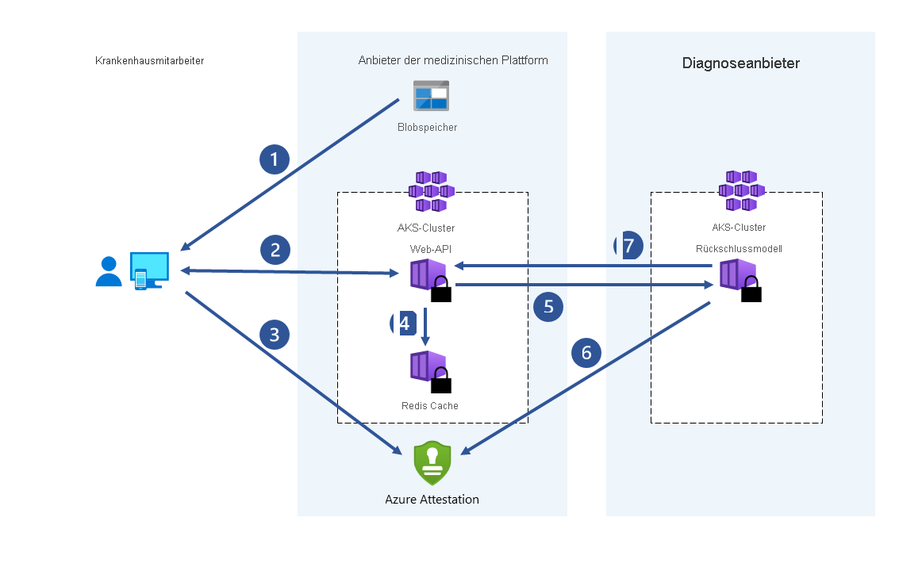

# Anwendungsfälle und -szenarien
Confidential Computing gilt für verschiedene Anwendungsfälle zum Schutz von Daten in regulierten Branchen wie Behörden und Finanzdienstleistungen sowie im Gesundheitswesen. Wenn Sie beispielsweise den Zugriff auf vertrauliche Daten verhindern, wird die digitale Identität der Bürger*innen vor allen beteiligten Parteien geschützt, einschließlich des Cloudanbieters, der sie speichert. Diese vertraulichen Daten können biometrische Daten enthalten, die zum Auffinden und Entfernen bekannter Bilder mit Kindermissbrauch, zur Verhinderung von Menschenhandel und zur Unterstützung digitaler forensischer Untersuchungen verwendet werden.

:::image type="content" source="media/use-cases-scenarios/use-cases.png" alt-text="Screenshot: Anwendungsfälle für Azure Confidential Computing, u. a. Szenarien für Behörden, Finanzdienstleistungen und das Gesundheitswesen":::

Dieser Artikel enthält eine Übersicht über verschiedene gängige Szenarien für Azure Confidential Computing. Die Empfehlungen in diesem Artikel dienen als Ausgangspunkt für die Anwendungsentwicklung mit Confidential Computing-Diensten und -Frameworks.

Nach Lesen dieses Artikels können Sie die folgenden Fragen beantworten:

- Was sind Beispiele für gängige Azure Confidential Computing-Szenarien?
- Welche Vorteile bietet die Verwendung von Azure Confidential Computing in Szenarien mit mehreren Parteien, für einen verbesserten Datenschutz von Kundendaten und in Blockchain-Netzwerken?

## Beweggründe
Mit Azure Confidential Computing können Sie Confidential Computing-Funktionen in einer virtualisierten Umgebung nutzen. Sie können jetzt Tools, Software und Cloudinfrastruktur verwenden, um basierend auf sicherer Hardware Erweiterungen vorzunehmen.  

**Verhindern nicht autorisierter Zugriffe:** Verwenden Sie vertrauliche Daten in der Cloud. Vertrauen Sie darauf, dass Azure den bestmöglichen Datenschutz bietet – mit wenigen bis gar keinen Änderungen im Vergleich zu aktuellen Maßnahmen.

**Einhaltung gesetzlicher Bestimmungen**: Migrieren Sie zur Cloud, und behalten Sie die volle Kontrolle über Daten, um behördliche Vorschriften zum Schutz von persönlichen Informationen und IP-Adressen der Organisation zu erfüllen.

**Sichere Zusammenarbeit ohne Vertrauensvorschuss:** Bewältigen Sie branchenweite aufgabenbezogene Probleme, indem Sie Daten von verschiedenen Organisationen und sogar von Mitbewerbern durchforsten, um umfassende Datenanalysen zu ermöglichen und tiefgreifendere Erkenntnisse zu gewinnen.

**Isolierte Verarbeitung:** Bieten Sie eine neue Reihe von Produkten an, die mittels Blindverarbeitung die Haftbarkeit für private Daten beseitigen. Benutzerdaten können nicht einmal vom Dienstanbieter abgerufen werden. 

## Sicheres Computing mit mehreren Parteien

Für Geschäftstransaktionen und die Zusammenarbeit an Projekten müssen Informationen von mehreren Parteien verwendet werden. Häufig sind die so geteilten Daten vertraulich. Bei den Daten kann es sich um personenbezogene Informationen, Finanzdaten, Patientenakten, Daten von Bürger*innen usw. handeln. Öffentliche und private Organisationen verlangen, dass ihre Daten vor nicht autorisiertem Zugriff geschützt sind. Manchmal möchten diese Organisationen sogar Daten vor dem Betreiber der Computinginfrastruktur oder Technikern, Sicherheitsarchitekten, Unternehmensberatern und Data Scientists schützen.

Beispielsweise ist die Verwendung von maschinellem Lernen für Gesundheitsdienstleistungen stark gestiegen, da es mehr Zugriff auf größere Datasets und Bilder von Patienten gibt, die von medizinischen Geräten erfasst wurden. Wenn es viele Datenquellen gibt, verbessern sich die Krankheitsdiagnose und die Entwicklung von Medizin. Krankenhäuser und medizinische Einrichtungen können zusammenarbeiten, indem sie Patientenakten in einer zentralisierten vertrauenswürdigen Ausführungsumgebung (Trusted Execution Environment, TEE) teilen. Dienste für maschinelles Lernen, die in der TEE ausgeführt werden, aggregieren und analysieren diese Daten dann. Diese aggregierte Datenanalyse kann eine höhere Vorhersagegenauigkeit bieten, da Modelle mithilfe konsolidierter Datasets trainiert werden. Mit Confidential Computing können Einrichtungen das Risiko für eine Beeinträchtigung der Privatsphäre ihrer Patienten minimieren.

Azure Confidential Computing ermöglicht die Verarbeitung von Daten aus mehreren Quellen, ohne die Eingabedaten für andere Parteien offenzulegen. Diese Art der sicheren Verarbeitung ermöglicht zahlreiche Szenarien. Hierzu zählen beispielsweise Geldwäschebekämpfung, Betrugserkennung und die sichere Analyse von Gesundheitsdaten.

Daten können von mehreren Quellen in eine Enklave auf einem virtuellen Computer hochgeladen werden. Eine Partei weist die Enklave an, Berechnungen oder Verarbeitungsvorgänge für die Daten durchzuführen. Die Daten, die von anderen Parteien in die Enklave hochgeladen wurden, sind für die jeweils anderen Parteien nicht sichtbar (auch nicht für die Partei, die die Analyse durchführt).

Beim sicheren Computing mit mehreren Parteien werden verschlüsselte Daten in die Enklave übertragen. Die Enklave entschlüsselt die Daten mithilfe eines Schlüssels, führt eine Analyse durch, ruft ein Ergebnis ab und sendet ein verschlüsseltes Ergebnis zurück, das eine Partei mit dem angegebenen Schlüssel entschlüsseln kann.

### Geldwäschebekämpfung

In diesem Beispiel für sicheres Computing mit mehreren Parteien tauschen mehrere Banken Daten aus, ohne persönliche Daten Ihrer Kunden offenzulegen. Banken führen vereinbarte Analysen für das kombinierte vertrauliche Dataset durch. Durch die Analyse des aggregierten Datasets können Geldbewegungen eines Benutzers zwischen mehreren Banken erkannt werden, ohne dass die Banken auf die Daten der jeweils anderen Banken zugreifen.

Dank Confidential Computing können diese Finanzinstitute die Betrugserkennungsrate erhöhen, Maßnahmen gegen Geldwäsche ergreifen, False Positives reduzieren und weitere Erkenntnisse aus umfangreicheren Datasets gewinnen.

:::image type="content" source="media/use-cases-scenarios/mpc-banks.png" alt-text="Grafik: Freigeben von Daten für mehrere Parteien bei Banken mit der durch Confidential Computing ermöglichten Datenbewegung":::

### Medikamentenentwicklung im Gesundheitswesen

Partnergesundheitseinrichtungen steuern private Gesundheitsdatasets bei, um ein Machine Learning-Modell zu trainieren. Die einzelnen Einrichtungen haben jeweils nur Zugriff auf ihr eigenes Dataset. Die Daten und das Trainingsmodell sind weder für eine andere Einrichtung noch für den Cloudanbieter sichtbar. Alle Einrichtungen profitieren von der Nutzung des trainierten Modells. Durch die Erstellung eines Modells mit mehr Daten wurde das Modell genauer. Jede Einrichtung, die zum Trainieren des Modells beigetragen hat, kann das Modell nutzen und hilfreiche Ergebnisse erhalten.

## Verbesserter Datenschutz für Kundendaten

Obwohl die Sicherheitsstufe von Microsoft Azure sich schnell zu einem der wichtigsten Faktoren für die Cloud Computing-Einführung entwickelt, ist das Vertrauen der Kundschaft in ihren Anbieter nicht immer gleich. Kundenwünsche:

- Minimale Hardware, Software und Betriebs-TCBs (Trusted Computing Bases) für vertrauliche Workloads
- Technische Erzwingung anstelle von Geschäftsrichtlinien und -prozessen
- Transparenz in Bezug auf die gewährten Garantien, das Restrisiko und mögliche Gegenmaßnahmen

Dies sind genau die Dinge, die Confidential Computing angeht, indem Kund*innen die inkrementelle Kontrolle über die TCB erhalten, die zum Ausführen ihrer Cloudworkloads verwendet wird. Mit Azure Confidential Computing können Kund*innen genau die Hardware- und Softwarekomponenten definieren, die Zugriff auf ihre Workloads (Daten und Code) haben. Außerdem bietet der Dienst die technischen Mechanismen, um diese Garantien überprüfbar durchzusetzen. Kurz gesagt: Die Kundschaft behält die vollständige Kontrolle über ihre Geheimnisse.

### Datenhoheit

In Behörden und öffentlichen Einrichtungen stellt Azure Confidential Computing eine Lösung dar, um das Vertrauen in die Fähigkeit zum Schutz der Datenhoheit in der öffentlichen Cloud zu erhöhen. Darüber hinaus kann aufgrund der zunehmenden Einführung von Confidential Computing-Funktionen in PaaS-Dienste in Azure dieses höhere Maß an Vertrauen mit einer geringeren Auswirkung auf die Innovationsfähigkeit von öffentlichen Clouddiensten erreicht werden. Diese Kombination von Faktoren macht Azure Confidential Computing zu einer sehr effektiven Lösung für die Anforderungen an die Datenhoheit und die digitale Transformation von Regierungsdiensten.

### Reduzierte Vertrauenskette

Enorme Investitionen und revolutionäre Innovationen in Confidential Computing haben es ermöglicht, den Clouddienstanbieter in nie dagewesenem Maße aus der Vertrauenskette herauszuhalten. Azure Confidential Computing bietet das höchste Maß an Datenhoheit, das heute auf dem Markt verfügbar ist. Dadurch können Kundschaft und Behörden ihre derzeitigen Anforderungen an die Datenhoheit erfüllen und auch in Zukunft auf Innovationen setzen.

Mit Confidential Computing können Sie die Anzahl von Workloads erhöhen, die für die Bereitstellung in der öffentlichen Cloud geeignet sind. Dies kann zu einer schnellen Einführung öffentlicher Dienste für Migrationsvorgänge und neue Workloads führen, den Sicherheitsstatus der Kundschaft schnell zu verbessern helfen und innovative Szenarien ermöglichen.

### BYOK-Szenarien (Bring Your Own Key)

Die Einführung von Hardwaresicherheitsmodulen (HSM) ermöglicht die sichere Übertragung von Schlüsseln und Zertifikaten in einen geschützten Cloudspeicher ([Azure Key Vault Managed HSM](\..\key-vault\managed-hsm\overview.md)), ohne dass der Clouddienstanbieter auf diese vertraulichen Informationen zugreifen kann. Die übertragenen Geheimnisse liegen außerhalb des HSM niemals im Klartext vor. Dies ermöglicht Szenarien für die Datenhoheit von Schlüsseln und Zertifikaten, die vom Client generiert und verwaltet werden, aber dennoch einen cloudbasierten sicheren Speicher nutzen.

## Sichere Blockchain

Bei einem Blockchain-Netzwerk handelt es sich um ein dezentralisiertes Netzwerk von Knoten. Diese Knoten werden von Operatoren oder Validierern betrieben und gepflegt, deren Ziel darin besteht, die Integrität zu wahren und einen Konsens hinsichtlich des Netzwerkzustands zu erreichen. Die Knoten selbst sind Replikate von Ledgern und dienen zur Nachverfolgung von Blockchain-Transaktionen. Jeder Knoten verfügt über eine vollständige Kopie des Transaktionsverlaufs, um die Integrität und Verfügbarkeit in einem verteilten Netzwerk zu gewährleisten.

Auf Confidential Computing aufbauende Blockchain-Technologien ermöglichen die Nutzung von hardwarebasiertem Datenschutz, um die Vertraulichkeit von Daten sowie sichere Berechnungen sicherzustellen. In einigen Fällen wird auch das gesamte Ledger verschlüsselt, um den Datenzugriff zu schützen. Manchmal wird die eigentliche Transaktion unter Umständen in einem Computemodul innerhalb der Enklave im Knoten abgewickelt.
