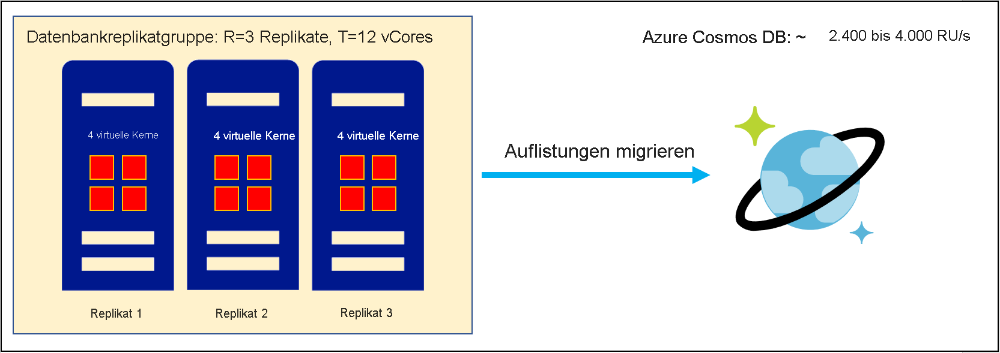
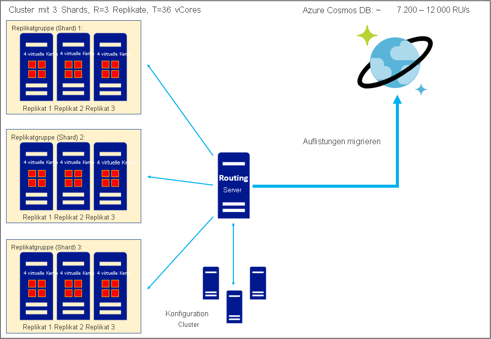
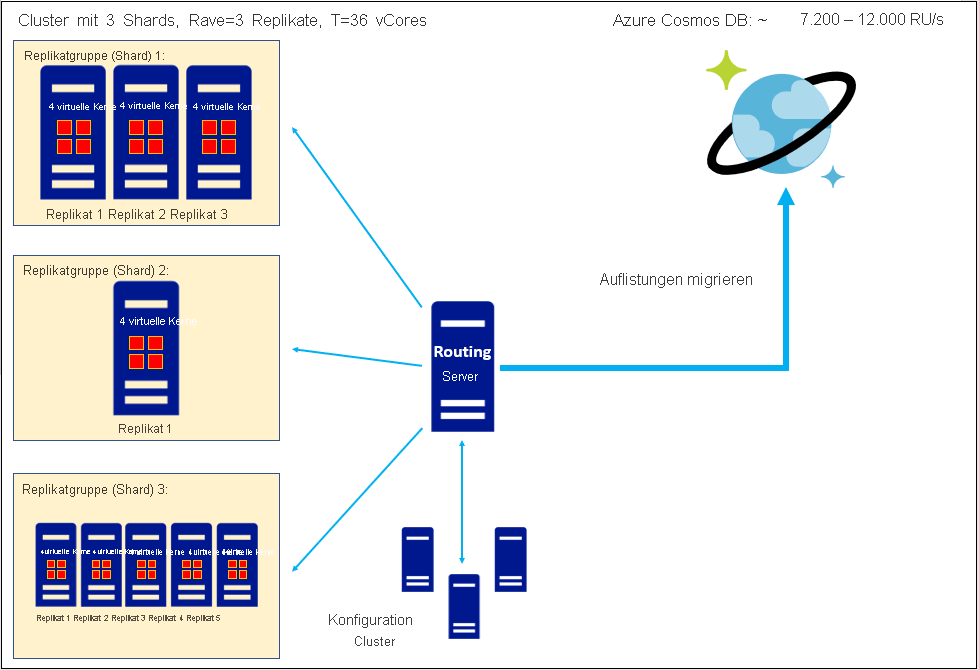

# Konvertieren der Anzahl von virtuellen Kernen oder virtuellen CPUs in einer nicht relationalen Datenbank zu Azure Cosmos DB-RU/s
[!INCLUDE[appliesto-sql-api](includes/appliesto-sql-api.md)]
[!INCLUDE[appliesto-mongodb-api](includes/appliesto-mongodb-api.md)]

In diesem Artikel wird erläutert, wie Sie Azure Cosmos DB-Anforderungseinheiten (Request Units, RUs) schätzen, wenn Sie eine Datenmigration erwägen, aber nur die Gesamtanzahl von virtuellen Kernen oder virtuellen CPUs in Ihren vorhandenen Datenbank-Replikatgruppen kennen. Wenn Sie Replikatgruppen zu Azure Cosmos DB migrieren, wird jede Sammlung in diesen Gruppen als Azure Cosmos DB-Sammlung gespeichert, die aus einem horizontal partitionierten Cluster mit einem 4-fachen Replikationsfaktor besteht. Weitere Informationen zu unserer Architektur finden Sie im [Leitfaden zur Partitionierung und Skalierung](partitioning-overview.md). Mit Anforderungseinheiten/Sekunde wird angegeben, wie die Durchsatzkapazität in einer Sammlung bereitgestellt wird. Weitere Informationen finden Sie im [Leitfaden zu Anforderungseinheiten](request-units.md) und im [Leitfaden zum bereitgestellten Durchsatz](set-throughput.md) (RU/s). Wenn Sie eine Sammlung migrieren, stellt Azure Cosmos DB genügend Shards bereit, um Ihre bereitgestellten Anforderungseinheiten zu verarbeiten und Ihre Daten zu speichern. Daher ist die Schätzung von Anforderungseinheiten bzw. Anforderungseinheiten/Sekunde ein wichtiger Schritt beim Ermitteln des Umfangs Ihres geplanten Azure Cosmos DB-Datenbestands vor der Migration. Basierend auf unserer Erfahrung mit Tausenden von Kunden haben wir die folgende Formel aufgestellt, die uns einen guten ersten Anhaltspunkt für die Schätzung der erforderlichen RU/s anhand der vorhandenen virtuellen Kerne oder CPUs bietet: 

`
Provisioned RU/s = C*T/R
`

* *T*: Gesamtanzahl von virtuellen Kernen und/oder CPUs in den Replikatgruppen, die in Ihrer vorhandenen Datenbank **Daten enthalten**. 
* *R*: Replikationsfaktor der vorhandenen Replikatgruppen, die **Daten enthalten**. 
* *C*: Empfohlener Wert für RU/s pro virtuellem Kern oder virtueller CPU. Dieser Wert lässt sich aus der Architektur von Azure Cosmos DB ableiten:
    * *C = 600 RU/s/virtuellem Kern* für die Azure Cosmos DB-SQL-API
    * *C = 1000 RU/s/virtuellem Kern* für die Azure Cosmos DB-API für MongoDB v4.0
    * Für die Cassandra-API, die Gremlin-API oder andere APIs sind derzeit keine Schätzwerte für *C* verfügbar.

Die Werte für *C* sind oben angegeben. ***T* muss folgendermaßen ermittelt werden: Finden Sie die Anzahl von virtuellen Kernen oder CPUs in jeder Daten enthaltenden Replikatgruppe Ihrer vorhandenen Datenbank heraus, und addieren Sie diese Zahlen, um die Gesamtsumme zu erhalten**; wenn Sie *T* nicht schätzen können, lesen Sie statt des vorliegenden Leitfadens den [Leitfaden zum Schätzen von RU/s mithilfe des Azure Cosmos DB-Kapazitätplaners](estimate-ru-with-capacity-planner.md). *T* darf keine *virtuellen Kerne* oder *virtuellen CPUs* enthalten, die dem Routingserver oder Konfigurationscluster Ihrer vorhandenen Datenbank zugeordnet sind, falls solche Komponenten vorhanden sind. 

Zur Ermittlung von *R* empfiehlt es sich, den durchschnittlichen Replikationsfaktor Ihrer Datenbank-Replikatgruppen einzubeziehen; falls diese Informationen nicht verfügbar sind, ist *R=3* eine gute Faustregel. 

Azure Cosmos DB-Interoperabilitäts-APIs werden zusätzlich zur SQL-API ausgeführt und implementieren ihre eigenen einzigartigen Architekturen; daher weist die Azure Cosmos DB API für MongoDB v4.0 einen anderen *C*-Wert auf als die Azure Cosmos DB-SQL-API.

## Arbeitsbeispiel: Schätzen des RU/s-Werts für die Migration einer einzelnen Replikatgruppe

Wir betrachten eine einzelne Replikatgruppe mit dem Replikationsfaktor *R=3* basierend auf einer Server-SKU mit vier Kernen. Then
* *T* = 12 virtuelle Kerne
* *R* = 3

Dann werden folgende Anforderungseinheiten für die Azure Cosmos DB-SQL-API empfohlen:

`
Provisioned RU/s, SQL API = (600 RU/s/vCore) * (12 vCores) / (3) = 2,400 RU/s
`

Und für die Azure Cosmos DB-API für MongoDB werden folgende Anforderungseinheiten empfohlen:

`
Provisioned RU/s, API for MongoDB = (1,000 RU/s/vCore) * (12 vCores) / (3) = 4,000 RU/s
`

## Arbeitsbeispiel: Schätzen des RU/s-Werts beim Migrieren eines Clusters aus homogenen Replikatgruppen

Wir betrachten einen horizontal partitionierten und replizierten Cluster mit drei Replikatgruppen jeweils mit dem Replikationsfaktor 3, wobei jeder Server eine SKU mit vier Kernen ist. Then
* *T* = 36 virtuelle Kerne
* *R* = 3

Dann werden folgende Anforderungseinheiten für die Azure Cosmos DB-SQL-API empfohlen:

`
Provisioned RU/s, SQL API = (600 RU/s/vCore) * (36 vCores) / (3) = 7,200 RU/s
`

Und für die Azure Cosmos DB-API für MongoDB werden folgende Anforderungseinheiten empfohlen:

`
Provisioned RU/s, API for MongoDB = (1,000 RU/s/vCore) * (36 vCores) / (3) = 12,000 RU/s
`

## Arbeitsbeispiel: Schätzen des RU/s-Werts beim Migrieren eines Clusters aus heterogenen Replikatgruppen

Wir betrachten einen horizontal partitionierten und replizierten Cluster mit drei Replikatgruppen, wobei jeder Server auf einer SKU mit vier Kernen basiert. Diese Replikatgruppen sind heterogen in dem Sinn, dass jede einen anderen Replikationsfaktor aufweist: 3-fach, 1-fach bzw. 5-fach. Die empfohlene Vorgehensweise besteht hier darin, beim Berechnen der Anforderungseinheiten den durchschnittlichen Replikationsfaktor zu verwenden. Then
* *T* = 36 virtuelle Kerne
* *Ravg* = (3+1+5)/3 = 3

Dann werden folgende Anforderungseinheiten für die Azure Cosmos DB-SQL-API empfohlen:

`
Provisioned RU/s, SQL API = (600 RU/s/vCore) * (36 vCores) / (3) = 7,200 RU/s
`

Und für die Azure Cosmos DB-API für MongoDB werden folgende Anforderungseinheiten empfohlen:

`
Provisioned RU/s, API for MongoDB = (1,000 RU/s/vCore) * (36 vCores) / (3) = 12,000 RU/s
`

## Tipps zum Erzielen eines möglichst genauen RU/s-Werts

*Migrieren von einer in der Cloud verwalteten Datenbank*: Wenn Sie derzeit eine in der Cloud verwaltete Datenbank verwenden, scheinen diese Dienste häufig in Einheiten von *virtuellen Kernen* oder *virtuellen CPUs* bereitgestellt zu sein (anders gesagt, als *T*), aber tatsächlich legt die von Ihnen bereitgestellte Kernanzahl den Wert *virtuelle Kerne/Replikat* bzw. *virtuelle CPU/Replikat* (*T/R*) für eine Replikatgruppe mit *R* Knoten fest; die tatsächliche Anzahl von Kernen ist *R*-mal höher als die Anzahl, die Sie explizit bereitgestellt haben. Sie sollten ermitteln, ob diese Beschreibung auf Ihre derzeitige in der Cloud verwaltete Datenbank zutrifft. Ist dies der Fall, müssen Sie die nominale Anzahl bereitgestellter *virtueller Kerne* oder *virtueller CPUs* mit *R* multiplizieren, um eine akkurate Schätzung von *T* zu erzielen.

*Virtuelle Kerne/virtuelle CPUs*: In diesem Artikel haben wir die Begriffe „virtueller Kern“ und „virtuelle CPU“ synonym verwendet, daher weist *C* ohne Unterscheidung *RU/s/virtuellem Kern* oder *RU/s/virtueller CPU* auf. In der Praxis entspricht diese Vereinfachung in einigen Fällen möglicherweise nicht exakt den Tatsachen. Diese Begriffe können unterschiedliche Bedeutungen haben. Wenn Ihre physischen CPUs beispielsweise das Hyperthreading unterstützen, ist eine Entsprechung von *1 virtuelle CPU = 2 virtuelle Kerne* oder ähnlichen Werten möglich. Ganz allgemein hängt die Beziehung *vCore*/*vCPU* von der Hardware ab. Es empfiehlt sich herauszufinden, wie diese Beziehung auf Ihrer vorhandenen Clusterhardware lautet, und ob die Computeressourcen in Ihrem Cluster als *virtuelle Kerne* oder *virtuelle CPUs* bereitgestellt wurden. Wenn *virtuelle CPU* und *virtueller Kern* in Ihrer Hardware unterschiedliche Bedeutungen haben, empfiehlt es sich, die oben erläuterten Schätzungen von *C* als Einheiten von *RU/s/vCore* zu betrachten und ggf. den Wert *T* anhand eines für Ihre Hardware geeigneten Konvertierungsfaktors von der Anzahl virtueller CPUs auf die Anzahl virtueller Kerne umzurechnen.

## Zusammenfassung

Zum Schätzen des RU/s-Werts anhand der Anzahl *virtueller Kerne* oder *virtueller CPUs* müssen Informationen zur Gesamtanzahl von *virtuellen Kernen*/*virtuellen CPUs* sowie zum Replikationsfaktor aus Ihren vorhandenen Datenbank-Replikatgruppen gesammelt werden. Dann können Sie bekannte Beziehungen zwischen *virtuellen Kernen*/*virtuellen CPUs* und dem Durchsatz verwenden, um Azure Cosmos DB-Anforderungseinheiten (RU/s) zu schätzen. Das Ermitteln dieses Schätzwerts für Anforderungseinheiten ist ein wichtiger Schritt beim Vorhersagen des Umfangs Ihres Azure Cosmos DB-Datenbestands nach der Migration.

In der folgenden Tabelle sind die Beziehungen zwischen *virtuellen Kernen* und *virtuellen CPUs* für die Azure Cosmos DB-SQL-API und die API für MongoDB v4.0 zusammengefasst:

| V-Kerne | RU/s (SQL-API)  (Replikationsfaktor: 3) | RU/s (API für MongoDB v4.0)  (Replikationsfaktor: 3) |
|-------------|----------------|------------------|
| 3           | 600            |            1000  |
| 6           | 1200            |            2000  |
| 12           | 2400            |            4000  |
| 24           | 4800            |            8.000  |
| 48           | 9600            |            16000  |
| 96           | 19200            |            32000  |
| 192           | 38400            |            64000  |
| 384           | 76800            |            128000  |

## Nächste Schritte
* [Informationen zu den Preisen für Azure Cosmos DB](https://azure.microsoft.com/pricing/details/cosmos-db/)
* [Planen und Verwalten von Kosten für Azure Cosmos DB](plan-manage-costs.md)
* [Optionen zum Migrieren zu Azure Cosmos DB](cosmosdb-migrationchoices.md)
* [Migrieren zur Azure Cosmos DB-SQL-API](import-data.md)
* [Planen der Migration zur Azure Cosmos DB-API für MongoDB](mongodb/pre-migration-steps.md). Dieses Dokument enthält Links zu verschiedenen Migrationstools, die Sie nach Abschluss der Planung verwenden können.

[regions]: https://azure.microsoft.com/regions/