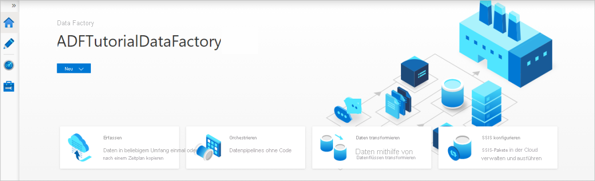

# Kopieren von Daten aus Azure Data Lake Storage Gen1 in Gen2 mit Azure Data Factory

[!INCLUDE[appliesto-adf-asa-md](includes/appliesto-adf-asa-md.md)]

Azure Data Lake Storage Gen2 bietet eine Reihe von Funktionen für die Big Data-Analyse, die auf [Azure Blob Storage](../storage/blobs/storage-blobs-introduction.md) aufbaut. So haben Sie eine Schnittstelle zu Ihren Daten sowohl über das Dateisystem als auch den Objektspeicher.

Wenn Sie zurzeit Azure Data Lake Storage Gen1 verwenden, können Sie Azure Data Lake Storage Gen2 bewerten, indem Sie mithilfe von Azure Data Factory Daten aus Data Lake Storage Gen1 in Gen2 kopieren.

Azure Data Factory ist ein vollständig verwalteter, cloudbasierter Datenintegrationsdienst. Mithilfe dieses Diensts können Sie den Lake mit Daten aus zahlreichen lokalen und cloudbasierten Datenspeichern füllen und Zeit beim Erstellen von Analyselösungen sparen. Eine Liste der unterstützten Connectors finden Sie in der Tabelle [Unterstützte Datenspeicher](copy-activity-overview.md#supported-data-stores-and-formats).

Azure Data Factory bietet eine Lösung zur horizontalen Skalierung und Verschiebung verwalteter Daten. Aufgrund der horizontal skalierbaren Architektur von Data Factory können Daten mit hohem Durchsatz erfasst werden. Weitere Informationen finden Sie unter [Leistung der Kopieraktivität](copy-activity-performance.md).

In diesem Artikel erfahren Sie, wie Sie das Tool zum Kopieren von Daten in Data Factory zum Kopieren von Daten aus Azure Data Lake Storage Gen1 in Azure Data Lake Storage Gen2 verwenden. Sie können ähnliche Schritte zum Kopieren von Daten aus anderen Typen von Datenspeichern ausführen.

## Voraussetzungen

* Ein Azure-Abonnement. Wenn Sie kein Azure-Abonnement besitzen, können Sie ein [kostenloses Konto](https://azure.microsoft.com/free/) erstellen, bevor Sie beginnen.
* Sie müssen ein Azure Data Lake Storage Gen1-Konto auswählen, das Daten enthält.
* Azure Storage-Konto mit aktiviertem Data Lake Storage Gen2. [Erstellen Sie ein Speicherkonto](https://ms.portal.azure.com/#create/Microsoft.StorageAccount-ARM), wenn Sie noch keines besitzen.

## Erstellen einer Data Factory

1. Wählen Sie im Menü auf der linken Seite **Ressource erstellen** > **Daten + Analysen** > **Data Factory** aus.
   
   

2. Geben Sie auf der Seite **Neue Data Factory** die in der folgenden Abbildung gezeigten Werte für die Felder an: 
      
   
 
    * **Name**: Geben Sie einen global eindeutigen Namen für die Azure Data Factory ein. Wenn die Fehlermeldung „Data Factory mit dem Namen \"LoadADLSDemo\" ist nicht verfügbar“ angezeigt wird, geben Sie einen anderen Namen für die Data Factory ein. Verwenden Sie beispielsweise den Namen _**IhrName**_ **ADFTutorialDataFactory**. Erstellen Sie die Data Factory erneut. Benennungsregeln für Data Factory-Artefakte finden Sie im Thema [Data Factory – Benennungsregeln](naming-rules.md).
    * **Abonnement**: Wählen Sie Ihr Azure-Abonnement aus, in dem die Data Factory erstellt werden soll. 
    * **Ressourcengruppe**: Wählen Sie in der Dropdownliste eine vorhandene Ressourcengruppe aus. Sie können auch die Option **Neu erstellen** auswählen und den Namen einer Ressourcengruppe eingeben. Weitere Informationen zu Ressourcengruppen finden Sie unter [Verwenden von Ressourcengruppen zum Verwalten von Azure-Ressourcen](../azure-resource-manager/management/overview.md). 
    * **Version**: Wählen Sie **V2** aus.
    * **Standort**: Wählen Sie den Standort für die Data Factory aus. In der Dropdownliste werden nur unterstützte Standorte angezeigt. Die von der Data Factory verwendeten Datenspeicher können sich an anderen Standorten bzw. in anderen Regionen befinden. 

3. Klicken Sie auf **Erstellen**.
4. Nach Abschluss der Erstellung navigieren Sie zu Ihrer Data Factory. Die Startseite **Data Factory** wird wie in der folgenden Abbildung dargestellt angezeigt: 
   
   :::image type="content" source="./media/doc-common-process/data-factory-home-page.png" alt-text="Startseite für die Azure Data Factory mit der Kachel „Open Azure Data Factory Studio“.":::

5. Klicken Sie auf der Kachel **Open Azure Data Factory Studio** auf **Öffnen**, um die Datenintegrationsanwendung in einer separaten Registerkarte zu starten.

## Laden von Daten in Azure Data Lake Storage Gen2

1. Wählen Sie auf der Homepage die Kachel **Erfassung** aus, um das Tool zum Kopieren von Daten zu starten. 

   

2. Wählen Sie auf der Seite **Eigenschaften** die Option **Integrierte Kopieraufgabe** unter dem **Aufgabentyp** aus. Wählen Sie nun unter **Aufgabenintervall oder Aufgabenzeitplan** die Option **Jetzt einmal ausführen** und dann **Weiter** aus.

3. Klicken Sie auf der Seite **Quelldatenspeicher** auf **+ Neue Verbindung**.
    
4. Wählen Sie im Connectorkatalog **Azure Data Lake Storage Gen1** aus, und klicken Sie auf **Weiter**.
    
    
    
5. Führen Sie auf der Seite **Neue Verbindung (Azure Data Lake Storage Gen1)** die folgenden Schritte aus:
   1. Wählen Sie Ihr Data Lake Storage Gen1 für den Kontonamen aus, und geben Sie den **Mandanten** an oder überprüfen Sie den angegebenen Mandanten.
   1. Wählen Sie **Verbindung testen** aus, um die Einstellungen zu überprüfen. Klicken Sie anschließend auf **Erstellen**.
  
   > [!IMPORTANT]
   > In dieser exemplarischen Vorgehensweise verwenden Sie eine verwaltete Identität für Azure-Ressourcen, um Azure Data Lake Storage Gen1 zu authentifizieren. Um der verwalteten Identität die entsprechenden Berechtigungen in Azure Data Lake Storage Gen1 zu erteilen, befolgen Sie [diese Anweisungen](connector-azure-data-lake-store.md#managed-identity).
   
   
      
6. Führen Sie auf der Seite **Quelldatenspeicher** die folgenden Schritte aus. 
    1. Wählen Sie im Abschnitt **Verbindung** die neu erstellte Verbindung aus.
    1. Navigieren Sie unter **Datei oder Ordner** zu dem Ordner und der Datei, die Sie kopieren möchten. Wählen Sie den Ordner oder die Datei und dann **OK** aus.
    1. Geben Sie das Kopierverhalten an, indem Sie die Optionen **Rekursiv** und **Binärkopie** auswählen. Klicken Sie auf **Weiter**.
    
    :::image type="content" source="./media/load-azure-data-lake-storage-gen2-from-gen1/source-data-store-page.png" alt-text="Screenshot der Seite „Quelldatenspeicher“.":::
    
7. Wählen Sie auf der Seite **Zieldatenspeicher** die Optionen **+ Neue Verbindung** > **Azure Data Lake Storage Gen2** > **Weiter** aus.

    

8. Führen Sie auf der Seite **Neue Verbindung (Azure Data Lake Storage Gen2)** die folgenden Schritte aus:
   1. Wählen Sie in der Dropdownliste **Speicherkontoname** das Data Lake Storage Gen2-fähige Konto aus.
   1. Wählen Sie **Erstellen** aus, um die Verbindung zu erstellen. 

   

9. Führen Sie auf der Seite **Zieldatenspeicher** die folgenden Schritte aus. 
    1. Wählen Sie im Block **Verbindung** die neu erstellte Verbindung aus. 
    1. Geben Sie dann unter **Ordnerpfad** die Zeichenfolge **copyfromadlsgen1** als Namen für den Ausgabeordner ein, und wählen Sie dann **Weiter** aus. Data Factory erstellt während des Kopiervorgangs das entsprechende Dateisystem und die Unterordner für Azure Data Lake Storage Gen2, wenn diese noch nicht vorhanden sind.

    :::image type="content" source="./media/load-azure-data-lake-storage-gen2-from-gen1/destination-data-store-page.png" alt-text="Screenshot der Seite „Zieldatenspeicher“.":::

10. Geben Sie auf der Seite **Einstellungen** im Feld **Aufgabenname** den Namen **CopyFromADLSGen1ToGen2** ein und wählen Sie dann **Weiter** aus, um die Standardeinstellungen zu übernehmen.

11. Überprüfen Sie auf der Seite **Zusammenfassung** die Einstellungen, und klicken Sie dann auf **Weiter**.

    

12. Klicken Sie auf der Seite **Bereitstellung** auf **Überwachen**, um die Pipeline zu überwachen.

    

13. Beachten Sie, dass die Registerkarte **Überwachen** auf der linken Seite automatisch ausgewählt ist. In der Spalte **Pipelinename** werden Links zum Anzeigen von Aktivitätsausführungsdetails und zum erneuten Ausführen der Pipeline angezeigt.

    

14. Wenn Sie die der Pipelineausführung zugeordneten Aktivitätsausführungen anzeigen möchten, wählen Sie den Link in der Spalte **Pipelinename** aus. Da die Pipeline nur eine Aktivität (Copy-Aktivität) enthält, wird nur ein Eintrag angezeigt. Wählen Sie im Breadcrumbmenü oben den Link **Alle Pipelineausführungen** aus, um zur Ansicht „Pipelineausführungen“ zurückzukehren. Klicken Sie zum Aktualisieren der Liste auf **Aktualisieren**. 

    

15. Zum Überwachen der Ausführungsdetails jeder Kopieraktivität klicken Sie in der Aktivitätsüberwachungsansicht unter der Spalte **Aktivitätsname** auf den Link **Details** (Brillensymbol). Sie können Details wie die Menge der Daten, die aus der Quelle in die Senke kopiert wurden, den Datendurchsatz, die Ausführungsschritte mit entsprechender Dauer sowie die verwendeten Konfigurationen überwachen.

    :::image type="content" source="./media/load-azure-data-lake-storage-gen2-from-gen1/monitor-activity-run-details.png" alt-text="Screenshot der Details zur Aktivitätsausführung.":::

16. Stellen Sie sicher, dass die Daten in Ihr Azure Data Lake Storage Gen2-Konto kopiert werden.

## Bewährte Methoden

Informationen zum allgemeinen Upgrade von Azure Data Lake Storage Gen1 auf Azure Data Lake Storage Gen2 finden Sie unter [Upgrade von Big Data-Analyselösungen von Azure Data Lake Storage Gen1 auf Azure Data Lake Storage Gen2](../storage/blobs/data-lake-storage-migrate-gen1-to-gen2.md). In den folgenden Abschnitten werden bewährte Methoden für die Verwendung von Data Factory für ein Datenupgrade von Data Lake Storage Gen1 auf Data Lake Storage Gen2 vorgestellt.

### Verlaufsdatenkopie

#### Leistungsoptimierung durch Proof-of-Concept

Verwenden Sie einen Proof of Concept, um die End-to-End-Lösung zu überprüfen und den Kopierdurchsatz in Ihrer Umgebung zu testen. Wichtigste Schritte für den Proof of Concept: 

1. Erstellen Sie eine Data Factory-Pipeline mit einer einzelnen Kopieraktivität, um mehrere TBs an Daten von Data Lake Storage Gen1 nach Data Lake Storage Gen2 zu kopieren und eine Basislinie für die Kopierleistung zu erhalten. Beginnen Sie mit [Datenintegrationseinheiten (DIUs)](copy-activity-performance-features.md#data-integration-units) von 128. [Parallele Kopie](copy-activity-performance-features.md#parallel-copy) sollte auf **leer (Standard)** festgelegt sein.
2. Auf der Grundlage des Kopierdurchsatzes, den Sie im ersten Schritt erhalten, berechnen Sie den geschätzten Zeitaufwand für die gesamte Datenmigration. Wenn der Kopierdurchsatz bei Ihnen nicht zufriedenstellend ist, identifizieren und beheben Sie die Leistungsengpässe, indem Sie die [Schritte zur Optimierung der Leistung](copy-activity-performance.md#performance-tuning-steps) ausführen.
3. Wenn Sie die Leistung bei einer einzelnen Kopieraktivität maximiert haben, die Durchsatzobergrenzen Ihrer Umgebung jedoch noch nicht erreicht haben, können Sie mehrere Kopieraktivitäten parallel ausführen. Jede Kopieraktivität kann so konfiguriert werden, dass jeweils eine Partition kopiert wird, sodass mehrere Kopieraktivitäten parallel Daten aus einem einzelnen Data Lake Storage Gen1-Konto kopieren können. Zum Partitionieren der Dateien verwenden Sie **name range- listAfter/listBefore** in der [Eigenschaft der Kopieraktivität](connector-azure-data-lake-store.md#copy-activity-properties).

Wenn die Gesamtdatengröße in Data Lake Storage Gen1 kleiner als 30 TB ist und die Anzahl der Dateien kleiner als 1 Million ist, können Sie alle Daten in einer einzelnen Kopieraktivitätsausführung kopieren. Wenn Sie eine größere Datenmenge zu kopieren haben oder die Flexibilität wünschen, die Datenmigration in Batches zu verwalten und diese jeweils innerhalb eines bestimmten Zeitraums abzuschließen, partitionieren Sie die Daten. Durch die Partitionierung verringert sich auch das Risiko unerwarteter Probleme. 

#### Netzwerkbandbreite und Speicher-E/A 

Wenn bei der [Überwachung der Kopieraktivität](copy-activity-monitoring.md#monitor-visually) eine erhebliche Anzahl von Drosselungsfehlern angezeigt wird, deutet dies darauf hin, dass Sie das Kapazitätslimit Ihres Speicherkontos erreicht haben. ADF wiederholt den Vorgang automatisch, um Drosselungsfehler zu beheben und um sicherzustellen, dass keine Daten verloren gehen, zu viele Wiederholungen wirken sich jedoch auch auf den Kopierdurchsatz aus. In diesem Fall wird empfohlen, die Anzahl der parallel ausgeführten Kopieraktivitäten zu reduzieren, um eine erhebliche Anzahl von Drosselungsfehlern zu vermeiden. Wenn Sie eine einzelne Kopieraktivität zum Kopieren von Daten verwendet haben, wird empfohlen, die Anzahl der [Datenintegrationseinheiten (DIUs)](copy-activity-performance-features.md#data-integration-units) zu reduzieren.

### Inkrementelles Kopieren 

Sie können mehrere Methoden verwenden, um nur die neuen oder aktualisierten Dateien aus Data Lake Storage Gen1 zu laden:

- Laden Sie neue oder aktualisierte Dateien nach zeitpartitioniertem Ordner- oder Dateinamen. Ein Beispiel hierfür ist „/2019/05/13/*“.
- Laden Sie neue oder aktualisierte Dateien nach „LastModifiedDate“. Wenn Sie große Mengen von Dateien kopieren, erstellen Sie zuerst Partitionen, um einen geringen Kopierdurchsatz zu vermeiden, der sich aus der Überprüfung des gesamten Data Lake Storage Gen1-Kontos durch eine einzelne Kopieraktivität zum Identifizieren neuer Dateien ergeben kann. 
- Identifizieren Sie neue oder aktualisierte Dateien durch ein Tool bzw. eine Lösung von Drittanbietern. Übergeben Sie dann den Datei- oder Ordnernamen per Parameter, Tabelle oder Datei an die Data Factory-Pipeline. 

Die richtige Häufigkeit für das inkrementelle Laden hängt von der Gesamtzahl der Dateien in Azure Data Lake Storage Gen1 und dem Volumen der neuen oder aktualisierten Dateien ab, die jedes Mal geladen werden müssen. 

### Beibehalten von ACLs

Wenn Sie die Zugriffssteuerungslisten zusammen mit Datendateien beim Upgrade von Data Lake Storage Gen1 auf Gen2 replizieren möchten, finden Sie weitere Informationen unter [Bewahren von Zugriffssteuerungslisten von Data Lake Storage Gen1](connector-azure-data-lake-storage.md#preserve-acls). 

### Berechtigungen 

In Data Factory unterstützt der [Azure Data Lake Storage Gen1-Connector](connector-azure-data-lake-store.md) den Dienstprinzipal und die verwaltete Identität für Azure-Ressourcenauthentifizierungen. Der [Azure Data Lake Storage Gen2-Connector](connector-azure-data-lake-storage.md) unterstützt den Kontoschlüssel, den Dienstprinzipal und die verwaltete Identität für Azure-Ressourcenauthentifizierungen. Damit Data Factory in der Lage ist, nach Bedarf zu navigieren und alle benötigten Dateien oder Zugriffssteuerungslisten (ACLs) zu kopieren, gewähren Sie dem von Ihnen bereitgestellten Konto ausreichende Berechtigungen für den Zugriff, das Lesen oder das Schreiben aller Dateien und das Festlegen von ACLs. Erteilen Sie dem Konto während der Migrationsphase die Administrator- oder Besitzerrolle. 

## Nächste Schritte

> [!div class="nextstepaction"]
> [Kopieraktivität – Übersicht](copy-activity-overview.md)
> [Azure Data Lake Storage Gen1-Connector](connector-azure-data-lake-store.md)
> [Azure Data Lake Storage Gen2-Connector](connector-azure-data-lake-storage.md)