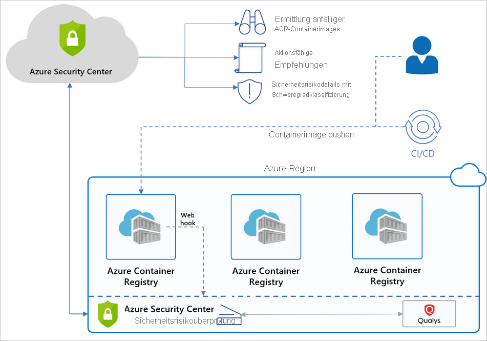

# Einführung in Microsoft Defender für Containerregistrierungen

[!INCLUDE [Banner for top of topics](./includes/banner.md)]

Azure Container Registry (ACR) ist ein verwalteter, privater Docker-Registrierungsdienst, der Ihre Containerimages für Azure-Bereitstellungen in einer zentralen Registrierung speichert und verwaltet. Er basiert auf der Open-Source-Docker-Registrierung 2.0.

Aktivieren Sie **Microsoft Defender für Containerregistrierungen** auf Abonnementebene, um die auf Azure Resource Manager basierenden Registrierungen in Ihrem Abonnement zu schützen. Mit Defender für Cloud werden dann alle Images gescannt, wenn sie in die Registrierung gepusht oder importiert werden oder innerhalb der letzten 30 Tage gepullt wurden. Ihnen wird jedes gescannte Image in Rechnung gestellt – einmal pro Image.

## Verfügbarkeit

|Aspekt|Details|
|----|:----|
|Status des Release:|Allgemein verfügbar (Generally Available, GA)|
|Preise:|**Microsoft Defender für Container-Registrierungen** wird wie auf der [Preisseite](https://azure.microsoft.com/pricing/details/security-center/) angegeben in Rechnung gestellt.|
|Unterstützte Registrierungen und Images:|Linux-Images in ACR-Registrierungen, auf die mit Shellzugriff über das öffentliche Internet zugegriffen werden kann [Mit Azure Private Link geschützte ACR-Registrierungen](../container-registry/container-registry-private-link.md)|
|Nicht unterstützte Registrierungen und Images:|Windows-Images Private Registrierungen (sofern kein Zugriff auf [vertrauenswürdige Dienste](../container-registry/allow-access-trusted-services.md#trusted-services) gewährt wird) Extrem minimalistische Images wie [Docker-Scratch](https://hub.docker.com/_/scratch/)-Images oder Images ohne Distribution, die nur eine Anwendung und deren Laufzeitabhängigkeiten ohne Paket-Manager, Shell oder Betriebssystem enthalten Images mit der [Spezifikation für das Imageformat Open Container Initiative (OCI)](https://github.com/opencontainers/image-spec/blob/master/spec.md)|
|Erforderliche Rollen und Berechtigungen:|**Sicherheitsleseberechtigter** und [Azure Container Registry: Rollen und Berechtigungen](../container-registry/container-registry-roles.md)|
|Clouds:|:::image type="icon" source="./media/icons/yes-icon.png" border="false"::: Kommerzielle Clouds :::image type="icon" source="./media/icons/yes-icon.png" border="false"::: National (Azure Government, Azure China 21Vianet)|
|||

## Welche Vorteile bietet Microsoft Defender für Containerregistrierungen?

Defender für Cloud ermittelt auf Azure Resource Manager basierende ACR-Registrierungen in Ihrem Abonnement und ermöglicht für die Images Ihrer Registrierung eine nahtlose native Azure-Sicherheitsrisikobewertung und -verwaltung.

**Microsoft Defender für Containerregistrierungen** verfügt über eine Option für die Überprüfung auf Sicherheitsrisiken, mit der die Images in Ihren Azure Resource Manager-basierten Azure Container Registry-Registrierungen gescannt und die Sicherheitsrisiken Ihrer Images eingehender untersucht werden können. Der integrierte Scanner wird von Qualys bereitgestellt. Hierbei handelt es sich um einen branchenführenden Anbieter von Tools zur Überprüfung auf Sicherheitsrisiken.

Wenn Probleme gefunden werden – von Qualys oder Defender für Cloud –, werden Sie im Dashboard für den Workloadschutz entsprechend benachrichtigt. Für jedes Sicherheitsrisiko stellt Defender für Cloud umsetzbare Empfehlungen sowie eine Klassifizierung des Schweregrads und Anleitungen für die Behebung des Problems bereit. Ausführliche Informationen zu den Defender für Cloud-Empfehlungen für Container finden Sie in der [Referenzliste mit den Empfehlungen](recommendations-reference.md#recs-container).

Defender für Cloud filtert und klassifiziert die Ergebnisse der Überprüfung. Wenn ein Image fehlerfrei ist, wird es von Defender für Cloud entsprechend gekennzeichnet. Defender für Cloud generiert Sicherheitsempfehlungen nur für Images, bei denen Probleme behoben werden müssen. Defender für Cloud liefert Details zu den einzelnen gemeldeten Sicherheitsrisiken und eine Klassifizierung des Schweregrads. Außerdem erhalten Sie Anleitungen zur Behebung der spezifischen Sicherheitsrisiken, die für jedes Image gefunden wurden.

Indem Sie nur benachrichtigt werden, wenn Probleme auftreten, sorgt Defender für Cloud für eine Reduzierung potenziell unerwünschter Informationswarnungen.

> [!TIP]
> Weitere Informationen zu den Features für die Containersicherheit von Microsoft Defender für Cloud finden Sie unter:
>
> - [Microsoft Defender für Cloud und Containersicherheit](container-security.md)
> - [Einführung in Microsoft Defender für Kubernetes](defender-for-kubernetes-introduction.md)

## Wann werden Images überprüft?

Für das Scannen von Images gibt es drei Trigger:

- **On Push** (Bei Push): Immer wenn ein Image in Ihre Registrierung gepusht wird, überprüft Defender für Containerregistrierungen dieses Image automatisch. Zum Auslösen der Überprüfung eines Images müssen Sie es also an Ihr Repository pushen.

- **Recently pulled** (Vor Kurzem gepullt): Da jeden Tag neue Sicherheitsrisiken ermittelt werden, werden mit **Microsoft Defender für Containerregistrierungen** wöchentlich auch alle Images gescannt, die innerhalb der letzten 30 Tage gepullt wurden. Für dieses erneute Scannen fallen keine zusätzlichen Kosten an. Wie oben erwähnt, erfolgt die Berechnung nur einmal pro Image.

- **On import** (Beim Importieren): Azure Container Registry verfügt über Importtools, mit denen Images aus Docker Hub, Microsoft Container Registry oder einer anderen Azure-Containerregistrierung in Ihre Registrierung eingefügt werden können. Mit **Microsoft Defender für Containerregistrierungen** werden alle unterstützten Images gescannt, die Sie importieren. Weitere Informationen finden Sie unter [Importieren von Containerimages in eine Containerregistrierung](../container-registry/container-registry-import-images.md).
 
Die Überprüfung dauert normalerweise nicht länger als zwei Minuten, aber der Vorgang kann auch einmal 40 Minuten in Anspruch nehmen. Die Ergebnisse werden als Sicherheitsempfehlungen bereitgestellt, z. B. wie folgt:

## Wie funktioniert Defender für Cloud mit Azure Container Registry?

Unten ist ein allgemeines Diagramm zu den Komponenten und Vorteilen angegeben, mit denen der Schutz Ihrer Registrierungen mit Defender für Cloud sichergestellt wird.

## Häufig gestellte Fragen zur Überprüfung von Azure Container Registry-Images

### Wie scannt Defender für Cloud ein Image?
Defender für Cloud pullt das Image aus der Registrierung und führt es in einer isolierten Sandbox mit dem Qualys-Scanner aus. Der Scanner extrahiert eine Liste bekannter Sicherheitsrisiken.

Defender für Cloud filtert und klassifiziert die Ergebnisse der Überprüfung. Wenn ein Image fehlerfrei ist, wird es von Defender für Cloud entsprechend gekennzeichnet. Defender für Cloud generiert Sicherheitsempfehlungen nur für Images, bei denen Probleme behoben werden müssen. Indem Sie nur benachrichtigt werden, wenn Probleme auftreten, sorgt Defender für Cloud für eine Reduzierung potenziell unerwünschter Informationswarnungen.

### Kann ich die Scanergebnisse über die REST-API abrufen?
Ja. Die Ergebnisse befinden sich unter [Sub-Assessments Rest API](/rest/api/securitycenter/subassessments/list/) (Unterbewertungen-REST-API). Außerdem können Sie Azure Resource Graph (ARG) verwenden, die Kusto-ähnliche API für alle Ihre Ressourcen: Mit einer Abfrage kann ein bestimmter Scan abgerufen werden.

### Welche Typen von Registrierungen werden überprüft? Welche Typen werden abgerechnet?
Eine Liste der Typen von Containerregistrierungen, die von Microsoft Defender für Containerregistrierungen unterstützt werden, finden Sie unter [Verfügbarkeit](#availability).

Wenn Sie nicht unterstützte Registrierungen mit Ihrem Azure-Abonnement verknüpfen, werden diese von Defender für Cloud nicht gescannt, und sie werden Ihnen nicht in Rechnung gestellt.

### Kann ich die Ergebnisse der Überprüfung auf Sicherheitsrisiken anpassen?
Ja. Wenn in Ihrer Organisation eine Suche ignoriert werden muss, anstatt sie zu beheben, können Sie sie optional deaktivieren. Deaktivierte Ergebnisse haben keine Auswirkung auf Ihre Sicherheitsbewertung und erzeugen kein unerwünschtes Rauschen.

[Weitere Informationen zum Erstellen von Regeln zum Deaktivieren der Ergebnisse aus dem integrierten Sicherheitsrisikobewertungstool](defender-for-container-registries-usage.md#disable-specific-findings-preview).

### Warum macht mich Defender für Cloud auf Sicherheitsrisiken bei einem Image aufmerksam, das sich nicht in meiner Registrierung befindet?
Defender für Cloud bietet Sicherheitsrisikobewertungen für jedes Image, das per Push oder Pull in eine Registrierung übertragen wird. Einige Images können Tags aus einem bereits überprüften Image wiederverwenden. Sie können z. B. jedes Mal, wenn Sie einem Digest ein Image hinzufügen, das Tag „Neueste Version“ wieder zuweisen. In solchen Fällen ist das „alte“ Image weiterhin in der Registrierung vorhanden und kann per Pull durch seinen Digest abgerufen werden. Wenn das Image Sicherheitsergebnisse aufweist und gepullt wird, entstehen Sicherheitsrisiken.

## Nächste Schritte

> [!div class="nextstepaction"]
> [Überprüfen Ihrer Images auf Sicherheitsrisiken](defender-for-container-registries-usage.md)
