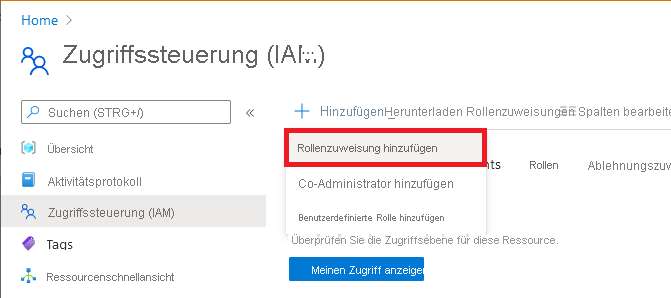

# Tutorial: Einrichten eines Labs in DevTest Labs mithilfe des Azure-Portals

In diesem Tutorial erstellen Sie ein Lab über das Azure-Portal. Ein Lab-Administrator richtet ein Lab in einer Organisation ein, erstellt VMs im Lab und konfiguriert Richtlinien. Lab-Benutzer (z.B. Entwickler und Tester) fordern virtuelle Computer im Lab an, stellen eine Verbindung mit ihnen her und nutzen sie. 

In diesem Tutorial lernen Sie Folgendes:

> [!div class="checklist"]
> * Erstellen eines Labs
> * Hinzufügen eines virtuellen Azure-Computers (VM) zum Lab
> * Hinzufügen eines Benutzers und Zuweisen zur Rolle **DevTest Labs-Benutzer**

Wenn Sie kein Azure-Abonnement besitzen, erstellen Sie ein [kostenloses Konto](https://azure.microsoft.com/free/?WT.mc_id=A261C142F), bevor Sie beginnen.

## Erstellen eines Labs

Diese Schritte beschreiben, wie Sie mithilfe des Azure-Portals ein Lab in Azure DevTest Labs erstellen. 

1. Melden Sie sich am [Azure-Portal](https://portal.azure.com) an.

1. Geben Sie `DevTest Labs` in das Suchtextfeld ein, und wählen Sie dann in den Ergebnissen **DevTest Labs** aus.

    :::image type="content" source="./media/tutorial-create-custom-lab/portal-search-devtest-labs.png" alt-text="Screenshot der Portalsuche nach DevTest Labs.":::

1. Wählen Sie auf der Seite **DevTest Labs** die Option **+ Hinzufügen** aus.

1. Geben Sie auf der Seite **Devtest Lab erstellen** auf der Registerkarte **Grundeinstellungen** die folgenden Informationen an:

    |Eigenschaft | Beschreibung |
    |---|---|
    |Subscription| Wählen Sie in der Dropdownliste das Azure-Abonnement aus, das für den Cluster verwendet wird.|
    |&nbsp;Ressourcengruppe| Wählen Sie in der Dropdownliste Ihre vorhandene Ressourcengruppe oder die Option **Neu erstellen** aus.|
    |Labname| Geben Sie einen Namen für das Lab ein.|
    |Standort| Wählen Sie in der Dropdownliste einen Speicherort für das Lab aus.|
    |Öffentliche Umgebungen| Behalten Sie den Standardwert **Ein** bei. Das Repository der öffentlichen Umgebung enthält eine Liste zusammengestellter Azure Resource Manager-Vorlagen, die Lab-Benutzer zum Erstellen von PaaS-Ressourcen innerhalb von Labs verwenden können.|

    :::image type="content" source="./media/tutorial-create-custom-lab/create-custom-lab-blade.png" alt-text="Screenshot der Registerkarte „Grundeinstellungen“ für „DevTest Labs erstellen“.":::

1. Wählen Sie **Überprüfen und erstellen** aus, um die Konfiguration zu überprüfen, und klicken Sie dann auf **Erstellen**. Für dieses Tutorial sind die Standardwerte für die anderen Registerkarten ausreichend.

1. Wählen Sie nach Abschluss des Erstellungsprozesses in der Bereitstellungsbenachrichtigung die Option **Zu Ressource wechseln** aus.

    :::image type="content" source="./media/tutorial-create-custom-lab/creation-notification.png" alt-text="Screenshot: DevTest Labs-Bereitstellungsbenachrichtigung.":::

1. Die Seite **Übersicht** des Labs ähnelt der folgenden Abbildung:

    :::image type="content" source="./media/tutorial-create-custom-lab/lab-home-page.png" alt-text="Screenshot: Seite „Übersicht“ von DevTest Labs.":::

## Hinzufügen einer VM zum Lab

1. Klicken Sie auf der Seite **DevTest Lab** auf der Symbolleiste auf **+ Hinzufügen**.

    :::image type="content" source="./media/tutorial-create-custom-lab/add-vm-to-lab-button.png" alt-text="Screenshot: Seite „Übersicht“ und Schaltfläche „Hinzufügen“ von DevTest Labs.":::

1. Wählen Sie auf der Seite **Basis auswählen** ein Marketplace-Image für den virtuellen Computer aus. Dieser Leitfaden verwendet **Windows Server 2019 Datacenter**. Bestimmte Optionen können sich unterscheiden, wenn Sie ein anderes Image verwenden.

1. Geben Sie auf der Registerkarte **Grundeinstellungen** die folgenden Informationen an:

    |Eigenschaft |Beschreibung |
    |---|---|
    |Name&nbsp;des virtuellen&nbsp;Computers| Im Textfeld wird bereits ein eindeutiger, automatisch generierter Name angegeben. Der Name entspricht dem Benutzernamen in Ihrer E-Mail-Adresse, gefolgt von einer eindeutigen dreistelligen Zahl. Behalten Sie diese Angabe bei, oder geben Sie einen eindeutigen Namen Ihrer Wahl ein.|
    |Benutzername| Im Textfeld wird bereits ein eindeutiger, automatisch generierter Name angegeben. Der Name entspricht dem Benutzernamen in Ihrer E-Mail-Adresse. Behalten Sie diese Angabe bei, oder geben Sie einen Namen Ihrer Wahl ein. Dieser Benutzer erhält auf dem virtuellen Computer **Administratorberechtigungen**.|
    |Gespeichertes Geheimnis verwenden| Lassen Sie das Kontrollkästchen für diese exemplarische Vorgehensweise deaktiviert. Sie können Geheimnisse zunächst in Azure Key Vault speichern und dann hier verwenden. Weitere Informationen finden Sie unter [Speichern eines Geheimnisses in Azure Key Vault](devtest-lab-store-secrets-in-key-vault.md). Wenn Sie lieber ein gespeichertes Geheimnis verwenden möchten, aktivieren Sie das Kontrollkästchen, und wählen Sie dann das Geheimnis aus der Dropdownliste **Geheimnis** aus.|
    |Kennwort|Geben Sie ein Kennwort ein, das zwischen 8 und 123 Zeichen lang ist.|
    |Als Standardkennwort speichern| Aktivieren Sie das Kontrollkästchen, um das Kennwort in der Azure Key Vault-Instanz zu speichern, die dem Lab zugeordnet ist.|
    |Größe des virtuellen Computers| Behalten Sie den Standardwert bei, oder wählen Sie **Größe ändern** aus, um andere physische Komponenten auszuwählen. In dieser exemplarischen Vorgehensweise wird **Standard_D4_v3** verwendet.|
    |Typ des Betriebssystemdatenträgers|Behalten Sie den Standardwert bei, oder wählen Sie eine andere Option aus der Dropdownliste aus.|
    |Artifacts| Wird für dieses Tutorial nicht verwendet.|

   :::image type="content" source="./media/tutorial-create-custom-lab/portal-lab-vm-basic-settings.png" alt-text="Screenshot der Seite „Grundeinstellungen“ des virtuellen Computers.":::

1. Wählen Sie die Registerkarte **Erweiterte Einstellungen** aus, und geben Sie die folgenden Informationen an:

    |Eigenschaft |BESCHREIBUNG |
    |---|---|
    |Virtuelles Netzwerk| Behalten Sie die Angabe unverändert bei, oder wählen Sie in der Dropdownliste ein anderes Netzwerk aus.|
    |&nbsp;Subnetzauswahl| Behalten Sie die Angabe unverändert bei, oder wählen Sie in der Dropdownliste ein anderes Subnetz aus.|
    |IP address (IP-Adresse)| Für diese exemplarische Vorgehensweise behalten Sie den Standardwert **Freigegeben** bei. Wenn **Freigegeben** ausgewählt ist, aktiviert Azure DevTest Labs automatisch RDP für Windows-VMs und SSH für Linux-VMs. Wenn Sie **Öffentlich** auswählen, sind RDP und SSH ohne Änderungen durch DevTest Labs aktiviert.  |
    |Ablaufdatum| Behalten Sie die Angabe unverändert bei, um kein Ablaufdatum festzulegen, oder wählen Sie das Kalendersymbol aus, um ein Ablaufdatum festzulegen.|
    |Diesen Computer als abrufbar festlegen| Behalten Sie die Angabe unverändert als **Nein** bei. Um die VM für einen Lab-Benutzer abrufbar zu machen, wählen Sie **Ja** aus. Das Markieren des Computers als abrufbar bedeutet, dass ihm zum Zeitpunkt der Erstellung kein Besitzer zugewiesen wird. |
    |Anzahl von Instanzen| Behalten Sie die Angabe unverändert als **1** bei. Die Anzahl der zu erstellenden VM-Instanzen.|
    |Automation | Optional. Wenn Sie **ARM-Vorlage anzeigen** auswählen, wird die Vorlage auf einer neuen Seite geöffnet. Sie können die Vorlage kopieren und speichern, um den gleichen virtuellen Computer später zu erstellen. Nach dem Speichern können Sie die Azure Resource Manager-Vorlage zum [Bereitstellen neuer virtueller Computer mit Azure PowerShell](../azure-resource-manager/templates/overview.md) nutzen.|

   :::image type="content" source="./media/tutorial-create-custom-lab/portal-lab-vm-advanced-settings.png" alt-text="Seite „Erweiterte Einstellungen“ des virtuellen Computers.":::

1. Kehren Sie zur Registerkarte **Grundeinstellungen** zurück, und wählen Sie dann **Erstellen** aus.

1. Sie werden zurück auf die Seite **DevTest Lab** geleitet. Wählen Sie unter **Mein Lab** die Option **Abrufbare virtuelle Computer** aus.

   :::image type="content" source="./media/tutorial-create-custom-lab/portal-lab-vm-creation-status.png" alt-text="Screenshot: Seite „Status der Lab-VM-Erstellung“.":::

1. Wählen Sie nach einigen Minuten **Aktualisieren** aus, wenn Ihre virtuellen Computer nicht angezeigt werden. Die Installationszeiten variieren basierend auf der ausgewählten Hardware, dem Basisimage und den Artefakten. Die Installation der in dieser exemplarischen Vorgehensweise verwendeten Konfigurationen hat etwa 12 Minuten betragen.

## Hinzufügen eines Benutzers zur Rolle „DevTest Labs-Benutzer“

1. Navigieren Sie zu der Ressourcengruppe, die das von Ihnen erstellte Lab enthält. Sie müssen [Benutzerzugriffsadministrator](../role-based-access-control/built-in-roles.md#user-access-administrator) oder [Besitzer](../role-based-access-control/built-in-roles.md#owner) sein.

1. Wählen Sie im linken Menü **Zugriffssteuerung (IAM)** aus.

1. Wählen Sie **+Hinzufügen** > **Rollenzuweisung hinzufügen** aus.

    

1. Wählen Sie auf der Registerkarte **Rolle** die Rolle **DevelopmentTest Labs User** (EntwicklungTestlabor Benutzer).

    

1. Wählen Sie auf der Registerkarte **Mitglieder** den Benutzer aus, dem Sie die Rolle zuweisen möchten.

1. Wählen Sie auf der Registerkarte **Überprüfen und zuweisen** die Option **Überprüfen und zuweisen** aus, um die Rolle zuzuweisen.

## Bereinigen von Ressourcen

Löschen Sie Ressourcen, um Gebühren für die Ausführung des Labs und der VM in Azure zu vermeiden. Wenn Sie das nächste Tutorial durcharbeiten möchten, um auf die VM im Lab zuzugreifen, können Sie die Ressourcen nach Abschluss dieses Tutorials bereinigen. Führen Sie andernfalls die folgenden Schritte aus: 

1. Kehren Sie zur Homepage für das Lab zurück, das Sie erstellt haben.

1. Wählen im oberen Menü **Löschen** aus.

   :::image type="content" source="./media/tutorial-create-custom-lab/portal-lab-delete.png" alt-text="Screenshot der Schaltfläche „Löschen“ des Labs.":::

1. Geben Sie auf der Seite **Möchten Sie den Löschvorgang durchführen?** den Lab-Namen in das Textfeld ein, und wählen Sie dann **Löschen** aus.

1. Während des Löschvorgangs können Sie oben auf dem Bildschirm **Benachrichtigungen** auswählen, um den Status anzuzeigen. Das Löschen des Labs dauert eine Weile. Fahren Sie mit dem nächsten Schritt fort, nachdem das Lab gelöscht wurde.

1. Wenn Sie das Lab in einer vorhandenen Ressourcengruppe erstellt haben, wurden alle Lab-Ressourcen entfernt. Wenn Sie eine neue Ressourcengruppe für dieses Tutorial erstellt haben, ist diese jetzt leer und kann gelöscht werden. Zuvor wäre nicht möglich gewesen, die Ressourcengruppe zu löschen, während sich das Lab noch in ihr befand.

## Nächste Schritte

In diesem Tutorial haben Sie ein Lab erstellt, eine VM hinzugefügt und einem Benutzer dann Zugriff auf das Lab gewährt. Um zu erfahren, wie Sie als Lab-Benutzer auf das Lab zugreifen, fahren Sie mit dem nächsten Tutorial fort:

> [!div class="nextstepaction"]
> [Tutorial: Zugreifen auf das Lab](tutorial-use-custom-lab.md)
