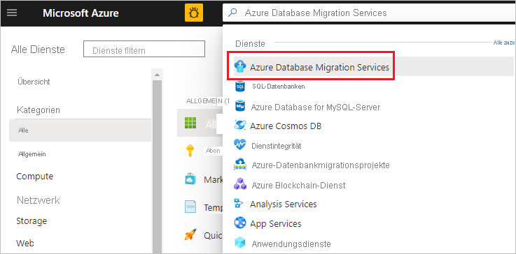

# Tutorial: Onlinemigration von SQL Server zu Azure SQL Managed Instance mithilfe von DMS

Mit Azure Database Migration Service können Sie die Datenbanken von einer SQL Server-Instanz mit minimaler Downtime zu [Azure SQL Managed Instance](../azure-sql/managed-instance/sql-managed-instance-paas-overview.md) migrieren. Informationen zu weiteren Methoden, die einen gewissen manuellen Aufwand erfordern, finden Sie im Artikel [Migration einer SQL Server-Instanz zu Azure SQL Managed Instance](../azure-sql/migration-guides/managed-instance/sql-server-to-managed-instance-guide.md).

In diesem Tutorial migrieren Sie mithilfe von Azure Database Migration Service die Datenbank [AdventureWorks2016](/sql/samples/adventureworks-install-configure#download-backup-files) mit minimaler Downtime von einer lokalen SQL Server-Instanz zu einer Instanz von SQL Managed Instance.

Sie lernen Folgendes:
> [!div class="checklist"]
>
> * Registrieren des Ressourcenanbieters für die Azure-Datenmigration
> * Erstellen einer Instanz von Azure Database Migration Service
> * Erstellen eines Migrationsprojekts und Starten der Onlinemigration mithilfe von Azure Database Migration Service
> * Überwachen der Migration
> * Führen Sie die Migrationsübernahme durch, wenn Sie bereit sind.

> [!IMPORTANT]
> Für die Onlinemigration von SQL Server zu SQL Managed Instance mithilfe von Azure Database Migration Service müssen Sie die vollständige Datenbanksicherung und nachfolgende Protokollsicherungen auf der SMB-Netzwerkfreigabe bereitstellen, die der Dienst zum Migrieren Ihrer Datenbanken verwenden kann. Azure Database Migration Service initiiert keine Sicherungen, sondern verwendet für die Migration vorhandene Sicherungen, die Sie im Rahmen Ihres Notfallwiederherstellungsplans möglicherweise bereits besitzen.
> Achten Sie darauf, [Sicherungen mit der Option WITH CHECKSUM](/sql/relational-databases/backup-restore/enable-or-disable-backup-checksums-during-backup-or-restore-sql-server?preserve-view=true&view=sql-server-2017) zu erstellen. Jede Sicherung kann entweder in eine separate Sicherungsdatei oder in mehrere Sicherungsdateien geschrieben werden. Das Anfügen mehrerer Sicherungen (vollständig und Transaktionsprotokoll) an ein einzelnes Sicherungsmedium wird jedoch nicht unterstützt. Des Weiteren können Sie komprimierte Sicherungen verwenden, um die Wahrscheinlichkeit von potenziellen Problemen bei der Migration großer Sicherungen zu verringern.

> [!NOTE]
> Die Verwendung von Azure Database Migration Service zum Ausführen einer Onlinemigration erfordert das Erstellen einer Instanz auf der Grundlage des Premium-Tarifs.

> [!IMPORTANT]
> Für eine optimale Migration empfiehlt Microsoft die Erstellung einer Azure Database Migration Service-Instanz in derselben Azure-Region, in der sich auch die Zieldatenbank befindet. Die Verschiebung von Daten zwischen Regionen oder Geografien kann den Migrationsvorgang verlangsamen und Fehler verursachen.

> [!IMPORTANT]
> Verkürzen Sie die Dauer des Onlinemigrationsvorgangs so stark wie möglich, um die Gefahr von Unterbrechungen zu minimieren, die durch die Neukonfiguration von Instanzen oder geplante Wartung bedingt sind. Im Fall eines solchen Ereignisses muss der Migrationsprozess von Anfang an neu beginnen. Bei einer geplanten Wartung gibt es eine Toleranzperiode von 36 Stunden, bevor der Migrationsprozess neu gestartet wird.

[!INCLUDE [online-offline](../../includes/database-migration-service-offline-online.md)]

In diesem Artikel wird die Onlinemigration von SQL Server zu einer Instanz von SQL Managed Instance beschrieben. Informationen zur Offlinemigration finden Sie unter [Tutorial: Migrieren von SQL Server zu einer verwalteten Azure SQL-Datenbank-Instanz mithilfe von DMS (offline)](tutorial-sql-server-to-managed-instance.md).

## Voraussetzungen

Für dieses Tutorial benötigen Sie Folgendes:

* Laden Sie [SQL Server 2016 oder höher](https://www.microsoft.com/sql-server/sql-server-downloads) herunter, und installieren Sie es.
* Aktivieren Sie das TCP/IP-Protokoll (dieses wird während der SQL Server Express-Installation standardmäßig deaktiviert), indem Sie die Anweisungen im Artikel [Aktivieren oder Deaktivieren eines Servernetzwerkprotokolls](/sql/database-engine/configure-windows/enable-or-disable-a-server-network-protocol#SSMSProcedure) befolgen.
* [Stellen Sie die Datenbank „AdventureWorks2016“ in der SQL Server-Instanz wieder her.](/sql/samples/adventureworks-install-configure#restore-to-sql-server)
* Erstellen Sie ein virtuelles Microsoft Azure-Netzwerk für Azure Database Migration Service mithilfe des Azure Resource Manager-Bereitstellungsmodells, das Site-to-Site-Konnektivität für Ihre lokalen Quellserver über [ExpressRoute](../expressroute/expressroute-introduction.md) oder über [VPN](../vpn-gateway/vpn-gateway-about-vpngateways.md) bereitstellt. [Erfahren Sie mehr über Netzwerktopologien für SQL Managed Instance-Migrationen mithilfe von Azure Database Migration Service](./resource-network-topologies.md). Weitere Informationen zum Erstellen eines virtuellen Netzwerks finden Sie in der [Dokumentation zu Virtual Network](../virtual-network/index.yml) und insbesondere in den Schnellstartartikeln mit Schritt-für-Schritt-Anleitungen.

    > [!NOTE]
    > Fügen Sie bei Verwendung von ExpressRoute mit Netzwerkpeering zu Microsoft während des Setups des virtuellen Netzwerks die folgenden [Dienstendpunkte](../virtual-network/virtual-network-service-endpoints-overview.md) zu dem Subnetz hinzu, in dem der Dienst bereitgestellt werden soll:
    >
    > * Zieldatenbankendpunkt (z. B. SQL-Endpunkt, Cosmos DB-Endpunkt usw.)
    > * Speicherendpunkt
    > * Service Bus-Endpunkt
    >
    > Diese Konfiguration ist erforderlich, weil Azure Database Migration Service über keine Internetverbindung verfügt.
    >
    >Wenn Sie keine Site-to-Site-Konnektivität zwischen dem lokalen Netzwerk und Azure haben oder wenn die Bandbreite der Site-to-Site-Konnektivität begrenzt ist, sollten Sie die Verwendung von Azure Database Migration Service im Hybridmodus (Vorschauversion) in Betracht ziehen. Der Hybridmodus nutzt einen lokalen Migrationsworker zusammen mit einer Instanz von Azure Database Migration Service, die in der Cloud ausgeführt wird. Informationen zum Erstellen einer Instanz von Azure Database Migration Service im Hybridmodus finden Sie im Artikel [Erstellen einer Instanz von Azure Database Migration Service im Hybridmodus mit dem Azure-Portal](./quickstart-create-data-migration-service-portal.md).

    > [!IMPORTANT]
    > In Bezug auf das Speicherkonto, das im Rahmen der Migration verwendet wird, müssen Sie einen der folgenden Schritte ausführen:
    > * Festlegen, dass alle Netzwerke auf das Speicherkonto zugreifen können
    > * [Subnetzdelegierung](../virtual-network/manage-subnet-delegation.md) für MI-Subnetz aktivieren und die Firewallregeln für das Speicherkonto aktualisieren, um dieses Subnetz zuzulassen

* Stellen Sie sicher, dass die NSG-Regeln (Netzwerksicherheitsgruppen) des virtuellen Netzwerks nicht den ausgehenden Port 443 von ServiceTag für ServiceBus, Storage und AzureMonitor blockieren. Ausführlichere Informationen zur NSG-Datenverkehrsfilterung in einem virtuellen Netzwerk finden Sie im Artikel [Filtern des Netzwerkdatenverkehrs mit Netzwerksicherheitsgruppen](../virtual-network/virtual-network-vnet-plan-design-arm.md).
* Konfigurieren Sie Ihre [Windows-Firewall für Quelldatenbank-Engine-Zugriff](/sql/database-engine/configure-windows/configure-a-windows-firewall-for-database-engine-access).
* Öffnen Sie Ihre Windows-Firewall, damit Azure Database Migration Service auf die SQL Server-Quellinstanz zugreifen kann (standardmäßig TCP-Port 1433). Wenn die Standardinstanz an einem anderen Port lauscht, fügen Sie diesen der Firewall hinzu.
* Bei der Ausführung mehrerer benannter SQL Server-Instanzen mit dynamischen Ports empfiehlt es sich, den SQL-Browser-Dienst zu aktivieren und den Zugriff auf den UDP-Port 1434 durch Ihre Firewalls zuzulassen, sodass Azure Database Migration Service eine Verbindung mit einer benannten Instanz auf Ihrem Quellserver herstellen kann.
* Wenn Sie eine Firewallappliance vor Ihren Quelldatenbanken verwenden, müssen Sie möglicherweise Firewallregeln hinzufügen, damit Azure Database Migration Service auf die Quelldatenbanken für die Migration sowie auf Dateien über SMB-Port 445 zugreifen kann.
* Eine Anleitung zum Erstellen einer verwalteten SQL-Instanz finden Sie im Artikel [Erstellen einer verwalteten SQL-Instanz im Azure-Portal](../azure-sql/managed-instance/instance-create-quickstart.md).
* Stellen Sie sicher, dass die zum Herstellen einer Verbindung zwischen der SQL Server-Quellinstanz und der SQL Managed Instance-Zielinstanz verwendeten Anmeldungen Mitglieder der sysadmin-Serverrolle sind.
* Stellen Sie eine SMB-Netzwerkfreigabe bereit, die alle vollständigen Datenbanksicherungsdateien Ihrer Datenbank sowie nachfolgende Sicherungsdateien des Transaktionsprotokolls enthält, die Azure Database Migration Service für die Datenbankmigration verwenden kann.
* Stellen Sie sicher, dass das Dienstkonto, unter dem die SQL Server-Quellinstanz ausgeführt wird, über Schreibberechtigungen für die Netzwerkfreigabe verfügt, die Sie erstellt haben, und dass das Computerkonto für den Quellserver über Lese-/Schreibzugriff auf dieselbe Freigabe verfügt.
* Notieren Sie sich einen Windows-Benutzer (mit Kennwort), der Vollzugriff auf die von Ihnen zuvor erstellte Netzwerkfreigabe hat. Azure Database Migration Service verwendet die Benutzeranmeldeinformationen, um die Sicherungsdateien für Wiederherstellungsvorgänge in den Azure Storage-Container hochzuladen.
* Erstellen Sie eine Azure Active Directory-Anwendungs-ID, die den Anwendungs-ID-Schlüssel generiert, den Azure Database Migration Service für die Verbindungsherstellung mit dem Ziel Azure Database Managed Instance und Azure Storage-Container verwenden kann. Weitere Informationen finden Sie unter [Erstellen einer Azure Active Directory-Anwendung und eines Dienstprinzipals mit Ressourcenzugriff mithilfe des Portals](../active-directory/develop/howto-create-service-principal-portal.md).

  > [!NOTE]
  > Die vom Dienst verwendete Anwendungs-ID unterstützt Azure Database Migration Service (kennwortbasierte)-Authentifizierung für Dienstprinzipale. Die zertifikatbasierte Authentifizierung wird nicht unterstützt.

  > [!NOTE]
  > Azure Database Migration Service erfordert die Berechtigung „Mitwirkender“ für das Abonnement für die angegebene Anwendungs-ID. Alternativ können Sie auch benutzerdefinierte Rollen erstellen, die die speziellen Berechtigungen gewähren, die Azure Database Migration Service erfordert. Eine Schrittanleitung zur Verwendung benutzerdefinierter Rollen finden Sie im Artikel [Benutzerdefinierte Rollen für die Onlinemigration von SQL Server zu SQL Managed Instance](./resource-custom-roles-sql-db-managed-instance.md).

* Erstellen Sie oder notieren Sie sich die **Standardleistungsstufe** (Azure Storage-Konto), die es dem DMS-Dienst ermöglicht, die Datenbanksicherungsdateien hochzuladen und für die Datenbankmigration zu verwenden.  Achten Sie darauf, das Azure Storage-Konto in der gleichen Region zu erstellen, in der auch die Azure Database Migration Service-Instanz erstellt wird.

  > [!NOTE]
  > Beim Migrieren einer Datenbank, die durch [Transparent Data Encryption](../azure-sql/database/transparent-data-encryption-tde-overview.md) geschützt ist, zu einer verwalteten Instanz mithilfe der Onlinemigration muss das entsprechende Zertifikat von der lokalen oder der SQL Server-Instanz auf der Azure-VM vor der Datenwiederherstellung migriert werden. Eine ausführliche Anleitung finden Sie unter [Migrieren des Zertifikats einer durch TDE geschützten Datenbank zu einer verwalteten Azure SQL-Instanz](../azure-sql/database/transparent-data-encryption-tde-overview.md).

[!INCLUDE [resource-provider-register](../../includes/database-migration-service-resource-provider-register.md)]

## Erstellen einer Instanz von Azure Database Migration Service

1. Wählen Sie im Menü des Azure-Portals oder auf der **Startseite** die Option **Ressource erstellen** aus. Suchen Sie **Azure Database Migration Service**, und wählen Sie ihn aus.

    

2. Wählen Sie auf dem Bildschirm **Azure Database Migration Service** die Schaltfläche **Erstellen** aus.

    

3. Auf dem Bildschirm **Create Migration Service** (Migrationsdienst erstellen) mit den Grundeinstellungen:

     - Wählen Sie das Abonnement aus.
     - Erstellen Sie eine neue Ressourcengruppe, oder wählen Sie eine vorhandene Ressourcengruppe aus.
     - Geben Sie einen Namen für die Instanz von Azure Database Migration Service an.
     - Wählen Sie den Standort aus, an dem Sie die Azure Database Migration Service-Instanz erstellen möchten.
     - Wählen Sie **Azure** als Dienstmodus aus.
     - Wählen Sie eine SKU aus dem Premium-Tarif aus. 
     
      > [!NOTE]
      > Onlinemigrationen werden nur bei Verwendung des Premium-Tarifs unterstützt.

     - Weitere Informationen zu Kosten und Tarifen finden Sie in der [Preisübersicht](https://aka.ms/dms-pricing).

    

     - Klicken Sie auf **Weiter: Netzwerk**.

4. Auf dem Netzwerkbildschirm **Create Migration Service** (Migrationsdienst erstellen):

    - Wählen Sie ein vorhandenes virtuelles Netzwerk aus, oder erstellen Sie ein neues. Das virtuelle Netzwerk erteilt Azure Database Migration Service Zugriff auf die SQL Server-Quellinstanz und die Zielinstanz von Azure SQL Managed Instance.
     
    - Weitere Informationen zum Erstellen eines virtuellen Netzwerks im Azure-Portal finden Sie im Artikel [Erstellen eines virtuellen Netzwerks im Azure Portal](../virtual-network/quick-create-portal.md).
    
    - Weitere Einzelheiten finden Sie im Artikel [Netzwerktopologien für Migrationen von Azure SQL Managed Instance mithilfe von Azure Database Migration Service](./resource-network-topologies.md).

      

    - Wählen Sie zum Überprüfen der Details **Überprüfen + erstellen** und dann **Erstellen** aus, um den Dienst zu erstellen.

## Erstellen eines Migrationsprojekts

Nachdem eine Instanz des Diensts erstellt wurde, suchen Sie diesen im Azure-Portal, öffnen Sie ihn, und erstellen Sie anschließend ein neues Migrationsprojekt.

1. Wählen Sie im Menü des Azure-Portals **Alle Dienste** aus. Suchen Sie **Azure Database Migration Services**, und wählen Sie sie aus.

    

2. Wählen Sie auf dem Bildschirm **Azure Database Migration Services** die von Ihnen erstellte Azure Database Migration Service-Instanz aus.

3. Wählen Sie **Neues Migrationsprojekt** aus.

     

4. Geben Sie auf dem Bildschirm **Neues Migrationsprojekt** einen Projektnamen ein, und wählen Sie im Textfeld **Quellservertyp** die Option **SQL Server** und im Textfeld **Zielservertyp** die Option **Verwaltete Azure SQL-Datenbank-Instanz** aus. Wählen Sie außerdem für **Aktivitätstyp auswählen** die Option **Onlinedatenmigration** aus.

   

5. Klicken Sie auf **Aktivität erstellen und ausführen**, um das Projekt zu erstellen und die Migrationsaktivität auszuführen.

## Angeben von Quelldetails

1. Geben Sie auf dem Bildschirm **Quelle auswählen** die Verbindungsdetails für die SQL Server-Quellinstanz an.

    Stellen Sie sicher, dass Sie einen vollständig qualifizierten Domänennamen (Fully Qualified Domain Name, FQDN) für den SQL Server-Quellinstanznamen verwenden. Sie können auch die IP-Adresse für Situationen verwenden, in denen DNS-Namensauflösung nicht möglich ist.

2. Falls Sie auf Ihrem Server kein vertrauenswürdiges Zertifikat installiert haben, aktivieren Sie das Kontrollkästchen **Serverzertifikat vertrauen**.

    Wenn kein vertrauenswürdiges Zertifikat installiert ist, generiert SQL Server beim Starten der Instanz ein selbstsigniertes Zertifikat. Dieses Zertifikat wird zum Verschlüsseln der Anmeldeinformationen für Clientverbindungen verwendet.

    > [!CAUTION]
    > TLS-Verbindungen, die mit einem selbstsignierten Zertifikat verschlüsselt sind, bieten keine hohe Sicherheit. Sie sind anfällig für Man-in-the-Middle-Angriffe. In einer Produktionsumgebung oder auf Servern, die mit dem Internet verbunden sind, sollten Sie sich nicht auf TLS mit Verwendung selbstsignierter Zertifikate verlassen.

    

3. Wählen Sie **Weiter: Ziel auswählen** aus.

## Angeben von Zieldetails

1. Geben Sie auf dem Bildschirm **Ziel auswählen** die **Anwendungs-ID** und den **Schlüssel** an, die bzw. den die DMS-Instanz für die Verbindungsherstellung mit der Zielinstanz von SQL Managed Instance und dem Azure Storage-Konto verwenden kann.

    Weitere Informationen finden Sie unter [Erstellen einer Azure Active Directory-Anwendung und eines Dienstprinzipals mit Ressourcenzugriff mithilfe des Portals](../active-directory/develop/howto-create-service-principal-portal.md).

2. Wählen Sie das **Abonnement** aus, das die Zielinstanz von SQL Managed Instance enthält, und wählen Sie dann die Zielinstanz von SQL Managed Instance aus.

    Falls Sie die verwaltete SQL-Instanz noch nicht bereitgestellt haben, wählen Sie den [Link](../azure-sql/managed-instance/instance-create-quickstart.md) aus, um Unterstützung bei der Bereitstellung der Instanz zu erhalten. Wenn die Instanz von SQL Managed Instance bereit ist, kehren Sie zu diesem spezifischen Projekt zurück, um die Migration durchzuführen.

3. Geben Sie den **SQL-Benutzer** und das **Kennwort** für die Verbindungsherstellung mit SQL Managed Instance an.

    

4. Wählen Sie **Weiter: Datenbanken auswählen** aus.

## Angeben von Quelldatenbanken

1. Wählen Sie auf dem Bildschirm **Datenbanken auswählen** die Quelldatenbank aus, die Sie migrieren möchten.

  

  > [!IMPORTANT]
  > Wenn Sie SQL Server Integration Services (SSIS) verwenden, bietet DMS aktuell keine Unterstützung für die Migration der Katalogdatenbank für Ihre SSIS-Projekte/-Pakete (SSISDB) von SQL Server zu SQL Managed Instance. Sie können SSIS jedoch in Azure Data Factory (ADF) bereitstellen und Ihre SSIS-Projekte/-Pakete in der Ziel-SSISDB neu bereitstellen, die von SQL Managed Instance gehostet wird. Weitere Informationen zur Migration von SSIS-Paketen finden Sie im Artikel [Migrieren von SQL Server Integration Services-Paketen in Azure](./how-to-migrate-ssis-packages.md).

2. Wählen Sie **Weiter: Migrationseinstellungen konfigurieren** aus.

## Konfigurieren von Migrationseinstellungen

1. Geben Sie im Bildschirm **Migrationseinstellungen konfigurieren** die folgenden Details an:

    | Parameter | Beschreibung |
    |--------|---------|
    |**SMB-Netzwerkadressfreigabe** | Die lokale SMB-Netzwerkfreigabe oder Azure-Dateifreigabe, die alle vollständigen Datenbanksicherungsdateien sowie Sicherungsdateien des Transaktionsprotokolls enthält, die Azure Database Migration Service für die Migration verwenden kann. Das Dienstkonto, unter dem die SQL Server-Quellinstanz ausgeführt wird, muss über Lese-/Schreibberechtigungen für diese Netzwerkfreigabe verfügen. Geben Sie in der Netzwerkfreigabe einen FQDN oder IP-Adressen des Servers an, wie z.B. „\\\servername.domainname.com\backupfolder\\“ oder „\IP address\backupfolder“. Zur Verbesserung der Leistung wird empfohlen, für jede zu migrierende Datenbank einen eigenen Ordner zu verwenden. Sie können den Dateifreigabepfad auf Datenbankebene mithilfe der Option **Erweiterte Einstellungen** angeben. Wenn beim Herstellen einer Verbindung mit der SMB-Freigabe Probleme auftreten, finden Sie weitere Informationen unter [Bekannte Probleme/Einschränkungen bei Onlinemigrationsvorgängen zu verwalteten Azure SQL-Instanzen](known-issues-azure-sql-db-managed-instance-online.md#smb-file-share-connectivity). |
    |**Benutzername** | Achten Sie darauf, dass der Windows-Benutzer eine Berechtigung für Vollzugriff auf die von Ihnen angegebene Netzwerkfreigabe besitzt. Azure Database Migration Service nimmt die Anmeldeinformationen des Benutzers an, um die Sicherungsdateien für Wiederherstellungsvorgänge in den Azure Storage-Container hochzuladen. Verwenden Sie bei der Nutzung der Azure-Dateifreigabe als Benutzernamen den Speicherkontonamen, dem „AZURE\“ vorangestellt ist. |
    |**Kennwort** | Kennwort für den Benutzer Verwenden Sie bei Nutzung der Azure-Dateifreigabe einen Speicherkontoschlüssel als Kennwort. |
    |**Abonnement des Azure Storage-Kontos** | Wählen Sie das Abonnement aus, das das Azure Storage-Konto enthält. |
    |**Azure Storage-Konto** | Wählen Sie das Azure Storage-Konto aus, in das DMS die Sicherungsdateien aus der SMB-Netzwerkfreigabe hochladen und das von DMS für die Datenbankmigration verwendet werden kann.  Es empfiehlt sich, das Speicherkonto in der gleichen Region auszuwählen, in der sich auch der DMS-Dienst befindet, um beim Hochladen der Dateien eine optimale Leistung zu erzielen. |

    

    > [!NOTE]
    > Wird in Azure Database Migration Service der Fehler „Systemfehler 53“ oder „Systemfehler 57“ anzeigt, rührt das unter Umständen daher, dass Azure Database Migration Service nicht auf die Azure-Dateifreigabe zugreifen kann. Sollte einer dieser Fehler auftreten, gewähren Sie Speicherkontozugriff über das virtuelle Netzwerk. Eine entsprechende Anleitung finden Sie [hier](../storage/common/storage-network-security.md?toc=%2fazure%2fvirtual-network%2ftoc.json#grant-access-from-a-virtual-network).

    > [!IMPORTANT]
    > Wenn die Loopback-Funktionalität aktiviert ist und sich die SQL Server-Quellinstanz und die Dateifreigabe auf demselben Computer befinden, kann die Quelle nicht mithilfe des FQDN auf die Dateifreigabe zugreifen. Um dieses Problem zu beheben, deaktivieren Sie die Loopback-Funktionalität anhand [dieser Anweisungen](https://support.microsoft.com/help/926642/error-message-when-you-try-to-access-a-server-locally-by-using-its-fqd).

2. Wählen Sie **Weiter: Zusammenfassung** aus.

## Überprüfen der Migrationszusammenfassung

1. Geben Sie auf dem Bildschirm **Zusammenfassung** im Textfeld **Aktivitätsname** einen Namen für die Migrationsaktivität an.

2. Überprüfen und verifizieren Sie die dem Migrationsprojekt zugeordneten Details.

    

## Ausführen und Überwachen der Migration

1. Wählen Sie **Migration starten** aus.

2. Das Fenster mit der Migrationsaktivität wird mit dem aktuellen Status der Datenbankmigration angezeigt. Wählen Sie zum Aktualisieren der Anzeige die Option **Aktualisieren** aus.

   

    Sie können die Datenbanken und Anmeldekategorien erweitern, um den Migrationsstatus des jeweiligen Serverobjekts zu überwachen.

   

## Durchführen der Migrationsübernahme

Nachdem die vollständige Datenbanksicherung für die Zielinstanz von SQL Managed Instance wiederhergestellt wurde, steht die Datenbank für die Durchführung einer Migrationsübernahme zur Verfügung.

1. Wenn Sie die Onlinedatenmigration abschließen möchten, klicken Sie auf **Übernahme starten**.

2. Beenden Sie den gesamten eingehenden Datenverkehr für Quelldatenbanken.

3. Verwenden Sie die [Sicherung des Protokollfragments], machen Sie die Sicherungsdatei auf der SMB-Netzwerkfreigabe verfügbar, und warten Sie, bis diese letzte Transaktionsprotokollsicherung wiederhergestellt wurde.

    Für **Ausstehende Änderungen** wird nun „0“ angezeigt.

4. Aktivieren Sie das Kontrollkästchen **Bestätigen**, und klicken Sie anschließend auf **Anwenden**.

    

    > [!IMPORTANT]
    > Nach der Übernahme kann die Verfügbarkeit von SQL Managed Instance mit nur der Dienstebene „Unternehmenskritisch“ erheblich länger dauern als mit „Universell“, da das Seeding von drei sekundären Replikaten für eine Always On-Verfügbarkeitsgruppe mit Hochverfügbarkeit ausgeführt werden muss. Die Dauer dieses Vorgangs hängt von der Größe der Daten ab. Weitere Informationen finden Sie unter [Dauer von Verwaltungsvorgängen](../azure-sql/managed-instance/management-operations-overview.md#duration).

5. Wenn als Status der Datenmigration **Abgeschlossen** angezeigt wird, stellen Sie eine Verbindung zwischen Ihren Anwendungen und der neuen Instanz von SQL Managed Instance her.

    

## Zusätzliche Ressourcen

* Ein Tutorial, in dem gezeigt wird, wie Sie eine Datenbank mit dem T-SQL-Befehl RESTORE zu SQL Managed Instance migrieren können, finden Sie unter [Wiederherstellen einer Sicherung in SQL Managed Instance mit dem restore-Befehl](../azure-sql/managed-instance/restore-sample-database-quickstart.md).
* Informationen zu SQL Managed Instance finden Sie unter [Was ist SQL Managed Instance?](../azure-sql/managed-instance/sql-managed-instance-paas-overview.md)
* Informationen zum Verbinden von Apps mit SQL Managed Instance finden Sie unter [Verbinden von Anwendungen](../azure-sql/managed-instance/connect-application-instance.md).
