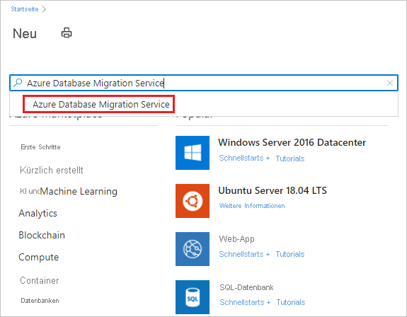
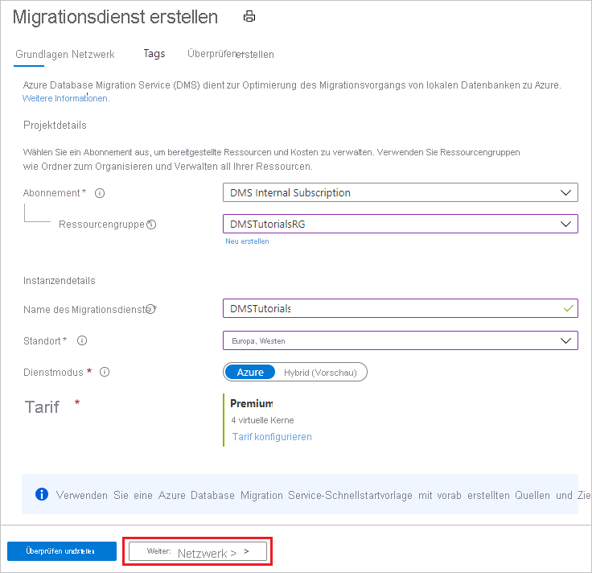
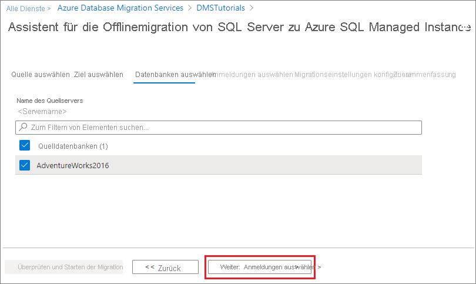
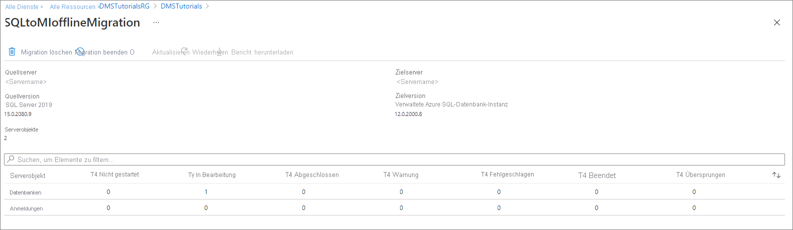
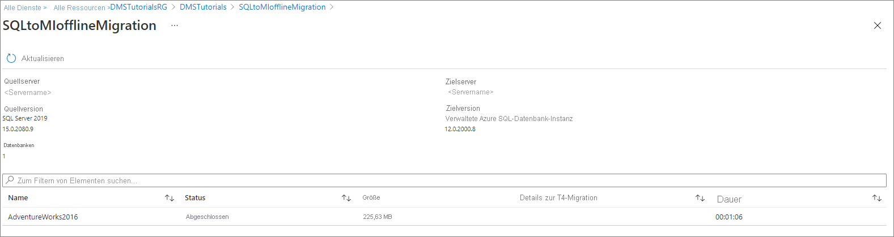

# Tutorial: Migrieren von SQL Server zu einer verwalteten Azure SQL-Instanz mithilfe von DMS (offline)

Mit Azure Database Migration Service können Sie die Datenbanken von einer SQL Server-Instanz zu einer [verwalteten Azure SQL-Instanz](../azure-sql/managed-instance/sql-managed-instance-paas-overview.md) migrieren. Informationen zu weiteren Methoden, die einen gewissen manuellen Aufwand erfordern, finden Sie im Artikel [SQL Server zu einer Azure SQL Managed Instance](../azure-sql/migration-guides/managed-instance/sql-server-to-managed-instance-guide.md) migrieren.

In diesem Tutorial migrieren Sie die Datenbank [AdventureWorks2016](/sql/samples/adventureworks-install-configure#download-backup-files) mithilfe von Azure Database Migration Service von einer lokalen SQL Server-Instanz zu einer verwalteten SQL-Instanz.

Sie lernen Folgendes:
> [!div class="checklist"]
>
> - Registrieren des Ressourcenanbieters für die Azure-Datenmigration
> - Erstellen einer Instanz von Azure Database Migration Service
> - Erstellen eines Migrationsprojekts mithilfe von Azure Database Migration Service
> - Ausführen der Migration
> - Überwachen der Migration

> [!IMPORTANT]
> Bei Offlinemigrationen von SQL Server zu einer verwalteten SQL-Instanz kann Azure Database Migration Service die Sicherungsdateien für Sie erstellen. Alternativ können Sie die neueste vollständige Datenbanksicherung in der SMB-Netzwerkfreigabe bereitstellen. Diese wird dann vom Dienst verwendet, um Ihre Datenbanken zu migrieren. Jede Sicherung kann entweder in eine separate Sicherungsdatei oder in mehrere Sicherungsdateien geschrieben werden. Das Anfügen mehrerer Sicherungen an ein einzelnes Sicherungsmedium wird jedoch nicht unterstützt. Sie können auch komprimierte Sicherungen verwenden, um die Wahrscheinlichkeit von potenziellen Problemen bei der Migration großer Sicherungen zu verringern.

[!INCLUDE [online-offline](../../includes/database-migration-service-offline-online.md)]

In diesem Artikel wird eine Offlinemigration von SQL Server zu einer verwalteten SQL-Instanz beschrieben. Informationen zu einer Onlinemigration finden Sie unter [Migrieren von SQL Server zu einer verwalteten SQL-Instanz mithilfe von DMS (online)](tutorial-sql-server-managed-instance-online.md).

## Voraussetzungen

Für dieses Tutorial benötigen Sie Folgendes:

- Laden Sie [SQL Server 2016 oder höher](https://www.microsoft.com/sql-server/sql-server-downloads) herunter, und installieren Sie es.
- Aktivieren Sie das TCP/IP-Protokoll (dieses wird während der SQL Server Express-Installation standardmäßig deaktiviert), indem Sie die Anweisungen im Artikel [Aktivieren oder Deaktivieren eines Servernetzwerkprotokolls](/sql/database-engine/configure-windows/enable-or-disable-a-server-network-protocol#SSMSProcedure) befolgen.
- [Stellen Sie die Datenbank „AdventureWorks2016“ in der SQL Server-Instanz wieder her](/sql/samples/adventureworks-install-configure#restore-to-sql-server).
- Erstellen Sie ein virtuelles Microsoft Azure-Netzwerk für Azure Database Migration Service mithilfe des Azure Resource Manager-Bereitstellungsmodells, das Site-to-Site-Konnektivität für Ihre lokalen Quellserver über [ExpressRoute](../expressroute/expressroute-introduction.md) oder über [VPN](../vpn-gateway/vpn-gateway-about-vpngateways.md) bereitstellt. [Erfahren Sie mehr über Netzwerktopologien für SQL Managed Instance-Migrationen mithilfe von Azure Database Migration Service](./resource-network-topologies.md). Weitere Informationen zum Erstellen eines virtuellen Netzwerks finden Sie in der [Dokumentation zu Virtual Network](../virtual-network/index.yml) und insbesondere in den Schnellstartartikeln mit Schritt-für-Schritt-Anleitungen.

    > [!NOTE]
    > Fügen Sie bei Verwendung von ExpressRoute mit Netzwerkpeering zu Microsoft während des Setups des virtuellen Netzwerks die folgenden [Dienstendpunkte](../virtual-network/virtual-network-service-endpoints-overview.md) zu dem Subnetz hinzu, in dem der Dienst bereitgestellt werden soll:
    > - Zieldatenbankendpunkt (z. B. SQL-Endpunkt, Cosmos DB-Endpunkt usw.)
    > - Speicherendpunkt
    > - Service Bus-Endpunkt
    >
    > Diese Konfiguration ist erforderlich, weil Azure Database Migration Service über keine Internetverbindung verfügt.

- Stellen Sie sicher, dass die NSG-Regeln (Netzwerksicherheitsgruppen) des virtuellen Netzwerks nicht den ausgehenden Port 443 von ServiceTag für ServiceBus, Storage und AzureMonitor blockieren. Ausführlichere Informationen zur NSG-Datenverkehrsfilterung in einem virtuellen Netzwerk finden Sie im Artikel [Filtern des Netzwerkdatenverkehrs mit Netzwerksicherheitsgruppen](../virtual-network/virtual-network-vnet-plan-design-arm.md).
- Konfigurieren Sie Ihre [Windows-Firewall für Quelldatenbank-Engine-Zugriff](/sql/database-engine/configure-windows/configure-a-windows-firewall-for-database-engine-access).
- Öffnen Sie Ihre Windows-Firewall, damit Azure Database Migration Service auf die SQL Server-Quellinstanz zugreifen kann (standardmäßig TCP-Port 1433). Wenn die Standardinstanz an einem anderen Port lauscht, fügen Sie diesen der Firewall hinzu.
- Bei der Ausführung mehrerer benannter SQL Server-Instanzen mit dynamischen Ports empfiehlt es sich, den SQL-Browser-Dienst zu aktivieren und den Zugriff auf den UDP-Port 1434 durch Ihre Firewalls zuzulassen, sodass Azure Database Migration Service eine Verbindung mit einer benannten Instanz auf Ihrem Quellserver herstellen kann.
- Wenn Sie eine Firewallappliance vor Ihren Quelldatenbanken verwenden, müssen Sie möglicherweise Firewallregeln hinzufügen, damit Azure Database Migration Service auf die Quelldatenbanken für die Migration sowie auf Dateien über SMB-Port 445 zugreifen kann.
- Eine Anleitung zum Erstellen einer verwalteten SQL-Instanz finden Sie im Artikel [Erstellen einer verwalteten SQL-Instanz im Azure-Portal](../azure-sql/managed-instance/instance-create-quickstart.md).
- Stellen Sie sicher, dass die zum Herstellen einer Verbindung zwischen der SQL Server-Quellinstanz und der SQL Managed Instance-Zielinstanz verwendeten Anmeldungen Mitglieder der sysadmin-Serverrolle sind.

    >[!NOTE]
    >Standardmäßig unterstützt Azure Database Migration Service nur das Migrieren von SQL-Anmeldungen. Sie können allerdings die Möglichkeit zum Migrieren von Windows-Anmeldungen wie folgt aktivieren:
    >
    >- Stellen Sie sicher, dass die verwaltete SQL-Zielinstanz über AAD-Lesezugriff verfügt. Dieser kann über das Azure-Portal von einem Benutzer mit der Rolle **Globaler Administrator** konfiguriert werden.
    >- Konfigurieren Sie die Azure Database Migration Service-Instanz, um die Migration von Windows-Anmeldungen von Benutzern/Gruppen zu aktivieren. Diese Konfiguration erfolgt über das Azure-Portal auf der Seite „Konfiguration“. Nachdem Sie diese Einstellung aktiviert haben, starten Sie den Dienst neu, damit die Änderungen übernommen werden.
    >
    > Nach dem Neustart des Diensts werden die Windows-Anmeldungen der Benutzer/Gruppen in der Liste der für die Migration verfügbaren Anmeldungen angezeigt. Für alle Windows-Anmeldungen von Benutzern/Gruppen, die Sie migrieren, werden Sie aufgefordert, den zugeordneten Domänennamen anzugeben. Dienstbenutzerkonten (Konten mit dem Domänennamen „NT AUTHORITY“) und virtuelle Benutzerkonten (Konten mit dem Domänennamen „NT SERVICE“) werden nicht unterstützt.

- Erstellen Sie eine Netzwerkfreigabe, mit der Azure Database Migration Service die Quelldatenbank sichern kann.
- Stellen Sie sicher, dass das Dienstkonto, unter dem die SQL Server-Quellinstanz ausgeführt wird, über Schreibberechtigungen für die Netzwerkfreigabe verfügt, die Sie erstellt haben, und dass das Computerkonto für den Quellserver über Lese-/Schreibzugriff auf dieselbe Freigabe verfügt.
- Notieren Sie sich einen Windows-Benutzer (mit Kennwort), der Vollzugriff auf die von Ihnen zuvor erstellte Netzwerkfreigabe hat. Azure Database Migration Service verwendet die Benutzeranmeldeinformationen, um die Sicherungsdateien für Wiederherstellungsvorgänge in den Azure Storage-Container hochzuladen.
- Erstellen Sie entsprechend der Schritte im Artikel [Verwalten von Azure Blob Storage-Ressourcen mit dem Storage-Explorer](../vs-azure-tools-storage-explorer-blobs.md#get-the-sas-for-a-blob-container) einen Blobcontainer, und rufen Sie den zugehörigen SAS-URI ab. Wählen Sie beim Erstellen des SAS-URI im Richtlinienfenster alle Berechtigungen aus (Lesen, Schreiben, Löschen, Auflisten). Durch dieses Detail wird Azure Database Migration Service Zugriff auf Ihren Speicherkontocontainer gewährt, um die Sicherungsdateien hochladen zu können, die für die Migration von Datenbanken zur verwalteten SQL-Instanz verwendet werden.

    > [!NOTE]
    > Die Verwendung eines SAS-Tokens auf Kontoebene wird beim Konfigurieren der Speicherkontoeinstellungen im Schritt [Migrationseinstellungen konfigurieren](#configure-migration-settings) nicht von Azure Database Migration Service unterstützt.
    
[!INCLUDE [resource-provider-register](../../includes/database-migration-service-resource-provider-register.md)]

## Erstellen einer Instanz von Azure Database Migration Service

1. Wählen Sie im Menü des Azure-Portals oder auf der **Startseite** die Option **Ressource erstellen** aus. Suchen Sie **Azure Database Migration Service**, und wählen Sie ihn aus.

    

2. Wählen Sie auf dem Bildschirm **Azure Database Migration Service** die Schaltfläche **Erstellen** aus.

    

3. Auf dem Bildschirm **Create Migration Service** (Migrationsdienst erstellen) mit den Grundeinstellungen:

     - Wählen Sie das Abonnement aus.
     - Erstellen Sie eine neue Ressourcengruppe, oder wählen Sie eine vorhandene Ressourcengruppe aus.
     - Geben Sie einen Namen für die Instanz von Azure Database Migration Service an.
     - Wählen Sie den Standort aus, an dem Sie die Azure Database Migration Service-Instanz erstellen möchten.
     - Wählen Sie **Azure** als Dienstmodus aus.
     - Wählen Sie einen Tarif. Weitere Informationen zu Kosten und Tarifen finden Sie in der [Preisübersicht](https://aka.ms/dms-pricing).

    

     - Klicken Sie auf **Weiter: Netzwerk**.

4. Auf dem Netzwerkbildschirm **Create Migration Service** (Migrationsdienst erstellen):

    - Wählen Sie ein vorhandenes virtuelles Netzwerk aus, oder erstellen Sie ein neues. Das virtuelle Netzwerk erteilt Azure Database Migration Service Zugriff auf die SQL Server-Quellinstanz und die Zielinstanz von Azure SQL Managed Instance.
     
    - Weitere Informationen zum Erstellen eines virtuellen Netzwerks im Azure-Portal finden Sie im Artikel [Erstellen eines virtuellen Netzwerks im Azure Portal](../virtual-network/quick-create-portal.md).
    
    - Weitere Einzelheiten finden Sie im Artikel [Netzwerktopologien für Migrationen von Azure SQL Managed Instance mithilfe von Azure Database Migration Service](./resource-network-topologies.md).

    

    - Wählen Sie zum Überprüfen der Details **Überprüfen + erstellen** und dann **Erstellen** aus, um den Dienst zu erstellen.

## Erstellen eines Migrationsprojekts

Nachdem eine Instanz des Diensts erstellt wurde, suchen Sie diesen im Azure-Portal, öffnen Sie ihn, und erstellen Sie anschließend ein neues Migrationsprojekt.

1. Wählen Sie im Menü des Azure-Portals **Alle Dienste** aus. Suchen Sie **Azure Database Migration Services**, und wählen Sie sie aus.

    

2. Wählen Sie auf dem Bildschirm **Azure Database Migration Services** die von Ihnen erstellte Azure Database Migration Service-Instanz aus.

3. Wählen Sie **Neues Migrationsprojekt** aus.

     

4. Geben Sie auf dem Bildschirm **Neues Migrationsprojekt** einen Projektnamen ein, und wählen Sie im Textfeld **Quellservertyp** die Option **SQL Server** und im Textfeld **Zielservertyp** die Option **Verwaltete Azure SQL-Datenbank-Instanz** aus. Wählen Sie außerdem für **Aktivitätstyp auswählen** die Option **Offlinedatenmigration** aus.

   

5. Klicken Sie auf **Aktivität erstellen und ausführen**, um das Projekt zu erstellen und die Migrationsaktivität auszuführen.

## Angeben von Quelldetails

1. Geben Sie auf dem Bildschirm **Quelle auswählen** die Verbindungsdetails für die SQL Server-Quellinstanz an.

    Stellen Sie sicher, dass Sie einen vollständig qualifizierten Domänennamen (Fully Qualified Domain Name, FQDN) für den SQL Server-Quellinstanznamen verwenden. Sie können auch die IP-Adresse für Situationen verwenden, in denen DNS-Namensauflösung nicht möglich ist.

2. Falls Sie auf Ihrem Server kein vertrauenswürdiges Zertifikat installiert haben, aktivieren Sie das Kontrollkästchen **Serverzertifikat vertrauen**.

    Wenn kein vertrauenswürdiges Zertifikat installiert ist, generiert SQL Server beim Starten der Instanz ein selbstsigniertes Zertifikat. Dieses Zertifikat wird zum Verschlüsseln der Anmeldeinformationen für Clientverbindungen verwendet.

    > [!CAUTION]
    > TLS-Verbindungen, die mit einem selbstsignierten Zertifikat verschlüsselt sind, bieten keine hohe Sicherheit. Sie sind anfällig für Man-in-the-Middle-Angriffe. In einer Produktionsumgebung oder auf Servern, die mit dem Internet verbunden sind, sollten Sie sich nicht auf TLS mit Verwendung selbstsignierter Zertifikate verlassen.

   

3. Wählen Sie **Weiter: Ziel auswählen** aus.

## Angeben von Zieldetails

1. Geben Sie auf dem Bildschirm **Ziel auswählen** die Verbindungsdetails für das Ziel an – dabei handelt es sich um die vorab bereitgestellte verwaltete SQL-Instanz, zu der Sie die Datenbank **AdventureWorks2016** migrieren.

    Falls Sie die verwaltete SQL-Instanz noch nicht bereitgestellt haben, wählen Sie den [Link](../azure-sql/managed-instance/instance-create-quickstart.md) aus, um Unterstützung bei der Bereitstellung der Instanz zu erhalten. Sie können trotzdem mit der Projekterstellung fortfahren und anschließend – wenn die verwaltete SQL-Instanz bereit ist – für die Ausführung der Migration zu diesem bestimmten Projekt zurückkehren.

    

2. Wählen Sie **Weiter: Datenbanken auswählen** aus. Wählen Sie auf dem Bildschirm **Datenbanken auswählen** die Datenbank **AdventureWorks2016** für die Migration aus.

   

    > [!IMPORTANT]
    > Wenn Sie SQL Server Integration Services (SSIS) verwenden, bietet DMS aktuell keine Unterstützung für die Migration der Katalogdatenbank für Ihre SSIS-Projekte/-Pakete (SSISDB) von SQL Server zu SQL Managed Instance. Sie können SSIS jedoch in Azure Data Factory (ADF) bereitstellen und Ihre SSIS-Projekte/-Pakete in der Ziel-SSISDB neu bereitstellen, die von SQL Managed Instance gehostet wird. Weitere Informationen zur Migration von SSIS-Paketen finden Sie im Artikel [Migrieren von SQL Server Integration Services-Paketen in Azure](./how-to-migrate-ssis-packages.md).

3. Wählen Sie **Weiter: Anmeldungen auswählen** aus.

## Auswählen von Benutzernamen

1. Wählen Sie auf dem Bildschirm **Auswählen von Benutzernamen** die Benutzernamen aus, die Sie migrieren möchten.

    >[!NOTE]
    >Standardmäßig unterstützt Azure Database Migration Service nur das Migrieren von SQL-Anmeldungen. Informationen zum Aktivieren der Unterstützung für die Migration von Windows-Anmeldungen finden Sie im Abschnitt **Voraussetzungen** dieses Tutorials.

    

2. Wählen Sie **Weiter: Migrationseinstellungen konfigurieren** aus.

## Konfigurieren von Migrationseinstellungen

1. Geben Sie im Bildschirm **Migrationseinstellungen konfigurieren** die folgenden Details an:

    | Parameter | Beschreibung |
    |--------|---------|
    |**Quellsicherungsoption auswählen** | Wählen Sie die Option **Ich stelle die neuesten Sicherungsdateien bereit**, wenn bereits vollständige Sicherungsdateien verfügbar sind, die DMS für die Datenbankmigration verwenden kann. Wählen Sie die Option **Azure Database Migration Service soll Sicherungsdateien erstellen**, wenn DMS zuerst eine vollständige Sicherung der Quelldatenbank erstellen und diese dann für die Migration verwenden soll. |
    |**Freigabe der Netzwerkadresse** | Die lokale SMB-Netzwerkfreigabe, auf die Azure Database Migration Service die Quelldatenbanksicherungen übertragen kann. Das Dienstkonto, mit dem die SQL Server-Quellinstanz ausgeführt wird, muss über Schreibberechtigungen für diese Netzwerkfreigabe verfügen. Geben Sie in der Netzwerkfreigabe einen FQDN oder IP-Adressen des Servers an, wie z.B. „\\\servername.domainname.com\backupfolder\\“ oder „\IP address\backupfolder“.|
    |**Benutzername** | Achten Sie darauf, dass der Windows-Benutzer eine Berechtigung für Vollzugriff auf die von Ihnen angegebene Netzwerkfreigabe besitzt. Azure Database Migration Service nimmt die Anmeldeinformationen des Benutzers an, um die Sicherungsdateien für Wiederherstellungsvorgänge in den Azure Storage-Container hochzuladen. Wenn TDE-fähige Datenbanken für die Migration ausgewählt werden, muss es sich beim oben genannten Windows-Benutzer um das integrierte Administratorkonto handeln, und die [Benutzerkontensteuerung](/windows/security/identity-protection/user-account-control/user-account-control-overview) muss deaktiviert sein, damit Azure Database Migration Service die Zertifikatdateien hochladen und löschen kann. |
    |**Kennwort** | Kennwort für den Benutzer |
    |**Speicherkontoeinstellungen** | Der SAS-URI, der Azure Database Migration Service Zugriff auf Ihren Speicherkontocontainer gewährt, in den der Dienst die Sicherungsdateien hochlädt und der für die Migration von Datenbanken zur verwalteten SQL-Instanz verwendet wird. [Erfahren Sie, wie der SAS-URI für Blobcontainer abgerufen wird](../vs-azure-tools-storage-explorer-blobs.md#get-the-sas-for-a-blob-container). Dieser SAS-URI muss für den Blobcontainer und nicht für das Speicherkonto gelten.|
    |**TDE-Einstellungen** | Wenn Sie die Quelldatenbanken mit aktivierter Transparent Data Encryption-Technologie (TDE) migrieren, müssen Sie über Schreibberechtigungen auf der verwalteten SQL-Zielinstanz verfügen.  Wählen Sie im Dropdownmenü das Abonnement aus, in dem die verwaltete SQL-Instanz bereitgestellt ist.  Wählen Sie im Dropdownmenü die Zielinstanz der verwalteten **Azure SQL-Datenbank** aus. |

    

2. Wählen Sie **Weiter: Zusammenfassung** aus.

## Überprüfen der Migrationszusammenfassung

1. Geben Sie auf dem Bildschirm **Zusammenfassung** im Textfeld **Aktivitätsname** einen Namen für die Migrationsaktivität an.

2. Überprüfen und verifizieren Sie die dem Migrationsprojekt zugeordneten Details.

    

## Ausführen der Migration

- Wählen Sie **Migration starten** aus.

  Das Fenster „Migrationsaktivität“ wird geöffnet, in dem der aktuelle Migrationsstatus der Datenbanken und Anmeldungen angezeigt wird.

## Überwachen der Migration

1. Wählen Sie auf dem Bildschirm zur Migrationsaktivität die Option **Aktualisieren** aus, um die Anzeige zu aktualisieren.

   

2. Sie können die Datenbanken und Anmeldekategorien erweitern, um den Migrationsstatus des jeweiligen Serverobjekts zu überwachen.

   

3. Überprüfen Sie nach Abschluss der Migration die Zieldatenbank in der SQL Managed Instance-Umgebung.

## Zusätzliche Ressourcen

- Ein Tutorial, in dem gezeigt wird, wie Sie eine Datenbank mit dem T-SQL-Befehl RESTORE zu SQL Managed Instance migrieren können, finden Sie unter [Wiederherstellen einer Sicherung in SQL Managed Instance mit dem restore-Befehl](../azure-sql/managed-instance/restore-sample-database-quickstart.md).
- Informationen zu SQL Managed Instance finden Sie unter [Was ist SQL Managed Instance?](../azure-sql/managed-instance/sql-managed-instance-paas-overview.md)
- Informationen zum Verbinden von Apps mit SQL Managed Instance finden Sie unter [Verbinden von Anwendungen](../azure-sql/managed-instance/connect-application-instance.md).
