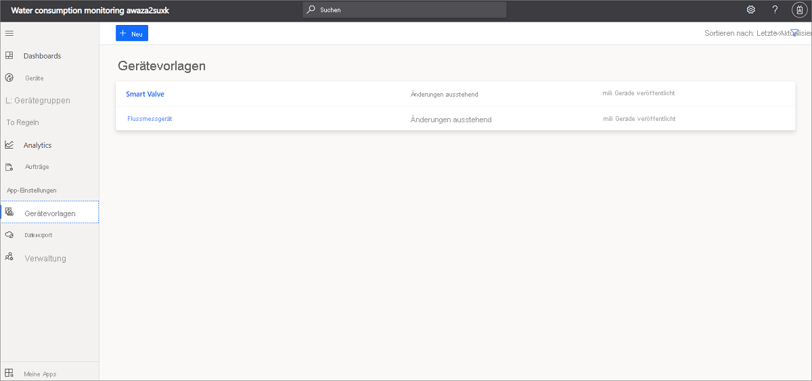

# Tutorial: Bereitstellen und Durchlaufen der Anwendung zur Überwachung des Wasserverbrauchs

Verwenden Sie die IoT Central-Anwendungsvorlage *Überwachung des Wasserverbrauchs* und die Anweisungen in diesem Artikel, um eine End-to-End-Lösung für die Überwachung des Wasserverbrauchs zu entwickeln.

### Geräte und Konnektivität

Wasserverwaltungslösungen nutzen intelligente Wasserwirtschaftsgeräte wie Strömungsmessgeräte, Geräte zur Überwachung der Wasserqualität, intelligente Ventile und Leckdetektoren.

Geräte in intelligenten Lösungen im Wasserwirtschaftsbereich können per LPWAN (Low-Power Wide Area Network) oder über einen externen Netzbetreiber vernetzt werden. Nutzen Sie für diese Gerätetypen [Azure IoT Central-Geräte-Bridge](../core/howto-build-iotc-device-bridge.md), um Ihre Gerätedaten an Ihre IoT-Anwendung in Azure IoT Central zu senden. Sie können auch Gerätegateways verwenden, die IP-fähig sind und direkt mit IoT Central verbunden werden können.

### IoT Central

Azure IoT Central ist eine IoT-App-Plattform, die eine schnelle Erstellung und Bereitstellung einer IoT-Lösung ermöglicht. Sie können Ihre Lösung mit Branding versehen, anpassen und in Dienste von Drittanbietern integrieren.

Wenn Sie Ihre intelligenten Wasserwirtschaftsgeräte mit IoT Central verbinden, stellt die Anwendung Befehls-, Steuerungs-, Überwachungs- und Alarmfunktionen, eine Benutzeroberfläche mit integrierter rollenbasierter Zugriffssteuerung (RBAC), konfigurierbare Dashboards und Erweiterungsoptionen zur Verfügung.

### Erweiterbarkeit und Integrationen

Sie können Ihre IoT-Anwendung in IoT Central erweitern und haben folgende Optionen:

* Transformieren und Integrieren Ihrer IoT-Daten für erweiterte Analysen, z. B. für das Training von Machine Learning-Modellen durch kontinuierlichen Datenexport aus der IoT Central-Anwendung
* Automatisieren von Workflows in anderen Systemen, indem in der IoT Central-Anwendung Aktionen über Power Automate oder Webhooks ausgelöst werden
* Programmgesteuertes Zugreifen auf Ihre IoT-Anwendung in IoT Central über IoT Central-APIs

### Geschäftsanwendungen

Sie können IoT-Daten verwenden, um verschiedene Geschäftsanwendungen in einem Wasserversorgungsunternehmen zu betreiben. In Ihrer [IoT Central-Anwendung für die Überwachung des Wasserverbrauchs](tutorial-water-consumption-monitoring.md) können Sie Regeln und Aktionen konfigurieren und so festlegen, dass in [Connected Field Service](/dynamics365/field-service/connected-field-service) Warnungen erstellt werden. Konfigurieren Sie Power Automate-Regeln in IoT Central, um Workflows anwendungs- und dienstübergreifend zu automatisieren. Darüber hinaus können Informationen basierend auf Dienstaktivitäten in Connected Field Service zurück an Azure IoT Central gesendet werden.

In diesem Tutorial lernen Sie, wie die folgenden Aufgaben ausgeführt werden:

> [!div class="checklist"]

> * Erstellen einer Anwendung zur Überwachung des Wasserverbrauchs unter Verwendung der entsprechenden Azure IoT Central-Vorlage
> * Erkunden und Anpassen des Dashboards
> * Erkunden von Gerätevorlagen
> * Erkunden von simulierten Geräten
> * Erkunden und Konfigurieren von Regeln
> * Konfigurieren von Aufträgen
> * Anpassen des Brandings Ihrer Anwendung mittels Whitelabeling

## Voraussetzungen

* Zum Bereitstellen dieser App müssen keine besonderen Voraussetzungen erfüllt werden.
* Sie können den Tarif „Free“ oder ein Azure-Abonnement verwenden.

## Erstellen einer Anwendung zur Überwachung des Wasserverbrauchs

Gehen Sie wie folgt vor, um die Anwendung zu erstellen:

1. Navigieren Sie zur Buildwebsite für [Azure IoT Central](https://aka.ms/iotcentral). Melden Sie sich dann mit einem persönlichen Microsoft-Konto oder mit einem Geschäfts-, Schul- oder Unikonto an. Wählen Sie auf der linken Navigationsleiste **Erstellen** und anschließend die Registerkarte **Behörden** aus: :::image type="content" source="media/tutorial-waterconsumptionmonitoring/iot-central-government-tab-overview1.png" alt-text="Anwendungsvorlage":::

1. Wählen Sie unter **Überwachung des Wasserverbrauchs** die Option **App erstellen** aus.

Weitere Informationen finden Sie unter [Erstellen einer IoT Central-Anwendung](../core/howto-create-iot-central-application.md).

## Einführung in die Anwendung

In den nächsten Abschnitten werden die wichtigsten Features der Anwendung behandelt:

### Dashboard

Nachdem Sie die Anwendung erstellt haben, wird das exemplarische Wide World-Dashboard für den Wasserverbrauch (**Wide World water consumption dashboard**) geöffnet.
  
:::image type="content" source="media/tutorial-waterconsumptionmonitoring/water-consumption-monitoring-dashboard-full.png" alt-text="Dashboard zur Überwachung des Wasserverbrauchs":::

Sie können Ansichten im Dashboard für Operators erstellen und anpassen.

> [!NOTE]
> Alle auf dem Dashboard angezeigten Daten basieren auf simulierten Gerätedaten, mit denen Sie sich im nächsten Abschnitt ausführlicher beschäftigen.
  
Das Dashboard besteht aus unterschiedlichen Arten von Kacheln:

* **Wide World Water Utility-Bildkachel:** Die erste Kachel auf dem Dashboard ist eine Bildkachel des fiktiven Wasserversorgungsunternehmens „Wide World Water“. Sie können die Kachel anpassen, indem Sie ein eigenes Bild einfügen oder das Bild entfernen.
* **Kachel mit KPI zur durchschnittlichen Wassermenge:** Die KPI-Kachel ist so konfiguriert, dass als Beispiel der *Durchschnitt der letzten 30 Minuten* angezeigt wird. Sie können die KPI-Kachel anpassen und auf einen anderen Typ und Zeitbereich festlegen.
* **Gerätebefehlskacheln:** Hierbei handelt es sich um die Kacheln **Close valve** (Ventil schließen), **Open valve** (Ventil öffnen) und **Set valve position** (Ventilposition festlegen). Durch Auswählen der Befehle gelangen Sie zur Seite mit den Befehlen für das simulierte Gerät. In Azure IoT Central ist ein *Befehl* ein *Gerätefunktionstyp*. Dieses Konzept wird weiter unten in diesem Tutorial im Abschnitt [Gerätevorlage](../government/tutorial-water-consumption-monitoring.md#explore-the-device-template) erläutert.

* **Karte mit dem Wasserüberwachungsbereich:** Die Karte basiert auf Azure Maps und kann direkt in Azure IoT Central konfiguriert werden. Auf der Kartenkachel wird der [Standort](../core/howto-use-location-data.md) des Geräts angezeigt. Zeigen Sie mit dem Mauszeiger auf die Karte, und probieren Sie die Steuerelemente aus (beispielsweise *Vergrößern*, *Verkleinern* oder *Erweitern*).

    :::image type="content" source="media/tutorial-waterconsumptionmonitoring/water-consumption-monitoring-dashboard-map.png" alt-text="Karte auf dem Dashboard zur Überwachung des Wasserverbrauchs":::

* **Liniendiagramm zur durchschnittlichen Wassermenge** und **Liniendiagramm zu Umgebungsbedingungen**: Sie können einzelne oder mehrere Gerätetelemetriedaten als Liniendiagramm für einen gewünschten Zeitbereich visualisieren.
* **Wärmebild zum durchschnittlichen Ventildruck:** Sie können die Wärmebildvisualisierung von Gerätetelemetriedaten auswählen, um deren Verteilung innerhalb eines Zeitbereichs mit einem Farbindex anzuzeigen.
* **Inhaltskachel zum Zurücksetzen von Warnungsschwellenwerten:** Sie können Inhaltskacheln mit einer Handlungsaufforderung hinzufügen und einen Link zu einer Aktionsseite einbetten. In diesem Fall gelangen Sie über die Kachel zum Zurücksetzen von Schwellenwerten zum Bereich **Aufträge** der Anwendung, wo Sie Updates für Geräteeigenschaften ausführen können. Sie erkunden diese Option weiter unten in diesem Tutorial im Abschnitt [Konfigurieren von Aufträgen](../government/tutorial-water-consumption-monitoring.md#configure-jobs).
* **Eigenschaftenkacheln:** Auf dem Dashboard werden die Kacheln **Valve operational info** (Betriebsinformationen zum Ventil), **Flow alert thresholds** (Warnungsschwellenwerte für Wasserfluss) und **Maintenance info** (Wartungsinformationen) angezeigt.

### Anpassen des Dashboards

Sie können Ansichten im Dashboard für Operators anpassen.

1. Wählen Sie die Option **Bearbeiten** aus, um das Wide World-Dashboard für den Wasserverbrauch (**Wide World water consumption dashboard**) anzupassen. Sie können das Dashboard anpassen, indem Sie das Menü **Bearbeiten** auswählen. Im Modus **Bearbeiten** können Sie dem Dashboard neue Kacheln hinzufügen und es konfigurieren.

    :::image type="content" source="media/tutorial-waterconsumptionmonitoring/water-consumption-monitoring-edit-dashboard.png" alt-text="Bearbeiten des Dashboards":::

Weitere Informationen finden Sie unter [Erstellen und Anpassen von Dashboards](../core/howto-manage-dashboards.md).

## Erkunden der Gerätevorlage

 In Azure IoT Central werden mit einer Gerätevorlage die Funktionen eines Geräts definiert. Zu den Gerätefunktionen gehören von Gerätesensoren gesendete Telemetriedaten, Geräteeigenschaften sowie Befehle, die das Gerät ausführen kann. Sie können in Azure IoT Central eine oder mehrere Gerätevorlagen definieren, die die Funktion der zu verbindenden Geräte darstellen.

Die Anwendung zur Überwachung des Wasserverbrauchs verfügt standardmäßig über zwei Referenzgerätevorlagen. Diese stellen ein Durchflussmessgerät (*flow meter*) und ein intelligentes Ventil (*smart valve*) dar.

Zeigen Sie die Gerätevorlage wie folgt an:

1. Wählen Sie in Azure IoT Central im linken Bereich für Ihre Anwendung die Option **Gerätevorlagen** aus. Die Liste **Gerätevorlagen** enthält zwei Gerätevorlagen: **Smart Valve** (Intelligentes Ventil) und **Flow meter** (Durchflussmessgerät).

   

1. Wählen Sie die Gerätevorlage **Flow meter** (Durchflussmessgerät) aus, und machen Sie sich mit den Gerätefunktionen vertraut.

     

### Anpassen der Gerätevorlage

So passen Sie die Gerätevorlage an:

1. Navigieren Sie im Menü **Gerätevorlagen** zu **Anpassen**.
1. Suchen Sie nach dem Telemetrietyp `Temperature`.
1. Ändern Sie den Wert unter **Anzeigename** von `Temperature` in `Reported temperature`.
1. Ändern Sie die Maßeinheit, oder legen Sie Werte für **Minimalwert** und **Maximalwert** fest.
1. Wählen Sie **Speichern** aus, um die Änderungen zu speichern.

    

### Hinzufügen einer Cloudeigenschaft

1. Navigieren Sie im Menü **Gerätevorlagen** zu **Cloudeigenschaften**.
1. Fügen Sie eine neue Cloudeigenschaft hinzu, indem Sie **+ Cloudeigenschaft hinzufügen** auswählen.
    In Azure IoT Central können Sie eine Eigenschaft hinzufügen, die für das Gerät relevant ist. Bei einer Cloudeigenschaft kann es sich beispielsweise um einen Warnungsschwellenwert handeln, der für einen bestimmten Installationsbereich, bestimmte Ressourceninformationen oder andere Wartungsinformationen gilt.
1. Wählen Sie **Speichern** aus, um die Änderungen zu speichern.

Weitere Informationen finden Sie unter [Cloudeigenschaften](../core/concepts-device-templates.md#cloud-properties).

### Sichten

Die Gerätevorlage zur Überwachung des Wasserverbrauchs verfügt über vordefinierte Ansichten. Mit den Sichten wird definiert, wie die Gerätedaten für Operators angezeigt werden und wie diese die Werte von Cloudeigenschaften festlegen können.

  

Weitere Informationen finden Sie unter [Sichten](../core/concepts-device-templates.md#views).

### Veröffentlichen der Gerätevorlage

Navigieren Sie zur Seite mit den Gerätevorlagen, und wählen Sie die Option **Veröffentlichen** aus, um die Änderungen zu speichern, die an der Gerätevorlage vorgenommen wurden.

Weitere Informationen finden Sie unter [Veröffentlichen der Gerätevorlage](../core/howto-set-up-template.md#publish-a-device-template).

### Erstellen einer neuen Gerätevorlage

Wählen Sie die Option **+ Neu** aus, um eine neue Gerätevorlage zu erstellen, und führen Sie die Schritte des Erstellungsprozesses aus.
Sie können eine benutzerdefinierte Gerätevorlage von Grund auf neu erstellen oder eine Gerätevorlage aus dem Azure-Gerätekatalog auswählen.

Weitere Informationen finden Sie unter [Hinzufügen einer Gerätevorlage](../core/howto-set-up-template.md).

## Erkunden von simulierten Geräten

In Azure IoT Central können Sie simulierte Geräte erstellen, um Ihre Gerätevorlage und Ihre Anwendung zu testen. Die Anwendung zur Überwachung des Wasserverbrauchs verfügt über zwei simulierte Geräte, die den Gerätevorlagen für **Flow meter** (Durchflussmessgerät) und **Smart Valve** (Intelligentes Ventil) zugeordnet sind.

### Anzeigen der Geräte

1. Wählen Sie im linken Bereich **Geräte** > **Alle Geräte** aus.

    :::image type="content" source="media/tutorial-waterconsumptionmonitoring/water-consumption-monitoring-devices.png" alt-text="Bereich „Alle Geräte“":::

1. Wählen Sie **Smart Valve 1** (Intelligentes Ventil 1) aus.

    :::image type="content" source="media/tutorial-waterconsumptionmonitoring/water-consumption-monitor-device-1.png" alt-text="„Smart Valve 1“ (Intelligentes Ventil 1)":::

1. Auf der Registerkarte **Befehle** werden die drei Gerätebefehle **Close valve** (Ventil schließen), **Open valve** (Ventil öffnen) und **Set valve position** (Ventilposition festlegen) angezeigt. Hierbei handelt es sich um Funktionen, die in der Gerätevorlage **Smart Valve** (Intelligentes Ventil) definiert sind.

1. Erkunden Sie die Registerkarten **Geräteeigenschaften** und **Gerätedashboard**.

> [!NOTE]
> Die Sichten auf dieser Seite werden über die Seite **Gerätevorlage > Ansichten** konfiguriert. 

### Hinzufügen neuer Geräte

Fügen Sie neue Geräte hinzu, indem Sie auf der Registerkarte **Geräte** die Option **+ Neu** auswählen.

Weitere Informationen finden Sie unter [Verwalten von Geräten](../core/howto-manage-devices-individually.md).

## Erkunden von Regeln

In Azure IoT Central können Sie Regeln zur automatischen Überwachung von Gerätetelemetriedaten erstellen und festlegen, dass Aktionen ausgelöst werden sollen, wenn einzelne oder mehrere Bedingungen erfüllt sind. Mögliche Aktionen sind beispielsweise das Senden von E-Mail-Benachrichtigungen oder das Auslösen einer Microsoft Power Automate-Aktion oder einer Webhookaktion zum Senden von Daten an andere Dienste.

Die von Ihnen erstellte Anwendung zur Überwachung des Wasserverbrauchs verfügt über drei vorkonfigurierte Regeln.

### Anzeigen von Regeln

1. Wählen Sie im linken Bereich die Option **Regeln** aus.

    :::image type="content" source="media/tutorial-waterconsumptionmonitoring/water-consumption-monitoring-rules.png" alt-text="Bereich „Regeln“":::

1. Wählen Sie die Option **High water flow alert** (Warnung: Hoher Wasserdurchfluss) aus. Dies ist eine der vorkonfigurierten Regeln in der Anwendung.

    :::image type="content" source="media/tutorial-waterconsumptionmonitoring/water-consumption-monitoring-high-flow-alert.png" alt-text="„High pH alert“ (Warnung: Hoher pH-Wert)":::

    Die Regel `High water flow alert` ist so konfiguriert, dass die Bedingung `Flow` auf Folgendes überprüft wird: `greater than``Max flow threshold`. Der Schwellenwert für die Flussmenge ist eine Cloudeigenschaft, die in der Gerätevorlage **Smart Valve** (Intelligentes Ventil) definiert ist. Der Wert von `Max flow threshold` wird pro Geräteinstanz festgelegt.

Als Nächstes können Sie eine E-Mail-Aktion erstellen.

So fügen Sie der Regel eine Aktion hinzu:

1. Wählen Sie **+ E-Mail** aus.
1. Geben Sie unter **Anzeigename** den Namen **High flow alert** (Warnung: Hoher Durchfluss) für die Aktion ein.
1. Geben Sie unter **An** die E-Mail-Adresse ein, die Ihrem Azure IoT Central-Konto zugeordnet ist.
1. Geben Sie optional eine Notiz ein, die in den Text der E-Mail aufgenommen werden soll.
1. Wählen Sie **Fertig** aus, um die Aktion fertig zu stellen.
1. Klicken Sie auf **Speichern**, um die neue Regel zu speichern.
1. Aktivieren Sie die Regel.

Wenn die konfigurierte Bedingung erfüllt wird, erhalten Sie innerhalb weniger Minuten eine entsprechende E-Mail.

> [!NOTE]
> Von der Anwendung wird jedes Mal eine E-Mail gesendet, wenn eine Bedingung erfüllt wird. Wählen Sie **Deaktivieren** aus, um die Regel zu deaktivieren und keine E-Mails mehr von der automatisierten Regel zu erhalten.
  
Erstellen Sie wie folgt eine neue Regel:

Wählen Sie zum Erstellen einer neuen Regel im linken Bereich auf der Registerkarte **Regeln** die Option **+ Neu** aus.

## Konfigurieren von Aufträgen

Mithilfe von Aufträgen können Sie in Azure IoT Central die Aktualisierung von Geräte- oder Cloudeigenschaften für mehrere Geräte auslösen. Sie können Aufträge nicht nur für Eigenschaften verwenden, sondern auch zum Auslösen von Gerätebefehlen auf mehreren Geräten. Der Workflow wird von Azure IoT Central für Sie automatisiert.

1. Wählen Sie im linken Bereich die Option **Aufträge** aus.
1. Wählen Sie **+ Neu** aus, und konfigurieren Sie eine beliebige Anzahl von Aufträgen.

Weitere Informationen finden Sie unter [Ausführen eines Auftrags](../core/howto-manage-devices-in-bulk.md).

## Anpassen Ihrer Anwendung

Als Administrator können Sie verschiedene Einstellungen ändern, um die Benutzeroberfläche in Ihrer Anwendung anzupassen.

1. Wählen Sie **Verwaltung** > **Anwendung anpassen** aus.
1. Wählen Sie unter **Anwendungslogo** die Schaltfläche **Ändern** aus, um ein Bild auszuwählen, das Sie als Anwendungslogo hochladen möchten.
1. Wählen Sie unter **Browsersymbol** die Schaltfläche **Ändern** aus, um ein Bild auszuwählen, das auf Browsertabs angezeigt werden soll.
1. Sie können auch die standardmäßigen **Browserfarben** ersetzen, indem Sie hexadezimale HTML-Farbcodes hinzufügen. Weitere Informationen zur Farbschreibweise **HEX-Wert** finden Sie unter [HTML-Farben](https://www.w3schools.com/html/html_colors.asp).

   

1. Unter **Verwaltung** > **Anwendungseinstellungen** können auch Anwendungsbilder geändert werden. Wählen Sie die Schaltfläche **Bild auswählen** aus, um ein Bild auszuwählen, das Sie als Anwendungsbild hochladen möchten.

## Bereinigen von Ressourcen

Falls Sie diese Anwendung nicht mehr benötigen, löschen Sie sie:

1. Wählen Sie im linken Bereich Ihrer Azure IoT Central-Anwendung die Option **Verwaltung** aus.
1. Wählen Sie **Anwendungseinstellungen** und anschließend unten auf der Seite die Schaltfläche **Löschen** aus.

## Nächste Schritte
 
Als Nächstes empfehlen wir Ihnen, sich über die [Überwachung der Wasserqualität](./tutorial-water-quality-monitoring.md) zu informieren.