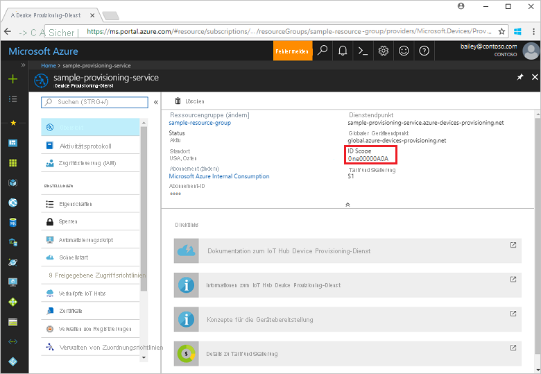
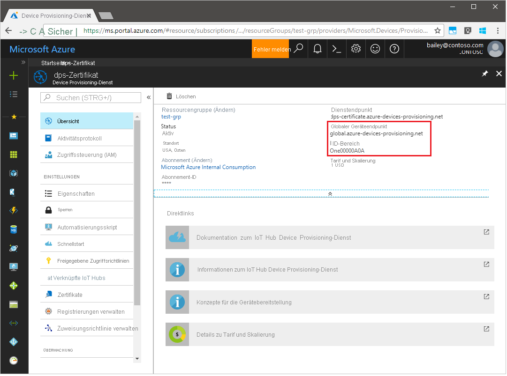
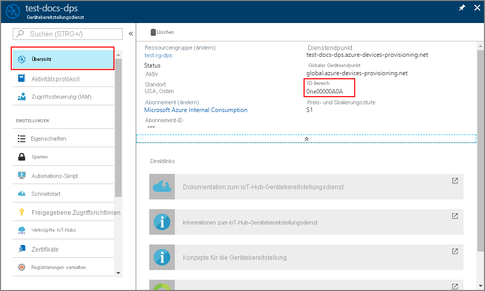
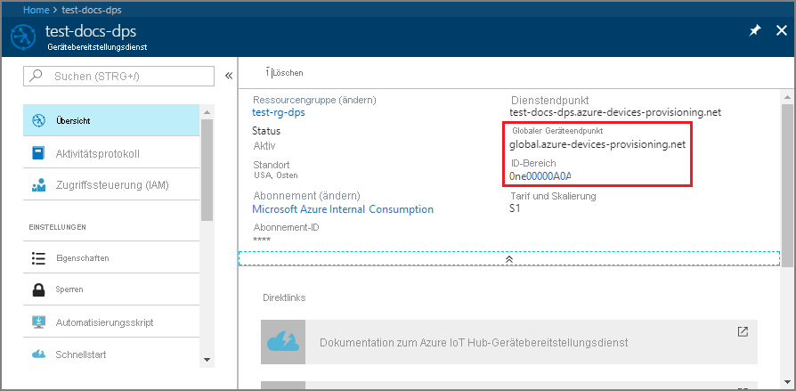
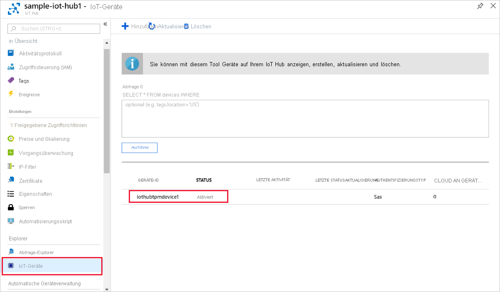
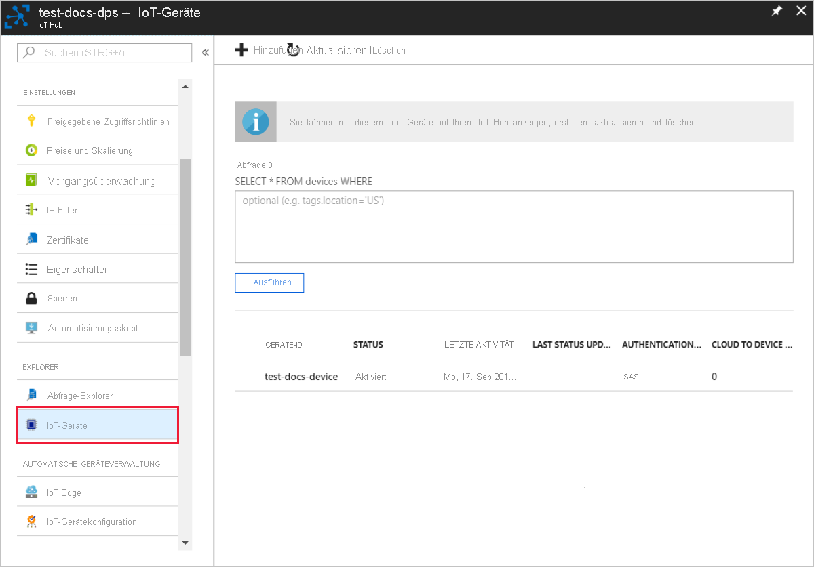
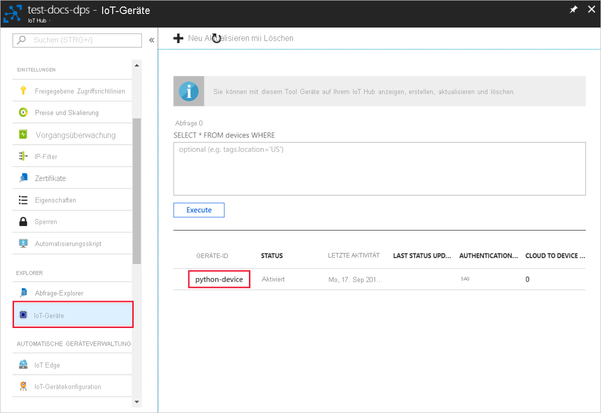

# <a name="quickstart-provision-a-simulated-tpm-device"></a>Schnellstart: Bereitstellen eines simulierten TPM-Geräts

In dieser Schnellstartanleitung erstellen Sie ein simuliertes TPM-Gerät auf Ihrem Windows-Computer. Nachdem Sie Ihr Gerät konfiguriert haben, stellen Sie es mithilfe des Azure IoT Hub Device Provisioning Service für Ihren IoT-Hub bereit. Anschließend wird Beispielcode verwendet, um das Gerät bei einer Device Provisioning Service-Instanz zu registrieren.

Wenn Sie mit dem Prozess der Bereitstellung noch nicht vertraut sind, sollten Sie zunächst die Übersicht zur [Bereitstellung](about-iot-dps.md#provisioning-process) lesen.  Vergewissern Sie sich außerdem, dass Sie die Schritte unter [Einrichten des IoT Hub Device Provisioning-Diensts über das Azure-Portal](./quick-setup-auto-provision.md) ausgeführt haben, bevor Sie fortfahren.

In Azure IoT Device Provisioning Service werden zwei Registrierungsarten unterstützt:

* [Registrierungsgruppen](concepts-service.md#enrollment-group), die für die Registrierung mehrerer zusammengehöriger Geräte verwendet werden.

* [Individuelle Registrierungen](concepts-service.md#individual-enrollment), die für die Registrierung eines einzelnen Geräts verwendet werden.

In diesem Artikel werden individuelle Registrierungen veranschaulicht.

## <a name="prerequisites"></a>Voraussetzungen

* Wenn Sie kein Azure-Abonnement besitzen, können Sie ein [kostenloses Konto](https://azure.microsoft.com/free/?ref=microsoft.com&utm_source=microsoft.com&utm_medium=docs&utm_campaign=visualstudio) erstellen, bevor Sie beginnen.

* Führen Sie die Schritte im Artikel [Einrichten des IoT Hub Device Provisioning Service im Azure-Portal](./quick-setup-auto-provision.md) aus.

Die folgenden Voraussetzungen gelten für eine Windows-Entwicklungsumgebung. Informationen zu Linux oder macOS finden Sie in der SDK-Dokumentation im entsprechenden Abschnitt unter [Vorbereiten Ihrer Entwicklungsumgebung](https://github.com/Azure/azure-iot-sdk-c/blob/master/doc/devbox_setup.md).

::: zone pivot="programming-language-ansi-c"

* [Visual Studio](https://visualstudio.microsoft.com/vs/) 2019 mit der aktivierten Workload [„Desktopentwicklung mit C++“](/cpp/ide/using-the-visual-studio-ide-for-cpp-desktop-development). Visual Studio 2015 und Visual Studio 2017 werden ebenfalls unterstützt.

::: zone-end

::: zone pivot="programming-language-csharp"

* Installieren Sie das [.NET Core 2.1 SDK](https://dotnet.microsoft.com/download) oder höher auf Ihrem Windows-Computer. Sie können den folgenden Befehl ausführen, um Ihre Version zu überprüfen:

    ```bash
    dotnet --info
    ```

::: zone-end

::: zone pivot="programming-language-nodejs"

* Installieren Sie [Node.js v4.0+](https://nodejs.org).

::: zone-end

::: zone pivot="programming-language-python"

* Installieren Sie [Python 2.x oder 3.x](https://www.python.org/downloads/). Stellen Sie je nach Einrichtung sicher, dass die 32-Bit- bzw. die 64-Bit-Installation verwendet wird. Fügen Sie Python Ihren plattformspezifischen Umgebungsvariablen hinzu, wenn Sie während der Installation dazu aufgefordert werden.

* Installieren Sie bei Verwendung des Windows-Betriebssystems das [Visual C++ Redistributable Package](https://support.microsoft.com/help/2977003/the-latest-supported-visual-c-downloads), um die Verwendung nativer DLLs aus Python zu ermöglichen.

* [Visual Studio](https://visualstudio.microsoft.com/vs/) 2019 mit der aktivierten Workload [„Desktopentwicklung mit C++“](/cpp/ide/using-the-visual-studio-ide-for-cpp-desktop-development). Visual Studio 2015 und Visual Studio 2017 werden ebenfalls unterstützt.

* [CMake-Buildsystem](https://cmake.org/download/).

::: zone-end

::: zone pivot="programming-language-java"

* Installieren Sie das [Java SE Development Kit 8](/azure/developer/java/fundamentals/java-support-on-azure) oder höher auf Ihrem Computer.

* Laden Sie [Maven](https://maven.apache.org/install.html) herunter, und installieren Sie es.

::: zone-end

* Installieren Sie die aktuelle Version von [Git](https://git-scm.com/download/). Stellen Sie sicher, dass Git den Umgebungsvariablen hinzugefügt wurde, auf die das Befehlsfenster Zugriff hat. Unter den [Git-Clienttools von Software Freedom Conservancy](https://git-scm.com/download/) finden Sie die neueste Version der zu installierenden `git`-Tools. Hierzu zählt auch die Befehlszeilen-App *Git Bash*, über die Sie mit Ihrem lokalen Git-Repository interagieren können.

<a id="setupdevbox"></a>

## <a name="prepare-your-development-environment"></a>Vorbereiten Ihrer Entwicklungsumgebung

::: zone pivot="programming-language-ansi-c"

In diesem Abschnitt bereiten Sie eine Entwicklungsumgebung vor, die zum Erstellen des [Azure IoT C SDK](https://github.com/Azure/azure-iot-sdk-c) und des Beispiels für den [TPM](/windows/device-security/tpm/trusted-platform-module-overview)-Gerätesimulator verwendet wird.

1. Laden Sie das neueste [CMake-Buildsystem](https://cmake.org/download/) herunter.

    >[!IMPORTANT]
    >Vergewissern Sie sich **vor** Beginn der Installation von `CMake`, dass die erforderlichen Visual Studio-Komponenten (Visual Studio und die Workload „Desktopentwicklung mit C++“) auf dem Computer installiert sind. Sobald die Voraussetzungen erfüllt sind und der Download überprüft wurde, installieren Sie das CMake-Buildsystem. Beachten Sie auch, dass ältere Versionen des CMake-Buildsystems die in diesem Artikel verwendete Projektmappendatei nicht generieren können. Stellen Sie sicher, dass Sie die neueste Version von CMake verwenden.

2. Öffnen Sie einen Webbrowser, und wechseln Sie zur [Releaseseite für das Azure IoT C SDK](https://github.com/Azure/azure-iot-sdk-c/releases/latest).

3. Wählen Sie oben auf der Seite die Registerkarte **Tags** aus.

4. Kopieren Sie den Tagnamen für das aktuelle Release des Azure IoT C SDK.

5. Öffnen Sie eine Eingabeaufforderung oder die Git Bash-Shell. Führen Sie die folgenden Befehle zum Klonen des aktuellen Releases des [Azure IoT C SDK](https://github.com/Azure/azure-iot-sdk-c)-GitHub-Repositorys aus. (Ersetzen Sie `<release-tag>` durch das Tag, das Sie im vorherigen Schritt kopiert haben.)

    ```cmd/sh
    git clone -b <release-tag> https://github.com/Azure/azure-iot-sdk-c.git
    cd azure-iot-sdk-c
    git submodule update --init
    ```

    Dieser Vorgang kann mehrere Minuten dauern.

6. Führen Sie nach Abschluss des Vorgangs die folgenden Befehle aus dem Verzeichnis `azure-iot-sdk-c` aus:

    ```cmd/sh
    mkdir cmake
    cd cmake
    ```

::: zone-end

::: zone pivot="programming-language-csharp"

1. Öffnen Sie eine Git CMD- oder Git Bash-Befehlszeilenumgebung.

2. Klonen Sie mithilfe des folgenden Befehls das GitHub-Repository mit den [Azure IoT-Beispielen für C#](https://github.com/Azure-Samples/azure-iot-samples-csharp):

    ```cmd
    git clone https://github.com/Azure-Samples/azure-iot-samples-csharp.git
    ```

::: zone-end

::: zone pivot="programming-language-nodejs"

1. Öffnen Sie eine Git CMD- oder Git Bash-Befehlszeilenumgebung.

2. Klonen Sie mit dem folgenden Befehl das GitHub-Repository [azure-utpm-c](https://github.com/Azure-Samples/azure-iot-samples-csharp):

    ```cmd/sh
    git clone https://github.com/Azure/azure-utpm-c.git --recursive
    ```

::: zone-end

::: zone pivot="programming-language-python"

1. Öffnen Sie eine Git CMD- oder Git Bash-Befehlszeilenumgebung.
  
2. Klonen Sie mit dem folgenden Befehl das GitHub-Repository für [Python](https://github.com/Azure/azure-iot-sdk-python):

    ```cmd/sh
    git clone --single-branch --branch v1-deprecated https://github.com/Azure/azure-iot-sdk-python.git --recursive
    ```

3. Erstellen Sie in Ihrer lokalen Kopie des GitHub-Repositorys einen Ordner für den CMake-Buildprozess. 

    ```cmd/sh
    cd azure-iot-sdk-python/c
    mkdir cmake
    cd cmake
    ```

4. Eine Anleitung für die Erstellung der Python-Pakete finden Sie [hier](https://github.com/Azure/azure-iot-sdk-python/blob/v1-deprecated/doc/python-devbox-setup.md).

   > [!NOTE]
   > Verwenden Sie bei Ausführung von `build_client.cmd` das Flag `--use-tpm-simulator`.
   > 
   > [!NOTE]
   > Bei Verwendung von `pip` muss auch das Paket `azure-iot-provisioning-device-client` installiert werden. Beachten Sie, dass die veröffentlichten PIP-Pakete nicht den Simulator, sondern das echte TPM verwenden. Zur Verwendung des Simulators muss bei der Kompilierung der Quelle das Flag `--use-tpm-simulator` verwendet werden.

::: zone-end

::: zone pivot="programming-language-java"

1. Öffnen Sie eine Git CMD- oder Git Bash-Befehlszeilenumgebung.
  
2. Klonen Sie mit dem folgenden Befehl das GitHub-Repository für [Java](https://github.com/Azure/azure-iot-sdk-java.git):

    ```cmd/sh
    git clone https://github.com/Azure/azure-iot-sdk-java.git --recursive
    ```

::: zone-end

## <a name="build-and-run-the-tpm-device-simulator"></a>Erstellen und Ausführen des TPM-Gerätesimulators

In diesem Abschnitt erstellen Sie den TPM-Simulator und führen ihn aus. Dieser Simulator lauscht über einen Socket an den Ports 2321 und 2322. Lassen Sie das Befehlsfenster geöffnet. Dieser Simulator muss bis zum Ende der Schnellstartanleitung ausgeführt werden.

::: zone pivot="programming-language-ansi-c"

1. Führen Sie den folgenden Befehl aus, um das Azure IoT C SDK zu erstellen, das den Beispielcode für den TPM-Gerätesimulator enthält. Im `cmake`-Verzeichnis wird eine Visual Studio-Projektmappe für das simulierte Gerät generiert. Dieses Beispiel stellt einen TPM-[Nachweismechanismus](concepts-service.md#attestation-mechanism) über SAS-Tokenauthentifizierung (Shared Access Signature) bereit.

    ```cmd
    cmake -Duse_prov_client:BOOL=ON ..
    ```

    >[!TIP]
    >Falls `cmake` Ihren C++-Compiler nicht findet, treten beim Ausführen des obigen Befehls unter Umständen Buildfehler auf. Führen Sie den Befehl in diesem Fall an der [Visual Studio-Eingabeaufforderung](/dotnet/framework/tools/developer-command-prompt-for-vs) aus.

2. Nach einer erfolgreichen Erstellung ähneln die letzten Ausgabezeilen der folgenden Ausgabe:

    ```cmd/sh
    $ cmake -Duse_prov_client:BOOL=ON ..
    -- Building for: Visual Studio 16 2019
    -- The C compiler identification is MSVC 19.23.28107.0
    -- The CXX compiler identification is MSVC 19.23.28107.0

    ...

    -- Configuring done
    -- Generating done
    -- Build files have been written to: C:/code/azure-iot-sdk-c/cmake
    ```

3. Navigieren Sie zum Stammordner des von Ihnen geklonten Git-Repositorys.

4. Führen Sie den [TPM](/windows/device-security/tpm/trusted-platform-module-overview)-Simulator aus, indem Sie den unten angegebenen Pfad verwenden.

    ```cmd/sh
    cd ..
    .\provisioning_client\deps\utpm\tools\tpm_simulator\Simulator.exe
    ```

    Im Simulator wird keine Ausgabe angezeigt. Setzen Sie die Ausführung fort, da hiermit ein TPM-Gerät simuliert wird.

::: zone-end

::: zone pivot="programming-language-csharp"

1. Wählen Sie im Hauptmenü Ihrer Device Provisioning Service-Instanz die Option **Übersicht** aus.

2. Kopieren Sie den Wert von **ID-Bereich**.

     

3. Wechseln Sie an einer Eingabeaufforderung zum Projektverzeichnis für das TPM-Gerätebereitstellungsbeispiel.

    ```cmd
    cd .\azure-iot-samples-csharp\provisioning\Samples\device\TpmSample
    ```

4. Geben Sie den folgenden Befehl ein, um das Beispiel für die TPM-Gerätebereitstellung zu erstellen und auszuführen (ersetzen Sie `<IDScope>` durch den ID-Bereich Ihrer Provisioning Service-Instanz).

    ```cmd
    dotnet run <IDScope>
    ```

    >[!NOTE]
    >Mit diesem Befehl wird der TPM-Chipsimulator in einer separaten Eingabeaufforderung gestartet. Unter Windows wird unter Umständen eine Windows-Sicherheitswarnung angezeigt, in der Sie gefragt werden, ob Sie die Kommunikation von `Simulator.exe` in öffentlichen Netzwerken zulassen möchten. Für dieses Beispiel können Sie die Anforderung abbrechen.

5. Im ursprünglichen Befehlsfenster werden der **_Endorsement Key_**, die **_Registrierungs-ID_** und eine vorgeschlagene **_Geräte-ID_** für die Geräteregistrierung angezeigt. Notieren Sie sich diese Werte. Sie verwenden diesen Wert später, um auf Ihrer Device Provisioning Service-Instanz eine individuelle Registrierung zu erstellen.

   > [!NOTE]
   > Verwechseln das Fenster mit der Befehlsausgabe nicht mit dem Fenster, das die Ausgabe des TPM-Simulators enthält. Möglicherweise müssen Sie das ursprüngliche Befehlsfenster auswählen, um es im Vordergrund anzuzeigen.

::: zone-end

::: zone pivot="programming-language-nodejs"

1. Navigieren Sie zum GitHub-Stammordner.

2. Führen Sie den [TPM](/windows/device-security/tpm/trusted-platform-module-overview)-Simulator aus, damit er als [HSM](https://azure.microsoft.com/blog/azure-iot-supports-new-security-hardware-to-strengthen-iot-security/) für das simulierte Gerät verwendet wird.

    ```cmd/sh
    .\azure-utpm-c\tools\tpm_simulator\Simulator.exe
    ```

3. Erstellen Sie einen neuen leeren Ordner namens **registerdevice**. Erstellen Sie im Ordner **registerdevice** die Datei _package.json_, indem Sie an der Eingabeaufforderung den folgenden Befehl verwenden (hierbei alle von `npm` gestellten Fragen beantworten oder ggf. Standardwerte übernehmen):

    ```cmd/sh
    npm init
    ```

4. Installieren Sie die folgenden Vorstufenpakete:

    ```cmd/sh
    npm install node-gyp -g
    npm install ffi -g
    ```

    > [!NOTE]
    > Die Installation der obigen Pakete kann zu einigen bekannten Problemen führen. Um diese Probleme zu beheben, führen Sie an einer Eingabeaufforderung `npm install --global --production windows-build-tools` im Modus **Als Administrator ausführen** aus. Führen Sie `SET VCTargetsPath=C:\Program Files (x86)\MSBuild\Microsoft.Cpp\v4.0\V140` aus, nachdem Sie den Pfad durch Ihre installierte Version ersetzt haben, und führen Sie anschließend die obigen Installationsbefehle erneut aus.
    >

5. Installieren Sie alle erforderlichen Pakete, indem Sie an der Eingabeaufforderung im Ordner **registerdevice** den folgenden Befehl ausführen:

    ```cmd/sh
    npm install --save azure-iot-device azure-iot-device-mqtt azure-iot-security-tpm azure-iot-provisioning-device-http azure-iot-provisioning-device
    ```

    Mit dem Befehl werden die folgenden Pakete installiert:

   * Einen für TPM geeigneten Sicherheitsclient: `azure-iot-security-tpm`
   * Eine Transportkomponente für das Gerät, um eine Verbindung mit dem Gerätebereitstellungsdienst herzustellen: `azure-iot-provisioning-device-http` oder `azure-iot-provisioning-device-amqp`
   * Einen Client zur Verwendung der Transportkomponente und des Sicherheitsclients: `azure-iot-provisioning-device`
   * Den Geräteclient: `azure-iot-device`
   * Eine Transportkomponente: `azure-iot-device-amqp`, `azure-iot-device-mqtt` oder `azure-iot-device-http`
   * Den bereit installierten Sicherheitsclient: `azure-iot-security-tpm`

     > [!NOTE]
     > Für die Beispiele in dieser Schnellstartanleitung werden die Transportkomponenten `azure-iot-provisioning-device-http` und `azure-iot-device-mqtt` verwendet.
     >

6. Öffnen Sie einen Text-Editor Ihrer Wahl.

7. Erstellen Sie im Ordner _registerdevice_ die neue Datei **ExtractDevice.js**.

8. Fügen Sie am Anfang der Datei **ExtractDevice.js** die folgenden `require`-Anweisungen hinzu:

    ```Javascript

    'use strict';
    
    var tpmSecurity = require('azure-iot-security-tpm');
    var tssJs = require("tss.js");
    
    var myTpm = new tpmSecurity.TpmSecurityClient(undefined, new tssJs.Tpm(true));
    ```

9. Fügen Sie die folgende Funktion hinzu, um die Methode zu implementieren:

    ```Javascript

    myTpm.getEndorsementKey(function(err, endorsementKey) {
      if (err) {
        console.log('The error returned from get key is: ' + err);
      } else {
        console.log('the endorsement key is: ' + endorsementKey.toString('base64'));
        myTpm.getRegistrationId((getRegistrationIdError, registrationId) => {
          if (getRegistrationIdError) {
            console.log('The error returned from get registration id is: ' + getRegistrationIdError);
          } else {
            console.log('The Registration Id is: ' + registrationId);
            process.exit();
          }
        });
      }
    });
    ```

10. Speichern und schließen Sie die Datei _ExtractDevice.js_.

    ```cmd/sh
    node ExtractDevice.js
    ```

11. Führen Sie das Beispiel aus.

12. Im Ausgabefenster werden der **_Endorsement Key_** und die **_Registrierungs-ID_** für die Geräteregistrierung angezeigt. Kopieren Sie diese Werte.

::: zone-end

::: zone pivot="programming-language-python"

1. Führen Sie den folgenden Befehl aus, um die SAS-Tokenauthentifizierung zu aktivieren (mit dem Befehl wird auch eine Visual Studio-Projektmappe für das simulierte Gerät generiert):

    ```cmd/sh
    cmake -Duse_prov_client:BOOL=ON -Duse_tpm_simulator:BOOL=ON ..
    ```

2. Öffnen Sie eine zweite Eingabeaufforderung.

3. Navigieren Sie an der zweiten Eingabeaufforderung zum Ordner mit dem TPM-Simulator.

4. Führen Sie den [TPM](/windows/device-security/tpm/trusted-platform-module-overview)-Simulator aus, damit er als [HSM](https://azure.microsoft.com/blog/azure-iot-supports-new-security-hardware-to-strengthen-iot-security/) für das simulierte Gerät verwendet wird.

5. Wählen Sie **Zugriff zulassen** aus. Der Simulator lauscht über einen Socket an den Ports 2321 und 2322. Lassen Sie das Befehlsfenster geöffnet. Es wird benötigt, um den Simulator bis zum Ende dieses Schnellstarts auszuführen.

  ```cmd/sh
  .\azure-iot-sdk-python\c\provisioning_client\deps\utpm\tools\tpm_simulator\Simulator.exe
  ```

  

::: zone-end

::: zone pivot="programming-language-java"

1. Führen Sie den [TPM](/windows/device-security/tpm/trusted-platform-module-overview)-Simulator aus, damit er als [HSM](https://azure.microsoft.com/blog/azure-iot-supports-new-security-hardware-to-strengthen-iot-security/) für das simulierte Gerät verwendet wird.

2. Wählen Sie **Zugriff zulassen** aus. Der Simulator lauscht über einen Socket an den Ports 2321 und 2322. Lassen Sie das Befehlsfenster geöffnet. Es wird benötigt, um den Simulator bis zum Ende dieses Schnellstarts auszuführen.

    ```cmd/sh
    .\azure-iot-sdk-java\provisioning\provisioning-tools\tpm-simulator\Simulator.exe
    ```

    

3. Öffnen Sie eine zweite Eingabeaufforderung.

4. Navigieren Sie an der zweiten Eingabeaufforderung zum Stammordner, und erstellen Sie die Beispielabhängigkeiten.

    ```cmd/sh
    cd azure-iot-sdk-java
    mvn install -DskipTests=true
    ```

5. Navigieren Sie zum Beispielordner.

    ```cmd/sh
    cd provisioning/provisioning-samples/provisioning-tpm-sample
    ```

::: zone-end

::: zone pivot="programming-language-ansi-c, programming-language-python,programming-language-java"

<a id="simulatetpm"></a>

## <a name="read-cryptographic-keys-from-the-tpm-device"></a>Lesen kryptografischer Schlüssel vom TPM-Gerät

In diesem Abschnitt erstellen Sie ein Beispiel, bei dem der Endorsement Key und die Registrierungs-ID aus dem ausgeführten TPM-Simulator gelesen werden. Sie führen das Beispiel aus, und es wird weiterhin über die Ports 2321 und 2322 gelauscht. Diese Werte werden für die Geräteregistrierung bei Ihrer Instanz des Device Provisioning-Diensts verwendet.

::: zone-end

::: zone pivot="programming-language-ansi-c"

1. Starten Sie Visual Studio.

2. Öffnen Sie die Projektmappe `azure_iot_sdks.sln`, die im Ordner *cmake* generiert wurde.

3. Wählen Sie im Visual Studio-Menü die Option **Erstellen** > **Projektmappe erstellen** aus, um alle Projekte in der Projektmappe zu erstellen.

4. Navigieren Sie im Visual Studio-Fenster *Projektmappen-Explorer* zum Ordner **Provision\_Tools**. Klicken Sie mit der rechten Maustaste auf das Projekt **tpm_device_provision**, und wählen Sie **Als Startprojekt festlegen** aus. 

5. Wählen Sie im Visual Studio-Menü die Option **Debuggen** > **Starten ohne Debugging** aus, um die Projektmappe auszuführen. Die App liest eine **_Registrierungs-ID_** und einen **_Endorsement Key_** und zeigt diese an. Notieren oder kopieren Sie diese Werte. Sie werden im nächsten Abschnitt für die Geräteregistrierung verwendet.

::: zone-end

::: zone pivot="programming-language-python"

1. Starten Sie Visual Studio.

2. Öffnen Sie die Projektmappe `azure_iot_sdks.sln`, die im Ordner *cmake* generiert wurde.

3. Wählen Sie im Visual Studio-Menü die Option **Erstellen** > **Projektmappe erstellen** aus, um alle Projekte in der Projektmappe zu erstellen.

4. Klicken Sie mit der rechten Maustaste auf das Projekt **tpm_device_provision**, und wählen Sie **Als Startprojekt festlegen** aus.

5. Führen Sie die Lösung aus. Im Ausgabefenster werden der **_Endorsement Key_** und die **_Registrierungs-ID_** für die Geräteregistrierung angezeigt. Kopieren Sie diese Werte.

::: zone-end

::: zone pivot="programming-language-java"

1. Melden Sie sich beim Azure-Portal an, wählen Sie im Menü links die Schaltfläche **Alle Ressourcen** aus, und öffnen Sie Ihre Device Provisioning Service-Instanz. Notieren Sie sich den _ID-Bereich_ und den _globalen Endpunkt für den Bereitstellungsdienst_.

    

2. Bearbeiten Sie `src/main/java/samples/com/microsoft/azure/sdk/iot/ProvisioningTpmSample.java`, um die zuvor notierten Werte für den _ID-Bereich_ und den _globalen Endpunkt für den Bereitstellungsdienst_ einzufügen.  

    ```java
    private static final String idScope = "[Your ID scope here]";
    private static final String globalEndpoint = "[Your Provisioning Service Global Endpoint here]";
    private static final ProvisioningDeviceClientTransportProtocol PROVISIONING_DEVICE_CLIENT_TRANSPORT_PROTOCOL = ProvisioningDeviceClientTransportProtocol.HTTPS;
    ```

3. Speichern Sie die Datei .

4. Erstellen Sie das Projekt mit den folgenden Befehlen, navigieren Sie zum Zielordner, und führen Sie die erstellte JAR-Datei aus (ersetzen Sie `{version}` durch Ihre Java-Version):

    ```cmd/sh
    mvn clean install
    cd target
    java -jar ./provisioning-tpm-sample-{version}-with-deps.jar
    ```

5. Wenn die Ausführung des Programms beginnt, werden der *_Endorsement Key_* und die *_Registrierungs-ID_* angezeigt.  Kopieren Sie diese Werte für den nächsten Abschnitt. Achten Sie darauf, dass das Programm weiter ausgeführt wird.
  
::: zone-end


<a id="portalenrollment"></a>

## <a name="create-a-device-enrollment-entry"></a>Erstellen eines Geräteregistrierungseintrags

1. Melden Sie sich beim [Azure-Portal](https://portal.azure.com) an.

2. Wählen Sie im Menü auf der linken Seite oder auf der Portalseite die Option **Alle Ressourcen** aus.

3. Wählen Sie Ihre Device Provisioning Service-Instanz aus.

4. Wählen Sie im Menü **Einstellungen** die Option **Registrierungen verwalten** aus.

5. Wählen Sie oben auf der Seite die Option **+ Individuelle Registrierung hinzufügen** aus.

6. Geben Sie im Bereich **Registrierung hinzufügen** die folgenden Informationen ein:

   * Wählen Sie **TPM** als *Mechanismus* für den Nachweis der Identität.
   * Geben Sie die zuvor notierte *Registrierungs-ID* und den *Endorsement Key* für Ihr TPM-Gerät entsprechend den zuvor notierten Werten ein.
   * Wählen Sie einen IoT Hub aus, der mit Ihrem Bereitstellungsdienst verknüpft ist.
   * Optional können Sie die folgenden Informationen angeben:
       * Geben Sie eine eindeutige *Geräte-ID* ein. (Sie können den Vorschlag **test-docs-device** verwenden oder eine eigene angeben.) Achten Sie darauf, dass Sie beim Benennen Ihres Geräts keine sensiblen Daten angeben. Wenn Sie keine Angabe machen, wird das Gerät stattdessen über die Registrierungs-ID identifiziert.
       * Aktualisieren Sie **Initial device twin state** (Anfänglicher Gerätezwillingsstatus) mit der gewünschten Anfangskonfiguration für das Gerät.
   * Klicken Sie abschließend auf die Schaltfläche **Speichern**.

        

7. Wählen Sie **Speichern** aus.

## <a name="register-the-device"></a>Registrieren des Geräts

In diesem Abschnitt konfigurieren Sie Beispielcode zum Verwenden des [Advanced Message Queuing Protocol (AMQP)](https://wikipedia.org/wiki/Advanced_Message_Queuing_Protocol), um die Startsequenz des Geräts an Ihre Device Provisioning Service-Instanz zu senden. Diese Startsequenz bewirkt, dass das Gerät bei einem IoT-Hub registriert wird, der mit der Device Provisioning Service-Instanz verknüpft ist.

::: zone pivot="programming-language-ansi-c"

<a id="firstbootsequence"></a>

1. Wählen Sie im Azure-Portal die Registerkarte **Übersicht** für Ihre Device Provisioning Service-Instanz aus.

2. Kopieren Sie den Wert **_ID-Bereich_**.

    
3. Navigieren Sie im Visual Studio-Fenster *Projektmappen-Explorer* zum Ordner **Provision\_Samples**. Erweitern Sie das Beispielprojekt mit dem Namen **prov\_dev\_client\_sample**. Erweitern Sie **Quelldateien**, und öffnen Sie **prov\_dev\_client\_sample.c**.

4. Suchen Sie im oberen Bereich der Datei die `#define`-Anweisungen für jedes Geräteprotokoll, wie unten dargestellt. Stellen Sie sicher, dass nur `SAMPLE_AMQP` auskommentiert wurde.

    Derzeit wird das [MQTT-Protokoll nicht für die individuelle TPM-Registrierung unterstützt](https://github.com/Azure/azure-iot-sdk-c#provisioning-client-sdk).

    ```c
    //
    // The protocol you wish to use should be uncommented
    //
    //#define SAMPLE_MQTT
    //#define SAMPLE_MQTT_OVER_WEBSOCKETS
    #define SAMPLE_AMQP
    //#define SAMPLE_AMQP_OVER_WEBSOCKETS
    //#define SAMPLE_HTTP
    ```

5. Suchen Sie die Konstante `id_scope`, und ersetzen Sie den Wert durch Ihren **ID-Bereich**-Wert, den Sie zuvor kopiert haben. 

    ```c
    static const char* id_scope = "0ne00002193";
    ```

6. Suchen Sie die Definition für die Funktion `main()` in der gleichen Datei. Stellen Sie sicher, dass die Variable `hsm_type` wie unten dargestellt auf `SECURE_DEVICE_TYPE_X509` anstelle von `SECURE_DEVICE_TYPE_TPM` festgelegt ist.

    ```c
    SECURE_DEVICE_TYPE hsm_type;
    //hsm_type = SECURE_DEVICE_TYPE_TPM;
    hsm_type = SECURE_DEVICE_TYPE_X509;
    ```

7. Klicken Sie mit der rechten Maustaste auf das Projekt **prov\_dev\_client\_sample**, und wählen Sie **Als Startprojekt festlegen** aus.

8. Wählen Sie im Visual Studio-Menü die Option **Debuggen** > **Starten ohne Debugging** aus, um die Projektmappe auszuführen. Wählen Sie in der Aufforderung zum erneuten Erstellen des Projekts **Ja** aus, um das Projekt vor der Ausführung neu zu erstellen.

    Die folgende Ausgabe ist ein Beispiel dafür, wie der Gerätebereitstellungsclient erfolgreich hochfährt und sich mit einer Instanz des Device Provisioning-Diensts verbindet, um IoT Hub-Informationen zu erhalten und sich zu registrieren:

     ```cmd
    Provisioning API Version: 1.2.7

    Registering... Press enter key to interrupt.

    Provisioning Status: PROV_DEVICE_REG_STATUS_CONNECTED
    Provisioning Status: PROV_DEVICE_REG_STATUS_ASSIGNING
    Provisioning Status: PROV_DEVICE_REG_STATUS_ASSIGNING

    Registration Information received from service:
    test-docs-hub.azure-devices.net, deviceId: test-docs-cert-device
    ```

::: zone-end

::: zone pivot="programming-language-nodejs"

1. Wählen Sie im Azure-Portal die Registerkarte **Übersicht** für Ihre Device Provisioning Service-Instanz aus.

2. Kopieren Sie den Wert **_ID-Bereich_**.

      

3. Öffnen Sie einen Text-Editor Ihrer Wahl.

4. Erstellen Sie im Ordner _registerdevice_ die neue Datei **RegisterDevice.js**.

5. Fügen Sie am Anfang der Datei _RegisterDevice.js_ die folgenden `require`-Anweisungen hinzu:

    ```Javascript

    'use strict';

    var ProvisioningTransport = require('azure-iot-provisioning-device-http').Http;
    var iotHubTransport = require('azure-iot-device-mqtt').Mqtt;
    var Client = require('azure-iot-device').Client;
    var Message = require('azure-iot-device').Message;
    var tpmSecurity = require('azure-iot-security-tpm');
    var ProvisioningDeviceClient = require('azure-iot-provisioning-device').ProvisioningDeviceClient;
    ```

    > [!NOTE]
    > Das **Azure IoT SDK für Node.js** unterstützt weitere Protokolle wie etwa _AMQP_, _AMQP WS_ und _MQTT WS_.  Weitere Beispiele finden Sie unter [Samples for the Azure IoT Device Provisioning Device SDK for Node.js](https://github.com/Azure/azure-iot-sdk-node/tree/master/provisioning/device/samples) (Beispiele für das Azure IoT Device Provisioning Device SDK für Node.js).
    > 

6. Fügen Sie die Variablen **globalDeviceEndpoint** und **idScope** hinzu, und verwenden Sie sie zum Erstellen einer Instanz von **ProvisioningDeviceClient**. Ersetzen Sie **{globalDeviceEndpoint}** und **{idScope}** durch die Werte für **_Globaler Geräteendpunkt_** und **_ID-Bereich_** aus **Schritt 1**:

    ```Javascript

    var provisioningHost = '{globalDeviceEndpoint}';
    var idScope = '{idScope}';

    var tssJs = require("tss.js");
    var securityClient = new tpmSecurity.TpmSecurityClient('', new tssJs.Tpm(true));
    // if using non-simulated device, replace the above line with following:
    //var securityClient = new tpmSecurity.TpmSecurityClient();

    var provisioningClient = ProvisioningDeviceClient.create(provisioningHost, idScope, new ProvisioningTransport(), securityClient);
    ```

7. Fügen Sie die folgende Funktion hinzu, um die Methode auf dem Gerät zu implementieren:

    ```JavaScript

    provisioningClient.register(function(err, result) {
      if (err) {
        console.log("error registering device: " + err);
      } else {
        console.log('registration succeeded');
        console.log('assigned hub=' + result.registrationState.assignedHub);
        console.log('deviceId=' + result.registrationState.deviceId);
        var tpmAuthenticationProvider = tpmSecurity.TpmAuthenticationProvider.fromTpmSecurityClient(result.registrationState.deviceId, result.registrationState.assignedHub, securityClient);
        var hubClient = Client.fromAuthenticationProvider(tpmAuthenticationProvider, iotHubTransport);

        var connectCallback = function (err) {
          if (err) {
            console.error('Could not connect: ' + err.message);
          } else {
            console.log('Client connected');
            var message = new Message('Hello world');
            hubClient.sendEvent(message, printResultFor('send'));
          }
        };

        hubClient.open(connectCallback);

        function printResultFor(op) {
          return function printResult(err, res) {
            if (err) console.log(op + ' error: ' + err.toString());
            if (res) console.log(op + ' status: ' + res.constructor.name);
            process.exit(1);
          };
        }
      }
    });
    ```

8. Speichern und schließen Sie die Datei _RegisterDevice.js_. 

9. Führen Sie den folgenden Befehl aus:

    ```cmd/sh
    node RegisterDevice.js
    ```

10. Beachten Sie die Nachrichten, die den Start und die Verbindungsherstellung des Geräts mit dem Device Provisioning-Dienst simulieren, um Ihre IoT Hub-Informationen abzurufen.

::: zone-end

::: zone pivot="programming-language-python"

1. Navigieren Sie im Git-Repository zum Ordner „samples“.

    ```cmd/sh
    cd azure-iot-sdk-python/provisioning_device_client/samples
    ```

2. Bearbeiten Sie mit Ihrer Python-IDE das Python-Skript mit dem Namen **provisioning\_device\_client\_sample.py**. (Ersetzen Sie `{globalServiceEndpoint}` und `{idScope}` durch die oben kopierten Werte.) Stellen Sie außerdem sicher, dass *SECURITY\_DEVICE\_TYPE* auf `ProvisioningSecurityDeviceType.TPM` festgelegt ist.

    ```python
    GLOBAL_PROV_URI = "{globalServiceEndpoint}"
    ID_SCOPE = "{idScope}"
    SECURITY_DEVICE_TYPE = ProvisioningSecurityDeviceType.TPM
    PROTOCOL = ProvisioningTransportProvider.HTTP
    ```

    

3. Führen Sie das Beispiel aus.

    ```cmd/sh
    python provisioning_device_client_sample.py
    ```

4. Beachten Sie die Nachrichten, die den Start und die Verbindungsherstellung des Geräts mit dem Device Provisioning-Dienst simulieren, um Ihre IoT Hub-Informationen abzurufen.

::: zone-end

::: zone pivot="programming-language-java"

1. Drücken Sie im Befehlsfenster, in dem der Java-Beispielcode auf Ihrem Computer ausgeführt wird, die *EINGABETASTE*, um die Ausführung der Anwendung fortzusetzen. Beachten Sie die Nachrichten, die den Start und die Verbindungsherstellung des Geräts mit dem Device Provisioning-Dienst simulieren, um Ihre IoT Hub-Informationen abzurufen.  

    

::: zone-end

## <a name="confirm-your-device-provisioning-registration"></a>Bestätigen der Registrierung der Gerätebereitstellung

1. Öffnen Sie das [Azure-Portal](https://portal.azure.com).

2. Wählen Sie im Menü auf der linken Seite oder auf der Portalseite die Option **Alle Ressourcen** aus.

3. Wählen Sie den IoT-Hub aus, dem Ihr Gerät zugewiesen wurde.

4. Wählen Sie im Menü **Explorer** die Option **IoT-Geräte** aus.

5. Wenn Ihr Gerät erfolgreich bereitgestellt wurde, sollte die Geräte-ID in der Liste mit dem **Status** *Aktiviert* angezeigt werden. Wählen Sie oben auf der Seite **Aktualisieren** aus, falls Ihr Gerät nicht angezeigt wird.

    :::zone pivot="programming-language-ansi-c"

     

    :::zone-end

    :::zone pivot="programming-language-csharp"

      

    ::: zone-end

    ::: zone pivot="programming-language-nodejs"

    

    ::: zone-end

    ::: zone pivot="programming-language-python"

     

    ::: zone-end

    ::: zone pivot="programming-language-java"

     

    ::: zone-end


> [!NOTE]
> Wenn Sie den *anfänglichen Gerätezwillingsstatus* im Registrierungseintrag für Ihr Gerät gegenüber dem Standardwert geändert haben, kann der gewünschte Zwillingsstatus vom Hub abgerufen werden, und es können entsprechende Aktionen durchgeführt werden. Weitere Informationen finden Sie unter [Verstehen und Verwenden von Gerätezwillingen in IoT Hub](../iot-hub/iot-hub-devguide-device-twins.md).
>

## <a name="clean-up-resources"></a>Bereinigen von Ressourcen

Wenn Sie das Geräteclientbeispiel weiter verwenden und erkunden möchten, sollten Sie die in dieser Schnellstartanleitung erstellten Ressourcen nicht bereinigen. Falls Sie nicht fortfahren möchten, führen Sie die folgenden Schritte aus, um alle Ressourcen zu löschen, die im Rahmen dieser Schnellstartanleitung erstellt wurden.

### <a name="delete-your-device-enrollment"></a>Löschen der Geräteregistrierung

1. Schließen Sie auf Ihrem Computer das Ausgabefenster des Geräteclientbeispiels.

2. Wählen Sie im Azure-Portal im linken Menü die Option **Alle Ressourcen** aus.

3. Wählen Sie Ihre Device Provisioning Service-Instanz aus.

4. Wählen Sie im Menü **Einstellungen** die Option **Registrierungen verwalten** aus.

5. Wählen Sie die Registerkarte **Individuelle Registrierungen** aus.

6. Aktivieren Sie das Kontrollkästchen neben der *REGISTRIERUNGS-ID* des Geräts, das Sie in dieser Schnellstartanleitung registriert haben.

7. Wählen Sie oben auf der Seite die Option **Löschen** aus.

### <a name="delete-your-device-registration-from-iot-hub"></a>Löschen Ihrer Geräteregistrierung aus IoT Hub

1. Wählen Sie im Azure-Portal im linken Menü die Option **Alle Ressourcen** aus.

2. Wählen Sie Ihren IoT Hub aus.

3. Wählen Sie im Menü **Explorer** die Option **IoT-Geräte** aus.

4. Aktivieren Sie das Kontrollkästchen neben der *GERÄTE-ID* des Geräts, das Sie in dieser Schnellstartanleitung registriert haben.

5. Wählen Sie oben auf der Seite die Option **Löschen** aus.

## <a name="next-steps"></a>Nächste Schritte

In diesem Schnellstart haben Sie auf Ihrem Computer ein simuliertes TPM-Gerät erstellt und mithilfe von IoT Hub Device Provisioning Service für Ihren IoT-Hub bereitgestellt. Informationen zum programmgesteuerten Registrieren Ihres TPM-Geräts finden Sie im Schnellstart für die programmgesteuerte Registrierung von TPM-Geräten.

> [!div class="nextstepaction"]
> [Schnellstart: Registrieren eines TPM-Geräts bei Azure IoT Hub Device Provisioning Service](quick-enroll-device-tpm.md)