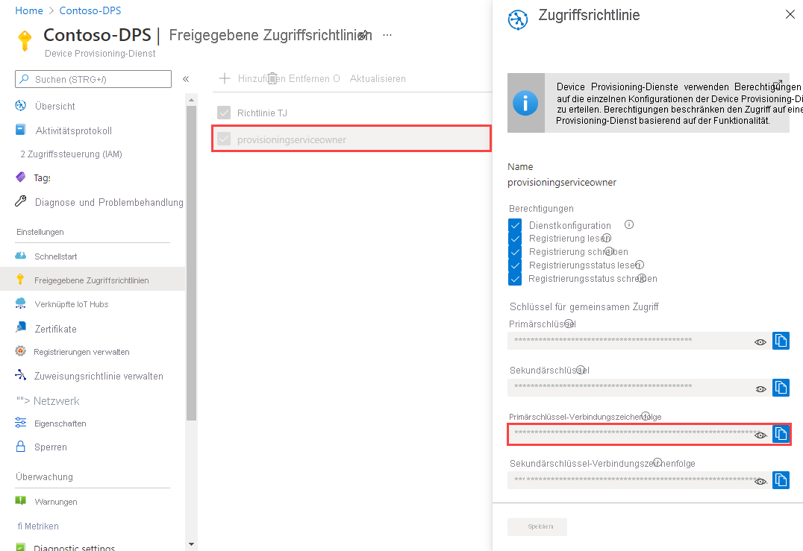
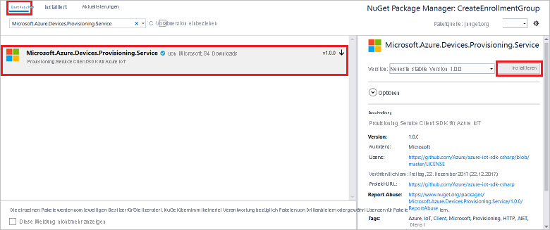

# <a name="quickstart-enroll-a-group-of-devices-to-the-device-provisioning-service-using-x509-certificate-attestation"></a>Schnellstart: Registrieren einer Gruppe von Geräten bei Device Provisioning Service mithilfe des X.509-Zertifikatnachweises 

:::zone pivot="programming-language-csharp,programming-language-nodejs, programming-language-python"

In dieser Schnellstartanleitung wird veranschaulicht, wie Sie eine [Registrierungsgruppe](concepts-service.md#enrollment-group) erstellen, für die X.509-Zertifikate einer Zwischen- oder Stammzertifizierungsstelle verwendet werden. Die Registrierungsgruppe wird mithilfe des [Microsoft Azure IoT SDK](../iot-hub/iot-hub-devguide-sdks.md) und einer Beispielanwendung erstellt. Eine Registrierungsgruppe steuert den Zugriff auf den Bereitstellungsdienst für Geräte, die das gleiche allgemeine Signaturzertifikat in ihrer Zertifikatkette verwenden. Weitere Informationen finden Sie unter [Steuern des Gerätezugriffs auf den Bereitstellungsdienst mit X.509-Zertifikaten](./concepts-x509-attestation.md#controlling-device-access-to-the-provisioning-service-with-x509-certificates). Weitere Informationen zur Verwendung der auf dem X.509-Zertifikat basierenden Public Key-Infrastruktur (PKI) mit Azure IoT Hub und dem Device Provisioning-Dienst finden Sie unter [Geräteauthentifizierung mit X.509-Zertifikaten](../iot-hub/iot-hub-x509ca-overview.md).

:::zone-end

:::zone pivot="programming-language-java"

In dieser Schnellstartanleitung wird veranschaulicht, wie Sie programmgesteuert ein einzelne Registrierung und eine [Registrierungsgruppe](concepts-service.md#enrollment-group) erstellen, für die X.509-Zertifikate einer Zwischen- oder Stammzertifizierungsstelle verwendet werden. Die Registrierungsgruppe wird mithilfe des [Microsoft Azure IoT SDK](../iot-hub/iot-hub-devguide-sdks.md) und einer Beispielanwendung erstellt. Eine Registrierungsgruppe steuert den Zugriff auf den Bereitstellungsdienst für Geräte, die das gleiche allgemeine Signaturzertifikat in ihrer Zertifikatkette verwenden. Weitere Informationen finden Sie unter [Steuern des Gerätezugriffs auf den Bereitstellungsdienst mit X.509-Zertifikaten](./concepts-x509-attestation.md#controlling-device-access-to-the-provisioning-service-with-x509-certificates). Weitere Informationen zur Verwendung der auf dem X.509-Zertifikat basierenden Public Key-Infrastruktur (PKI) mit Azure IoT Hub und dem Device Provisioning-Dienst finden Sie unter [Geräteauthentifizierung mit X.509-Zertifikaten](../iot-hub/iot-hub-x509ca-overview.md).

:::zone-end

## <a name="prerequisites"></a>Voraussetzungen

* Wenn Sie kein Azure-Abonnement besitzen, können Sie ein [kostenloses Konto](https://azure.microsoft.com/free/?ref=microsoft.com&utm_source=microsoft.com&utm_medium=docs&utm_campaign=visualstudio) erstellen, bevor Sie beginnen.

* Führen Sie die Schritte im Artikel [Schnellstart: Einrichten des IoT Hub Device Provisioning-Diensts über das Azure-Portal](./quick-setup-auto-provision.md) aus.

:::zone pivot="programming-language-csharp"

* Installieren Sie [Visual Studio 2019](https://www.visualstudio.com/vs/).

* Installieren Sie das [.NET Core 3.1 SDK oder höher](https://dotnet.microsoft.com/download) auf Ihrem Windows-Computer. Sie können den folgenden Befehl ausführen, um Ihre Version zu überprüfen:

    ```bash
    dotnet --info
    ```

:::zone-end

:::zone pivot="programming-language-nodejs"

* Installieren Sie [Node.js v4.0 oder höher](https://nodejs.org) auf Ihrem Computer.

:::zone-end

:::zone pivot="programming-language-python"

* Installieren Sie [Python 2.x oder 3.x](https://www.python.org/downloads/), und fügen Sie Ihren plattformspezifischen Umgebungsvariablen Python hinzu.

    > [!IMPORTANT]
    > Dieser Artikel gilt nur für das veraltete Python-SDK V1. Geräte- und Dienstclients für IoT Hub Device Provisioning Service sind in V2 noch nicht verfügbar. Das Team arbeitet zurzeit mit vollem Einsatz an der Featureparität für V2.

* Installieren Sie [Pip](https://pip.pypa.io/en/stable/installing/), falls das Programm in Ihrer Python-Distribution nicht bereits enthalten ist.

:::zone-end

:::zone pivot="programming-language-java"

* [Java SE Development Kit 8](/azure/developer/java/fundamentals/java-support-on-azure) In dieser Schnellstartanleitung wird weiter unten das [Java Service SDK](https://azure.github.io/azure-iot-sdk-java/master/service/) installiert. Es funktioniert sowohl unter Windows als auch unter Linux. In dieser Schnellstartanleitung wird Windows verwendet.

* [Maven 3](https://maven.apache.org/download.cgi).

:::zone-end

* Installieren Sie die aktuelle Version von [Git](https://git-scm.com/download/). Stellen Sie sicher, dass Git den Umgebungsvariablen hinzugefügt wurde, auf die das Befehlsfenster Zugriff hat. Unter den [Git-Clienttools von Software Freedom Conservancy](https://git-scm.com/download/) finden Sie die neueste Version der zu installierenden `git`-Tools. Hierzu zählt auch die Befehlszeilen-App *Git Bash*, über die Sie mit Ihrem lokalen Git-Repository interagieren können.

>[!NOTE]
>Die Schritte in diesem Artikel funktionieren für Windows- und Linux-Computer. In diesem Artikel wird allerdings nur ein Windows-Entwicklungscomputer verwendet.

## <a name="prepare-test-certificates"></a>Vorbereiten von Testzertifikaten

Für diese Schnellstartanleitung müssen Sie über eine *PEM*- oder *CER*-Datei verfügen, die den öffentlichen Teil eines X.509-Zertifikats einer Zwischen- oder Stammzertifizierungsstelle enthält. Dieses Zertifikat muss in Ihren Bereitstellungsdienst hochgeladen und vom Dienst überprüft werden.

:::zone pivot="programming-language-csharp,programming-language-nodejs, programming-language-python"

### <a name="clone-the-azure-iot-c-sdk"></a>Klonen des Azure IoT C SDK

Das [Azure IoT C SDK](https://github.com/Azure/azure-iot-sdk-c) enthält Testtools zum Erstellen einer X.509-Zertifikatkette, zum Hochladen eines Stamm- oder Zwischenzertifikats aus dieser Kette und zum Durchführen eines Eigentumsnachweises über den Dienst, um das Zertifikat zu überprüfen.

Wenn Sie das neueste Release des GitHub-Repositorys für das [Azure IoT C SDK](https://github.com/Azure/azure-iot-sdk-c) bereits geklont haben, fahren Sie mit dem [nächsten Abschnitt](#create-the-test-certificate) fort.

1. Öffnen Sie einen Webbrowser, und wechseln Sie zur [Releaseseite für das Azure IoT C SDK](https://github.com/Azure/azure-iot-sdk-c/releases/latest).

2. Kopieren Sie den Tagnamen für das aktuelle Release des Azure IoT C SDK.

3. Öffnen Sie eine Eingabeaufforderung oder die Git Bash-Shell. Führen Sie die folgenden Befehle zum Klonen des aktuellen Releases des [Azure IoT C SDK](https://github.com/Azure/azure-iot-sdk-c)-GitHub-Repositorys aus. (Ersetzen Sie `<release-tag>` durch das Tag, das Sie im vorherigen Schritt kopiert haben.)

    ```cmd/sh
    git clone -b <release-tag> https://github.com/Azure/azure-iot-sdk-c.git
    cd azure-iot-sdk-c
    git submodule update --init
    ```

    Dieser Vorgang kann mehrere Minuten dauern.

4. Die Testtools sollten sich jetzt im geklonten Repository unter *azure-iot-sdk-c/tools/CACertificates* befinden.

:::zone-end

:::zone pivot="programming-language-java"

<a id="javasample"></a>

### <a name="clone-the-azure-iot-java-sdk"></a>Klonen des Azure IoT Java SDK

Das [Azure IoT Java SDK](https://github.com/Azure/azure-iot-sdk-java) enthält Testtools zum Erstellen einer X.509-Zertifikatkette, zum Hochladen eines Stamm- oder Zwischenzertifikats aus dieser Kette und zum Durchführen eines Eigentumsnachweises über den Dienst, um das Zertifikat zu überprüfen.

1. Öffnen Sie eine Eingabeaufforderung.

2. Klonen Sie das GitHub-Repository für das Codebeispiel zur Geräteregistrierung, indem Sie das [Java-Dienst-SDK](https://azure.github.io/azure-iot-sdk-java/master/service/) verwenden:

    ```cmd\sh
    git clone https://github.com/Azure/azure-iot-sdk-java.git --recursive
    ```

:::zone-end

### <a name="create-the-test-certificate"></a>Erstellen des Testzertifikats

So erstellen Sie das Testzertifikat

:::zone pivot="programming-language-csharp,programming-language-nodejs, programming-language-python"

Führen Sie zum Erstellen des Zertifikats die Schritte unter [Verwalten von Zertifizierungsstellen-Testzertifikaten für Beispiele und Tutorials](https://github.com/Azure/azure-iot-sdk-c/blob/master/tools/CACertificates/CACertificateOverview.md) aus.

>[!TIP]
>Zusätzlich zu den Tools im C SDK veranschaulicht das [Beispiel zum Überprüfen des Gruppenzertifikats](https://github.com/Azure-Samples/azure-iot-samples-csharp/tree/master/provisioning/Samples/service/GroupCertificateVerificationSample) im *Microsoft Azure IoT SDK für .NET* das Ausführen eines Eigentumsnachweises in C# für ein vorhandenes X.509-Zwischen- oder -Stammzertifikat einer Zertifizierungsstelle.

:::zone-end

:::zone pivot="programming-language-java"

1. Navigieren Sie in einem Befehlsfenster zum Ordner *_azure-iot-sdk-java/provisioning/provisioning-tools/provisioning-x509-cert-generator_*.

2. Führen Sie den folgenden Befehl aus, um das Tool zu erstellen:

    ```cmd\sh
    mvn clean install
    ```

3. Verwenden Sie die folgenden Befehle, um das Tool auszuführen:

    ```cmd\sh
    cd target
    java -jar ./provisioning-x509-cert-generator-{version}-with-deps.jar
    ```

4. Wenn die Aufforderung angezeigt wird, können Sie optional einen _allgemeinen Namen_ für Ihre Zertifikate eingeben.

5. Das Tool erstellt lokal ein Clientzertifikat (*Client Cert*), den privaten Schlüssel für das Clientzertifikat (*Client Cert Private Key*) und das Stammzertifikat (*Root Cert*). Kopieren Sie das *Stammzertifikat*. Sie benötigen es zum Anpassen des Beispielcodes.

6. Schließen Sie das Befehlsfenster, oder geben Sie **n** ein, wenn Sie zur Eingabe des *Verifizierungscodes* aufgefordert werden.

:::zone-end

### <a name="add-and-verify-your-test-certificate"></a>Hinzufügen und Überprüfen des Testzertifikats

So fügen Sie Ihr Zertifikat zu Device Provisioning Service hinzu und überprüfen es

1. Melden Sie sich nach dem Erstellen der Zertifikate beim [Azure-Portal](https://portal.azure.com) an.

2. Wählen Sie im Menü auf der linken Seite oder auf der Portalseite die Option **Alle Ressourcen** aus.

3. Wählen Sie Ihre Device Provisioning Service-Instanz aus.

4. Wählen Sie im Menü **Einstellungen** die Option **Zertifikate* aus.

5. Wählen Sie im oberen Menü die Option **+ Hinzufügen:** aus.

6. Geben Sie einen Zertifikatnamen ein, und laden Sie die *PEM*-Datei hoch, die Sie im vorherigen Abschnitt erstellt haben.

7. Wählen Sie **Beim Hochladen den Zertifikatstatus auf "verifiziert" festlegen** aus.

8. Wählen Sie **Speichern** aus.

:::image type="content" source="./media/quick-enroll-device-x509/add-certificate.png" alt-text="Hinzufügen eines Zertifikats für die Überprüfung":::

## <a name="get-the-connection-string-for-your-provisioning-service"></a>Abrufen der Verbindungszeichenfolge für Ihren Bereitstellungsdienst

Für das Beispiel in dieser Schnellstartanleitung müssen Sie die Verbindungszeichenfolge für Ihren Bereitstellungsdienst kopieren.

1. Melden Sie sich beim [Azure-Portal](https://portal.azure.com) an.

2. Wählen Sie im Menü auf der linken Seite oder auf der Portalseite die Option **Alle Ressourcen** aus.

3. Wählen Sie Ihre Device Provisioning Service-Instanz aus.

4. Wählen Sie im Menü **Einstellungen** die Option **Richtlinien für gemeinsamen Zugriff** aus.

5. Wählen Sie die Zugriffsrichtlinie aus, die Sie verwenden möchten.

6. Kopieren Sie im Bereich **Zugriffsrichtlinie** die Primärschlüssel-Verbindungszeichenfolge, und speichern Sie sie.

    

## <a name="create-the-enrollment-group-sample"></a>Erstellen des Registrierungsgruppenbeispiels

:::zone pivot="programming-language-csharp"

Dieser Abschnitt zeigt, wie Sie eine .NET Core-Konsolenanwendung erstellen, die Ihrem Bereitstellungsdienst eine Registrierungsgruppe hinzufügt.

>[!TIP]
>Wenn Sie diese Schritte etwas abwandeln, können Sie damit auch eine [Windows IoT Core](https://developer.microsoft.com/en-us/windows/iot)-Konsolenanwendung zum Hinzufügen einer Registrierungsgruppe erstellen. Weitere Informationen zum Entwickeln mit IoT Core finden Sie in der [Windows IoT Core-Dokumentation für Entwickler](/windows/iot-core/).

1. Öffnen Sie Visual Studio, und wählen Sie **Neues Projekt erstellen** aus.

2. Wählen Sie im Bereich **Neues Projekt erstellen** die Option *Konsolenanwendung* aus.

3. Klicken Sie auf **Weiter**.

4. Geben Sie unter **Projektname** den Namen *CreateEnrollmentGroup* ein.

5. Wählen Sie **Weiter** aus. Übernehmen Sie den Standardwert für **Zielframework**.

6. Klicken Sie auf **Erstellen**.

7. Wenn die Projektmappe im Bereich des **Projektmappen-Explorers** geöffnet wird, klicken Sie mit der rechten Maustaste auf das Projekt **CreateEnrollmentGroup**, und wählen Sie dann **NuGet-Pakete verwalten** aus.

8. Wählen Sie in **NuGet Package Manager** die Option **Durchsuchen** aus.

9. Geben Sie *Microsoft.Azure.Devices.Provisioning.Service* ein, und wählen Sie den Eintrag aus.

10. Wählen Sie **Installieren** aus.

    

    In diesem Schritt wird das NuGet-Paket mit dem [Client-SDK für Azure IoT Provisioning Service](https://www.nuget.org/packages/Microsoft.Azure.Devices.Provisioning.Service/) heruntergeladen und installiert und ein Verweis auf das Paket und seine Abhängigkeiten hinzugefügt.

11. Fügen Sie am Anfang von `Program.cs` nach den anderen `using`-Anweisungen die folgenden `using`-Anweisungen hinzu:

    ```csharp
    using System.Security.Cryptography.X509Certificates;
    using System.Threading.Tasks;
    using Microsoft.Azure.Devices.Provisioning.Service;
    ```

12. Fügen Sie die folgenden Felder zur `Program`-Klasse hinzu, und nehmen Sie die aufgeführten Änderungen vor.  

    ```csharp
    private static string ProvisioningConnectionString = "{ProvisioningServiceConnectionString}";
    private static string EnrollmentGroupId = "enrollmentgrouptest";
    private static string X509RootCertPath = @"{Path to a .cer or .pem file for a verified root CA or intermediate CA X.509 certificate}";
    ```

13. Ersetzen Sie den Platzhalterwert `ProvisioningServiceConnectionString` durch die Verbindungszeichenfolge des Bereitstellungsdiensts, die Sie im vorherigen Abschnitt kopiert haben.

14. Ersetzen Sie den Platzhalterwert `X509RootCertPath` durch den Pfad zu einer PEM- oder CER-Datei. Diese Datei stellt den öffentlichen Teil eines X.509-Zwischenzertifikats oder -Stammzertifikats einer Zertifizierungsstelle dar, das zuvor für Ihren Bereitstellungsdienst hochgeladen und überprüft wurde.

15. Sie können auch den Wert `EnrollmentGroupId` ändern, dies ist jedoch optional. Die Zeichenfolge darf nur Kleinbuchstaben und Bindestriche enthalten.

    > [!IMPORTANT]
    > Beachten Sie bei Produktionscode die folgenden Sicherheitshinweise:
    >
    > * Die Hartcodierung der Verbindungszeichenfolge für den Bereitstellungsdienstadministrator verstößt gegen die bewährten Methoden für die Sicherheit. Stattdessen sollte die Verbindungszeichenfolge sicher gespeichert werden, etwa in einer sicheren Konfigurationsdatei oder in der Registrierung.
    > * Achten Sie darauf, dass nur der öffentliche Teil des Signaturzertifikats hochgeladen wird. Laden Sie nie PFX-Dateien (PKCS12) oder PEM-Dateien mit privaten Schlüsseln in den Bereitstellungsdienst hoch.

16. Fügen Sie der `Program`-Klasse die folgende Methode hinzu. Dieser Code erstellt einen Registrierungsgruppeneintrag und ruft dann die `CreateOrUpdateEnrollmentGroupAsync`-Methode für `ProvisioningServiceClient` auf, um die Registrierungsgruppe zum Bereitstellungsdienst hinzuzufügen.

    ```csharp
    public static async Task RunSample()
    {
        Console.WriteLine("Starting sample...");
    
        using (ProvisioningServiceClient provisioningServiceClient =
                ProvisioningServiceClient.CreateFromConnectionString(ProvisioningConnectionString))
        {
            #region Create a new enrollmentGroup config
            Console.WriteLine("\nCreating a new enrollmentGroup...");
            var certificate = new X509Certificate2(X509RootCertPath);
            Attestation attestation = X509Attestation.CreateFromRootCertificates(certificate);
            EnrollmentGroup enrollmentGroup =
                    new EnrollmentGroup(
                            EnrollmentGroupId,
                            attestation)
                    {
                        ProvisioningStatus = ProvisioningStatus.Enabled
                    };
            Console.WriteLine(enrollmentGroup);
            #endregion
    
            #region Create the enrollmentGroup
            Console.WriteLine("\nAdding new enrollmentGroup...");
            EnrollmentGroup enrollmentGroupResult =
                await provisioningServiceClient.CreateOrUpdateEnrollmentGroupAsync(enrollmentGroup).ConfigureAwait(false);
            Console.WriteLine("\nEnrollmentGroup created with success.");
            Console.WriteLine(enrollmentGroupResult);
            #endregion
    
        }
    }
    ```

17. Ersetzen Sie schließlich die Methode `Main` durch die folgenden Zeilen:

    ```csharp
    static async Task Main(string[] args)
    {
        await RunSample();
        Console.WriteLine("\nHit <Enter> to exit ...");
        Console.ReadLine();
    }
    ```

18. Erstellen Sie die Projektmappe.

:::zone-end

:::zone pivot="programming-language-nodejs"

Dieser Abschnitt zeigt, wie Sie ein node.js-Skript erstellen, das Ihrem Bereitstellungsdienst eine Registrierungsgruppe hinzufügt.

1. Führen Sie in einem Befehlsfenster in Ihrem Arbeitsordner Folgendes aus:

     ```cmd\sh
     npm install azure-iot-provisioning-service
     ```  

2. Erstellen Sie mit einem Text-Editor in Ihrem Arbeitsordner die Datei **create_enrollment_group.js**. Fügen Sie der Datei den folgenden Code hinzu, und speichern Sie sie:

    ```javascript
        'use strict';
        var fs = require('fs');
    
        var provisioningServiceClient = require('azure-iot-provisioning-service').ProvisioningServiceClient;
    
        var serviceClient = provisioningServiceClient.fromConnectionString(process.argv[2]);
    
        var enrollment = {
          enrollmentGroupId: 'first',
          attestation: {
            type: 'x509',
            x509: {
              signingCertificates: {
                primary: {
                  certificate: fs.readFileSync(process.argv[3], 'utf-8').toString()
                }
              }
            }
          },
          provisioningStatus: 'disabled'
        };
    
        serviceClient.createOrUpdateEnrollmentGroup(enrollment, function(err, enrollmentResponse) {
          if (err) {
            console.log('error creating the group enrollment: ' + err);
          } else {
            console.log("enrollment record returned: " + JSON.stringify(enrollmentResponse, null, 2));
            enrollmentResponse.provisioningStatus = 'enabled';
            serviceClient.createOrUpdateEnrollmentGroup(enrollmentResponse, function(err, enrollmentResponse) {
              if (err) {
                console.log('error updating the group enrollment: ' + err);
              } else {
                console.log("updated enrollment record returned: " + JSON.stringify(enrollmentResponse, null, 2));
              }
            });
          }
        });
    ```

:::zone-end

:::zone pivot="programming-language-python"

Dieser Abschnitt zeigt, wie Sie ein Python-Skript erstellen, das Ihrem Bereitstellungsdienst eine Registrierungsgruppe hinzufügt.

1. Erstellen Sie mit einem Text-Editor die neue Datei *EnrollmentGroup.py*.

2. Kopieren Sie den folgenden Python-Code in die Datei. (Ersetzen Sie `{dpsConnectionString}` durch die zuvor kopierte Verbindungszeichenfolge, den Zertifikatplatzhalter durch das Zertifikat, das unter [Vorbereiten von Testzertifikaten](#prepare-test-certificates) erstellt wurde, und `{registrationid}` durch ein eindeutiges `registrationid`-Element, das nur aus Kleinbuchstaben und Bindestrichen besteht.)

    ```python
    from provisioningserviceclient import ProvisioningServiceClient
    from provisioningserviceclient.models import EnrollmentGroup, AttestationMechanism
    
    CONNECTION_STRING = "{dpsConnectionString}"
    
    SIGNING_CERT = """-----BEGIN CERTIFICATE-----
    XXXXXXXXXXXXXXXXXXXXXXXXXXXXXXXXXXXXXXXXXXXXXXXXXXXXXXXXXXXXXXXX
    XXXXXXXXXXXXXXXXXXXXXXXXXXXXXXXXXXXXXXXXXXXXXXXXXXXXXXXXXXXXXXXX
    XXXXXXXXXXXXXXXXXXXXXXXXXXXXXXXXXXXXXXXXXXXXXXXXXXXXXXXXXXXXXXXX
    XXXXXXXXXXXXXXXXXXXXXXXXXXXXXXXXXXXXXXXXXXXXXXXXXXXXXXXXXXXXXXXX
    XXXXXXXXXXXXXXXXXXXXXXXXXXXXXXXXXXXXXXXXXXXXXXXXXXXXXXXXXXXXXXXX
    XXXXXXXXXXXXXXXXXXXXXXXXXXXXXXXXXXXXXXXXXXXXXXXXXXXXXXXXXXXXXXXX
    XXXXXXXXXXXXXXXXXXXXXXXXXXXXXXXXXXXXXXXXXXXXXXXXXXXXXXXXXXXXXXXX
    XXXXXXXXXXXXXXXXXXXXXXXXXXXXXXXXXXXXXXXXXXXXXXXXXXXXXXXXXXXXXXXX
    XXXXXXXXXXXXXXXXXXXXXXXXXXXXXXXXXXXXXXXXXXXXXXXXXXXXXXXXXXXXXXXX
    XXXXXXXXXXXXXXXXXXXXXXXXXXXXXXXXXXXXXXXXXXXXXXXXXXXXXXXXXXXXXXXX
    XXXXXXXXXXXXXXXXXXXXXXXXXXXXXXXXXXXXXXXXXXXXXXXXXXXXXXXXXXXXXXXX
    XXXXXXXXXXXXXXXXXXXXXXXXXXXXXXXXXXXXXXXXXXXXXXXXXXXXXXXXXXXXXXXX
    XXXXXXXXXXXXXXXXXXXXXXXXXXXXXXXXXXXXXXXXXXXXXXXXXXXXXXXXXXXXXXXX
    XXXXXXXXXXXXXXXXXXXXXXXXXXXXXXXXXXXXXXXXXXXXXXXXXXXXXXXXXXXXXXXX
    XXXXXXXXXXXXXXXXXXXXXXXXXXXXXXXXXXXXXXXXXXXXXXXXXXXXXXXX
    -----END CERTIFICATE-----"""
    
    GROUP_ID = "{registrationid}"

    def main():
        print ( "Initiating enrollment group creation..." )

        psc = ProvisioningServiceClient.create_from_connection_string(CONNECTION_STRING)
        att = AttestationMechanism.create_with_x509_signing_certs(SIGNING_CERT)
        eg = EnrollmentGroup.create(GROUP_ID, att)

        eg = psc.create_or_update(eg)
    
        print ( "Enrollment group created." )

    if __name__ == '__main__':
        main()
    ```

3. Speichern und schließen Sie die Datei **EnrollmentGroup.py**.

:::zone-end

:::zone pivot="programming-language-java"

<a id="runjavasample"></a>

1. Navigieren Sie im Azure IoT Java SDK zum Beispielordner *_azure-iot-sdk-java/provisioning/provisioning-samples/service-enrollment-group-sample_*.

2. Öffnen Sie die Datei *_/src/main/java/samples/com/microsoft/azure/sdk/iot/ServiceEnrollmentGroupSample.java_* in einem Editor Ihrer Wahl.

3. Ersetzen Sie `[Provisioning Connection String]` durch die Verbindungszeichenfolge, die Sie unter [Abrufen der Verbindungszeichenfolge für Ihren Bereitstellungsdienst](#get-the-connection-string-for-your-provisioning-service) kopiert haben.

4. Ersetzen Sie den Wert `PUBLIC_KEY_CERTIFICATE_STRING` durch den Wert des *Stammzertifikats**, das Sie im vorherigen Abschnitt erstellt haben. Ersetzen Sie unbedingt den gesamten Beispielwert, einschließlich der Zeilen **_-----BEGIN CERTIFICATE-----_** und **_-----END CERTIFICATE-----_**.

5. Fahren Sie mit dem nächsten Schritt fort, um Ihren Bereitstellungsdienst im Beispielcode zu konfigurieren. Falls Sie den Bereitstellungsdienst nicht konfigurieren möchten, sollten Sie die folgenden Anweisungen in der Datei _ServiceEnrollmentGroupSample.java_ auskommentieren oder löschen:

    ```Java
    enrollmentGroup.setIotHubHostName(IOTHUB_HOST_NAME);                // Optional parameter.
    enrollmentGroup.setProvisioningStatus(ProvisioningStatus.ENABLED);  // Optional parameter.
    ```

6. In diesem Schritt wird gezeigt, wie Sie Ihren Bereitstellungsdienst im Beispielcode konfigurieren.

    1. Öffnen Sie das [Azure-Portal](https://portal.azure.com).

    2. Wählen Sie im Menü auf der linken Seite oder auf der Portalseite die Option **Alle Ressourcen** aus.

    3. Wählen Sie Ihre Device Provisioning Service-Instanz aus.

    4. Kopieren Sie im Bereich **Übersicht** den Hostnamen des *Dienstendpunkts*.  Ersetzen Sie im Quellcodebeispiel `[Host name]` durch den kopierten Hostnamen.

        ```Java
        private static final String IOTHUB_HOST_NAME = "[Host name].azure-devices.net";
        ```

7. Sehen Sie sich den Beispielcode näher an. Er bewirkt, dass eine Gruppenregistrierung für X.509-Geräte erstellt, aktualisiert, abgefragt und gelöscht wird. Um zu überprüfen, ob die Registrierung im Portal erfolgreich war, können Sie die folgenden Codezeilen am Ende der Datei _ServiceEnrollmentGroupSample.java_ vorübergehend auskommentieren:

    ```Java
    // ************************************** Delete info of enrollmentGroup ***************************************
    System.out.println("\nDelete the enrollmentGroup...");
    provisioningServiceClient.deleteEnrollmentGroup(enrollmentGroupId);
    ```

8. Speichern Sie die Datei _ServiceEnrollmentGroupSample.java_.

:::zone-end

## <a name="run-the-enrollment-group-sample"></a>Ausführen des Registrierungsgruppenbeispiels

:::zone pivot="programming-language-csharp"

1. Führen Sie das Beispiel in Visual Studio aus, um die Registrierungsgruppe zu erstellen. Ein Befehlsfenster wird angezeigt, in dem Bestätigungsmeldungen angezeigt werden.

2. Bei erfolgreicher Erstellung werden im Befehlsfenster die Eigenschaften der neuen Registrierungsgruppe angezeigt.

:::zone-end

:::zone pivot="programming-language-nodejs"

1. Öffnen Sie eine Eingabeaufforderung, und führen Sie den folgenden Befehl aus. (Schließen Sie die Anführungszeichen um die Befehlsargumente ein, und ersetzen Sie `<connection string>` durch die Verbindungszeichenfolge, die Sie im vorherigen Abschnitt kopiert haben, und `<certificate .pem file>` durch den Pfad Ihrer `.pem`-Datei.)

    ```cmd\sh
    node create_enrollment_group.js "<connection string>" "<certificate .pem file>"
    ```

2. Bei erfolgreicher Erstellung werden im Befehlsfenster die Eigenschaften der neuen Registrierungsgruppe angezeigt.

:::zone-end

:::zone pivot="programming-language-python"

1. Öffnen Sie eine Eingabeaufforderung im Administratormodus, und führen Sie den folgenden Befehl aus, um [azure-iot-provisioning-device-client](https://pypi.org/project/azure-iot-provisioning-device-client) zu installieren.

    ```cmd/sh
    pip install azure-iothub-provisioningserviceclient    
    ```

2. Führen Sie das Skript an der Eingabeaufforderung aus:

    ```cmd/sh
    python EnrollmentGroup.py
    ```

3. Bei erfolgreicher Erstellung werden im Befehlsfenster die Eigenschaften der neuen Registrierungsgruppe angezeigt.

:::zone-end

:::zone pivot="programming-language-java"

1. Öffnen Sie ein Befehlsfenster im Administratormodus, und navigieren Sie zum Ordner *_azure-iot-sdk-java/provisioning/provisioning-samples/service-enrollment-group-sample_*.

2. Führen Sie den folgenden Befehl an der Eingabeaufforderung aus:

    ```cmd\sh
    mvn install -DskipTests
    ```

    Mit diesem Befehl wird das Maven-Paket [`com.microsoft.azure.sdk.iot.provisioning.service`](https://mvnrepository.com/artifact/com.microsoft.azure.sdk.iot.provisioning/provisioning-service-client) auf Ihren Computer heruntergeladen. Das Paket enthält die Binärdateien für das Java-Dienst-SDK, das mit dem Code erstellt werden soll. Wenn Sie im vorherigen Abschnitt das Tool _X.509-Zertifikatgenerator_ ausgeführt haben, wurde dieses Paket bereits auf Ihren Computer heruntergeladen.

3. Führen Sie das Skript an der Eingabeaufforderung aus:

    ```cmd\sh
    cd target
    java -jar ./service-enrollment-group-sample-{version}-with-deps.jar
    ```

4. Bei erfolgreicher Erstellung werden im Befehlsfenster die Eigenschaften der neuen Registrierungsgruppe angezeigt.

:::zone-end

So überprüfen Sie, ob die Registrierungsgruppe erstellt wurde

1. Wählen Sie im Azure-Portal Ihre Device Provisioning Service-Instanz aus.

2. Wählen Sie im Menü **Einstellungen** die Option **Registrierungen verwalten** aus.

3. Wählen Sie **Registrierungsgruppen** aus. Daraufhin sollte ein neuer Registrierungseintrag mit der im Beispiel verwendeten Registrierungs-ID angezeigt werden.

:::zone pivot="programming-language-csharp"

:::image type="content" source="./media/quick-enroll-device-x509/verify-enrollment-csharp.png" alt-text="Überprüfen der Registrierung für die C#-Gruppe im Portal":::

:::zone-end

:::zone pivot="programming-language-nodejs"


:::zone-end

:::zone pivot="programming-language-python"

:::image type="content" source="./media/quick-enroll-device-x509/verify-enrollment-python.png" alt-text="Überprüfen der Registrierung für die Python-Gruppe im Portal":::

:::zone-end

:::zone pivot="programming-language-java"

:::image type="content" source="./media/quick-enroll-device-x509/verify-enrollment-java.png" alt-text="Überprüfen der Registrierung für die Java-Gruppe im Portal":::

:::zone-end

:::zone pivot="programming-language-java"

## <a name="modifications-to-enroll-a-single-x509-device"></a>Änderungen zur Registrierung eines einzelnen X.509-Geräts

Ändern Sie zum Registrieren eines einzelnen X.509-Geräts den Beispielcode für die *individuelle Registrierung*, der unter [Registrieren eines TPM-Geräts für den IoT Hub Device Provisioning-Dienst per Java-Dienst-SDK](quick-enroll-device-tpm.md) verwendet wurde, wie folgt:

1. Kopieren Sie den *allgemeinen Namen* Ihres X.509-Clientzertifikats in die Zwischenablage. Wenn Sie das Tool _X.509 Certificate Generator_ wie im [vorherigen Codeabschnitt](#javasample) gezeigt verwenden möchten, können Sie entweder einen _allgemeinen Namen_ für Ihr Zertifikat eingeben oder den Standardwert **microsoftriotcore** verwenden. Verwenden Sie diesen **allgemeinen Namen** als Wert für die Variable *REGISTRATION_ID*.

    ```Java
    // Use common name of your X.509 client certificate
    private static final String REGISTRATION_ID = "[RegistrationId]";
    ```

2. Benennen Sie die Variable *TPM_ENDORSEMENT_KEY* in *PUBLIC_KEY_CERTIFICATE_STRING* um. Kopieren Sie Ihr Clientzertifikat bzw. das **Client Cert** aus der Ausgabe des Tools _X.509 Certificate Generator_ als Wert für die Variable *PUBLIC_KEY_CERTIFICATE_STRING*.

    ```Java
    // Rename the variable *TPM_ENDORSEMENT_KEY* as *PUBLIC_KEY_CERTIFICATE_STRING*
    private static final String PUBLIC_KEY_CERTIFICATE_STRING =
            "-----BEGIN CERTIFICATE-----\n" +
            "XXXXXXXXXXXXXXXXXXXXXXXXXXXXXXXXXXXXXXXXXXXXXXXXXXXXXXXXXXXXXXXX\n" +
            "XXXXXXXXXXXXXXXXXXXXXXXXXXXXXXXXXXXXXXXXXXXXXXXXXXXXXXXXXXXXXXXX\n" +
            "XXXXXXXXXXXXXXXXXXXXXXXXXXXXXXXXXXXXXXXXXXXXXXXXXXXXXXXXXXXXXXXX\n" +
            "XXXXXXXXXXXXXXXXXXXXXXXXXXXXXXXXXXXXXXXXXXXXXXXXXXXXXXXXXXXXXXXX\n" +
            "XXXXXXXXXXXXXXXXXXXXXXXXXXXXXXXXXXXXXXXXXXXXXXXXXXXXXXXXXXXXXXXX\n" +
            "XXXXXXXXXXXXXXXXXXXXXXXXXXXXXXXXXXXXXXXXXXXXXXXXXXXXXXXXXXXXXXXX\n" +
            "XXXXXXXXXXXXXXXXXXXXXXXXXXXXXXXXXXXXXXXXXXXXXXXXXXXXXXXXXXXXXXXX\n" +
            "XXXXXXXXXXXXXXXXXXXXXXXXXXXXXXXXXXXXXXXXXXXXXXXXXXXXXXXXXXXXXXXX\n" +
            "XXXXXXXXXXXXXXXXXXXXXXXXXXXXXXXXXXXXXXXXXXXXXXXXXXXXXXXXXXXXXXXX\n" +
            "XXXXXXXXXXXXXXXXXXXXXXXXXXXXXXXXXXXXXXXXXXXXXXXXXXXXXXXXXXXXXXXX\n" +
            "-----END CERTIFICATE-----\n";
    ```

3. Ersetzen Sie in der Funktion **main** die Zeile `Attestation attestation = new TpmAttestation(TPM_ENDORSEMENT_KEY);` durch Folgendes, um das X.509-Clientzertifikat zu verwenden:

    ```Java
    Attestation attestation = X509Attestation.createFromClientCertificates(PUBLIC_KEY_CERTIFICATE_STRING);
    ```

4. Führen Sie das Speichern, Erstellen und Ausführen der Beispieldatei für die *individuelle Registrierung* durch, indem Sie die Schritte im Abschnitt [Erstellen des Beispiels für die individuelle Registrierung](quick-enroll-device-tpm.md) befolgen.

:::zone-end

## <a name="clean-up-resources"></a>Bereinigen von Ressourcen

Wenn Sie die [Tutorials zu Azure IoT Hub Device Provisioning Service](./tutorial-set-up-cloud.md) erkunden möchten, sollten Sie die in dieser Schnellstartanleitung erstellten Ressourcen nicht bereinigen. Führen Sie andernfalls die folgenden Schritte aus, um alle Ressourcen zu löschen, die im Rahmen dieser Schnellstartanleitung erstellt wurden.

1. Schließen Sie das Beispielausgabefenster auf Ihrem Computer.

2. Wählen Sie im Azure-Portal im linken Menü die Option **Alle Ressourcen** aus.

3. Wählen Sie Ihre Device Provisioning Service-Instanz aus.

4. Wählen Sie im Menü **Einstellungen** die Option **Registrierungen verwalten** aus.

5. Wählen Sie die Registerkarte **Registrierungsgruppen** aus.

6. Aktivieren Sie das Kontrollkästchen neben der *REGISTRIERUNGS-ID* des Geräts, das Sie in dieser Schnellstartanleitung registriert haben.

7. Wählen Sie am oberen Rand der Seite die Option **Löschen** aus.

8. Wählen Sie im Azure-Portal in Ihrer Device Provisioning Service-Instanz die Option **Zertifikate** aus.

9. Wählen Sie das Zertifikat aus, das Sie für diese Schnellstartanleitung hochgeladen haben.

10. Wählen Sie am oberen Rand von **Zertifikatdetails** die Option **Löschen** aus.  

## <a name="next-steps"></a>Nächste Schritte

In dieser Schnellstartanleitung haben Sie eine Registrierungsgruppe für ein X.509-Zwischenzertifikat oder -Stammzertifikat einer Zertifizierungsstelle erstellt, indem Sie Azure IoT Hub Device Provisioning Service verwendet haben. Ausführlichere Informationen zur Gerätebereitstellung finden Sie im Tutorial zur Einrichtung des Device Provisioning-Diensts über das Azure-Portal.

> [!div class="nextstepaction"]
> [Tutorials für den Azure IoT Hub Device Provisioning-Dienst](./tutorial-set-up-cloud.md)

:::zone pivot="programming-language-nodejs"

> [!div class="nextstepaction"]
>[Node.js-Gerätebereitstellungsbeispiel](https://github.com/Azure/azure-iot-sdk-node/tree/master/provisioning/device/samples)

:::zone-end