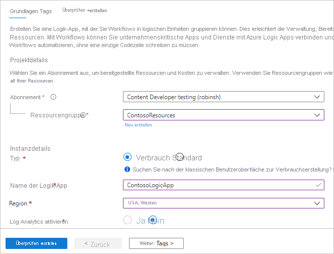
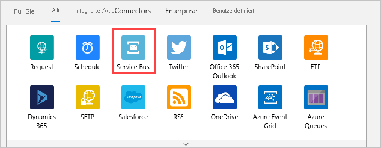
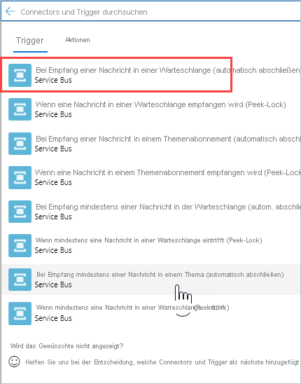
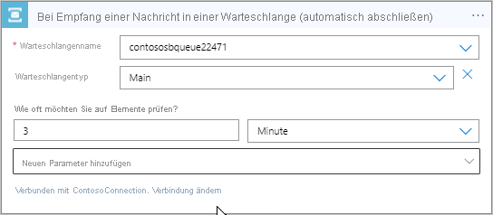
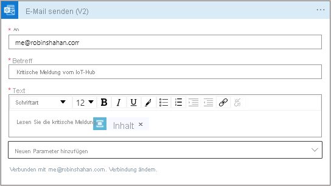
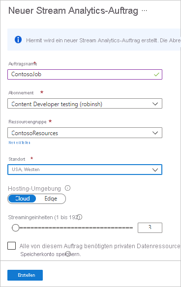
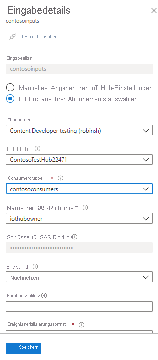
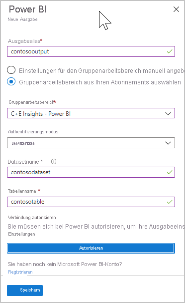
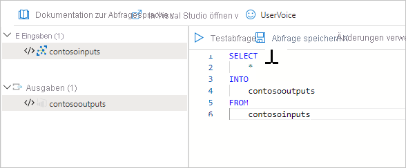
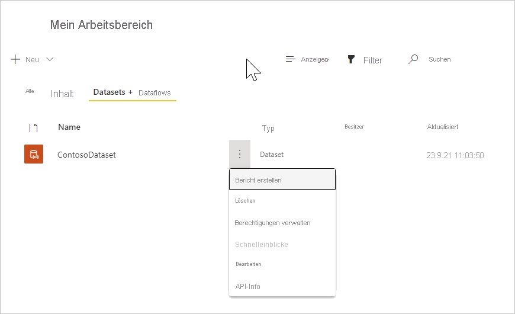

# <a name="tutorial-part-2---view-the-routed-messages"></a>Tutorial: Teil 2: Anzeigen der weitergeleiteten Nachrichten

[!INCLUDE [iot-hub-include-routing-intro](../../includes/iot-hub-include-routing-intro.md)]

[!INCLUDE [updated-for-az](../../includes/updated-for-az.md)]

## <a name="rules-for-routing-the-messages"></a>Regeln für das Routing der Nachrichten

Die folgenden Regeln gelten für das Nachrichtenrouting. Sie wurden in Teil 1 dieses Tutorials eingerichtet, und im zweiten Teil erfahren Sie, wie sie funktionieren.

|Wert |Ergebnis|
|------|------|
|level="storage" |Schreibvorgang in Azure Storage.|
|level="critical" |Schreibvorgang in eine Service Bus-Warteschlange. Eine Logik-App ruft die Nachricht aus der 
 Warteschlange ab und versendet sie mit Office 365 per E-Mail.|
|default |Anzeigen dieser Daten mithilfe von Power BI.|

Sie erstellen jetzt die Ressourcen, an die die Nachrichten geleitet werden, führen eine App zum Senden der Nachrichten an den Hub aus, und erleben das Routing in Aktion.

## <a name="create-a-logic-app"></a>Erstellen einer Logik-App  

Die Service Bus-Warteschlange sollte zum Empfangen von als kritisch eingestuften Nachrichten verwendet werden. Sie richten eine Logik-App ein, um die Service Bus-Warteschlange zu überwachen und eine E-Mail zu senden, wenn der Warteschlange eine Nachricht hinzugefügt wird.

1. Wählen Sie im [Azure-Portal](https://portal.azure.com) die Option **+ Ressource erstellen**. Geben Sie **Logik-App** in das Suchfeld ein, und drücken Sie die EINGABETASTE. Wählen Sie aus den angezeigten Suchergebnissen „Logik-App“ aus, und wählen Sie dann **Erstellen**, um zum Bereich **Logik-App erstellen** zu gelangen. Füllen Sie die Felder aus.

   **Abonnement**: Wählen Sie Ihr Azure-Abonnement.

   **Ressourcengruppe**: Wählen Sie unter dem Feld „Ressourcengruppe“ die Option **Neu erstellen** aus. Geben Sie **ContosoResources** als Namen der Ressourcengruppe an. 

   **Instanzdetails**
   **Typ**: Wählen Sie für den Instanztyp die Option **Verbrauch** aus. 

   Geben Sie unter **Logik-App-Name** den Namen der Logik-App an. In diesem Tutorial wird **ContosoLogicApp** verwendet. 

   **Region**: Verwenden Sie den Standort des nächstgelegenen Rechenzentrums. In diesem Tutorial wird **USA, Westen** verwendet.

   **Log Analytics aktivieren**: Legen Sie für diese Umschaltfläche fest, dass Log Analytics nicht aktiviert wird. 

   

   Klicken Sie auf **Überprüfen + erstellen**. Das Bereitstellen der App kann einige Minuten in Anspruch nehmen. Anschließend wird ein Bildschirm mit einer Übersicht der Bereitstellung angezeigt. 

2. Wechseln Sie jetzt zur Logik-App. Wenn Sie sich noch auf der Bereitstellungsseite befinden, können Sie **Zu Ressource wechseln** auswählen. Sie können auch zur Logik-App wechseln, indem Sie die Option **Ressourcengruppen** und Ihre Ressourcengruppe (in diesem Tutorial wird **ContosoResources** verwendet) und dann in der Liste mit den Ressourcen die Logik-App auswählen. 

    Scrollen Sie nach unten, bis die fast leere Kachel **Leere Logik-App +** angezeigt wird, und wählen Sie sie aus. Die Standardregisterkarte auf dem Bildschirm lautet „Für Sie“. Wählen Sie **Alle** aus, wenn dieser Bereich leer ist, um die verfügbaren Connectors und Trigger anzuzeigen.

3. Wählen in der Liste mit den Connectors den Eintrag **Service Bus** aus.

   

4. Dieser Screenshot zeigt eine Liste der Trigger. Wählen Sie den Trigger **Wenn eine Nachricht in einer Warteschlange empfangen wird (automatisch abschließen)** aus.

   

5. Füllen Sie die Felder auf dem nächsten Bildschirm mit den Verbindungsinformationen aus.

   **Verbindungsname**: ContosoConnection
   
   Wählen Sie den Service Bus-Namespace aus. In diesem Tutorial wird **ContosoSBNamespace** verwendet. Der Name des Schlüssels (RootManageSharedAccessKey) und die Rechte (Lauschen, Verwalten, Senden) werden abgerufen und geladen. Wählen Sie **RootManageSharedAccessKey**. Die Schaltfläche **Erstellen** wird blau (aktiv). Wählen Sie sie aus. Der Bildschirm für die Warteschlangenauswahl wird angezeigt.  

6. Als Nächstes werden Sie aufgefordert, Informationen zur Warteschlange anzugeben.  

   

   **Warteschlangenname:** Dieses Feld ist der Name der Warteschlange, von der die Nachricht gesendet wird. Klicken Sie auf diese Dropdownliste, und wählen Sie den Warteschlangennamen aus, der in den Setupschritten festgelegt wurde. In diesem Tutorial wird **contososbqueue** verwendet.

   **Warteschlangentyp:** Der Typ der Warteschlange. Wählen Sie **Übergeordnet** aus der Dropdownliste aus.

   Übernehmen Sie die Standardwerte für die anderen Felder. Wählen Sie **Speichern** aus, um die Designerkonfiguration für Logik-Apps zu speichern.

7. Wählen Sie **+ Neuer Schritt** aus. Der Bereich **Vorgang auswählen** wird angezeigt. Wählen Sie **Office 365 Outlook** aus. Wählen Sie in der Liste **E-Mail senden (V2)** aus. Melden Sie sich bei Ihrem Office 365-Konto an.   

8. Füllen Sie die Felder aus, die beim Senden einer E-Mail über die Nachricht in der Warteschlange verwendet werden sollen. 

    

   **An**: Geben Sie die E-Mail-Adresse ein, an die die Warnung gesendet werden soll.

   **Betreff**: Geben Sie den Betreff der E-Mail ein.

   **Text**: Geben Sie den Text ein. Klicken Sie auf **Dynamischen Inhalt hinzufügen**. Daraufhin werden Felder angezeigt, die Sie zum Einbeziehen in die E-Mail auswählen können. Wenn keine Felder angezeigt werden, wählen Sie **Mehr anzeigen** aus, um weitere Optionen anzuzeigen. Wählen Sie **Inhalt** aus, damit der Text der E-Mail in der Fehlermeldung angezeigt wird.

9. Klicken Sie zum Speichern der Änderungen auf **Speichern**. Schließen Sie den Logik-App-Designer. 

## <a name="set-up-azure-stream-analytics"></a>Einrichten von Azure Stream Analytics

Um die Daten in einer Power BI-Visualisierung anzuzeigen, richten Sie zuerst einen Stream Analytics-Auftrag zum Abrufen der Daten ein. Denken Sie daran, dass nur Nachrichten mit „**level** = **normal**“ an den Standardendpunkt gesendet und vom Stream Analytics-Auftrag für die Power BI-Visualisierung abgerufen werden.

### <a name="create-the-stream-analytics-job"></a>Erstellen des Stream Analytics-Auftrags

1. Geben Sie **Stream** **Analytics-** **Auftrag** in das Suchfeld im [Azure-Portal](https://portal.azure.com) ein, und wählen Sie **Eingabe** aus. Wählen Sie **Erstellen** aus, um zum Stream Analytics-Auftragsbildschirm zu gelangen, und dann erneut **Erstellen**, um zum Erstellungsbildschirm zu gelangen. 

2. Geben Sie die folgenden Informationen für den Auftrag ein.

   **Auftragsname**: Der Name des Auftrags. Der Name muss global eindeutig sein. In diesem Tutorial wird **contosoJob** verwendet.

   **Abonnement**: Azure-Abonnement, das Sie für das Tutorial verwenden.

   **Ressourcengruppe**: Verwenden Sie dieselbe Ressourcengruppe wie für Ihre IoT Hub-Instanz. In diesem Tutorial wird **ContosoResources** verwendet.

   **Standort**: Verwenden Sie den gleichen Standort, der im Einrichtungsskript verwendet wurde. In diesem Tutorial wird **USA, Westen** verwendet.

   

3. Klicken Sie auf **Erstellen**, um den Auftrag zu erstellen. Die Bereitstellung kann einige Minuten dauern.

    Um zum Auftrag zurückzukehren, wählen Sie **Zu Ressource wechseln** aus. Sie können auch **Ressourcengruppen** auswählen. In diesem Tutorial wird **ContosoResources** verwendet. Wählen Sie dann die Ressourcengruppe und anschließend in der Ressourcenliste den Stream Analytics-Auftrag aus.

### <a name="add-an-input-to-the-stream-analytics-job"></a>Hinzufügen einer Eingabe zum Stream Analytics-Auftrag

1. Wählen Sie unter **Auftragstopologie** die Option **Eingaben** aus.

2. Wählen Sie im Bereich **Eingaben** die Option **Datenstromeingabe hinzufügen** und dann „IoT Hub“ aus. Füllen Sie im daraufhin angezeigten Bildschirm die folgenden Felder aus:

   **Eingabealias**: In diesem Tutorial wird **contosoinputs** verwendet.

   Wählen **IoT Hub aus Ihren Abonnements auswählen** und dann in der Dropdownliste Ihr Abonnement aus.
   
   **IoT Hub**: Wählen Sie die IoT Hub-Instanz aus. In diesem Tutorial wird **ContosoTestHub** verwendet.

   **Consumergruppe**: Wählen Sie die Consumergruppe aus, die Sie in Teil 1 dieses Tutorials eingerichtet haben. In diesem Tutorial wird **contosoconsumers** verwendet.

   **Name der SAS-Richtlinie**: Wählen Sie **Dienst** aus. Das Portal füllt den Schlüssel für die Richtlinie für den gemeinsamen Zugriff für Sie aus.

   **Endpunkt**: Wählen Sie **Messaging** aus. (Wenn Sie die Vorgangsüberwachung auswählen, erhalten Sie nicht die Daten, die Sie senden, sondern die Telemetriedaten zu Ihrer IoT Hub-Instanz.) 

   Übernehmen Sie in den restlichen Feldern die Standardwerte. 

   

3. Wählen Sie **Speichern** aus.

### <a name="add-an-output-to-the-stream-analytics-job"></a>Hinzufügen einer Ausgabe zum Stream Analytics-Auftrag

1. Wählen Sie unter **Auftragstopologie** die Option **Ausgaben** aus.

2. Wählen Sie im Bereich **Ausgaben** die Option **Hinzufügen** und dann **Power BI** aus. Füllen Sie im daraufhin angezeigten Bildschirm die folgenden Felder aus:

   **Ausgabealias**: Der eindeutige Alias für die Ausgabe. In diesem Tutorial wird **contosooutputs** verwendet. 

   Wählen Sie **Gruppenarbeitsbereich aus Ihren Abonnements auswählen** aus. Geben Sie in **Gruppenarbeitsbereich** die Option **Mein Arbeitsbereich** an.

   **Authentifizierungsmodus**: Wählen Sie **Benutzertoken** aus. 

   **Datasetname**: Name des Datasets, das in Power BI verwendet werden soll. In diesem Tutorial wird **contosodataset** verwendet. 

   **Tabellenname**: Name der Tabelle, die in Power BI verwendet werden soll. In diesem Tutorial wird **contosotable** verwendet.

3. Wählen Sie **Autorisieren**, und melden Sie sich an Ihrem Power BI-Konto an. (Zum Anmelden benötigen Sie ggf. mehrere Versuche.)

   

4. Wählen Sie **Speichern** aus.

### <a name="configure-the-query-of-the-stream-analytics-job"></a>Konfigurieren der Abfrage des Stream Analytics-Auftrags

1. Wählen Sie unter **Auftragstopologie** die Option **Abfrage** aus.

2. Ersetzen Sie `[YourInputAlias]` durch den Eingabealias des Auftrags. In diesem Tutorial wird **contosoinputs** verwendet.

3. Ersetzen Sie `[YourOutputAlias]` durch den Ausgabealias des Auftrags. In diesem Tutorial wird **contosooutputs** verwendet.

   

4. Wählen Sie **Speichern** aus.

5. Schließen Sie den Abfragebereich. Sie gelangen wieder zur Ansicht mit den Ressourcen in der Ressourcengruppe. Wählen Sie den Stream Analytics-Auftrag aus. In diesem Tutorial hat er den Namen **contosoJob**.

### <a name="run-the-stream-analytics-job"></a>Ausführen des Stream Analytics-Auftrags

Wählen Sie im Stream Analytics-Auftrag **Starten** > **Jetzt** > **Starten**. Sobald der Auftrag erfolgreich gestartet wurde, ändert sich der Status des Auftrags von **Beendet** in **Wird ausgeführt**.

Um den Power BI-Bericht einzurichten, benötigen Sie Daten. Richten Sie Power BI daher erst ein, wenn Sie das Gerät erstellt haben und die Gerätesimulationsanwendung ausgeführt wird, um Daten zu generieren.

## <a name="run-simulated-device-app"></a>Ausführen der App zur Simulation von Geräten

In Teil 1 dieses Tutorials haben Sie ein Gerät für eine Simulation mit einem IoT-Gerät eingerichtet. Wenn Sie es noch nicht heruntergeladen haben, laden Sie es herunter, nicht die .NET-Konsolen-App, die das Gerät durch Senden von D2C-Nachrichten an einen IoT Hub simuliert. Sie laden es hier herunter.

Mit dieser Anwendung werden Nachrichten unter Verwendung aller unterschiedlichen Nachrichtenroutingmethoden gesendet. Der Download beinhaltet auch einen Ordner, der die vollständige Azure Resource Manager-Vorlage und die Parameterdatei sowie die Azure CLI- und PowerShell-Skripts enthält.

Wenn Sie die Dateien in Teil 1 dieses Tutorials nicht aus dem Repository heruntergeladen haben, können Sie den Download jetzt unter [IoT Device Simulation](https://github.com/Azure-Samples/azure-iot-samples-csharp/archive/main.zip) (IoT-Gerätesimulation) durchführen. Bei Auswahl dieses Links wird ein Repository mit mehreren Anwendungen heruntergeladen. Die von Ihnen benötigte Lösung ist „iot-hub/Tutorials/Routing/IoT_SimulatedDevice.sln“. 

Doppelklicken Sie auf die Lösungsdatei (IoT_SimulatedDevice.sln), um den Code in Visual Studio zu öffnen. Öffnen Sie anschließend „Program.cs“. Ersetzen Sie `{your hub name}` durch den IoT Hub-Hostnamen. Das Format des IoT Hub-Hostnamens ist **{iot-hub-name}.azure-devices.net**. Für dieses Tutorial lautet der Hubhostname **ContosoTestHub.azure-devices.net**. Ersetzen Sie jetzt `{your device key}` durch den Geräteschlüssel, den Sie zuvor beim Einrichten des simulierten Geräts gespeichert haben. 

   ```csharp
        static string s_myDeviceId = "Contoso-Test-Device";
        static string s_iotHubUri = "ContosoTestHub.azure-devices.net";
        // This is the primary key for the device. This is in the portal. 
        // Find your IoT hub in the portal > IoT devices > select your device > copy the key. 
        static string s_deviceKey = "{your device key}";
   ```

## <a name="run-and-test"></a>Ausführen und Testen

Führen Sie die Konsolenanwendung aus. Warten Sie ein paar Minuten. Sie sehen die Nachrichten, die an den Konsolenbildschirm der Anwendung gesendet werden.

Die App sendet jede Sekunde eine neue Gerät-zu-Cloud-Nachricht an die IoT Hub-Instanz. Die Nachricht enthält ein JSON-serialisiertes Objekt mit Geräte-ID, Temperatur und Luftfeuchtigkeit sowie der Nachrichtenebene, die standardmäßig `normal` lautet. Nach dem Zufallsprinzip wird die Ebene `critical` oder `storage` zugewiesen, sodass die Nachricht an das Speicherkonto oder die Service Bus-Warteschlange weitergeleitet wird (diese löst das Senden einer E-Mail durch Ihre Logik-App aus). Die Standardmesswerte (`normal`) können in einem BI-Bericht angezeigt werden. 

Wenn alles ordnungsgemäß eingerichtet wurde, sollten Sie jetzt die folgenden Ergebnisse sehen:

1. Ab jetzt erhalten Sie E-Mails mit kritischen Nachrichten.

   

   Dieses Ergebnis bedeutet, dass die folgenden Anweisungen wahr (true) sind. 

   * Die Weiterleitung an die Service Bus-Warteschlange funktioniert ordnungsgemäß.
   * Die Logik-App, die die Nachricht aus der Service Bus-Warteschlange abruft, funktioniert ordnungsgemäß.
   * Der Logik-App-Connector zu Outlook funktioniert ordnungsgemäß. 

2. Wählen Sie im [Azure-Portal](https://portal.azure.com) die Option **Ressourcengruppen** und dann Ihre Ressourcengruppe aus. In diesem Tutorial wird **ContosoResources** verwendet. 

    Wählen Sie das Speicherkonto aus, wählen Sie **Container** aus, und wählen Sie dann den Container aus, in dem Ihre Ergebnisse gespeichert werden. In diesem Tutorial wird **contosoresults** verwendet. Es wird ein Ordner angezeigt, und Sie können ein Drilldown durch die Verzeichnisse ausführen, bis Dateien angezeigt werden. Öffnen Sie eine dieser Dateien. Sie enthalten die Einträge, die an das Speicherkonto weitergeleitet wurden. 

   

Dieses Ergebnis bedeutet, dass die folgende Anweisung wahr (true) ist.

   * Die Weiterleitung an das Speicherkonto funktioniert ordnungsgemäß.

Richten Sie die Power BI-Visualisierung ein, während die Anwendung weiter ausgeführt wird, um die Nachrichten anzuzeigen, die durch den Standardendpunkt weitergeleitet werden.

## <a name="set-up-the-power-bi-visualizations"></a>Einrichten der Power BI-Visualisierungen

1. Melden Sie sich bei Ihrem [Power BI](https://powerbi.microsoft.com/)-Konto an.

2. Wählen Sie **Mein Arbeitsbereich** aus. Es wird mindestens ein Dataset angezeigt, das erstellt wurde. Wenn nichts vorhanden ist, führen Sie die Anwendung **Simuliertes Gerät** für weitere 5 bis 10 Minuten aus, um weitere Daten zu streamen. Sobald der Arbeitsbereich angezeigt wird, verfügt er über ein Dataset namens ContosoDataset. Klicken Sie mit der rechten Maustaste auf die drei vertikalen Punkte rechts neben dem Datasetnamen. Wählen Sie in der Dropdownliste **Bericht erstellen** aus.

     

3. Wählen Sie auf der rechten Seite im Abschnitt **Visualisierungen** die Option **Liniendiagramm** aus, um ein Liniendiagramm auf der BI-Berichtsseite auszuwählen. Ziehen Sie die Grafik so, dass sie den Bereich horizontal ausfüllt. Öffnen Sie nun im Abschnitt **Felder** auf der rechten Seite „ContosoTable“. Wählen Sie **EventEnqueuedUtcTime** aus. Das Diagramm sollte längs der X-Achse angezeigt werden. Wählen Sie **Temperatur** aus, und ziehen Sie die Option für die Temperatur in das Feld **Werte**. So wird dem Diagramm die Temperatur hinzugefügt. Das Ergebnis sollte in etwa so aussehen wie die folgende Grafik:

     

4. Klicken Sie in die untere Hälfte des Diagrammbereichs. Wählen Sie das **Liniendiagramm** erneut aus. Es wird ein Diagramm unter dem ersten Diagramm erstellt.

5. Wählen Sie in der Tabelle **EventQueuedTime** aus. Dies wird im Feld „Achse“ angezeigt. Ziehen Sie **Luftfeuchtigkeit** in das Feld „Werte“. Nun werden beide Diagramme angezeigt.

     

   Sie haben Nachrichten vom Standardendpunkt des IoT Hub an Azure Stream Analytics gesendet. Anschließend haben Sie einen Power BI-Bericht hinzugefügt, um die Daten anzuzeigen, und zwei Diagramme hinzugefügt, um die Temperatur und die Luftfeuchtigkeit darzustellen. 

7. Wählen Sie **Datei > Speichern** aus, um den Bericht zu speichern, und geben Sie einen Namen für den Bericht ein, wenn Sie dazu aufgefordert werden. Speichern Sie den Bericht in Ihrem Arbeitsbereich.

In beiden Diagrammen werden Daten angezeigt. Dieses Ergebnis bedeutet, dass die folgenden Anweisungen wahr (true) sind:

   * Die Weiterleitung an den Standardendpunkt funktioniert ordnungsgemäß.
   * Das Streaming des Azure Stream Analytics-Auftrags funktioniert ordnungsgemäß.
   * Die Power BI-Visualisierung ist ordnungsgemäß eingerichtet.

Sie können die Diagramme aktualisieren, um die neuesten Daten anzuzeigen. Wählen Sie zu diesem Zweck oben im Power BI-Fenster die Schaltfläche „Aktualisieren“ aus. 

## <a name="clean-up-resources"></a>Bereinigen von Ressourcen 

Löschen Sie die Ressourcengruppe, falls Sie alle Azure-Ressourcen entfernen möchten, die Sie in den beiden Teilen dieses Tutorials erstellt haben. Diese Aktion löscht alle in der Gruppe enthaltenen Ressourcen. In diesem Fall werden folgende Elemente entfernt: die IoT Hub-Instanz, der Service Bus-Namespace und die Service Bus-Warteschlange, die Logik-App, das Speicherkonto und die Ressourcengruppe selbst. Sie können auch die Power BI-Ressourcen entfernen und die während des Tutorials gesendeten E-Mails löschen.

### <a name="clean-up-resources-in-the-power-bi-visualization"></a>Bereinigen von Ressourcen in der Power BI-Visualisierung

Melden Sie sich bei Ihrem [Power BI](https://powerbi.microsoft.com/)-Konto an. Wechseln Sie zu Ihrem Arbeitsbereich. In diesem Tutorial wird **My Workspace** verwendet. Um die Power BI-Visualisierung zu entfernen, wechseln Sie zu „Datasets“ und wählen das Papierkorbsymbol, um das Dataset zu löschen. In diesem Tutorial wird **contosodataset** verwendet. Wenn Sie das Dataset entfernen, wird auch der Bericht entfernt.

### <a name="use-the-azure-cli-to-clean-up-resources"></a>Verwenden der Azure CLI zum Bereinigen von Ressourcen

Um die Ressourcengruppe zu entfernen, verwenden Sie den Befehl [az group delete](/cli/azure/group#az_group_delete). `$resourceGroup` wurde zu Beginn dieses Tutorials auf **ContosoResources** festgelegt.

```azurecli-interactive
az group delete --name $resourceGroup
```

### <a name="use-powershell-to-clean-up-resources"></a>Verwenden von PowerShell zum Bereinigen von Ressourcen

Verwenden Sie zum Entfernen der Ressourcengruppe den Befehl [Remove-AzResourceGroup](/powershell/module/az.resources/remove-azresourcegroup). `$resourceGroup` wurde zu Beginn dieses Tutorials auf **ContosoResources** festgelegt.

```azurepowershell-interactive
Remove-AzResourceGroup -Name $resourceGroup
```

### <a name="clean-up-test-emails"></a>Löschen der Test-E-Mails

Sie können auch die E-Mails in Ihrem Posteingang löschen, die über die Logik-App generiert wurden, während die Geräteanwendung ausgeführt wurde.

## <a name="next-steps"></a>Nächste Schritte

In diesem zweiteiligen Tutorial haben Sie erfahren, wie Sie die Nachrichtenweiterleitung verwenden, um IoT Hub-Nachrichten an verschiedene Ziele weiterzuleiten. Hierfür haben Sie folgende Aufgaben durchgeführt.  

**Teil 1: Erstellen von Ressourcen, Einrichten des Nachrichtenroutings**
> [!div class="checklist"]
> * Sie erstellen die Ressourcen: einen IoT-Hub, ein Speicherkonto, eine Service Bus-Warteschlange und ein simuliertes Gerät.
> * Sie konfigurieren die Endpunkte und Nachrichtenrouten in IoT Hub für das Speicherkonto und die Service Bus-Warteschlange.

**Teil 2: Senden von Nachrichten an den Hub, Anzeigen von Routingergebnissen**
> [!div class="checklist"]
> * Sie erstellen eine Logik-App, die ausgelöst wird und eine E-Mail sendet, wenn der Service Bus-Warteschlange eine Nachricht hinzugefügt wird.
> * Sie laden eine App herunter und führen sie aus, die ein IoT-Gerät simuliert, das für die verschiedenen Weiterleitungsoptionen Nachrichten an den Hub sendet.
>
> * Sie erstellen eine Power BI-Visualisierung für die Daten, die an den Standardendpunkt gesendet werden.
>
> * Sie zeigen die Ergebnisse an:
> * – in der Service Bus-Warteschlange und in E-Mails
> * – im Speicherkonto
> * – in der Power BI-Visualisierung


Fahren Sie mit dem nächsten Tutorial fort, um zu erfahren, wie Sie den Status eines IoT-Geräts verwalten. 

> [!div class="nextstepaction"]
> [Tutorial: Set up and use metrics and diagnostic logs with an IoT hub](tutorial-use-metrics-and-diags.md) (Einrichten und Verwenden von Metriken und Diagnoseprotokollen mit einem IoT-Hub)
