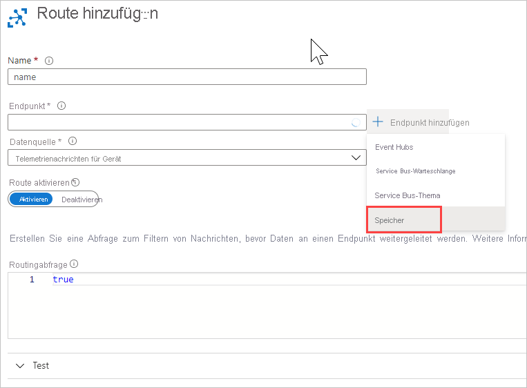
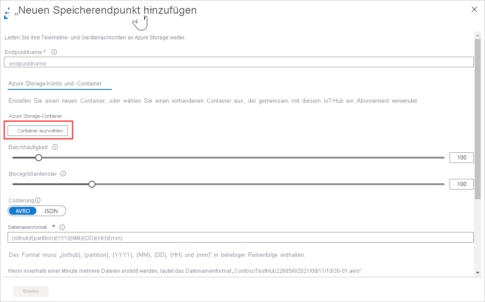
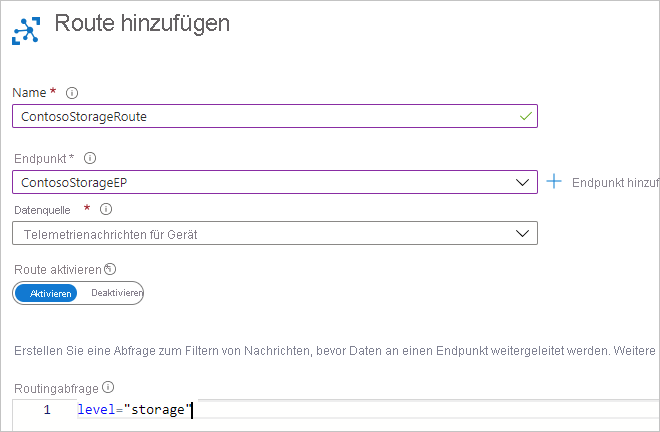
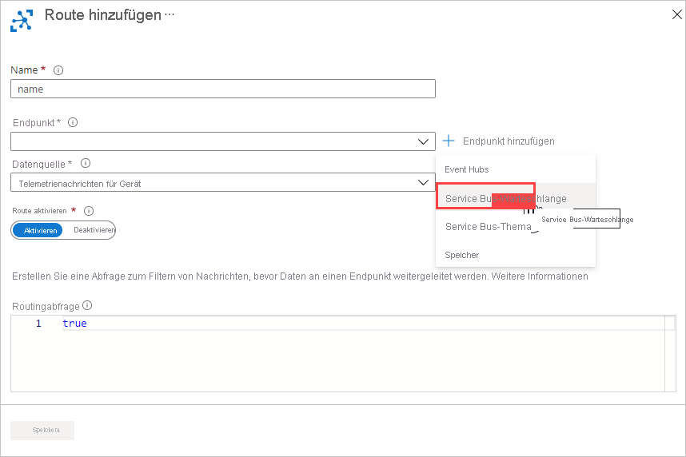
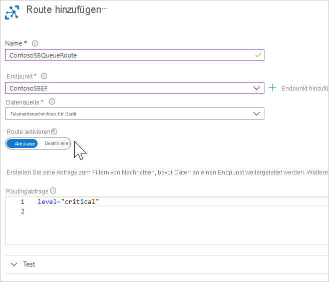

# <a name="tutorial-use-the-azure-cli-and-azure-portal-to-configure-iot-hub-message-routing"></a>Tutorial: Verwenden der Azure CLI und des Azure-Portals zum Konfigurieren des IoT Hub-Nachrichtenroutings

[!INCLUDE [iot-hub-include-routing-intro](../../includes/iot-hub-include-routing-intro.md)]

[!INCLUDE [iot-hub-include-routing-create-resources](../../includes/iot-hub-include-routing-create-resources.md)]

## <a name="use-the-azure-cli-to-create-the-base-resources"></a>Verwenden der Azure CLI zum Erstellen der grundlegenden Ressourcen

In diesem Tutorial wird die Azure CLI zum Erstellen der grundlegenden Ressourcen und anschließend das [Azure-Portal](https://portal.azure.com) verwendet, um zu veranschaulichen, wie Sie das Nachrichtenrouting konfigurieren und das virtuelle Gerät für das Testen einrichten.

Kopieren Sie das folgende Skript, fügen Sie es in Cloud Shell ein, und drücken Sie die EINGABETASTE. Daraufhin wird das Skript Zeile für Zeile ausgeführt. Hiermit werden die grundlegenden Ressourcen für dieses Tutorial erstellt, z. B. Speicherkonto, IoT Hub, Service Bus-Namespace und Service Bus-Warteschlange.

Einige Ressourcennamen müssen global eindeutig sein. Hierzu zählen beispielsweise der IoT Hub-Name und der Name des Speicherkontos. Zur Vereinfachung wird an diese Ressourcennamen ein alphanumerischer Zufallswert namens *randomValue* angefügt. Der Zufallswert wird einmalig zu Beginn des Skripts generiert und innerhalb des gesamten Skripts nach Bedarf an die Ressourcennamen angefügt. Falls Sie keinen Zufallswert verwenden möchten, können Sie den Wert auf eine leere Zeichenfolge oder auf einen bestimmten Wert festlegen.

> [!TIP]
> Ein Tipp zum Debuggen: Dieses Skript verwendet das Fortsetzungssymbol (umgekehrter Schrägstrich: `\`), um die Lesbarkeit des Skripts zu verbessern. Falls beim Ausführen des Skripts ein Problem auftritt, sollten Sie sich vergewissern, dass in Ihrer Cloud Shell-Sitzung `bash` ausgeführt wird und dass nach keinem der umgekehrten Schrägstriche ein Leerzeichen steht.
>

```azurecli-interactive
# This retrieves the subscription id of the account 
#   in which you're logged in.
# This field is used to set up the routing queries.
subscriptionID=$(az account show --query id)

# Concatenate this number onto the resources that have to be globally unique.
# You can set this to "" or to a specific value if you don't want it to be random.
# This retrieves a random value.
randomValue=$RANDOM

# Set the values for the resource names that 
#   don't have to be globally unique.
location=westus
resourceGroup=ContosoResources
iotHubConsumerGroup=ContosoConsumers
containerName=contosoresults

# Create the resource group to be used
#   for all the resources for this tutorial.
az group create --name $resourceGroup \
    --location $location

# The IoT hub name must be globally unique, 
#   so add a random value to the end.
iotHubName=ContosoTestHub$randomValue 
echo "IoT hub name = " $iotHubName

# Create the IoT hub.
az iot hub create --name $iotHubName \
    --resource-group $resourceGroup \
    --sku S1 --location $location

# Add a consumer group to the IoT hub for the 'events' endpoint.
az iot hub consumer-group create --hub-name $iotHubName \
    --name $iotHubConsumerGroup

# The storage account name must be globally unique, 
#   so add a random value to the end.
storageAccountName=contosostorage$randomValue
echo "Storage account name = " $storageAccountName

# Create the storage account to be used as a routing destination.
az storage account create --name $storageAccountName \
    --resource-group $resourceGroup \
    --location $location \
    --sku Standard_LRS

# Get the primary storage account key. 
#    You need this to create the container.
storageAccountKey=$(az storage account keys list \
    --resource-group $resourceGroup \
    --account-name $storageAccountName \
    --query "[0].value" | tr -d '"') 

# See the value of the storage account key.
echo "storage account key = " $storageAccountKey

# Create the container in the storage account. 
az storage container create --name $containerName \
    --account-name $storageAccountName \
    --account-key $storageAccountKey \
    --public-access off

# The Service Bus namespace must be globally unique, 
#   so add a random value to the end.
sbNamespace=ContosoSBNamespace$randomValue
echo "Service Bus namespace = " $sbNamespace

# Create the Service Bus namespace.
az servicebus namespace create --resource-group $resourceGroup \
    --name $sbNamespace \
    --location $location

# The Service Bus queue name must be globally unique, 
#   so add a random value to the end.
sbQueueName=ContosoSBQueue$randomValue
echo "Service Bus queue name = " $sbQueueName

# Create the Service Bus queue to be used as a routing destination.
az servicebus queue create --name $sbQueueName \
    --namespace-name $sbNamespace \
    --resource-group $resourceGroup

```

Nachdem die grundlegenden Ressourcen eingerichtet wurden, können Sie das Nachrichtenrouting im [Azure-Portal](https://portal.azure.com) konfigurieren.

## <a name="set-up-message-routing"></a>Einrichten der Nachrichtenweiterleitung

[!INCLUDE [iot-hub-include-create-routing-description](../../includes/iot-hub-include-create-routing-description.md)]

### <a name="route-to-a-storage-account"></a>Weiterleiten an ein Speicherkonto

Richten Sie jetzt die Weiterleitung für das Speicherkonto ein. Wechseln Sie zum Bereich „Nachrichtenrouting“, und fügen Sie eine Route hinzu. Definieren Sie beim Hinzufügen der Route einen neuen Endpunkt für die Route. Nach der Einrichtung des Routings werden Nachrichten, deren **level**-Eigenschaft auf **storage** festgelegt wurde, automatisch in ein Speicherkonto geschrieben. 

[!INCLUDE [iot-hub-include-blob-storage-format](../../includes/iot-hub-include-blob-storage-format.md)]

Nun richten Sie die Konfiguration für das Nachrichtenrouting an Azure Storage ein.

1. Wählen Sie im [Azure-Portal](https://portal.azure.com) die Option **Ressourcengruppen** und dann Ihre Ressourcengruppe aus. In diesem Tutorial wird **ContosoResources** verwendet.

2. Wählen Sie in der Liste mit den Ressourcen Ihren IoT-Hub aus. In diesem Tutorial wird **ContosoTestHub** verwendet.

3. Wählen Sie in der mittleren Spalte (**_Messaging_*) die Option **Nachrichtenrouting** aus. Wählen Sie** + Hinzufügen** aus, um den Bereich **Route hinzufügen** anzuzeigen. Wählen Sie neben dem Feld „Endpunkt“ die Option **+ Endpunkt hinzufügen** und dann **Speicher** aus. Der Bereich **Speicherendpunkt hinzufügen** wird angezeigt.

   

4. Geben Sie einen Namen für den Endpunkt ein. In diesem Tutorial wird **ContosoStorageEndpoint** verwendet.

   

5. Wählen Sie **Container auswählen**. Dadurch gelangen Sie zu einer Liste Ihrer Speicherkonten. Wählen Sie das in den Vorbereitungsschritten eingerichtete Speicherkonto aus. In diesem Tutorial wird **contosostorage** verwendet. Es zeigt eine Liste der Container in diesem Speicherkonto. **Wählen** Sie den Container aus, den Sie in den Vorbereitungsschritten eingerichtet haben. In diesem Tutorial wird **contosoresults** verwendet. Klicken Sie dann am unteren Bildschirmrand auf **Auswählen**. Ein anderer Bereich **Speicherendpunkt hinzufügen** wird angezeigt. Die URL für den ausgewählten Container wird angezeigt. 

6. Legen Sie die Codierung auf AVRO oder JSON fest. Verwenden Sie in diesem Tutorial die Standardwerte für die restlichen Felder. Dieses Feld ist ausgegraut, wenn die JSON-Codierung für die ausgewählte Region nicht unterstützt wird. Legen Sie das Format für den Dateinamen fest. 

   > [!NOTE]
   > Legen Sie das Format des Blobnamens fest, indem Sie das **Format für Blobdateinamen** verwenden. Der Standardwert lautet `{iothub}/{partition}/{YYYY}/{MM}/{DD}/{HH}/{mm}`. Das Format muss {iothub}, {partition}, {YYYY}, {MM}, {DD}, {HH} und {mm} in einer beliebigen Reihenfolge enthalten.
   >
   > Bei Verwendung des Standardformats für Blobdateinamen sieht der Blobname beispielsweise wie folgt aus, wenn der Hubname „ContosoTestHub“ lautet und als Datum bzw. Uhrzeit „30. Oktober 2018 um 10:56 Uhr“ verwendet wird: `ContosoTestHub/0/2018/10/30/10/56`.
   > 
   > Die Blobs werden standardmäßig im AVRO-Format geschrieben.
   >

7. Wählen Sie unten auf der Seite **Erstellen** aus, um den Speicherendpunkt zu erstellen und der Route hinzuzufügen. Sie gelangen zurück zum Bereich **Route hinzufügen**. 

8. Geben Sie die restlichen Routingabfrageinformationen an. Diese Abfrage gibt die Kriterien für das Senden von Nachrichten an den Speichercontainer, den Sie gerade als Endpunkt hinzugefügt haben, an. Füllen Sie die Felder auf dem Bildschirm aus.

9. Füllen Sie die übrigen Felder aus:

   - **Name**: Geben Sie einen Namen für Ihre Route ein. In diesem Tutorial wird **ContosoStorageRoute** verwendet. Geben Sie als Nächstes den Endpunkt für den Speicher an. In diesem Tutorial wird ContosoStorageEndpoint verwendet.
   
   - Geben Sie einen Wert für **Datenquelle** an: Wählen Sie in der Dropdownliste **Gerätetelemetriemeldungen** aus.   

   - Aktivieren Sie **Route aktivieren**: Achten Sie darauf, dass dieses Feld auf `enabled` festgelegt ist.

   - **Routingabfrage**: Geben Sie `level="storage"` als Abfragezeichenfolge ein.

   
  
10.  Wählen Sie **Speichern** aus. Wenn der Speichervorgang abgeschlossen ist, werden Sie wieder zum Bereich „Nachrichtenrouting“ geleitet, in dem Sie Ihre neue Routingabfrage für die Speicherung anzeigen können. Schließen Sie den Bereich „Nachrichtenrouting“. Daraufhin werden Sie wieder zur Seite der Ressourcengruppe geleitet.


### <a name="route-to-a-service-bus-queue"></a>Weiterleiten an eine Service Bus-Warteschlange

Richten Sie jetzt die Weiterleitung für die Service Bus-Warteschlange ein. Wechseln Sie zum Bereich „Nachrichtenrouting“, und fügen Sie eine Route hinzu. Definieren Sie beim Hinzufügen der Route eine Service Bus-Warteschlange als Endpunkt für die Route. Nach der Einrichtung dieser Route werden Nachrichten, bei denen die **level**-Eigenschaft auf **critical** festgelegt ist, in die Service Bus-Warteschlange geschrieben. Hierdurch wird eine Logik-App ausgelöst, die dann eine E-Mail mit den Informationen sendet.

1. Wählen Sie auf der Seite der Ressourcengruppe Ihre IoT Hub-Instanz und dann die Option **Nachrichtenrouting** aus.

2. Wählen Sie im Bereich **Nachrichtenrouting** die Option **+ Hinzufügen** aus.

3. Wählen Sie im Bereich **Route hinzufügen** neben **Endpunkt** die Option **+ Hinzufügen** aus. Wählen Sie **Service Bus-Warteschlange** aus. Der Bereich **Service Bus-Endpunkt hinzufügen** wird angezeigt.

   

4. Füllen Sie die übrigen Felder aus:

   **Endpunktname**: Geben Sie einen Namen für den Endpunkt ein. In diesem Tutorial wird **ContosoSBQEndpoint** verwendet.
   
   **Service Bus-Namespace**: Verwenden Sie die Dropdownliste, um den Service Bus-Namespace auszuwählen, den Sie in den Vorbereitungsschritten eingerichtet haben. In diesem Tutorial wird **ContosoSBNamespace** verwendet.

   **Service Bus-Warteschlange**: Verwenden Sie die Dropdownliste, um die Service Bus-Warteschlange auszuwählen. In diesem Tutorial wird **contososbqueue** verwendet.

5. Wählen Sie **Erstellen** aus, um den Endpunkt für die erste Service Bus-Warteschlange hinzuzufügen. Sie wechseln zurück zum Bereich **Route hinzufügen**.

   

6. Geben Sie nun die restlichen Routingabfrageinformationen an. Diese Abfrage gibt die Kriterien für das Senden von Nachrichten an die Service Bus-Warteschlange an, die Sie gerade als Endpunkt hinzugefügt haben. Füllen Sie die Felder auf dem Bildschirm aus. 

   **Name**: Geben Sie einen Namen für Ihre Route ein. In diesem Tutorial wird **ContosoSBQueueRoute** verwendet. 

   **Endpunkt**: Zeigt den Endpunkt an, den Sie gerade eingerichtet haben.

   **Datenquelle**: Wählen Sie in der Dropdownliste **Gerätetelemetriemeldungen** aus.

   **Route aktivieren**: Legen Sie dieses Feld auf `enable` fest.

   **Routingabfrage**: Geben Sie als Routingabfrage `level="critical"` ein. 

   

7. Wählen Sie **Speichern** aus. Wenn Sie zum Bereich „Routen“ zurückkehren, sehen Sie Ihre beiden neuen Routen.

   

8. Sie können die von Ihnen eingerichteten benutzerdefinierten Endpunkte anzeigen, indem Sie die Registerkarte **Benutzerdefinierte Endpunkte** auswählen.

   

9. Schließen Sie den Bereich „Nachrichtenrouting“. Daraufhin werden Sie wieder zum Bereich der Ressourcengruppe geleitet.

## <a name="create-a-simulated-device"></a>Erstellen Sie ein simuliertes Gerät.

[!INCLUDE [iot-hub-include-create-simulated-device-portal](../../includes/iot-hub-include-create-simulated-device-portal.md)]

## <a name="next-steps"></a>Nächste Schritte

Nachdem Sie die Ressourcen eingerichtet und die Nachrichtenrouten konfiguriert haben, können Sie sich nun im nächsten Tutorial darüber informieren, wie Sie Nachrichten an IoT Hub senden, die dann an die verschiedenen Ziele weitergeleitet werden. 

> [!div class="nextstepaction"]
> [Teil 2: Anzeigen der Ergebnisse des Nachrichtenroutings](tutorial-routing-view-message-routing-results.md)
