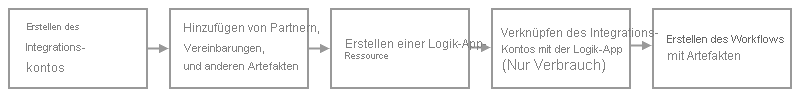

# Workflows für die B2B-Unternehmensintegration mit Azure Logic Apps und Enterprise Integration Pack

Für Business-to-Business-Lösungen (B2B) und eine nahtlose Kommunikation zwischen Organisationen können Sie mithilfe von [Azure Logic Apps](logic-apps-overview.md) mit Enterprise Integration Pack (EIP) automatisierte skalierbare Unternehmensintegrationsworkflows erstellen.

## Was ist das Enterprise Integration Pack?

Wenn Sie mit Microsoft BizTalk Server oder Azure BizTalk Services vertraut sind, sind die B2B-Funktionen leicht zu verwenden, da das EIP ähnliche Konzepte befolgt. Ein wesentlicher Unterschied besteht jedoch darin, dass das EIP hinsichtlich der Architektur auf *Integrationskonten* basiert. Bei diesen Konten handelt es sich um cloudbasierte Container in Azure, sodass Sie B2B-Artefakte für die B2B-Kommunikation, einschließlich [Handelspartner](logic-apps-enterprise-integration-partners.md), [Vereinbarungen](logic-apps-enterprise-integration-agreements.md), [Zuordnungen](logic-apps-enterprise-integration-maps.md), [Schemata](logic-apps-enterprise-integration-schemas.md), [Zertifikate](logic-apps-enterprise-integration-certificates.md) usw., einfacher speichern, verwalten und verwenden können.

Mithilfe dieser Artefakte können Sie B2B-Workflows und Integrationslösungen erstellen, die Clouddienste wie Azure, Microsoft und andere SaaS-Apps (Software-as-Service), lokale Systeme und benutzerdefinierte Apps einbeziehen, indem Sie Azure Logic Apps mit [über 400 integrierten Vorgängen und verwalteten Connectors](/connectors/connector-reference/connector-reference-logicapps-connectors) verwenden. Beispielsweise können Sie mithilfe integrierter Codeausführungsvorgänge und Azure Functions benutzerdefinierten Code aus Ihren Workflows erstellen und ausführen. Sie können auch [Unternehmensintegrationsconnectors](../connectors/managed.md#enterprise-connectors) verwenden, die die folgenden Branchenstandards unterstützen:

* Electronic Data Interchange (EDI)
* Enterprise Application Integration (EAI)

Obwohl Organisationen unterschiedliche Protokolle und Formate für die B2B-Kommunikation verwenden, können Sie dennoch elektronisch Nachrichten mit anderen Organisationen austauschen. Sie können diese verschiedenen Formate in ein Format umwandeln, das die Systeme Ihrer Organisation verarbeiten können, indem Sie das EIP verwenden, das branchenübliche Protokolle wie [AS2](logic-apps-enterprise-integration-as2.md), [X12](logic-apps-enterprise-integration-x12.md), [EDIFACT](logic-apps-enterprise-integration-edifact.md) und [RosettaNet](logic-apps-enterprise-integration-rosettanet.md) unterstützt. Sie können die Nachrichtensicherheit auch mithilfe von Verschlüsselung und digitalen Signaturen erhöhen.

## Was benötige ich für den Einstieg?

* Ein Azure-Konto und ein Azure-Abonnement. Wenn Sie nicht über ein Azure-Abonnement verfügen, können Sie sich [für ein kostenloses Azure-Konto registrieren](https://azure.microsoft.com/free/?WT.mc_id=A261C142F).

* Ein [Integrationskonto](logic-apps-enterprise-integration-create-integration-account.md) zum Speichern der B2B-Artefakte, die Sie definieren und verwenden möchten.

* Ihre B2B-Artefakte wie [Handelspartner](logic-apps-enterprise-integration-partners.md), [Vereinbarungen](logic-apps-enterprise-integration-agreements.md), [Zuordnungen](logic-apps-enterprise-integration-maps.md), [Schemas](logic-apps-enterprise-integration-schemas.md), [Zertifikate](logic-apps-enterprise-integration-certificates.md) usw.

* Zum Erstellen von Zuordnungen und Schemas können Sie die [Erweiterung „Microsoft Azure Logic Apps Enterprise Integration Tools“](https://aka.ms/vsenterpriseintegrationtools) und Visual Studio 2019 verwenden. Bei Verwendung von Visual Studio 2015 können Sie die Erweiterung [Microsoft Azure Logic Apps Enterprise Integration Tools für Visual Studio 2015 2.0](https://aka.ms/vsmapsandschemas) verwenden.

   > [!IMPORTANT]
   > Installieren Sie diese Erweiterung nicht zusammen mit der BizTalk Server-Erweiterung. Sind beide Erweiterungen installiert, kann dies zu unerwartetem Verhalten führen. Stellen Sie sicher, dass nur eine dieser Erweiterungen installiert ist.

   > [!NOTE]
   > Auf Monitoren mit hoher Auflösung kann ein [Anzeigeproblem des Zuordnungs-Designers](/visualstudio/designers/disable-dpi-awareness) in Visual Studio auftreten. Um dieses Anzeigeproblem zu beheben, [starten Sie Visual Studio im nicht DPI-fähigen Modus neu](/visualstudio/designers/disable-dpi-awareness#restart-visual-studio-as-a-dpi-unaware-process), oder fügen Sie den [DPIUNAWARE-Registrierungswert](/visualstudio/designers/disable-dpi-awareness#add-a-registry-entry) hinzu.

Nachdem Sie ein Integrationskonto erstellt und Ihre Artefakte hinzugefügt haben, können Sie mit der Erstellung von B2B-Workflows beginnen, indem Sie eine Logik-App-Ressource erstellen. Wenn Sie noch keine Erfahrung mit Logik-Apps haben, sollten Sie zunächst einen [einfachen Workflow für eine Logik-App erstellen](quickstart-create-first-logic-app-workflow.md). Sie können Logik-Apps auch mithilfe von [Visual Studio Code](quickstart-create-logic-apps-visual-studio-code.md), [Visual Studio](quickstart-create-logic-apps-with-visual-studio.md) oder [PowerShell](/powershell/module/az.logicapp) erstellen, verwalten und bereitstellen.

> [!IMPORTANT]
> Wenn Sie den Ressourcentyp **Logik-App (Verbrauch)** verwenden, müssen Sie Ihr Integrationskonto mit Ihrer Logic-App-Ressource verknüpfen, bevor Sie B2B-Artefakte für die Verwendung in Ihrem Workflow auswählen können. Zum Definieren und Hinzufügen dieser Artefakte zu Ihrem Integrationskonto benötigen Sie jedoch noch keine Logik-App-Ressource.
>
> Wenn Sie den Ressourcentyp **Logik-App (Standard)** verwenden, können Sie Schemata und Zuordnungen direkt zu Ihrer Logik-App-Ressource hinzufügen und diese Artefakte in mehreren Workflows innerhalb *derselben Logik-App-Ressource* verwenden. 
> Sie benötigen weiterhin ein Integrationskonto, um andere Artefakte wie Partner und Vereinbarungen zu speichern, aber eine Verknüpfung ist nicht mehr notwendig, sodass diese Möglichkeit nicht besteht. Weitere Informationen zu diesen Ressourcentypen finden Sie unter [Was ist Azure Logic Apps: Ressourcentyp und Hostumgebungen](logic-apps-overview.md#resource-type-and-host-environment-differences).

Das folgende Diagramm zeigt die wichtigsten Schritte für das Erstellen von Workflows für B2B-Logik-Apps:

## Jetzt testen

[Bereitstellen einer voll funktionsfähigen Beispiel-Logik-App, die AS2-Nachrichten sendet und empfängt](https://github.com/Azure/azure-quickstart-templates/tree/master/quickstarts/microsoft.logic/logic-app-as2-send-receive)

## Nächste Schritte

* [Erstellen von Handelspartnern](logic-apps-enterprise-integration-partners.md)
* [Erstellen von Vereinbarungen](logic-apps-enterprise-integration-agreements.md)
* [Hinzufügen von Schemas](logic-apps-enterprise-integration-schemas.md)
* [Hinzufügen von Zuordnungen](logic-apps-enterprise-integration-maps.md)
* [Migrieren von BizTalk Services](logic-apps-move-from-mabs.md)
