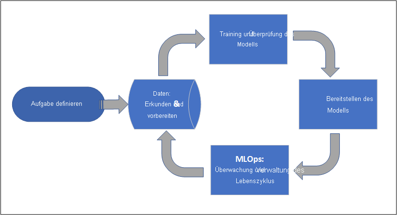
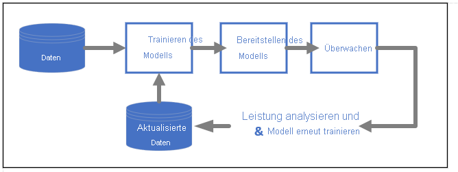

# Was ist Azure Machine Learning?

Azure Machine Learning ist ein Clouddienst zum Beschleunigen und Verwalten des Lebenszyklus von Machine Learning-Projekten: Machine Learning-Experten, wissenschaftliche Fachkräfte für Daten und Techniker können sie in ihren täglichen Workflows verwenden: Trainieren und Bereitstellen von Modellen und Verwalten von MLOps.

Sie können ein Modell in Azure Machine Learning erstellen oder ein Modell verwenden, das auf einer Open-Source-Plattform wie Pytorch, TensorFlow oder scikit-learn erstellt wurde. MLOps-Tools helfen Ihnen beim Überwachen, erneuten Trainieren und erneuten Bereitstellen von Modellen. 

> [!Tip]
> **Kostenlose Testversion!**  Wenn Sie kein Azure-Abonnement besitzen, können Sie ein kostenloses Konto erstellen, bevor Sie beginnen. [Probieren Sie die kostenlose oder kostenpflichtige Version von Azure Machine Learning aus](https://azure.microsoft.com/free/machine-learning/search/). Sie erhalten dann eine Gutschrift, die Sie für Azure-Dienste einlösen können. Wenn das Guthaben aufgebraucht ist, können Sie das Konto behalten und weiterhin [kostenlose Azure-Dienste](https://azure.microsoft.com/free/) nutzen. Ihre Kreditkarte wird nur dann belastet, wenn Sie Ihre Einstellungen explizit ändern und mit der Berechnung von Gebühren einverstanden sind.

## Für wen ist Azure Machine Learning geeignet?

Azure Machine Learning ist für Einzelpersonen und Teams konzipiert, die MLOps innerhalb ihrer Organisation implementieren, um Machine Learning-Modelle in einer sicheren und überprüfbaren Produktionsumgebung in die Produktion einzuführen.

Wissenschaftliche Fachkräfte für Daten und ML-Techniker finden hier Tools, um ihre täglichen Workflows zu beschleunigen und zu automatisieren. Anwendungsentwickler finden hier Tools für die Integration von Modellen in Anwendungen oder Dienste. Plattformentwickler finden hier einen stabilen Satz von Tools, die auf permanenten Azure Resource Manager-APIs zum Erstellen erweiterter ML-Tools unterstützt werden.

Unternehmen, die in der Microsoft Azure Cloud arbeiten, finden hier eine vertraute Sicherheit und rollenbasierte Zugriffssteuerung (RBAC) für die Infrastruktur. Sie können ein Projekt einrichten, um den Zugriff auf geschützte Daten zu verweigern und Vorgänge auszuwählen.

### Zusammenarbeit für Machine Learning-Teams

Machine Learning-Projekte erfordern häufig ein Team mit unterschiedlichen Skillsets für die Erstellung und Verwaltung. Azure Machine Learning verfügt über Tools, die die Zusammenarbeit erleichtern. Beispiel:

- Freigegebene Notebooks, Computeressourcen, Daten und Umgebungen
- Nachverfolgung und Überwachbarkeit, die zeigen, wann und von wem Änderungen vorgenommen wurden
- Versionsverwaltung für Ressourcen

### Tools für Entwickler

Entwickler finden vertraute Schnittstellen in Azure Machine Learning. Beispiel:

- [Python SDK](/python/api/overview/azure/ml/)
- [Azure Resource Manager-REST-APIs (Vorschau)](/rest/api/azureml/)
- [CLI v2 (Vorschau)](/cli/azure/ml)

### Studio-Benutzeroberfläche 

Das [Azure Machine Learning Studio](https://ml.azure.com) ist eine grafische Benutzeroberfläche für einen Projektarbeitsbereich. In Studio haben Sie die folgenden Möglichkeiten:

- Anzeigen von Ausführungen, Metriken, Protokollen, Ausgaben usw.
- Erstellen und Bearbeiten von Notebooks und Dateien.
- Verwalten von allgemeinen Ressourcen, z. B.
    - Datenanmeldeinformationen
    - Compute
    - Umgebungen
- Visualisieren Sie Ausführungsmetriken, Ergebnisse und Berichte.
- Visualisieren Sie Pipelines, die über Entwicklerschnittstellen erstellt wurden.
- Erstellen Sie Aufträge für automatisiertes maschinelles Lernen.

Außerdem verfügt der Designer über eine Drag & Drop-Schnittstelle, über die Sie Modelle trainieren und bereitstellen können. 

Wenn Sie ML Studio (klassisch) verwenden, [erfahren Sie mehr über die eingestellte Unterstützung von Studio (klassisch) und den Unterschied zwischen diesem und Azure Machine Learning Studio](overview-what-is-machine-learning-studio.md#ml-studio-classic-vs-azure-machine-learning-studio).

## Unternehmensbereitschaft und -sicherheit

Azure Machine Learning kann in die Azure-Cloudplattform integriert werden, um ML-Projekte sicherer zu gestalten. 

Sicherheitsintegrationen umfassen Folgendes:

- Azure Virtual Network-Instanzen (VNets) mit Netzwerksicherheitsgruppen 
- Azure Key Vault zum Speichern von Sicherheitsgeheimnissen, z. B. Zugriffsinformationen für Speicherkonten
- Azure Container Registry-Einrichtung hinter einem VNet

Weitere Informationen finden Sie unter [Tutorial: Einrichten eines sicheren Arbeitsbereichs](tutorial-create-secure-workspace.md).

## Azure-Integrationen für vollständige Lösungen

Andere Integrationen in Azure-Dienste unterstützen ein End-to-End-Machine Learning-Projekt. Dazu gehören:

- Azure Synapse Analytics zum Verarbeiten und Streamen von Daten mit Spark
- Azure Arc, in dem Sie Azure-Dienste in einer Kubernetes-Umgebung ausführen können
- Speicher- und Datenbankoptionen wie Azure SQL-Datenbank, Azure Storage Blob-Instanzen usw.
- Azure App Service ermöglicht Ihnen das Bereitstellen und Verwalten von ML-gestützten Apps.

## Projektworkflow für maschinelles Lernen

Modelle werden in der Regel als Teil eines Projekts mit einer Zielsetzung und Zielen entwickelt. Projekte umfassen häufig mehr als eine Person. Beim Experimentieren mit Daten, Algorithmen und Modellen erfolgt die Entwicklung iterativ. 

### Projektlebenszyklus

Obwohl der Projektlebenszyklus je nach Projekt variieren kann, sieht er häufig wie folgt aus:

Ein Arbeitsbereich organisiert ein Projekt und ermöglicht die Zusammenarbeit für viele Benutzer, die alle an einem gemeinsamen Ziel arbeiten. Benutzer in einem Arbeitsbereich können problemlos die Ergebnisse ihrer Ausführungen aus Experimenten auf der Studio-Benutzeroberfläche freigeben oder Ressourcen mit Versionsverwaltung für Aufträge wie Umgebungen und Speicherverweise verwenden.

Weitere Informationen finden Sie unter [Verwalten von Azure Machine Learning-Arbeitsbereichen](how-to-manage-workspace.md?tabs=python).

Wenn ein Projekt für die Operationalisierung bereit ist, kann die Arbeit der Benutzer in einer Machine Learning-Pipeline automatisiert und nach einem Zeitplan oder einer HTTPS-Anforderung ausgelöst werden.

Modelle können sowohl für Echtzeit- als auch für Batchbereitstellungen in der verwalteten Rückschlusslösung bereitgestellt werden, wodurch die Infrastrukturverwaltung, die normalerweise für die Bereitstellung von Modellen erforderlich ist, entfällt.

## Trainieren von Modellen

In Azure Machine Learning können Sie Ihr Trainingsskript in der Cloud ausführen oder ein Modell von Grund auf neu erstellen. Kunden nutzen häufig Modelle, die sie in Open-Source-Frameworks erstellt und trainiert haben, damit sie sie in der Cloud operationalisieren können. 

### Offen und interoperabel

Wissenschaftliche Fachkräfte für Daten können Modelle in Azure Machine Learning verwenden, die sie in allgemeinen Python-Frameworks erstellt haben. Beispiel: 

- PyTorch
- TensorFlow
- scikit-learn
- XGBoost
- LightGBM

Andere Sprachen und Frameworks werden auch unterstützt, einschließlich: 
- R
- .NET

Weitere Informationen finden Sie unter [Open-Source-Integration in Azure Machine Learning](concept-open-source.md).

### Automatisierte Featurisierung und Algorithmusauswahl (AutoML)

In einem sich wiederholenden, zeitaufwändigen Prozess nutzen wissenschaftliche Fachkräfte für Daten beim klassischen maschinellen Lernen vorherige Erfahrungen und Intuition, um die richtige Datenfeaturisierung und den richtigen Algorithmus für das Training auszuwählen. Automatisiertes ML (AutoML) beschleunigt diesen Prozess und kann über die Studio-Benutzeroberfläche oder das Python SDK verwendet werden.

Weitere Informationen finden Sie unter [Was ist automatisiertes maschinelles Lernen?](concept-automated-ml.md).

### Hyperparameteroptimierung

Die Hyperparameteroptimierung kann eine mühsame Aufgabe darstellen. Azure Machine Learning kann diese Aufgabe für beliebige parametrisierte Befehle mit geringen Änderungen an Ihrer Auftragsdefinition automatisieren. Ergebnisse werden in Studio visualisiert.

Weitere Informationen finden Sie unter [Optimieren von Hyperparametern für Ihr Modell mit Azure Machine Learning](how-to-tune-hyperparameters.md).

### Verteiltes Training mit mehreren Knoten

Die Effizienz des Trainings für Deep Learning und manchmal klassische Machine Learning-Trainingsaufträge kann durch verteiltes Training mit mehreren Knoten drastisch verbessert werden. Azure Machine Learning-Computecluster bieten die neuesten GPU-Optionen.

Unterstützt über Kubernetes mit Azure Arc-Unterstützung (Vorschau) und Azure ML-Computecluster:

- PyTorch
- TensorFlow
- MPI

Die MPI-Verteilung kann für Horovod oder die benutzerdefinierte Logik für mehrere Knoten verwendet werden. Außerdem wird Apache Spark über Azure Synapse Analytics Spark-Cluster (Vorschau) unterstützt.

Weitere Informationen finden Sie unter [Verteiltes Training mit Azure Machine Learning](concept-distributed-training.md).

### Hochgradig paralleles Training

Das Skalieren eines Machine Learning-Projekts erfordert möglicherweise eine Skalierung des hochgradig parallelen Modelltrainings. Dieses Muster wird häufig für Szenarien wie die Nachfrageprognose verwendet, in denen ein Modell für viele Geschäfte trainiert werden kann.

## Bereitstellen von Modellen

Zur Einführung eines Modells in die Produktion wird es bereitgestellt. Die verwalteten Endpunkte von Azure Machine Learning abstrahieren die erforderliche Infrastruktur für die Echtzeit- (Online) oder Batchmodellbewertung (Rückschließen).

### Echtzeit- und Batchbewertung (Rückschließen)

Die *Batchbewertung* oder das *Batchrückschließen* umfasst das Aufrufen eines Endpunkts mit einem Verweis auf Daten. Der Batchendpunkt führt Aufträge asynchron aus, um Daten parallel auf Computeclustern zu verarbeiten und die Daten zur weiteren Analyse zu speichern.

Bei der *Echtzeitbewertung* oder beim *Onlinerückschließen* wird ein Endpunkt mit einer oder mehreren Modellbereitstellungen aufgerufen und eine Antwort nahezu in Echtzeit über HTTP empfangen. Der Datenverkehr kann auf mehrere Bereitstellungen aufgeteilt werden, sodass neue Modellversionen getestet werden können, indem anfänglich ein gewisses Datenverkehrsaufkommen umgeleitet und die Konfidenz in das neue Modell erhöht wird.    

Thema
 - [Bereitstellen eines Modells mit einem verwalteten Echtzeitendpunkt](how-to-deploy-managed-online-endpoints.md)
 - [Verwenden von Batchendpunkten für die Bewertung](how-to-use-batch-endpoint.md) 

## MLOps: DevOps für maschinelles Lernen 

DevOps für Machine Learning-Modelle, die häufig als MLOps bezeichnet werden, ist ein Prozess zum Entwickeln von Modellen für die Produktion. Der Lebenszyklus eines Modells vom Training bis zur Bereitstellung muss überwachbar, wenn nicht gar reproduzierbar sein.

### Lebenszyklus von ML-Modellen 

Erfahren Sie mehr über [MLOps in Azure Machine Learning](concept-model-management-and-deployment.md).

### Integrationen zum Aktivieren von MLOPs

Azure Machine Learning wurde mit Fokus auf den Lebenszyklus des Modells erstellt. Sie können den Modelllebenszyklus bis zu einem bestimmten Commit und einer bestimmten Umgebung überwachen. 

Einige wichtige Features, die MLOps ermöglichen, sind:

- `git`-Integration
- MLflow-Integration
- Zeitplanung für Machine Learning-Pipelines
- Azure Event Grid-Integration für benutzerdefinierte Trigger
- Einfache Verwendung mit CI/CD-Tools wie GitHub Actions oder Azure DevOps

Darüber hinaus umfasst Azure Machine Learning entsprechende Features für Überwachung und Überprüfung:
- Auftragsartefakte wie Codemomentaufnahmen, Protokolle und andere Ausgaben
- Datenherkunft zwischen Aufträgen und Ressourcen, z. B. Container, Daten und Computeressourcen

## Nächste Schritte

Starten der Verwendung von Azure Machine Learning:
- [Einrichten eines Azure Machine Learning-Arbeitsbereichs](quickstart-create-resources.md)
- [Tutorial: Erstellen eines ersten Machine Learning-Projekts](tutorial-1st-experiment-hello-world.md)
- [Vorschau: Ausführen von Modelltrainingsaufträgen mit der CLI (v2)](how-to-train-cli.md)
