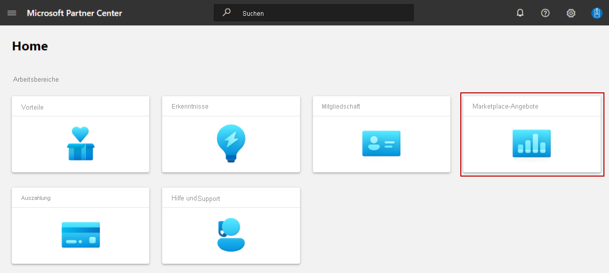

# Registrierung für Azure Consumption Commitment

Dieser Artikel richtet sich an Herausgeber im kommerziellen Marketplace und beschreibt die Microsoft Azure Consumption Commitment (MACC), eine vertragliche Verpflichtung, die Kunden gegenüber Microsoft für bestimmte Azure-Ausgaben über einen bestimmten Zeitraum eingehen. Informationen darüber, wie Kunden von MACC profitieren, finden Sie unter [Vorteile von Azure Consumption Commitment](/marketplace/azure-consumption-commitment-benefit).

> [!TIP]
> Die Ansicht der Consumption Commitment-Vorteile für den Kunden im Azure Marketplace finden Sie unter [Vorteil eines Prepaidtarifs für den Azure-Verbrauch](/marketplace/azure-consumption-commitment-benefit).

## MACC-Programm

Das Programm _Microsoft Azure Consumption Commitment (MACC)_ gilt für [transaktionsfähige Angebote](marketplace-commercial-transaction-capabilities-and-considerations.md#transact-overview), die in Azure Marketplace veröffentlicht werden. Azure Marketplace-Käufe transaktionsfähiger Angebote, die in diesem Programm registriert sind, werden auf das Microsoft Azure Consumption Commitment einer Organisation angerechnet.

### Voraussetzungen für die Registrierung eines Angebots bei MACC

Ein Angebot muss die folgenden Anforderungen erfüllen, um im MACC-Programm registriert zu werden:

- Transaktionsfähig mit einem Tarif größer als 0 USD  
    > [!NOTE]
    > Kostenlose und BYOL-Angebote (Bring Your Own License) gelten NICHT als transaktionsfähig.
- Azure IP Co-Sell Incentive
- Liveveröffentlichung in Azure Marketplace

## Wie Sie erfahren, ob Ihr Angebot im MACC-Programm registriert ist

[!INCLUDE [Workspaces view note](./includes/preview-interface.md)]

#### [Ansicht „Arbeitsbereiche“](#tab/workspaces-view)

1. Melden Sie sich bei [Partner Center](https://partner.microsoft.com/dashboard/home) an.
1. Wählen Sie auf der Startseite die Kachel **Marketplace offers** (Marketplace-Angebote) aus.

    

1. Klicken Sie auf der Seite „Marketplace offers“ (Marketplace-Angebote) auf das Angebot, das Sie ansehen möchten.
1. Auf der Seite **Angebotsübersicht** wird im Abschnitt **Marketplace-Programme** der **Status „Microsoft Azure Consumption Commitment“** entweder als _Registriert_ oder _Nicht registriert_ angezeigt.

    

    ***Abbildung 1: Angebot, das im MACC-Programm registriert ist***

> [!NOTE]
> Der MACC-Programmstatus für Angebote, die in Azure Marketplace veröffentlicht werden, wird wöchentlich montags aktualisiert. Das bedeutet, dass, wenn Sie ein Angebot veröffentlichen, das die Voraussetzungen des MACC-Programms erfüllt, der Status im Partner Center bis zum folgenden Montag nicht als „Registriert“ angezeigt wird.

#### [Aktuelle Ansicht](#tab/current-view)

1. Melden Sie sich bei [Partner Center](https://partner.microsoft.com/dashboard/home) an.
1. Wählen Sie im linken Navigationsmenü **Kommerzieller Marketplace** > **Übersicht** aus.
1. Wählen Sie im Abschnitt **Angebote** das gewünschte Angebot aus.
1. Auf der Seite **Angebotsübersicht** wird im Abschnitt **Marketplace-Programme** der **Status „Microsoft Azure Consumption Commitment“** entweder als _Registriert_ oder _Nicht registriert_ angezeigt.

    :::image type="content" source="media/azure-benefit/enrolled.png" alt-text="Screenshot der Seite „Angebotsübersicht“ im Partner Center, die den Microsoft Azure Consumption Commitment-Status zeigt.":::

    ***Abbildung 1: Angebot, das im MACC-Programm registriert ist***

> [!NOTE]
> Der MACC-Programmstatus für Angebote, die in Azure Marketplace veröffentlicht werden, wird wöchentlich montags aktualisiert. Das bedeutet, dass, wenn Sie ein Angebot veröffentlichen, das die Voraussetzungen des MACC-Programms erfüllt, der Status im Partner Center bis zum folgenden Montag nicht als „Registriert“ angezeigt wird.

---

## Nächste Schritte

- Der Artikel [Vorteil eines Prepaidtarifs für den Azure-Verbrauch](/marketplace/azure-consumption-commitment-benefit) enthält weitere Informationen dazu, wie Kunden vom MACC-Programm profitieren und wie sie Lösungen mit MACC-Aktivierung finden.
- Wenn Sie mehr darüber erfahren möchten, wie Ihre Organisation Azure Marketplace nutzen kann, absolvieren Sie das folgende Microsoft Learn-Modul: [Vereinfachen der Beschaffung und Governance der Cloud mit dem Azure Marketplace](/learn/modules/simplify-cloud-procurement-governance-azure-marketplace/).
- [Transaktionsfunktionen im kommerziellen Marketplace](marketplace-commercial-transaction-capabilities-and-considerations.md#transact-publishing-option)
