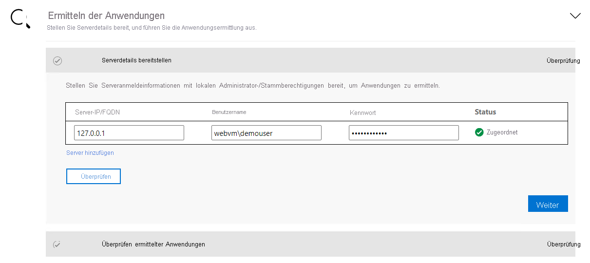

# <a name="aspnet-app-containerization-and-migration-to-azure-app-service"></a>Das Containerisieren und Migrieren von ASP.NET-Apps zum Azure App Service

In diesem Artikel erfahren Sie, wie Sie ASP.NET-Anwendungen mit dem Anwendungscontainerisierungstool von Azure Migrate containerisieren und dann zu [Azure App Service](https://azure.microsoft.com/services/app-service/) migrieren. Für den Containerisierungsprozess ist kein Zugriff auf Ihre Codebasis erforderlich, und vorhandene Anwendungen können leicht containerisiert werden. Das Tool ermittelt anhand des Ausführungsstatus der Anwendungen auf einem Server die Anwendungskomponenten. Anschließend können Sie sie als Containerimage verpacken. Sie können die containerisierte Anwendung dann in Azure App Service bereitstellen.

Vom Anwendungscontainerisierungstool von Azure Migrate wird derzeit Folgendes unterstützt:

- Das Containerisieren von ASP.NET-Apps und das Bereitstellen dieser Apps in Windows-Containern in App Service.
- Das Containerisieren von ASP.NET-Apps und das Bereitstellen dieser Apps in Windows-Containern in Azure Kubernetes Service (AKS). [Lesen Sie die weiteren Informationen zu diesem Containerisierungsszenario](./tutorial-app-containerization-aspnet-kubernetes.md).
- Das Containerisieren von Java-Web-Apps unter Apache Tomcat (auf Linux-Servern) und das Bereitstellen dieser Apps in Linux-Containern in AKS. [Lesen Sie die weiteren Informationen zu diesem Containerisierungsszenario](./tutorial-app-containerization-java-kubernetes.md).
- Containerisieren von Java-Web-Apps unter Apache Tomcat (auf Linux-Servern) und Bereitstellen dieser Apps in Linux-Containern in App Service. [Lesen Sie die weiteren Informationen zu diesem Containerisierungsszenario](./tutorial-app-containerization-java-app-service.md).

Mit dem Anwendungscontainerisierungstool können Sie Folgendes durchführen:

- **Ermitteln Ihrer Anwendungskomponenten** Das Tool stellt eine Remoteverbindung mit den Anwendungsservern her, auf denen Ihre ASP.NET-Anwendung ausgeführt wird, und ermittelt die Anwendungskomponenten. Es wird ein Dockerfile erstellt, das Sie zum Erstellen eines Containerimages für die Anwendung verwenden können.
- **Erstellen des Containerimages** Sie können das Dockerfile untersuchen und basierend auf Ihren Anwendungsanforderungen weiter anpassen. Anschließend können Sie es verwenden, um das Containerimage für Ihre Anwendung zu erstellen. Das Containerimage für die Anwendung wird an eine von Ihnen angegebene Azure-Containerregistrierung gepusht.
- **Bereitstellen in Azure App Service**  Das Tool generiert dann die Bereitstellungsdateien, die zum Bereitstellen der containerisierten Anwendung in Azure App Service erforderlich sind.

> [!NOTE]
> Mit dem Anwendungscontainerisierungstool von Azure Migrate können Sie bestimmte Anwendungstypen (ASP.NET- und Java-Web-Apps unter Apache Tomcat) und die zugehörigen Komponenten auf einem Anwendungsserver ermitteln. Verwenden Sie das [Azure Migrate-Tool zur Ermittlung und Bewertung](./tutorial-discover-vmware.md), um Server sowie den Bestand an Apps, Rollen und Features zu ermitteln, die auf lokalen Computern ausgeführt werden.

Nicht alle Anwendungen profitieren von einer direkten Umstellung auf Container ohne größere Änderungen an der Architektur. Es gibt aber einige Vorteile der Umstellung vorhandener Apps auf Container ohne Umschreibeaufwand, z. B.:

- **Verbesserte Auslastung der Infrastruktur** Bei Verwendung von Containern können Ressourcen von mehreren Anwendungen gemeinsam genutzt und auf derselben Infrastruktur gehostet werden. Dadurch können Sie die Infrastruktur konsolidieren und die Auslastung verbessern.
- **Vereinfachte Verwaltung** Indem Sie Ihre Anwendungen auf modernen verwalteten Plattformen wie AKS und App Service hosten, können Sie Ihre Verwaltungsmethoden vereinfachen. Diese Vereinfachung können Sie erreichen, indem Sie Ihre normalerweise durchgeführten Wartungs- und Verwaltungsvorgänge für Ihre eigene Infrastruktur ganz einstellen oder reduzieren.
- **Anwendungsportabilität** Aufgrund der zunehmenden Nutzung und Standardisierung von Containerspezifikationsformaten und -plattformen stellt die Anwendungsportabilität keine Herausforderung mehr dar.
- **Moderne Verwaltung mit DevOps** Die Nutzung von Containern ermöglicht Ihnen die Einführung und Standardisierung moderner Verwaltungs- und Sicherheitsverfahren sowie die Umstellung auf DevOps.


In diesem Tutorial lernen Sie Folgendes:

> [!div class="checklist"]
> * Einrichten eines Azure-Kontos
> * Installieren des Anwendungscontainerisierungstools von Azure Migrate
> * Erkunden Ihrer ASP.NET-Anwendung
> * Erstellen des Containerimages
> * Das Bereitstellen der containerisierten Anwendung in App Service.

> [!NOTE]
> In den Tutorials wird der einfachste Bereitstellungspfad für ein Szenario beschrieben, damit Sie schnell einen Proof of Concept-Vorgang einrichten können. Nach Möglichkeit werden in den Tutorials Standardoptionen verwendet und nicht alle Einstellungen und Pfade angezeigt.

## <a name="prerequisites"></a>Voraussetzungen

Bevor Sie mit diesem Tutorial beginnen, sollten Sie zunächst:

**Anforderung** | **Details**
--- | ---
**Identifizieren eines Computers für die Installation des Tools** | Sie benötigen einen Windows-Computer, auf dem das Anwendungscontainerisierungstool von Azure Migrate installiert und ausgeführt werden kann. Auf dem Windows-Computer kann ein Server- (Windows Server 2016 oder höher) oder Clientbetriebssystem (Windows 10) ausgeführt werden. (Das Tool kann auf Ihrem Desktop ausgeführt werden.) <br/><br/> Der Windows-Computer, auf dem das Tool ausgeführt wird, sollte über eine Netzwerkverbindung mit den Servern bzw. virtuellen Computern verfügen, auf denen die zu containerisierenden ASP.NET-Anwendungen gehostet werden.<br/><br/> Vergewissern Sie sich, dass auf dem Windows-Computer, auf dem das Anwendungscontainerisierungstool von Azure Migrate ausgeführt wird, 6 GB freier Speicherplatz vorhanden sind. Dieser Platz dient zum Speichern von Anwendungsartefakten. <br/><br/> Der Windows-Computer sollte direkt oder über einen Proxy auf das Internet zugreifen können. <br/> <br/>Falls noch nicht geschehen: Installieren Sie das Microsoft-Webbereitstellungstool auf dem Computer, auf dem das Anwendungscontainerisierungstool und der Anwendungsserver ausgeführt werden. Sie können das [Tool herunterladen](https://aka.ms/webdeploy3.6).
**Anwendungsserver** | Aktivieren Sie das PowerShell-Remoting auf den Anwendungsservern: Melden Sie sich beim Anwendungsserver an, und befolgen Sie [diese Anleitung](/powershell/module/microsoft.powershell.core/enable-psremoting) zur Aktivierung des PowerShell-Remotings. <br/><br/> Wenn auf dem Anwendungsserver Windows Server 2008 R2 ausgeführt wird, stellen Sie sicher, dass PowerShell 5.1 auf dem Anwendungsserver installiert ist. Befolgen Sie [diese Anleitung zum Herunterladen und Installieren von PowerShell 5.1](/powershell/scripting/windows-powershell/wmf/setup/install-configure) auf dem Anwendungsserver. <br/><br/> Falls noch nicht geschehen: Installieren Sie das Microsoft-Webbereitstellungstool auf dem Computer, auf dem das Anwendungscontainerisierungstool und der Anwendungsserver ausgeführt werden. Sie können das [Tool herunterladen](https://aka.ms/webdeploy3.6).
**ASP.NET-Anwendung** | Vom Tool wird derzeit Folgendes unterstützt: <br> <ul><li> ASP.NET-Anwendungen, für die .NET Framework 3.5 oder höher verwendet wird.<br/> <li>Anwendungsserver, auf denen Windows Server 2008 R2 oder höher ausgeführt wird. (Auf Anwendungsservern sollte PowerShell 5.1 ausgeführt werden.) <br/><li> Anwendungen, die unter Internetinformationsdienste 7.5 oder höher ausgeführt werden.</ul> <br/><br/> Folgendes wird vom Tool derzeit nicht unterstützt: <br/> <ul><li>Anwendungen, für die eine Windows-Authentifizierung erforderlich ist. (Von AKS wird gMSA derzeit nicht unterstützt.) <br/> <li> Anwendungen, die von anderen Windows-Diensten abhängig sind, für die das Hosten außerhalb von Internetinformationsdienste erfolgt.


## <a name="prepare-an-azure-user-account"></a>Vorbereiten eines Azure-Benutzerkontos

Wenn Sie kein Azure-Abonnement besitzen, können Sie ein [kostenloses Konto erstellen](https://azure.microsoft.com/pricing/free-trial/), bevor Sie beginnen.

Nachdem Ihr Abonnement eingerichtet wurde, benötigen Sie ein Azure-Benutzerkonto mit den folgenden Berechtigungen:
- Besitzerberechtigungen für das Azure-Abonnement
- Berechtigungen zum Registrieren von Azure Active Directory-Apps

Wenn Sie gerade erst ein kostenloses Azure-Konto erstellt haben, sind Sie der Besitzer Ihres Abonnements. Wenn Sie nicht der Besitzer des Abonnements sind, müssen Sie mit dem Besitzer zusammenarbeiten, um die Berechtigungen wie folgt zuzuweisen:

1. Suchen Sie im Azure-Portal nach „Abonnements“. Wählen Sie unter **Dienste** die Option **Abonnements** aus:

    

2. Wählen Sie auf der Seite **Abonnements** das Abonnement aus, unter dem Sie ein Azure Migrate-Projekt erstellen möchten.
3. Wählen Sie im Abonnement im linken Bereich die Option **Zugriffssteuerung (IAM)** aus.
4. Suchen Sie auf der Registerkarte **Zugriff überprüfen** nach dem relevanten Benutzerkonto.
5. Wählen Sie unter **Rollenzuweisung hinzufügen** die Option **Hinzufügen** aus:

    

6. Wählen Sie auf der Seite **Rollenzuweisung hinzufügen** die Rolle **Besitzer** und anschließend das Konto aus (in diesem Beispiel **azmigrateuser**). Klicken Sie dann auf **Speichern**.

    

   Ihr Azure-Konto benötigt zudem Berechtigungen zum Registrieren von Azure Active Directory-Apps.
8. Navigieren Sie im Azure-Portal zu **Azure Active Directory** > **Benutzer** > **Benutzereinstellungen**.
9. Vergewissern Sie sich unter **Benutzereinstellungen**, dass Azure AD-Benutzer Anwendungen registrieren können. (Standardmäßig ist diese Option auf **Ja** festgelegt.)

      

10. Wenn die Option **App-Registrierungen** auf **Nein** festgelegt ist, können Sie den Mandantenadministrator bzw. globalen Administrator darum bitten, Ihnen die erforderliche Berechtigung zuzuweisen. Alternativ kann der Mandantenadministrator bzw. globale Administrator einem Konto die Rolle „Anwendungsentwickler“ zuweisen, um die Registrierung von Azure Active Directory-Apps zu ermöglichen. Weitere Informationen finden Sie unter [Zuweisen von Rollen zu Benutzern](../active-directory/fundamentals/active-directory-users-assign-role-azure-portal.md).

## <a name="download-and-install-the-azure-migrate-app-containerization-tool"></a>Herunterladen und Installieren des Anwendungscontainerisierungstools von Azure Migrate

1. [Laden Sie das Installationsprogramm für das Anwendungscontainerisierungstool von Azure Migrate auf einen Windows-Computer herunter.](https://go.microsoft.com/fwlink/?linkid=2134571)
2. Öffnen Sie PowerShell im Administratormodus, und ändern Sie das PowerShell-Verzeichnis in den Ordner, der das Installationsprogramm enthält.
3. Führen Sie das Installationsskript mit dem folgenden Befehl aus:

   ```powershell
   .\AppContainerizationInstaller.ps1
   ```

## <a name="open-the-app-containerization-tool"></a>Öffnen des Anwendungscontainerisierungstools

1. Öffnen Sie einen Browser auf einem beliebigen Computer, von dem aus eine Verbindung mit dem Windows-Computer hergestellt werden kann, auf dem das Anwendungscontainerisierungstool ausgeführt wird. Navigieren Sie zur URL des Tools: **https://*Name oder IP-Adresse des Computers*: 44369**.

   Alternativ können Sie die App über Ihren Desktop öffnen, indem Sie die entsprechende Verknüpfung verwenden.

2. Wählen Sie die Option **Advanced** (Erweitert) aus, wenn eine Warnung mit dem Hinweis angezeigt wird, dass Ihre Verbindung nicht privat ist. Fahren Sie anschließend auf der Website fort. Diese Warnung wird angezeigt, weil für die Webschnittstelle ein selbstsigniertes TLS/SSL-Zertifikat genutzt wird.
3. Verwenden Sie auf dem Anmeldebildschirm das lokale Administratorkonto des Computers, um sich anzumelden.
4. Wählen Sie **ASP.NET Web-Apps** als den Anwendungstyp aus, den Sie containerisieren möchten.
5. Wählen Sie in der Liste **Target Azure service** (Azure-Zieldienst) die Option **Containers on Azure App Service** (Container in Azure App Service) aus:

   

### <a name="complete-the-tool-prerequisites"></a>Ausführen der erforderlichen Vorbereitungsschritte für das Tool
1. Akzeptieren Sie die Lizenzbedingungen und lesen Sie die Drittanbieterinformationen.
6. Führen Sie in der Tool-Web-App mit dem Namen **Set up prerequisites** (Erforderliche Komponenten einrichten) die folgenden Schritte aus:
   - **Konnektivität**: Das Tool überprüft, ob der Windows-Computer über Internetzugriff verfügt. Falls der Computer einen Proxy verwendet:
     1. Wählen Sie die Option **Set up proxy** (Proxy einrichten) aus, um die Proxyadresse (als IP-Adresse oder FQDN) und den lauschenden Port anzugeben.
     1. Geben Sie die Anmeldeinformationen an, wenn der Proxy eine Authentifizierung erfordert.
       
     1. Wenn Sie Proxydetails hinzugefügt oder den Proxy oder die Authentifizierung deaktiviert haben, wählen Sie die Option **Save** (Speichern) aus, um die Konnektivitätsprüfung erneut auszulösen.
     
     Es werden nur HTTP-Proxys unterstützt.
   - **Installation von Updates**: Das Tool sucht automatisch nach den neuesten Updates und installiert sie. Sie können die [aktuelle Version des Tools auch manuell installieren](https://go.microsoft.com/fwlink/?linkid=2134571).
   - **Installation des Microsoft-Webbereitstellungstools**: Das Tool überprüft, ob das Microsoft-Webbereitstellungstool auf dem Windows-Computer installiert ist, auf dem das Anwendungscontainerisierungstool von Azure Migrate ausgeführt wird.
   - **Aktivierung von PowerShell-Remoting**: Sie erhalten im Tool eine Aufforderung, Folgendes sicherzustellen: PowerShell-Remoting ist auf den Anwendungsservern aktiviert, auf denen die ASP.NET-Anwendungen ausgeführt werden, die Sie containerisieren möchten.


## <a name="sign-in-to-azure"></a>Anmelden bei Azure

1. Wählen Sie **Sign in** (Anmelden) aus, um sich bei Ihrem Azure-Konto anzumelden.

   Für die Authentifizierung bei Azure benötigen Sie einen Gerätecode. Nach dem Auswählen von **Sign in** (Anmelden) sollte ein Fenster geöffnet werden, das den Gerätecode enthält. Falls das Fenster nicht angezeigt wird, sollten Sie sich vergewissern, dass Sie den Popupblocker im Browser deaktiviert haben.
2. Wählen Sie die Option **Copy code and Sign in** (Code kopieren und anmelden) aus, um den Gerätecode zu kopieren und eine Azure-Anmeldeaufforderung in einem neuen Browsertab zu öffnen:

    

3. Fügen Sie auf dem neuen Tab den Gerätecode ein, und melden Sie sich mit den Anmeldeinformationen für Ihr Azure-Konto an. Nach der Anmeldung können Sie den Browsertab schließen und zurück zur Weboberfläche des Anwendungscontainerisierungstools wechseln.
4. Wählen Sie den **Azure-Mandanten** aus, den Sie verwenden möchten.
5. Geben Sie das gewünschte **Azure-Abonnement** an.

## <a name="discover-aspnet-applications"></a>Erkunden von ASP.NET-Anwendungen

Das Anwendungscontainerisierungstool stellt mit den angegebenen Anmeldeinformationen eine Remoteverbindung mit den Anwendungsservern her und versucht, ASP.NET-Anwendungen zu ermitteln, die auf den Anwendungsservern gehostet werden.

1. Geben Sie die **IP-Adresse oder den FQDN des Servers** und die Anmeldeinformationen für den Server an, auf dem die ASP.NET-Anwendung ausgeführt wird. Diese Daten dienen dazu, zur Anwendungsermittlung eine Remoteverbindung mit dem Server herzustellen.
    - Die angegebenen Anmeldeinformationen müssen für einen lokalen Administrator (Windows) auf dem Anwendungsserver angegeben werden.
    - Bei Domänenkonten (der Benutzer muss Administrator auf dem Anwendungsserver sein) müssen Sie dem Benutzernamen den Domänennamen im folgenden Format voranstellen: *<Domäne\Benutzername>* .
    - Bei lokalen Konten (der Benutzer muss Administrator auf dem Anwendungsserver sein) müssen Sie dem Benutzernamen den Hostnamen im folgenden Format voranstellen: *<Hostname\Benutzername>* .
    - Sie können die Anwendungsermittlung für bis zu fünf Server gleichzeitig ausführen.

2. Wählen Sie **Validate** (Überprüfen) aus, um sich zu vergewissern, dass der Anwendungsserver von dem Computer aus erreichbar ist, auf dem das Tool ausgeführt wird, und dass die Anmeldeinformationen gültig sind. Bei erfolgreicher Überprüfung wird in der Spalte **Status** der Status **Mapped** (Zugeordnet) angezeigt:

    

3. Wählen Sie **Continue** (Weiter) aus, um die Anwendungsermittlung auf den ausgewählten Anwendungsservern zu starten.

4. Wählen Sie nach Abschluss der Anwendungsermittlung die Anwendungen aus, die Sie containerisieren möchten:

    

6. Geben Sie einen Namen für den Zielcontainer jeder ausgewählten Anwendung an. Geben Sie den Containernamen im Format <*name:tag*> an, wobei *tag* für das Containerimage verwendet wird. Sie können den Zielcontainernamen beispielsweise auf *appname:v1* festlegen.   

### <a name="parameterize-application-configurations"></a>Parametrisieren von Anwendungskonfigurationen
Durch das Parametrisieren der Konfiguration steht diese zur Bereitstellungszeit als Parameter zur Verfügung. Dank der Parametrisierung können Sie eine Einstellung bei der Anwendungsbereitstellung konfigurieren, anstatt diese in einem bestimmten Wert im Containerimage hartzucodieren. Diese Option ist beispielsweise für Parameter wie Datenbank-Verbindungszeichenfolgen nützlich.
1. Wählen Sie die Option **app configurations** (App-Konfigurationen) aus, um die erkannten Konfigurationen anzuzeigen.
2. Wählen Sie die Parameter, die Sie parametrisieren möchten, und dann die Option **Apply** (Übernehmen) aus:

   

### <a name="externalize-file-system-dependencies"></a>Externalisieren von Dateisystemabhängigkeiten

 Sie können weitere Ordner hinzufügen, die von der Anwendung verwendet werden. Geben Sie an, ob diese Teil des Containerimages sein oder per Azure-Dateifreigabe in persistenten Speicher ausgelagert werden sollen. Die Verwendung von externem persistentem Speicher ist für zustandsbehaftete Anwendungen ideal, die den Zustand außerhalb des Containers speichern oder statische Inhalte im Dateisystem gespeichert haben.

1. Wählen Sie unter **Application folders** (Anwendungsordner) die Option **Edit** (Bearbeiten) aus, um die erkannten Anwendungsordner anzuzeigen. Diese Ordner wurden als obligatorische Artefakte identifiziert, die von der Anwendung benötigt werden. Sie werden in das Containerimage kopiert.

2. Wählen Sie die Option **Add folder** (Ordner hinzufügen) aus, und geben Sie die Ordnerpfade an, die Sie hinzufügen möchten.
3. Trennen Sie die Werte durch Kommas, falls Sie für ein Volume mehrere Ordner angeben möchten.
4. Wählen Sie **Azure-Datenfreigabe** als Speicheroption aus, wenn die Ordner außerhalb des Containers in einem persistenten Speicher gespeichert werden sollen.
5. Wählen Sie **Save** (Speichern) aus, nachdem Sie die Anwendungsordner überprüft haben:

   

6. Wählen Sie **Continue** (Weiter) aus, um mit der Buildphase des Containerimages fortzufahren.

## <a name="build-container-image"></a>Erstellen des Containerimage


1. Wählen Sie in der Dropdownliste eine [Azure-Containerregistrierung](../container-registry/index.yml) aus, die zum Erstellen und Speichern der Containerimages für die Apps verwendet werden soll. Sie können eine vorhandene Azure-Containerregistrierung verwenden oder eine neue erstellen, indem Sie die Option **Create new registry** (Neue Registrierung erstellen) auswählen:

    

   > [!NOTE]
   > Es werden nur Azure-Containerregistrierungen angezeigt, für die das Administratorbenutzerkonto aktiviert ist. Das Administratorbenutzerkonto ist derzeit für die Bereitstellung eines Images aus einer Azure-Containerregistrierung für Azure App Service erforderlich. Weitere Informationen finden Sie unter [Authentifizieren mit einer Azure-Containerregistrierung](../container-registry/container-registry-authentication.md#admin-account).

2. Die Dockerfiles, die für die Erstellung der Containerimages für die einzelnen ausgewählten Anwendungen benötigt werden, werden zu Beginn des Buildschritts generiert. Wählen Sie **Review** (Überprüfen) aus, um das Dockerfile für die Überprüfung anzuzeigen. Im Überprüfungsschritt können Sie auch alle erforderlichen Anpassungen am Dockerfile vornehmen und die Änderungen speichern, bevor Sie den Buildprozess starten.

3. Wählen Sie die Anwendungen, für die Sie Images erstellen möchten, und dann die Option **Build** (Erstellen) aus. Wenn Sie **Build** (Erstellen) auswählen, wird der Buildvorgang für die Containerimages der einzelnen Anwendungen gestartet. Das Tool überwacht den Buildstatus und ermöglicht Ihnen die Ausführung des nächsten Schritts, nachdem der Buildvorgang abgeschlossen ist.

4.  Sie können den Status des Buildvorgangs überwachen, indem Sie in der Spalte „Status“ die Option **Build in Progress** (Buildvorgang wird ausgeführt) auswählen. Der Link wird einige Minuten nach dem Auslösen des Buildprozesses aktiv.  

5. Wählen Sie nach Abschluss des Buildvorgangs die Option **Continue** (Weiter) aus, um die Bereitstellungseinstellungen anzugeben:

    

## <a name="deploy-the-containerized-app-on-azure-app-service"></a>Das Bereitstellen der containerisierten App auf dem Azure App Service

Nachdem das Containerimage erstellt wurde, besteht der nächste Schritt darin, die Anwendung als Container in [Azure App Service](https://azure.microsoft.com/services/app-service/) bereitzustellen.

1. Wählen Sie den Azure App Service-Plan aus, der von der Anwendung verwendet werden soll.

   Falls Sie keinen App Service-Plan besitzen oder einen neuen erstellen möchten, können Sie die Option **Create new App Service plan** (Neuen App Service-Plan erstellen) auswählen.      
1. Wählen Sie **Continue** (Weiter) aus, nachdem Sie den App Service-Plan ausgewählt haben.

2. Geben Sie den Geheimnisspeicher an, der für die Anwendung verwendet werden soll, falls Sie Anwendungskonfigurationen parametrisiert haben. Sie können Azure Key Vault oder die App Service-Anwendungseinstellungen auswählen, um Ihre Anwendungsgeheimnisse zu verwalten. Weitere Informationen finden Sie unter [Konfigurieren von Verbindungszeichenfolgen](../app-service/configure-common.md#configure-connection-strings).

     - Wählen Sie **Continue** (Weiter) aus, wenn Sie App Service-Anwendungseinstellungen für die Verwaltung Ihrer Geheimnisse ausgewählt haben.
     - Falls Sie einen Azure-Schlüsseltresor zum Verwalten Ihrer Anwendungsgeheimnisse verwenden möchten, geben Sie den entsprechenden Schlüsseltresor an.     
         - Falls Sie keinen Azure-Schlüsseltresor besitzen oder einen neuen erstellen möchten, können Sie die Option **Create new Azure Key Vault** (Neuen Azure-Schlüsseltresor erstellen) auswählen.
         - Das Tool weist automatisch die erforderlichen Berechtigungen für die Verwaltung von Geheimnissen über den Schlüsseltresor zu.

3. Falls Sie weitere Ordner hinzugefügt und die Option „Azure-Dateifreigabe“ für persistenten Speicher ausgewählt haben, müssen Sie die entsprechende Azure-Dateifreigabe für die Verwendung durch das Anwendungscontainerisierungstool während der Bereitstellung angeben. Das Tool kopiert die Anwendungsordner, die Sie für Azure Files konfiguriert haben, an den neuen Speicherort und bindet sie während der Bereitstellung in den Anwendungscontainer ein. 

   Falls Sie keine Azure-Dateifreigabe besitzen oder eine neue erstellen möchten, können Sie die Option **Create new Storage Account and file share** (Neues Speicherkonto und Dateifreigabe erstellen) auswählen.  

4. Nun müssen Sie die Bereitstellungskonfiguration für die Anwendung angeben. Wählen Sie **Configure** (Konfigurieren) aus, um die Bereitstellung für die Anwendung anzupassen. Im Konfigurationsschritt können Sie die folgenden Anpassungen vornehmen:
     - **Name**. Geben Sie einen eindeutigen App-Namen für die Anwendung an. Dieser Name wird verwendet, um die Anwendungs-URL zu generieren. Darüber hinaus wird er als Präfix für andere Ressourcen verwendet, die im Rahmen der Bereitstellung erstellt werden.
     - **Anwendungskonfiguration**: Geben Sie für alle parametrisierten Anwendungskonfigurationen die Werte an, die für die aktuelle Bereitstellung verwendet werden sollen.
     - **Speicherkonfiguration**: Sehen Sie sich die Informationen zu den Anwendungsordnern an, die für die persistente Speicherung konfiguriert wurden.

    

5. Nachdem Sie die Bereitstellungskonfiguration für die Anwendung gespeichert haben, generiert das Tool die Kubernetes-Bereitstellungsdatei mit dem YAML-Code für die Anwendung.
     - Wähen Sie **Review** (Überprüfen) aus, um die Bereitstellungskonfiguration für die Anwendungen zur Überprüfung anzuzeigen.
     - Wählen Sie die Anwendungen aus, die Sie bereitstellen möchten.
     - Wählen Sie **Deploy** (Bereitstellen) aus, um die Bereitstellung für die ausgewählten Anwendungen zu starten.

         

     - Nachdem die Anwendung bereitgestellt wurde, können Sie die Spalte **Deployment status** (Bereitstellungsstatus) auswählen, um die Ressourcen nachzuverfolgen, die für die Anwendung bereitgestellt wurden.


## <a name="troubleshoot-problems"></a>Behandeln von Problemen

Wenn Sie Probleme mit dem Anwendungscontainerisierungstool behandeln müssen, können Sie sich die Protokolldateien auf dem Windows-Computer ansehen, auf dem das Tool ausgeführt wird. Die Protokolldateien für das Tool befinden sich unter *C:\ProgramData\Microsoft Azure Migrate App Containerization\Logs*.

## <a name="next-steps"></a>Nächste Schritte

- [Containerisieren und Migrieren von ASP.NET-Apps zu Azure Kubernetes Service](./tutorial-app-containerization-aspnet-kubernetes.md)
- [Containerisieren und Migrieren von Java-Web-Apps zu Azure Kubernetes Service](./tutorial-app-containerization-java-kubernetes.md)
- [Containerisieren und Migrieren von Java-Web-Apps zu Azure App Service](./tutorial-app-containerization-java-app-service.md)
