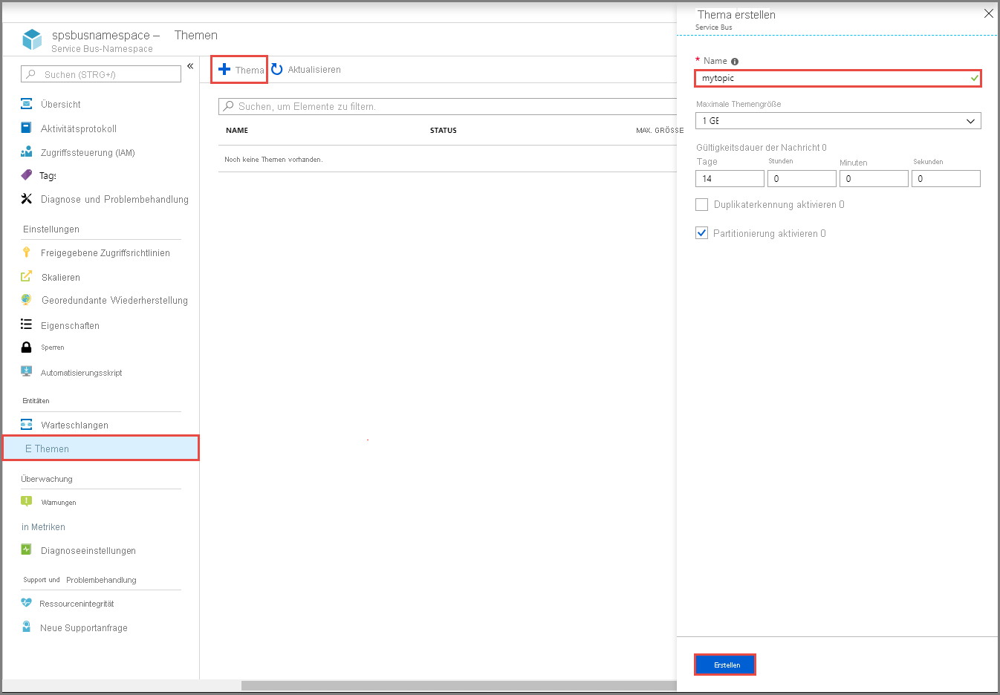
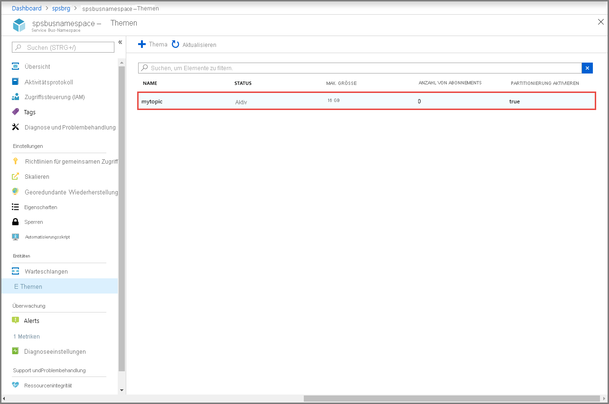
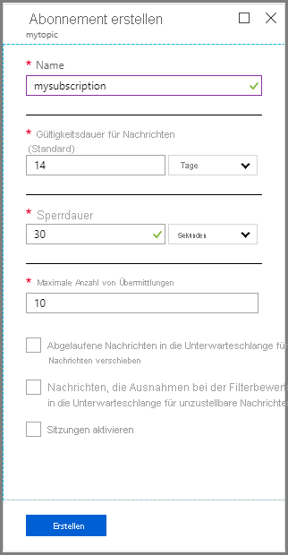

## Erstellen eines Themas mit dem Azure-Portal
1. Wählen Sie auf der Seite **Service Bus-Namespace** im linken Menü die Option **Themen** aus.
2. Wählen Sie auf der Symbolleiste die Option **+ Thema** aus. 
4. Geben Sie unter **Name** einen Namen für das Thema ein. Behalten Sie bei den anderen Optionen die Standardwerte bei.
5. Wählen Sie **Erstellen** aus.

    

## Erstellen von Abonnements für das Thema
1. Wählen Sie das **Thema** aus, das Sie im vorherigen Abschnitt erstellt haben. 
    
    
2. Wählen Sie auf der Seite **Service Bus-Thema** im linken Menü die Option **Abonnements** und anschließend auf der Symbolleiste die Option **+ Abonnement** aus. 
    
    
3. Führen Sie auf der Seite **Abonnement erstellen** die folgenden Schritte aus:
    1. Geben Sie **S1** für **Name** des Abonnements ein.
    1. Geben Sie **3** für **Maximale Lieferungsanzahl** ein.
    1. Wählen Sie dann **Erstellen**, um das Abonnement zu erstellen. 

        
4. Wiederholen Sie den vorherigen Schritt zweimal, um die Abonnements mit den Namen **S2** und **S3** zu erstellen.