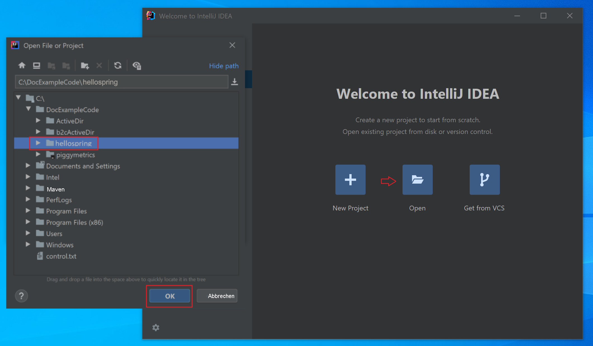
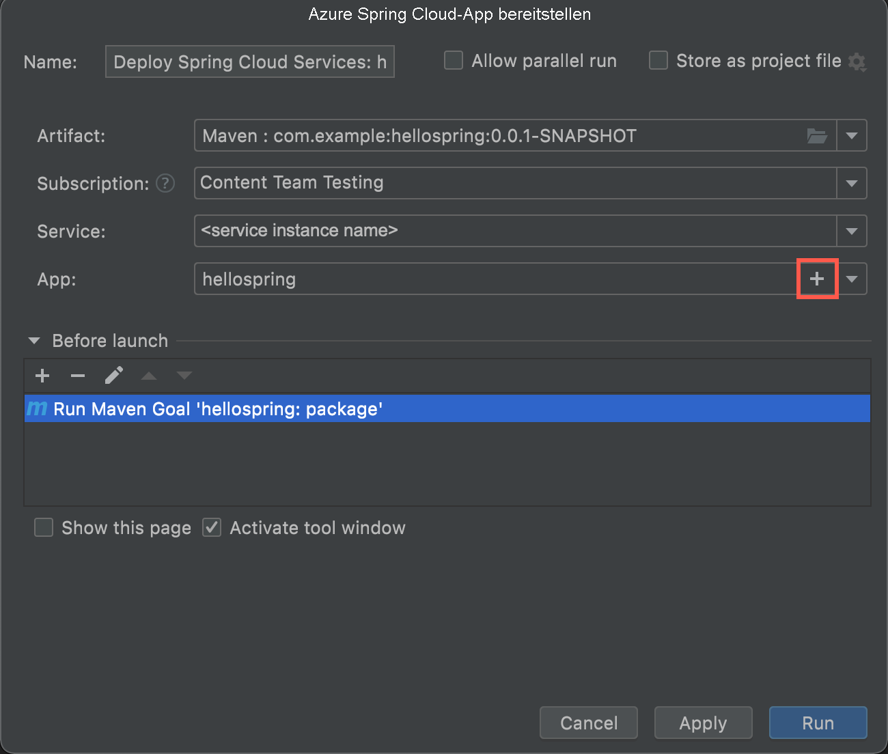
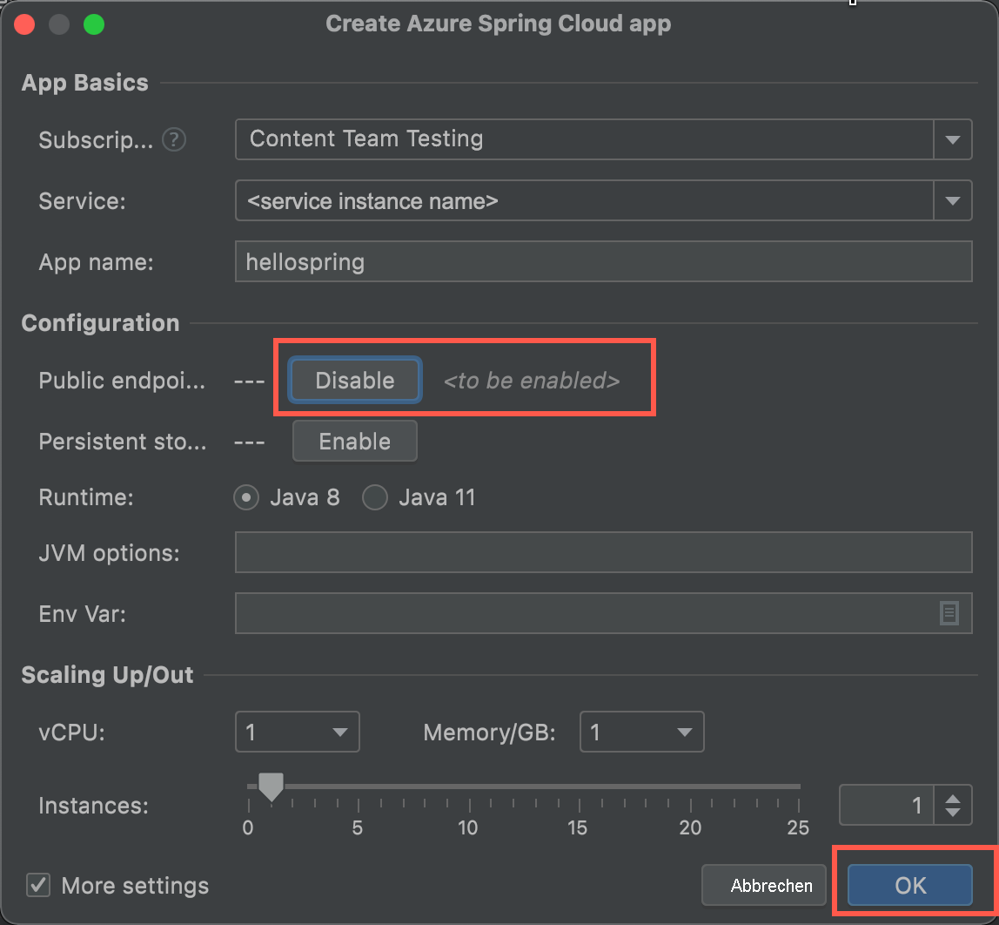
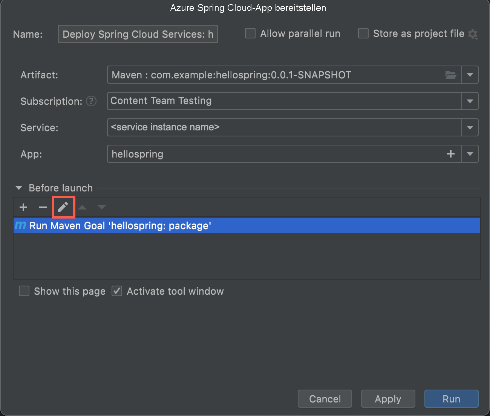
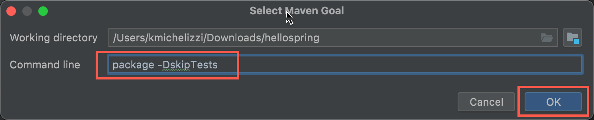

# <a name="quickstart-deploy-your-first-application-to-azure-spring-cloud"></a>Schnellstart: Bereitstellen Ihrer ersten Anwendung in Azure Spring Cloud

::: zone pivot="programming-language-csharp"
In diesem Schnellstart erfahren Sie, wie Sie eine kleine Anwendung für die Ausführung in Azure Spring Cloud bereitstellen.

>[!NOTE]
> Steeltoe-Unterstützung für Azure Spring Cloud wird zurzeit als Public Preview angeboten. Angebote der Public Preview ermöglichen Kunden das Experimentieren mit neuen Funktionen vor der offiziellen Veröffentlichung.  Funktionen und Dienste in der Public Preview sind nicht zur Verwendung in der Produktion bestimmt.  Weitere Informationen zur Unterstützung während der Vorschauphase finden Sie in den [häufig gestellten Fragen](https://azure.microsoft.com/support/faq/). Sie können auch eine [Supportanfrage](../azure-portal/supportability/how-to-create-azure-support-request.md) einreichen.

In dieser Schnellstartanleitung wird Folgendes vermittelt:
> [!div class="checklist"]
> * Generieren eines einfachen Steeltoe-.NET Core-Projekts
> * Bereitstellen einer Azure Spring Cloud-Dienstinstanz
> * Erstellen und Bereitstellen der App mit einem öffentlichen Endpunkt
> * Streamen von Protokollen in Echtzeit

Der in diesem Schnellstart verwendete Anwendungscode ist eine einfache App, die mit einer .NET Core-Web-API-Projektvorlage erstellt wurde. Wenn Sie dieses Beispiel abgeschlossen haben, kann auf die Anwendung online zugegriffen werden, und sie kann über das Azure-Portal und die Azure CLI verwaltet werden.

## <a name="prerequisites"></a>Voraussetzungen

* Ein Azure-Konto mit einem aktiven Abonnement. Sie können [kostenlos ein Konto erstellen](https://azure.microsoft.com/free/?WT.mc_id=A261C142F).
* [.NET Core 3.1 SDK](https://dotnet.microsoft.com/download/dotnet-core/3.1). Der Azure Spring Cloud-Dienst unterstützt .NET Core 3.1 und höhere Versionen.
* [Azure CLI-Version 2.0.67 oder höher](/cli/azure/install-azure-cli)
* [Git](https://git-scm.com/).

## <a name="install-azure-cli-extension"></a>Installieren der Azure CLI-Erweiterung

Vergewissern Sie sich, dass Sie mindestens Version 2.0.67 der Azure CLI verwenden:

```azurecli
az --version
```

Führen Sie den folgenden Befehl aus, um die Azure Spring Cloud-Erweiterung für die Azure CLI zu installieren:

```azurecli
az extension add --name spring-cloud
```

## <a name="sign-in-to-azure"></a>Anmelden bei Azure

1. Melden Sie sich bei der Azure CLI an:

    ```azurecli
    az login
    ```

1. Falls Sie über mehrere Abonnements verfügen, wählen Sie das gewünschte Abonnement für diese Schnellstartanleitung aus.

   ```azurecli
   az account list -o table
   ```

   ```azurecli
   az account set --subscription <Name or ID of a subscription from the last step>
   ```

## <a name="generate-a-steeltoe-net-core-project"></a>Generieren eines Steeltoe-.NET Core-Projekts

Erstellen Sie in Visual Studio mit der API-Projektvorlage eine ASP.NET Core-Webanwendung mit dem Namen „hello-world“. Beachten Sie, dass ein automatisch generierter WeatherForecastController vorhanden ist, der später als Testendpunkt verwendet wird.

1. Erstellen Sie einen Ordner für den Projektquellcode, und generieren Sie das Projekt.

   ```console
   mkdir source-code
   ```

   ```console
   cd source-code
   ```

   ```dotnetcli
   dotnet new webapi -n hello-world --framework netcoreapp3.1
   ```

1. Navigieren Sie zum Projektverzeichnis.

   ```console
   cd hello-world
   ```

1. Bearbeiten Sie die Datei *appSettings.json*, um die folgenden Einstellungen hinzuzufügen:

   ```json
   "spring": {
     "application": {
       "name": "hello-world"
     }
   },
   "eureka": {
     "client": {
       "shouldFetchRegistry": true,
       "shouldRegisterWithEureka": true
     }
   }
   ```

1. Ändern Sie außerdem in *appsettings.json* die Protokollebene für die Kategorie `Microsoft` von `Warning` in `Information`. Durch diese Änderung wird sichergestellt, dass Protokolle erstellt werden, wenn Sie Streamingprotokolle in einem späteren Schritt anzeigen.

   Die Datei *appsettings.json* sieht nun in etwa wie im folgenden Beispiel aus:

   ```json
   {
     "Logging": {
       "LogLevel": {
         "Default": "Information",
         "Microsoft": "Information",
         "Microsoft.Hosting.Lifetime": "Information"
       }
     },
     "AllowedHosts": "*",
     "spring": {
       "application": {
         "name": "hello-world"
       }
     },
     "eureka": {
       "client": {
         "shouldFetchRegistry": true,
         "shouldRegisterWithEureka": true
       }
     }
   }
   ```

1. Fügen Sie der Datei *.csproj* Abhängigkeiten und eine Aufgabe vom Typ `Zip` hinzu:

   ```xml
   <ItemGroup>
     <PackageReference Include="Steeltoe.Discovery.ClientCore" Version="3.1.0" />
     <PackageReference Include="Microsoft.Azure.SpringCloud.Client" Version="2.0.0-preview.1" />
   </ItemGroup>
   <Target Name="Publish-Zip" AfterTargets="Publish">
     <ZipDirectory SourceDirectory="$(PublishDir)" DestinationFile="$(MSBuildProjectDirectory)/deploy.zip" Overwrite="true" />
   </Target>
   ```

   Die Pakete sind für die Steeltoe-Dienstermittlung und die Azure Spring Cloud-Clientbibliothek bestimmt. Die Aufgabe `Zip` ist für die Bereitstellung in Azure vorgesehen. Wenn Sie den Befehl `dotnet publish` ausführen, werden die Binärdateien im Ordner *publish* generiert, und mit dieser Aufgabe wird der Ordner *publish* in einer *ZIP*-Datei komprimiert, die Sie in Azure hochladen.

1. Fügen Sie in der Datei *Program.cs* eine Anweisung vom Typ `using` sowie Code hinzu, der die Azure Spring Cloud-Clientbibliothek verwendet:

   ```csharp
   using Microsoft.Azure.SpringCloud.Client;
   ```

   ```csharp
   public static IHostBuilder CreateHostBuilder(string[] args) =>
               Host.CreateDefaultBuilder(args)
                   .UseAzureSpringCloudService()
                   .ConfigureWebHostDefaults(webBuilder =>
                   {
                       webBuilder.UseStartup<Startup>();
                   });
   ```

1. Fügen Sie in der Datei *Startup.cs* eine `using`-Anweisung sowie Code hinzu, der die Steeltoe-Dienstermittlung am Ende der `ConfigureServices`-Methode verwendet:

   ```csharp
   using Steeltoe.Discovery.Client;
   ```

   ```csharp
   public void ConfigureServices(IServiceCollection services)
   {
       // Template code not shown.

       services.AddDiscoveryClient(Configuration);
   }
   ```

1. Erstellen Sie das Projekt, um sich zu vergewissern, dass keine Kompilierungsfehler auftreten.

   ```dotnetcli
   dotnet build
   ```

## <a name="provision-a-service-instance"></a>Bereitstellen einer Dienstinstanz

Mit dem folgenden Verfahren wird eine Azure Spring Cloud-Instanz über das Azure-Portal erstellt:

1. Öffnen Sie das [Azure-Portal](https://ms.portal.azure.com/).

1. Suchen Sie im oberen Suchfeld nach *Azure Spring Cloud*.

1. Wählen Sie in den Ergebnissen *Azure Spring Cloud* aus.

   

1. Wählen Sie auf der Seite „Azure Spring Cloud“ die Option **Erstellen** aus.

   

1. Füllen Sie das Formular auf der Azure Spring Cloud-Seite **Erstellen** aus.  Berücksichtigen Sie die folgenden Richtlinien:

   * **Abonnement**: Wählen Sie das Abonnement aus, unter dem diese Ressource abgerechnet werden soll.
   * **Ressourcengruppe**: Erstellen Sie eine neue Ressourcengruppe. Der hier eingegebene Name wird später als **\<resource group name\>** verwendet.
   * **Dienstdetails/Name**: Geben Sie **\<service instance name\>** an.  Der Name muss zwischen 4 und 32 Zeichen lang sein und darf nur Kleinbuchstaben, Ziffern und Bindestriche enthalten.  Das erste Zeichen des Dienstnamens muss ein Buchstabe und das letzte Zeichen entweder ein Buchstabe oder eine Ziffer sein.
   * **Region**: Wählen Sie die Region für Ihre Dienstinstanz aus.

   

1. Klicken Sie auf **Überprüfen und erstellen**.

1. Klicken Sie auf **Erstellen**.

## <a name="build-and-deploy-the-app"></a>Erstellen und Bereitstellen der App

Im folgenden Verfahren wird das zuvor von Ihnen generierte Projekt erstellt und bereitgestellt.

1. Stellen Sie sicher, dass sich die Eingabeaufforderung noch im Projektordner befindet.

1. Führen Sie den folgenden Befehl aus, um das Projekt zu erstellen, die Binärdateien zu veröffentlichen und die Binärdateien in einer *ZIP*-Datei im Projektordner zu speichern.

   ```dotnetcorecli
   dotnet publish -c release -o ./publish
   ```

1. Erstellen Sie eine App in Ihrer Azure Spring Cloud-Instanz mit einem zugewiesenen öffentlichen Endpunkt. Verwenden Sie den gleichen Anwendungsnamen (hello-world), den Sie in *appsettings.json* angegeben haben.

   ```console
   az spring-cloud app create -n hello-world -s <service instance name> -g <resource group name> --assign-endpoint --runtime-version NetCore_31
   ```

1. Stellen Sie die *ZIP*-Datei in der App bereit.

   ```azurecli
   az spring-cloud app deploy -n hello-world -s <service instance name> -g <resource group name> --runtime-version NetCore_31 --main-entry hello-world.dll --artifact-path ./deploy.zip
   ```

   Die Option `--main-entry` identifiziert die *DLL*-Datei, die den Einstiegspunkt der Anwendung enthält. Nachdem der Dienst die *ZIP*-Datei hochgeladen hat, werden alle Dateien und Ordner extrahiert, und es wird versucht, den Einstiegspunkt in der von `--main-entry`angegebenen *DLL*-Datei auszuführen.

   Es dauert einige Minuten, bis die Bereitstellung der Anwendung abgeschlossen ist. Navigieren Sie im Azure-Portal zum Abschnitt **Apps**, um zu überprüfen, ob die Anwendung bereitgestellt wurde.

## <a name="test-the-app"></a>Testen der App

Nach Abschluss der Bereitstellung können Sie unter folgender URL auf die App zugreifen:

```url
https://<service instance name>-hello-world.azuremicroservices.io/weatherforecast
```

Die App gibt JSON-Daten wie im folgenden Beispiel zurück:

```json
[{"date":"2020-09-08T21:01:50.0198835+00:00","temperatureC":14,"temperatureF":57,"summary":"Bracing"},{"date":"2020-09-09T21:01:50.0200697+00:00","temperatureC":-14,"temperatureF":7,"summary":"Bracing"},{"date":"2020-09-10T21:01:50.0200715+00:00","temperatureC":27,"temperatureF":80,"summary":"Freezing"},{"date":"2020-09-11T21:01:50.0200717+00:00","temperatureC":18,"temperatureF":64,"summary":"Chilly"},{"date":"2020-09-12T21:01:50.0200719+00:00","temperatureC":16,"temperatureF":60,"summary":"Chilly"}]
```

## <a name="stream-logs-in-real-time"></a>Streamen von Protokollen in Echtzeit

Verwenden Sie den folgenden Befehl, um Echtzeitprotokolle von der App zu erhalten.

```azurecli
az spring-cloud app logs -n hello-world -s <service instance name> -g <resource group name> --lines 100 -f
```

Protokolle werden in der Ausgabe angezeigt:

```output
[Azure Spring Cloud] The following environment variables are loaded:
2020-09-08 20:58:42,432 INFO supervisord started with pid 1
2020-09-08 20:58:43,435 INFO spawned: 'event-gather_00' with pid 9
2020-09-08 20:58:43,436 INFO spawned: 'dotnet-app_00' with pid 10
2020-09-08 20:58:43 [Warning] No managed processes are running. Wait for 30 seconds...
2020-09-08 20:58:44,843 INFO success: event-gather_00 entered RUNNING state, process has stayed up for > than 1 seconds (startsecs)
2020-09-08 20:58:44,843 INFO success: dotnet-app_00 entered RUNNING state, process has stayed up for > than 1 seconds (startsecs)
←[40m←[32minfo←[39m←[22m←[49m: Steeltoe.Discovery.Eureka.DiscoveryClient[0]
      Starting HeartBeat
info: Microsoft.Hosting.Lifetime[0]
      Now listening on: http://[::]:1025
info: Microsoft.Hosting.Lifetime[0]
      Application started. Press Ctrl+C to shut down.
info: Microsoft.Hosting.Lifetime[0]
      Hosting environment: Production
info: Microsoft.Hosting.Lifetime[0]
      Content root path: /netcorepublish/6e4db42a-b160-4b83-a771-c91adec18c60
2020-09-08 21:00:13 [Information] [10] Start listening...
info: Microsoft.AspNetCore.Hosting.Diagnostics[1]
      Request starting HTTP/1.1 GET http://asc-svc-hello-world.azuremicroservices.io/weatherforecast
info: Microsoft.AspNetCore.Routing.EndpointMiddleware[0]
      Executing endpoint 'hello_world.Controllers.WeatherForecastController.Get (hello-world)'
info: Microsoft.AspNetCore.Mvc.Infrastructure.ControllerActionInvoker[3]
      Route matched with {action = "Get", controller = "WeatherForecast"}. Executing controller action with signature System.Collections.Generic.IEnumerable`1[hello_world.WeatherForecast] Get() on controller hello_world.Controllers.WeatherForecastController (hello-world).
info: Microsoft.AspNetCore.Mvc.Infrastructure.ObjectResultExecutor[1]
      Executing ObjectResult, writing value of type 'hello_world.WeatherForecast[]'.
info: Microsoft.AspNetCore.Mvc.Infrastructure.ControllerActionInvoker[2]
      Executed action hello_world.Controllers.WeatherForecastController.Get (hello-world) in 1.8902ms
info: Microsoft.AspNetCore.Routing.EndpointMiddleware[1]
      Executed endpoint 'hello_world.Controllers.WeatherForecastController.Get (hello-world)'
info: Microsoft.AspNetCore.Hosting.Diagnostics[2]
      Request finished in 4.2591ms 200 application/json; charset=utf-8
```

> [!TIP]
> Verwenden Sie `az spring-cloud app logs -h`, um weitere Parameter und Funktionen für Protokolldatenströme zu untersuchen.

Informationen zu erweiterten Protokollanalysefeatures finden Sie im Menü im [Azure-Portal](https://portal.azure.com/) auf der Registerkarte **Protokolle**. Bei den hier aufgeführten Protokollen kommt es zu einer Wartezeit von einigen Minuten.
[  ](media/spring-cloud-quickstart-java/logs-analytics.png#lightbox)
::: zone-end

::: zone pivot="programming-language-java"

In diesem Schnellstart erfahren Sie, wie Sie eine kleine Anwendung für Azure Spring Cloud bereitstellen.

Der in diesem Tutorial verwendete Anwendungscode ist eine einfache App, die mit Spring initializr erstellt wurde. Wenn Sie das Tutorial abgeschlossen haben, kann auf die Anwendung online zugegriffen werden, und sie kann über das Azure-Portal verwaltet werden.

In dieser Schnellstartanleitung wird Folgendes erläutert:

> [!div class="checklist"]
> * Generieren eines grundlegenden Spring Cloud-Projekts
> * Bereitstellen einer Dienstinstanz
> * Erstellen und Bereitstellen der App mit einem öffentlichen Endpunkt
> * Streamen von Protokollen in Echtzeit

## <a name="prerequisites"></a>Voraussetzungen

So führen Sie diesen Schnellstart durch:

* [Installieren Sie JDK 8 oder JDK 11](/java/azure/jdk/).
* [Registrierung für ein Azure-Abonnement](https://azure.microsoft.com/free/)
* (Optional) [Installation der Azure CLI, Version 2.0.67 oder höher](/cli/azure/install-azure-cli) und der Azure Spring Cloud-Erweiterung mit dem Befehl `az extension add --name spring-cloud`
* (Optional) [Installation von IntelliJ IDEA](https://www.jetbrains.com/idea/)
* (Optional) [Installation des Azure-Toolkits für IntelliJ](https://plugins.jetbrains.com/plugin/8053-azure-toolkit-for-intellij/) und [Anmeldung](/azure/developer/java/toolkit-for-intellij/create-hello-world-web-app#installation-and-sign-in)
* (Optional) [Installieren Sie Maven](https://maven.apache.org/guides/getting-started/maven-in-five-minutes.html). Wenn Sie die Azure Cloud Shell verwenden, ist diese Installation nicht erforderlich.

## <a name="generate-a-spring-cloud-project"></a>Generieren eines Spring Cloud-Projekts

Beginnen Sie mit [Spring Initializr](https://start.spring.io/#!type=maven-project&language=java&platformVersion=2.5.5&packaging=jar&jvmVersion=1.8&groupId=com.example&artifactId=hellospring&name=hellospring&description=Demo%20project%20for%20Spring%20Boot&packageName=com.example.hellospring&dependencies=web,cloud-eureka,actuator,cloud-config-client), um ein Beispielprojekt mit empfohlenen Abhängigkeiten für Azure Spring Cloud zu generieren. Dieser Link verwendet die folgende URL, um Ihnen Standardeinstellungen bereitzustellen. 

```url
https://start.spring.io/#!type=maven-project&language=java&platformVersion=2.5.5&packaging=jar&jvmVersion=1.8&groupId=com.example&artifactId=hellospring&name=hellospring&description=Demo%20project%20for%20Spring%20Boot&packageName=com.example.hellospring&dependencies=web,cloud-eureka,actuator,cloud-config-client
```
Die folgende Abbildung zeigt die empfohlene Initializr-Instanz, die für dieses Beispielprojekt eingerichtet wurde. 

In diesem Beispiel wird Java-Version 8 verwendet.  Wenn Sie Java-Version 11 verwenden möchten, ändern Sie die Option unter **Projektmetadaten**.


1. Wählen Sie **Generieren** aus, wenn alle Abhängigkeiten festgelegt sind. 
1. Laden Sie das Paket herunter, und entpacken Sie es. Erstellen Sie anschließend einen Webcontroller für eine einfache Webanwendung, indem Sie die Datei *src/main/java/com/example/hellospring/HelloController.java* mit dem folgenden Inhalt hinzufügen:

    ```java
    package com.example.hellospring;

    import org.springframework.web.bind.annotation.RestController;
    import org.springframework.web.bind.annotation.RequestMapping;

    @RestController
    public class HelloController {

        @RequestMapping("/")
        public String index() {
            return "Greetings from Azure Spring Cloud!";
        }

    }
    ```

## <a name="provision-an-instance-of-azure-spring-cloud"></a>Bereitstellen einer Instanz von Azure Spring Cloud

Mit dem folgenden Verfahren wird eine Azure Spring Cloud-Instanz über das Azure-Portal erstellt:

1. Öffnen Sie das [Azure-Portal](https://ms.portal.azure.com/) in einem neuen Tab.

2. Suchen Sie im oberen Suchfeld nach **Azure Spring Cloud**.

3. Wählen Sie in den Ergebnissen **Azure Spring Cloud** aus.

    

4. Wählen Sie auf der Seite „Azure Spring Cloud“ die Option **Erstellen** aus.

    

5. Füllen Sie das Formular auf der Azure Spring Cloud-Seite **Erstellen** aus.  Berücksichtigen Sie die folgenden Richtlinien:

    - **Abonnement**: Wählen Sie das Abonnement aus, unter dem diese Ressource abgerechnet werden soll.
    - **Ressourcengruppe**: Die Erstellung neuer Ressourcengruppen für neue Ressourcen ist eine bewährte Methode. Sie verwenden diese Ressourcengruppe in späteren Schritten als **\<resource group name\>** .
    - **Dienstdetails/Name**: Geben Sie **\<service instance name\>** an.  Der Name muss zwischen 4 und 32 Zeichen lang sein und darf nur Kleinbuchstaben, Ziffern und Bindestriche enthalten.  Das erste Zeichen des Dienstnamens muss ein Buchstabe und das letzte Zeichen entweder ein Buchstabe oder eine Ziffer sein.
    - **Standort**: Wählen Sie die Region für Ihre Dienstinstanz aus.

    

6. Klicken Sie auf **Überprüfen und erstellen**.

## <a name="build-and-deploy-the-app"></a>Erstellen und Bereitstellen der App

#### <a name="cli"></a>[BEFEHLSZEILENSCHNITTSTELLE (CLI)](#tab/Azure-CLI)
Im folgenden Verfahren wird die Anwendung mithilfe der Azure CLI erstellt und bereitgestellt. Führen Sie im Stammverzeichnis des Projekts folgenden Befehl aus:

1. Melden Sie sich bei Azure an, und wählen Sie Ihr Abonnement aus.

    ```azurecli
    az login
    ```

   Wenn Sie über mehr als ein Abonnement verfügen, listen Sie mit dem folgenden Befehl die Abonnements auf, auf die Sie Zugriff haben, und wählen Sie dann das Abonnement aus, das Sie für diese Schnellstartanleitung verwenden möchten.

   ```azurecli
   az account list -o table
   ```

   Verwenden Sie den folgenden Befehl, um das Standardabonnement festzulegen, das mit den Azure CLI-Befehlen in dieser Schnellstartanleitung verwendet werden soll.

   ```azurecli
   az account set --subscription <Name or ID of a subscription from the last step>
   ```

1. Erstellen Sie das Projekt mithilfe von Maven:

    ```console
    mvn clean package -DskipTests
    ```

1. Erstellen Sie die App mit einem zugewiesenen öffentlichen Endpunkt. Fügen Sie die Option `--runtime-version=Java_11` ein, wenn Sie beim Generieren des Spring Cloud-Projekts die Java-Version 11 ausgewählt haben.

    ```azurecli
    az spring-cloud app create -n hellospring -s <service instance name> -g <resource group name> --assign-endpoint true
    ```

1. Stellen Sie die JAR-Datei für die App bereit (`target\hellospring-0.0.1-SNAPSHOT.jar` unter Windows):

    ```azurecli
    az spring-cloud app deploy -n hellospring -s <service instance name> -g <resource group name> --artifact-path <jar file path>/hellospring-0.0.1-SNAPSHOT.jar
    ```

1. Es dauert einige Minuten, bis die Bereitstellung der Anwendung abgeschlossen ist. Navigieren Sie im Azure-Portal zum Abschnitt **Apps**, um zu überprüfen, ob die Anwendung bereitgestellt wurde. Der Status der Anwendung sollte angezeigt werden.

#### <a name="intellij"></a>[IntelliJ](#tab/IntelliJ)

Im folgenden Verfahren wird das IntelliJ-Plug-In für Azure Spring Cloud verwendet, um die Beispiel-App in IntelliJ IDEA bereitzustellen.

### <a name="import-project"></a>Importieren des Projekts

1. Öffnen Sie das IntelliJ-Dialogfeld **Willkommen**, und wählen Sie **Öffnen** aus, um den Import-Assistenten zu öffnen.
1. Wählen Sie den Ordner **hellospring** aus.

    

### <a name="deploy-the-app"></a>Bereitstellen der App

Für die Bereitstellung in Azure müssen Sie sich bei Ihrem Azure-Konto anmelden und Ihr Abonnement auswählen.  Anmeldeinformationen finden Sie unter [Installation und Anmeldung](/azure/developer/java/toolkit-for-intellij/create-hello-world-web-app#installation-and-sign-in).

1. Klicken Sie im Projektexplorer von IntelliJ mit der rechten Maustaste auf Ihr Projekt, und wählen Sie **Azure** -> **In Azure Spring Cloud bereitstellen** aus.

    [  ](media/spring-cloud-quickstart-java/intellij-deploy-azure-1.png#lightbox)

1. Übernehmen Sie den Namen für die App im Feld **Name**. **Name** bezieht sich auf die Konfiguration, nicht auf den App-Namen. Benutzer müssen ihn in der Regel nicht ändern.
1. Wählen Sie im Textfeld **Artefakt** die Datei **Maven:com.example:hellospring-0.0.1-SNAPSHOT** aus.
1. Vergewissern Sie sich, dass im Textfeld **Abonnement** das richtige Abonnement angegeben ist.
1. Wählen Sie im Textfeld **Dienst** die Instanz von Azure Spring Cloud aus, die Sie unter [Bereitstellen einer Instanz von Azure Spring Cloud](./quickstart-provision-service-instance.md) erstellt haben.
1. Klicken Sie im Textfeld **App** auf **+** , um eine neue App zu erstellen.

    

1. Geben Sie im Textfeld **App-Name** den Namen *hellospring* ein, und aktivieren Sie dann das Kontrollkästchen **Weitere Einstellungen**.
1. Wählen Sie neben **Öffentlicher Endpunkt** die Schaltfläche **Aktivieren** aus. Die Schaltfläche ändert sich in *Deaktivieren \<to be enabled\>* .
1. Wenn Sie Java 11 verwendet haben, wählen Sie **Java 11** unter **Runtime** aus.
1. Klicken Sie auf **OK**.

    

1. Wählen Sie unter **Vor dem Start** die Zeile **Maven-Ziel „hellospring:package“ ausführen** aus, und wählen Sie dann den Stift aus, um die Befehlszeile zu bearbeiten.

    

1. Geben Sie im Textfeld **Befehlszeile** nach *package* die Zeichenfolge *-DskipTests* ein, und klicken Sie auf **OK**.

    

1. Starten Sie die Bereitstellung, indem Sie unten im Dialogfeld **Azure Spring Cloud-App bereitstellen** die Schaltfläche **Ausführen** auswählen. Das Plug-In führt den Befehl `mvn package -DskipTests` für die App `hellospring` aus, und stellt die vom `package`-Befehl generierte JAR-Datei bereit.

---

Nach Abschluss der Bereitstellung können Sie unter `https://<service instance name>-hellospring.azuremicroservices.io/` auf die App zugreifen.

[](media/spring-cloud-quickstart-java/access-app-browser.png#lightbox)

## <a name="streaming-logs-in-real-time"></a>Streamingprotokolle in Echtzeit

#### <a name="cli"></a>[BEFEHLSZEILENSCHNITTSTELLE (CLI)](#tab/Azure-CLI)

Verwenden Sie den folgenden Befehl, um Echtzeitprotokolle von der App zu erhalten.

```azurecli
az spring-cloud app logs -n hellospring -s <service instance name> -g <resource group name> --lines 100 -f
```

Protokolle werden in den Ergebnissen angezeigt:

[  ](media/spring-cloud-quickstart-java/streaming-logs.png#lightbox)

>[!TIP]
> Verwenden Sie `az spring-cloud app logs -h`, um weitere Parameter und Funktionen für Protokolldatenströme zu untersuchen.

#### <a name="intellij"></a>[IntelliJ](#tab/IntelliJ)

1. Wählen Sie **Azure-Explorer** und dann **Spring Cloud** aus.
1. Klicken Sie mit der rechten Maustaste auf die ausgeführte App.
1. Wählen Sie in der Dropdownliste **Streamingprotokolle** aus.
1. Wählen Sie die Instanz aus.

    [](media/spring-cloud-quickstart-java/intellij-get-streaming-logs.png)

1. Das Streamingprotokoll wird im Ausgabefenster angezeigt.

    [](media/spring-cloud-quickstart-java/intellij-streaming-logs-output.png)

---

Informationen zu erweiterten Protokollanalysefeatures finden Sie im Menü im [Azure-Portal](https://portal.azure.com/) auf der Registerkarte **Protokolle**. Bei den hier aufgeführten Protokollen kommt es zu einer Wartezeit von einigen Minuten.

[](media/spring-cloud-quickstart-java/logs-analytics.png#lightbox)

::: zone-end

## <a name="clean-up-resources"></a>Bereinigen von Ressourcen

In den obigen Schritten haben Sie Azure-Ressourcen erstellt, für die weiterhin Gebühren anfallen, solange sie in Ihrem Abonnement verbleiben. Wenn Sie diese Ressourcen in Zukunft nicht mehr benötigen, löschen Sie die Ressourcengruppe über das Portal oder durch Ausführen des folgenden Befehls in der Azure CLI:

```azurecli
az group delete --name <your resource group name> --yes
```

## <a name="next-steps"></a>Nächste Schritte

In diesem Schnellstart haben Sie gelernt, wie Sie:

> [!div class="checklist"]
> * Generieren eines grundlegenden Spring Cloud-Projekts
> * Bereitstellen einer Dienstinstanz
> * Erstellen und Bereitstellen der App mit einem öffentlichen Endpunkt
> * Streamen von Protokollen in Echtzeit

Informationen zu weiteren Azure Spring-Funktionen finden Sie in der Schnellstartserie, in der eine Beispielanwendung in Azure Spring Cloud bereitgestellt wird:

> [!div class="nextstepaction"]
> [Erstellen und Ausführen von Apps](./quickstart-sample-app-introduction.md)

Weitere Beispiele finden Sie auf GitHub: [Azure Spring Cloud-Beispiele](https://github.com/Azure-Samples/Azure-Spring-Cloud-Samples).
