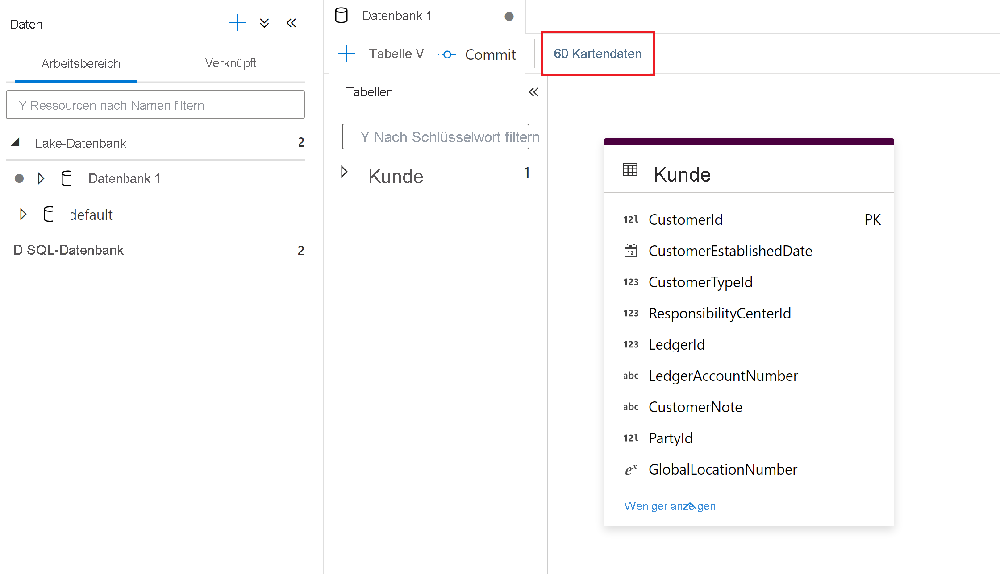
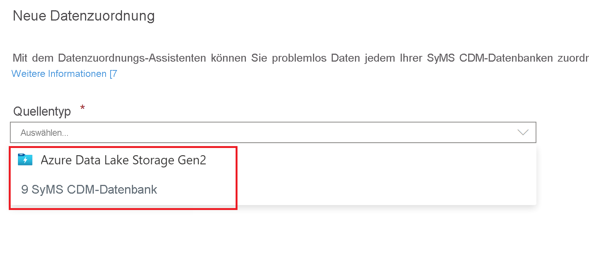

# Zuordnen von Daten in Azure Synapse Analytics

## Was ist das Datenzuordnungstool?

Das Datenzuordnungstool ist ein geführter Prozess, mit dem Benutzer ETL-Zuordnungen und Zuordnungsdatenflüsse zwischen Ihren Quelldaten und Synapse-Lake-Datenbanktabellen erstellen können, ohne Code schreiben zu müssen. Dieser Prozess beginnt damit, dass der Benutzer die Zieltabellen in Synapse Lake-Datenbanken auswählt und dann seine Quelldaten diesen Tabellen zuordnet. 

Weitere Informationen zu Synapse-Lake-Datenbanken finden Sie unter [Was sind Azure Synapse-Datenbankvorlagen?](overview-database-templates.md).

Das Datenzuordnungstool bietet eine geführte Umgebung, in der Benutzer schnell einen skalierbaren, in Synapse-Pipelines ausführbaren Zuordnungsdatenfluss generieren können, ohne mit einer leeren Canvas beginnen zu müssen.

> [!NOTE] 
> Das Datenzuordnungsfeature in Synapse Analytics-Pipelines befindet sich derzeit in der Public Preview-Phase.

## Erste Schritte

Das Datenzuordnungstool wird innerhalb der Synapse-Lake-Datenbankumgebung gestartet. Hier können Sie das Datenzuordnungstool auswählen, um den Prozess zu starten. 

Für die Datenzuordnung müssen Compute-Ressourcen verfügbar sein, um Benutzer beim Anzeigen einer Datenvorschau sowie beim Lesen des Schemas ihrer Quelldateien unterstützen zu können. Wenn Sie die Datenzuordnung zum ersten Mal in einer Sitzung verwenden, müssen Sie einen Cluster aufwärmen.

Wählen Sie zunächst Ihre Datenquelle aus, die Sie Ihren Lake-Datenbanktabellen zuordnen möchten. Derzeit werden Azure Data Lake Storage Gen2-Datenbanken und Synapse-Lake-Datenbanken unterstützt.

### Optionen für den Dateityp
Wenn Sie einen Dateispeicher wie Azure Data Lake Storage Gen2 auswählen, werden folgende Dateitypen unterstützt:

* Common Data Model
* Durch Trennzeichen getrennter Text
* Parquet

## Erstellen einer Datenzuordnung
Benennen Sie Ihre Datenzuordnung, und wählen Sie das Synapse-Lake-Datenbankziel aus.

## Zuordnen der Quelle zum Ziel
Wählen Sie eine primäre Quelltabelle aus, die der Zieltabelle der Synapse-Lake-Datenbank zugeordnet werden soll.

### Neue Zuordnung
Verwenden Sie die Schaltfläche „Neue Zuordnung“, um eine Zuordnungsmethode für die Erstellung einer Zuordnung oder Transformation hinzuzufügen.

### „Additional source“ (Zusätzliche Quelle)
Verwenden Sie die Schaltfläche „Additional source“ (Zusätzliche Quelle), um eine Verknüpfung einzurichten und Ihrer Zuordnung eine weitere Quelle hinzuzufügen.

### Datenvorschau
Auf der Registerkarte **Datenvorschau** wird eine interaktive Momentaufnahme der Daten der jeweiligen Transformation angezeigt. Weitere Informationen finden Sie unter [Datenvorschau im Debugmodus](../../data-factory/concepts-data-flow-debug-mode.md#data-preview).

### Zuordnungsmethoden

Folgende Zuordnungsmethoden werden unterstützt:

* [Direkt](../../data-factory/data-flow-select.md)
* [Ersatzschlüssel](../../data-factory/data-flow-surrogate-key.md)
* [Suche](../../data-factory/data-flow-lookup.md)
* [Entpivotieren](../../data-factory/data-flow-unpivot.md)
* [Aggregat](../../data-factory/data-flow-aggregate.md)
    * Sum
    * Minimum
    * Maximum
    * First (Erster)
    * Last (Letzter)
    * Standardabweichung
    * Average
    * Mittelwert
* [Abgeleitete Spalte](../../data-factory/data-flow-derived-column.md)
    * Glätten
    * Upper
    * Geringer
    * Fortgeschrittene 

## Erstellen der Pipeline

Wenn Sie mit den Transformationen für die Datenzuordnung fertig sind, können Sie die Schaltfläche „Pipeline erstellen“ auswählen, um einen Zuordnungsdatenfluss und eine Pipeline zum Debuggen und Ausführen der Transformation zu generieren.