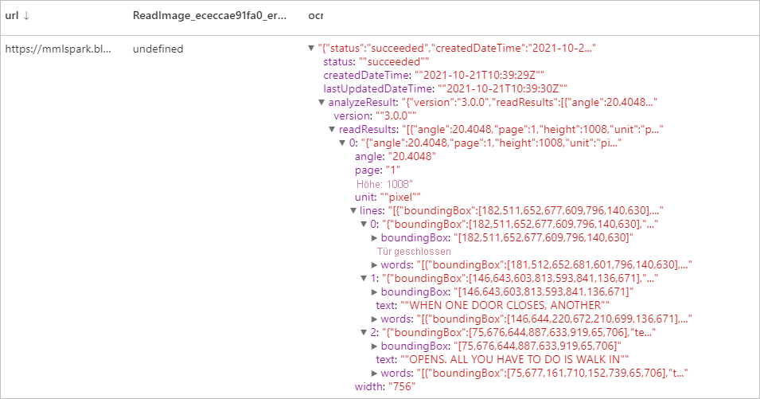

# <a name="tutorial-computer-vision-with-cognitive-service"></a>Tutorial: maschinelles Sehen mit Cognitive Services

[Maschinelles Sehen](../../cognitive-services/computer-vision/index.yml) ist ein [Azure Cognitive Services](../../cognitive-services/index.yml)-Dienst, mit dem Sie Bilder verarbeiten und Informationen basierend auf den visuellen Merkmalen zurückgeben können. In diesem Tutorial erfahren Sie, wie Sie [Maschinelles Sehen](../../cognitive-services/computer-vision/index.yml) verwenden, um Bilder in Azure Synapse Analytics zu analysieren.

Dieses Tutorial veranschaulicht die Verwendung der Textanalyse mit [SynapseML](https://github.com/microsoft/SynapseML) für Folgendes:

> [!div class="checklist"]
> - Extrahieren visueller Merkmale aus dem Bildinhalt
> - Erkennen von Zeichen in Bildern (optische Zeichenerkennung)
> - Analysieren von Bildinhalten und Generieren von Miniaturansichten
> - Erkennen und Identifizieren domänenspezifischer Inhalte in einem Bild
> - Generieren von Tags im Zusammenhang mit einem Bild
> - Generieren einer Beschreibung eines ganzen Bilds in von Menschen lesbarer Sprache


## <a name="analyze-image"></a>Bild analysieren
Dieser Vorgang extrahiert basierend auf dem Bildinhalt eine große Menge visueller Merkmale, z. B. Objekte, Gesichter, nicht jugendfreie Inhalte und automatisch generierte Textbeschreibungen. 
### <a name="example-input"></a>Beispieleingabe


```python
# Create a dataframe with the image URLs
df = spark.createDataFrame([
        ("<replace with your file path>/dog.jpg", )
    ], ["image", ])

# Run the Computer Vision service. Analyze Image extracts infortmation from/about the images.
analysis = (AnalyzeImage()
    .setLinkedService(cognitive_service_name)
    .setVisualFeatures(["Categories","Color","Description","Faces","Objects","Tags"])
    .setOutputCol("analysis_results")
    .setImageUrlCol("image")
    .setErrorCol("error"))

# Show the results of what you wanted to pull out of the images.
display(analysis.transform(df).select("image", "analysis_results.description.tags"))

```
### <a name="expected-results"></a>Erwartete Ergebnisse

```json
["dog","outdoor","fence","wooden","small","brown","building","sitting","front","bench","standing","table","walking","board","beach","holding","bridge"]
```

## <a name="optical-character-recognition-ocr"></a>Optische Zeichenerkennung (Optical Character Recognition, OCR)
Dieser Vorgang extrahiert gedruckten und handschriftlichen Text, Ziffern und Währungssymbole aus Bildern, z. B. Fotos von Straßenschildern und Produkten, sowie aus Dokumenten wie u. a. Rechnungen, Finanzberichten und Artikeln. Die API ist für das Extrahieren von Text aus textlastigen Bildern und mehrseitigen PDF-Dokumenten mit gemischten Sprachen optimiert. Sie unterstützt sowohl die Erkennung von gedrucktem als auch von handschriftlichem Text im selben Bild oder Dokument.

### <a name="example-input"></a>Beispieleingabe


```python
df = spark.createDataFrame([
        ("<replace with your file path>/ocr.jpg", )
    ], ["url", ])

ri = (ReadImage()
    .setLinkedService(cognitive_service_name)
    .setImageUrlCol("url")
    .setOutputCol("ocr"))

display(ri.transform(df))
```
### <a name="expected-results"></a>Erwartete Ergebnisse


## <a name="generate-thumbnails"></a>Generieren von Miniaturansichten
Analysieren Sie den Inhalt eines Bilds, um eine geeignete Miniaturansicht für das Bild zu generieren. Die Maschinelles Sehen-API generiert zunächst eine hochwertige Miniaturansicht und analysiert dann die Objekte im Bild, um den relevanten Bereich zu bestimmen. Anschließend wird das Bild auf den relevanten Bereich zugeschnitten. Das Seitenverhältnis der generierten Miniaturansicht kann sich bei Bedarf vom Seitenverhältnis des ursprünglichen Bilds unterscheiden.

### <a name="example-input"></a>Beispieleingabe


```python
df = spark.createDataFrame([
        ("<replace with your file path>/satya.jpeg", )
    ], ["url", ])

gt =  (GenerateThumbnails()
    .setLinkedService(cognitive_service_name)
    .setHeight(50)
    .setWidth(50)
    .setSmartCropping(True)
    .setImageUrlCol("url")
    .setOutputCol("thumbnails"))

thumbnails = gt.transform(df).select("thumbnails").toJSON().first()

import json
img = json.loads(thumbnails)["thumbnails"]

displayHTML("")

```

### <a name="expected-results"></a>Erwartete Ergebnisse


## <a name="tag-image"></a>Bild markieren
Dieser Vorgang generiert eine Liste von Wörtern bzw. Tags, die für den Inhalt des angegebenen Bilds relevant sind. Tags werden auf Grundlage von Tausenden erkennbarer Objekte, Lebewesen, Landschaften oder Handlungen in Bildern zurückgegeben. Tags können Hinweise enthalten, um Mehrdeutigkeiten zu vermeiden oder Kontext bereitzustellen. Das Tag „Cello“ kann beispielsweise vom Hinweis „Musikinstrument“ begleitet werden.

Lassen Sie uns weiterhin das Bild von Satya als Beispiel verwenden.

```python
df = spark.createDataFrame([
        ("<replace with your file path>/satya.jpeg", )
    ], ["url", ])

ti = (TagImage()
    .setLinkedService(cognitive_service_name)
    .setImageUrlCol("url")
    .setOutputCol("tags"))

display(ti.transform(df))
```

### <a name="expected-result"></a>Erwartetes Ergebnis


## <a name="describe-image"></a>Bild beschreiben
Generieren Sie eine Beschreibung eines gesamten Bilds mit vollständigen Sätzen in lesbarer Sprache. Algorithmen für maschinelles Sehen generieren verschiedene Beschreibungen auf der Grundlage der im Bild erkannten Objekte. Die Beschreibungen werden jeweils ausgewertet, und eine Zuverlässigkeitsbewertung wird generiert. Dann wird eine Liste in der Reihenfolge von höchster Zuverlässigkeitsbewertung zu niedrigster zurückgegeben.

Lassen Sie uns weiterhin das Bild von Satya als Beispiel verwenden.

```python
df = spark.createDataFrame([
        ("<replace with your file path>/satya.jpeg", )
    ], ["url", ])

di = (DescribeImage()
    .setLinkedService(cognitive_service_name)
    .setMaxCandidates(3)
    .setImageUrlCol("url")
    .setOutputCol("descriptions"))

display(di.transform(df))
```
### <a name="expected-result"></a>Erwartetes Ergebnis


## <a name="recognize-domain-specific-content"></a>Domänenspezifische Inhalte erkennen
Verwenden Sie Domänenmodelle, um domänenspezifische Inhalte (etwa berühmte Personen und Orientierungspunkte) in einem Bild zu erkennen. Wenn ein Bild also beispielsweise Personen enthält, kann maschinelles Sehen auf ein Domänenmodell für berühmte Personen zurückgreifen und so ermitteln, ob es sich bei den Personen auf dem Bild um berühmte Personen handelt.

Lassen Sie uns weiterhin das Bild von Satya als Beispiel verwenden.

```python

df = spark.createDataFrame([
        ("<replace with your file path>/satya.jpeg", )
    ], ["url", ])

celeb =  (RecognizeDomainSpecificContent()
    .setLinkedService(cognitive_service_name)
    .setModel("celebrities")
    .setImageUrlCol("url")
    .setOutputCol("celebs"))

display(celeb.transform(df))
```

### <a name="expected-result"></a>Erwartetes Ergebnis


## <a name="clean-up-resources"></a>Bereinigen von Ressourcen
Beenden Sie alle verbundenen Sitzungen (Notebooks), um sicherzustellen, dass die Spark-Instanz heruntergefahren wird. Der Pool wird heruntergefahren, wenn die im Apache Spark-Pool angegebene **Leerlaufzeit** erreicht wird. Sie können auch auf der Statusleiste am oberen Rand des Notebooks die Option **Sitzung beenden** auswählen.


## <a name="next-steps"></a>Nächste Schritte

* [Beispiele für Synapse-Notebooks](https://github.com/Azure-Samples/Synapse/tree/main/MachineLearning) 
* [SynapseML-GitHub-Repository](https://github.com/Azure/mmlspark)
