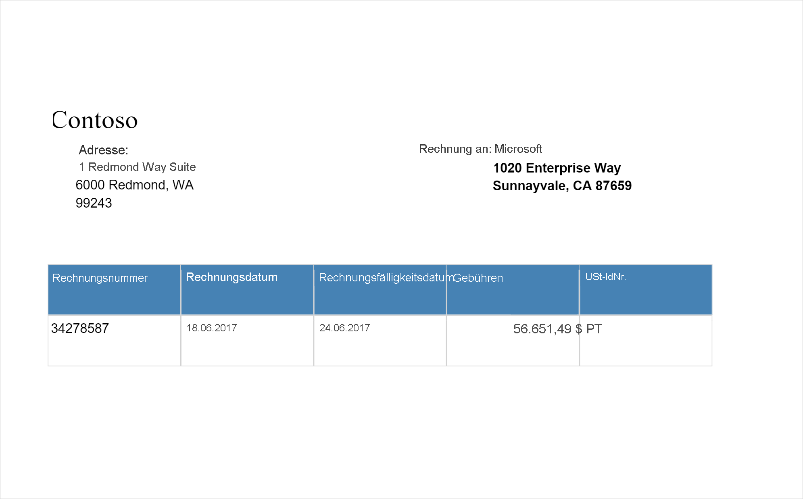

# <a name="tutorial-form-recognizer-with-applied-ai-service"></a>Tutorial: Formularerkennung mit Applied AI Service

[Azure-Formularerkennung](../../applied-ai-services/form-recognizer/index.yml) ist ein Feature von [Azure Applied AI Services](../../applied-ai-services/index.yml), das Ihnen mithilfe von Technologie für maschinelles Lernen ermöglicht, eine Anwendung für die automatisierte Dokumentverarbeitung zu erstellen. In diesem Tutorial erfahren Sie, wie Sie in Azure Synapse Analytics Ihre Daten problemlos anreichern können. Mithilfe der [Formularerkennung](../../applied-ai-services/form-recognizer/index.yml) können Sie Formulare und Dokumente analysieren, um Text und Daten zu extrahieren, und eine strukturierte JSON-Ausgabe zurückgeben. Sie können schnell präzise und auf Ihre spezifischen Inhalte zugeschnittene Ergebnisse erzielen, ohne dass komplizierte manuelle Eingriffe oder umfangreiche Data Science-Kenntnisse erforderlich sind. 

Dieses Tutorial veranschaulicht den Einsatz der Formularerkennung mit [SynapseML](https://github.com/microsoft/SynapseML) für Folgendes:

> [!div class="checklist"]
> - Extrahieren von Text und Layout aus einem bestimmten Dokument
> - Erkennen und Extrahieren von Daten aus Belegen
> - Erkennen und Extrahieren von Daten aus Visitenkarten
> - Erkennen und Extrahieren von Daten aus Rechnungen
> - Erkennen und Extrahieren von Daten aus Ausweisdokumenten


Wenn Sie kein Azure-Abonnement besitzen, können Sie ein [kostenloses Konto](https://azure.microsoft.com/free/) erstellen, bevor Sie beginnen.


## <a name="prerequisites"></a>Voraussetzungen

- [Azure Synapse Analytics-Arbeitsbereich](../get-started-create-workspace.md) mit einem als Standardspeicher konfigurierten Azure Data Lake Storage Gen2-Speicherkonto. Für das hier verwendete Data Lake Storage Gen2-Dateisystem müssen Sie über die Rolle *Mitwirkender an Storage-Blobdaten* verfügen.
- Spark-Pool in Ihrem Azure Synapse Analytics-Arbeitsbereich. Ausführliche Informationen finden Sie unter [Erstellen eines Spark-Pools in Azure Synapse](../quickstart-create-sql-pool-studio.md).
- Vorkonfigurationsschritte im Tutorial [Konfigurieren von Cognitive Services in Azure Synapse](tutorial-configure-cognitive-services-synapse.md)


## <a name="get-started"></a>Erste Schritte
Öffnen Sie Synapse Studio, und erstellen Sie ein neues Notebook. Importieren Sie zunächst [SynapseML](https://github.com/microsoft/SynapseML). 

```python
import synapse.ml
from synapse.ml.cognitive import *
```

## <a name="configure-form-recognizer"></a>Konfigurieren der Formularerkennung 

Verwenden Sie die verknüpfte Formularerkennung, die Sie in den [Vorbereitungsschritten](tutorial-configure-cognitive-services-synapse.md) konfiguriert haben. 

```python
cognitive_service_name = "<Your linked service for form recognizer>"
```


## <a name="analyze-layout"></a>Analysieren des Layouts

Extrahiert Text- und Layoutinformationen aus einem bestimmten Dokument Das Eingabedokument muss einen der unterstützten Inhaltstypen aufweisen: „application/pdf“, „image/jpeg“, „image/png“ oder „image/tiff“.

### <a name="example-input"></a>Beispieleingabe


```python
from pyspark.sql.functions import col, flatten, regexp_replace, explode, create_map, lit

imageDf = spark.createDataFrame([
  ("<replace with your file path>/layout.jpg",)
], ["source",])

analyzeLayout = (AnalyzeLayout()
                 .setLinkedService(cognitive_service_name)
                 .setImageUrlCol("source")
                 .setOutputCol("layout")
                 .setConcurrency(5))


display(analyzeLayout
        .transform(imageDf)
        .withColumn("lines", flatten(col("layout.analyzeResult.readResults.lines")))
        .withColumn("readLayout", col("lines.text"))
        .withColumn("tables", flatten(col("layout.analyzeResult.pageResults.tables")))
        .withColumn("cells", flatten(col("tables.cells")))
        .withColumn("pageLayout", col("cells.text"))
        .select("source", "readLayout", "pageLayout"))
```

### <a name="expected-results"></a>Erwartete Ergebnisse


## <a name="analyze-receipts"></a>Analysieren von Belegen

Erkennt und extrahiert Daten aus Belegen mithilfe der optischen Zeichenerkennung (Optical Character Recognition, OCR) und unseres Belegmodells, sodass Sie problemlos strukturierte Daten aus Belegen wie Händlername- und telefonnummer, Transaktionsdatum und -summe und noch weitere Informationen extrahieren können.

### <a name="example-input"></a>Beispieleingabe


```python
imageDf2 = spark.createDataFrame([
  ("<replace with your file path>/receipt1.png",)
], ["image",])

analyzeReceipts = (AnalyzeReceipts()
                 .setLinkedService(cognitive_service_name)
                 .setImageUrlCol("image")
                 .setOutputCol("parsed_document")
                 .setConcurrency(5))


results = analyzeReceipts.transform(imageDf2).cache()
display(results.select("image", "parsed_document"))
```

### <a name="expected-results"></a>Erwartete Ergebnisse


## <a name="analyze-business-cards"></a>Analysieren von Visitenkarten
Erkennt und extrahiert Daten aus Visitenkarten mithilfe der optischen Zeichenerkennung (Optical Character Recognition, OCR) und unseres Visitenkartenmodells, sodass Sie aus Visitenkarten problemlos strukturierte Daten wie Kontakt- und Firmenname, Telefonnummern, E-Mail-Adressen und vieles mehr extrahieren können.
### <a name="example-input"></a>Beispieleingabe


```python
imageDf3 = spark.createDataFrame([
  ("<replace with your file path>/business_card.jpg",)
], ["source",])

analyzeBusinessCards = (AnalyzeBusinessCards()
                 .setLinkedService(cognitive_service_name)
                 .setImageUrlCol("source")
                 .setOutputCol("businessCards")
                 .setConcurrency(5))

display(analyzeBusinessCards
        .transform(imageDf3)
        .withColumn("documents", explode(col("businessCards.analyzeResult.documentResults.fields")))
        .select("source", "documents"))
```

### <a name="expected-results"></a>Erwartete Ergebnisse


## <a name="analyze-invoices"></a>Analysieren von Rechnungen
Erkennt und extrahiert Daten aus Rechnungen mithilfe der optischen Zeichenerkennung (Optical Character Recognition, OCR) und unserer Deep Learning-Modelle, sodass Sie aus Rechnungen problemlos strukturierte Daten extrahieren können, z. B. Kunde, Lieferant, Rechnungs-ID, Fälligkeitsdatum der Rechnung, Gesamtsumme, fälliger Rechnungsbetrag, Steuerbetrag, Lieferadresse, Rechnungsadresse, Posten und mehr.
### <a name="example-input"></a>Beispieleingabe

```python
imageDf4 = spark.createDataFrame([
  ("<replace with your file path>/invoice.png",)
], ["source",])

analyzeInvoices = (AnalyzeInvoices()
                 .setLinkedService(cognitive_service_name)
                 .setImageUrlCol("source")
                 .setOutputCol("invoices")
                 .setConcurrency(5))

display(analyzeInvoices
        .transform(imageDf4)
        .withColumn("documents", explode(col("invoices.analyzeResult.documentResults.fields")))
        .select("source", "documents"))
```
### <a name="expected-results"></a>Erwartete Ergebnisse


## <a name="analyze-id-documents"></a>Analysieren von Ausweisdokumenten
Erkennt und extrahiert Daten aus Ausweisdokumenten mithilfe der optischen Zeichenerkennung (Optical Character Recognition, OCR) und unseres Ausweisdokumentmodells, sodass Sie aus Ausweisdokumenten strukturierte Daten problemlos extrahieren können, z. B. Vorname, Nachname, Geburtsdatum, Ausweisnummer usw.
### <a name="example-input"></a>Beispieleingabe


```python
imageDf5 = spark.createDataFrame([
  ("<replace with your file path>/id.jpg",)
], ["source",])

analyzeIDDocuments = (AnalyzeIDDocuments()
                 .setLinkedService(cognitive_service_name)
                 .setImageUrlCol("source")
                 .setOutputCol("ids")
                 .setConcurrency(5))

display(analyzeIDDocuments
        .transform(imageDf5)
        .withColumn("documents", explode(col("ids.analyzeResult.documentResults.fields")))
        .select("source", "documents"))

```
### <a name="expected-results"></a>Erwartete Ergebnisse


## <a name="clean-up-resources"></a>Bereinigen von Ressourcen
Beenden Sie alle verbundenen Sitzungen (Notebooks), um sicherzustellen, dass die Spark-Instanz heruntergefahren wird. Der Pool wird heruntergefahren, wenn die im Apache Spark-Pool angegebene **Leerlaufzeit** erreicht wird. Sie können auch auf der Statusleiste am oberen Rand des Notebooks die Option **Sitzung beenden** auswählen.


## <a name="next-steps"></a>Nächste Schritte

* [Trainieren eines benutzerdefinierten Formularerkennungsmodells](../../applied-ai-services/form-recognizer/label-tool.md)
* [Beispiele für Synapse-Notebooks](https://github.com/Azure-Samples/Synapse/tree/main/MachineLearning) 
* [SynapseML-GitHub-Repository](https://github.com/microsoft/SynapseML)
