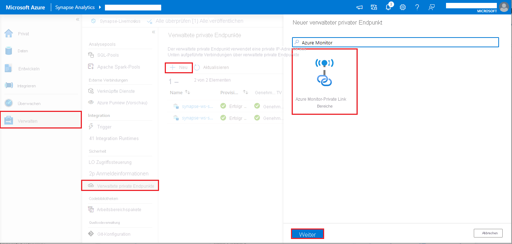

# <a name="monitor-apache-spark-applications-with-azure-log-analytics"></a>Überwachen von Apache Spark-Anwendungen mit Azure Log Analytics

In diesem Tutorial erfahren Sie, wie Sie den in Log Analytics integrierten Synapse Studio-Connector aktivieren. Anschließend können Sie Anwendungsmetriken und -protokolle von Apache Spark erfassen und an Ihren [Log Analytics-Arbeitsbereich](../../azure-monitor/logs/quick-create-workspace.md) senden. Abschließend können Sie eine Azure Monitor-Arbeitsmappe verwenden, um die Metriken und Protokolle zu visualisieren.

## <a name="configure-workspace-information"></a>Konfigurieren von Arbeitsbereichsinformationen

Führen Sie die folgenden Schritte aus, um die erforderlichen Informationen in Synapse Studio zu konfigurieren.

### <a name="step-1-create-a-log-analytics-workspace"></a>Schritt 1: Erstellen eines Log Analytics-Arbeitsbereichs

Informationen zum Erstellen dieses Arbeitsbereichs finden Sie in den folgenden Ressourcen:
- [Erstellen eines Log Analytics-Arbeitsbereichs im Azure-Portal](../../azure-monitor/logs/quick-create-workspace.md)
- [Beispiele für Resource Manager-Vorlagen für Log Analytics-Arbeitsbereiche in Azure Monitor](../../azure-monitor/logs/resource-manager-workspace.md)
- [Erstellen und Konfigurieren eines Log Analytics-Arbeitsbereichs in Azure Monitor mithilfe von PowerShell](../../azure-monitor/logs/powershell-workspace-configuration.md)

### <a name="step-2-prepare-an-apache-spark-configuration-file"></a>Schritt 2: Vorbereiten einer Apache Spark-Konfigurationsdatei

Verwenden Sie eine der folgenden Optionen, um die Datei vorzubereiten.

#### <a name="option-1-configure-with-log-analytics-workspace-id-and-key"></a>Option 1: Konfigurieren mit der ID und dem Schlüssel des Log Analytics-Arbeitsbereichs 

Kopieren Sie die folgende Apache Spark-Konfiguration, speichern Sie sie als *spark_loganalytics_conf.txt*, und füllen Sie die folgenden Parameter aus:

   - `<LOG_ANALYTICS_WORKSPACE_ID>`: ID des Log Analytics-Arbeitsbereichs
   - `<LOG_ANALYTICS_WORKSPACE_KEY>`: Log Analytics-Schlüssel. Diesen Schlüssel finden Sie im Azure-Portal unter **Azure Log Analytics-Arbeitsbereich** > **Agent-Verwaltung** > **Primärschlüssel**.

```properties
spark.synapse.logAnalytics.enabled true
spark.synapse.logAnalytics.workspaceId <LOG_ANALYTICS_WORKSPACE_ID>
spark.synapse.logAnalytics.secret <LOG_ANALYTICS_WORKSPACE_KEY>
```

#### <a name="option-2-configure-with-azure-key-vault"></a>Option 2: Konfigurieren mit Azure Key Vault

> [!NOTE]
> Benutzern, die Apache Spark-Anwendungen übermitteln, muss die Berechtigung zum Lesen von Geheimnissen erteilt werden. Weitere Informationen finden Sie unter [Gewähren des Zugriffs auf Key Vault-Schlüssel, -Zertifikate und -Geheimnisse mit der rollenbasierten Zugriffssteuerung in Azure](../../key-vault/general/rbac-guide.md). Wenn Sie dieses Feature in einer Synapse-Pipeline aktivieren, müssen Sie **Option 3** verwenden. Dies ist erforderlich, um das Geheimnis aus Azure Key Vault mit der verwalteten Identität des Arbeitsbereichs abzurufen.

Führen Sie die folgenden Schritte aus, um Azure Key Vault zum Speichern des Arbeitsbereichsschlüssels zu konfigurieren:

1. Erstellen Sie im Azure-Portal einen Schlüsseltresor, und navigieren Sie dorthin.
2. Wählen Sie auf der Seite mit den Einstellungen des Schlüsseltresors **Geheimnisse** aus.
3. Wählen Sie die Option **Generieren/Importieren** aus.
4. Wählen Sie auf dem Bildschirm **Geheimnis erstellen** folgende Werte aus:
   - **Name**: Geben Sie einen Namen für das Geheimnis ein. Geben Sie als Standardeinstellung `SparkLogAnalyticsSecret` ein.
   - **Wert**: Geben Sie als Geheimnis `<LOG_ANALYTICS_WORKSPACE_KEY>` ein.
   - Behalten Sie bei den anderen Optionen die Standardwerte bei. Klicken Sie anschließend auf **Erstellen**.
5. Kopieren Sie die folgende Apache Spark-Konfiguration, speichern Sie sie als *spark_loganalytics_conf.txt*, und füllen Sie die folgenden Parameter aus:

   - `<LOG_ANALYTICS_WORKSPACE_ID>`: Die ID des Log Analytics-Arbeitsbereichs
   - `<AZURE_KEY_VAULT_NAME>`: Der von Ihnen konfigurierte Schlüsseltresorname
   - `<AZURE_KEY_VAULT_SECRET_KEY_NAME>` (optional): Der Geheimnisname im Schlüsseltresor für den Arbeitsbereichsschlüssel. Der Standardwert lautet `SparkLogAnalyticsSecret`.

```properties
spark.synapse.logAnalytics.enabled true
spark.synapse.logAnalytics.workspaceId <LOG_ANALYTICS_WORKSPACE_ID>
spark.synapse.logAnalytics.keyVault.name <AZURE_KEY_VAULT_NAME>
spark.synapse.logAnalytics.keyVault.key.secret <AZURE_KEY_VAULT_SECRET_KEY_NAME>
```

> [!NOTE]
> Sie können auch die Arbeitsbereichs-ID in Key Vault speichern. Gehen Sie wie oben beschrieben vor, und speichern Sie die Arbeitsbereichs-ID mit dem Geheimnisnamen `SparkLogAnalyticsWorkspaceId`. Alternativ können Sie die Konfiguration `spark.synapse.logAnalytics.keyVault.key.workspaceId` verwenden, um den Geheimnisnamen der Arbeitsbereichs-ID in Key Vault anzugeben.

#### <a name="option-3-configure-with-a-linked-service"></a>Option 3. Konfigurieren mit einem verknüpften Dienst

> [!NOTE]
> Bei dieser Option müssen Sie der verwalteten Identität des Arbeitsbereichs Berechtigung zum Lesen von Geheimnissen erteilen. Weitere Informationen finden Sie unter [Gewähren des Zugriffs auf Key Vault-Schlüssel, -Zertifikate und -Geheimnisse mit der rollenbasierten Zugriffssteuerung in Azure](../../key-vault/general/rbac-guide.md).

Führen Sie die folgenden Schritte aus, um in Synapse Studio einen mit Key Vault verknüpften Dienst zum Speichern des Arbeitsbereichsschlüssels zu konfigurieren:

1. Führen Sie alle Schritte im vorherigen Abschnitt unter „Option 2“ aus.
2. Erstellen Sie in Synapse Studio einen mit Key Vault verknüpften Dienst:

    a. Navigieren Sie zu **Synapse Studio** > **Verwalten** > **Verknüpfte Dienste**, und wählen Sie dann **Neu** aus.

    b. Suchen Sie mithilfe des Suchfelds nach **Azure Key Vault**.

    c. Geben Sie einen Namen für den verknüpften Dienst ein.

    d. Wählen Sie Ihren Schlüsseltresor und dann **Erstellen** aus.

3. Fügen Sie der Apache Spark-Konfiguration ein Element vom Typ `spark.synapse.logAnalytics.keyVault.linkedServiceName` hinzu.

```properties
spark.synapse.logAnalytics.enabled true
spark.synapse.logAnalytics.workspaceId <LOG_ANALYTICS_WORKSPACE_ID>
spark.synapse.logAnalytics.keyVault.name <AZURE_KEY_VAULT_NAME>
spark.synapse.logAnalytics.keyVault.key.secret <AZURE_KEY_VAULT_SECRET_KEY_NAME>
spark.synapse.logAnalytics.keyVault.linkedServiceName <LINKED_SERVICE_NAME>
```

#### <a name="available-apache-spark-configuration"></a>Verfügbare Apache Spark-Konfiguration

| Konfigurationsname | Standardwert | Beschreibung |
| ------------------ | ------------- | ----------- |
| spark.synapse.logAnalytics.enabled | false | „true“, um die Log Analytics-Senke für die Spark-Anwendungen zu aktivieren. Andernfalls „false“. |
| spark.synapse.logAnalytics.workspaceId | - | Die ID des Log Analytics-Zielarbeitsbereichs |
| spark.synapse.logAnalytics.secret | - | Das Geheimnis des Log Analytics-Zielarbeitsbereichs |
| spark.synapse.logAnalytics.keyVault.linkedServiceName   | - | Der Name des mit Key Vault verknüpften Diensts für die ID und den Schlüssel des Log Analytics-Arbeitsbereichs |
| spark.synapse.logAnalytics.keyVault.name | - | Der Name der Key Vault-Instanz für die ID und den Schlüssel von Log Analytics |
| spark.synapse.logAnalytics.keyVault.key.workspaceId | SparkLogAnalyticsWorkspaceId | Der Name des Key Vault-Geheimnisses für die ID des Log Analytics-Arbeitsbereichs |
| spark.synapse.logAnalytics.keyVault.key.secret | SparkLogAnalyticsSecret | Der Name des Key Vault-Geheimnisses für den Log Analytics-Arbeitsbereich |
| spark.synapse.logAnalytics.uriSuffix | ods.opinsights.azure.com | Das [URI-Suffix][uri_suffix] des Log Analytics-Zielarbeitsbereichs. Befindet sich Ihr Arbeitsbereich nicht in der globalen Azure-Region, muss das URI-Suffix an die entsprechende Cloud angepasst werden. |
| spark.synapse.logAnalytics.filter.eventName.match | - | Optional. Kommagetrennte Liste mit Spark-Ereignisnamen, um anzugeben, welche Ereignisse gesammelt werden sollen. Beispiel: `SparkListenerJobStart,SparkListenerJobEnd` |
| spark.synapse.logAnalytics.filter.loggerName.match | - | Optional. Kommagetrennte Liste mit log4j-Protokollierungsnamen, um anzugeben, welche Protokolle gesammelt werden sollen. Beispiel: `org.apache.spark.SparkContext,org.example.Logger` |
| spark.synapse.logAnalytics.filter.metricName.match | - | Optional. Kommagetrennte Liste mit Spark-Metriknamensuffixen, um anzugeben, welche Metriken gesammelt werden sollen. Beispiel: `jvm.heap.used`|

> [!NOTE]  
> - Für Azure China muss der Parameter `spark.synapse.logAnalytics.uriSuffix` auf `ods.opinsights.azure.cn` festgelegt werden. 
> - Für Azure Government muss der Parameter `spark.synapse.logAnalytics.uriSuffix` auf `ods.opinsights.azure.us` festgelegt werden. 

[uri_suffix]: ../../azure-monitor/logs/data-collector-api.md#request-uri


### <a name="step-3-upload-your-apache-spark-configuration-to-an-apache-spark-pool"></a>Schritt 3: Hochladen Ihrer Apache Spark-Konfiguration in einen Apache Spark-Pool
Sie können die Konfigurationsdatei in Ihren Apache Spark-Pool in Azure Synapse Analytics hochladen. In Synapse Studio:

   1. Wählen Sie **Verwalten** > **Apache Spark-Pools** aus.
   2. Wählen Sie neben Ihrem Apache Spark-Pool die Schaltfläche **...** aus.
   3. Wählen Sie **Apache Spark-Konfiguration** aus. 
   4. Wählen Sie **Hochladen** und dann die Datei *spark_loganalytics_conf.txt* aus.
   5. Wählen Sie **Hochladen** und dann **Anwenden** aus.

      > [!div class="mx-imgBorder"]
      > 

> [!NOTE] 
>
> Von allen an den Apache Spark-Pool übermittelten Apache Spark-Anwendungen wird die Konfigurationseinstellung verwendet, durch die Metriken und Protokolle der Apache Spark-Anwendung an den angegebenen Arbeitsbereich gepusht werden.

## <a name="submit-an-apache-spark-application-and-view-the-logs-and-metrics"></a>Übermitteln einer Apache Spark-Anwendung und Anzeigen der Protokolle und Metriken

Gehen Sie dazu wie folgt vor:

1. Übermitteln Sie eine Apache Spark-Anwendung an den im vorherigen Schritt konfigurierten Apache Spark-Pool. Sie können dazu eine der folgenden Methoden verwenden:
    - Führen Sie ein Notebook in Synapse Studio aus. 
    - Übermitteln Sie in Synapse Studio einen Apache Spark-Batchauftrag über eine Apache Spark-Auftragsdefinition.
    - Führen Sie eine Pipeline mit einer Apache Spark-Aktivität aus.

1. Navigieren Sie zum angegebenen Log Analytics-Arbeitsbereich, und sehen Sie sich die Anwendungsmetriken und -protokolle an, wenn die Apache Spark-Anwendung gestartet wird.

## <a name="write-custom-application-logs"></a>Schreiben von benutzerdefinierten Anwendungsprotokollen

Sie können die Apache Log4j-Bibliothek verwenden, um benutzerdefinierte Protokolle zu schreiben.

Ein Beispiel für Scala:

```scala
%%spark
val logger = org.apache.log4j.LogManager.getLogger("com.contoso.LoggerExample")
logger.info("info message")
logger.warn("warn message")
logger.error("error message")
```

Ein Beispiel für PySpark:

```python
%%pyspark
logger = sc._jvm.org.apache.log4j.LogManager.getLogger("com.contoso.PythonLoggerExample")
logger.info("info message")
logger.warn("warn message")
logger.error("error message")
```

## <a name="use-the-sample-workbook-to-visualize-the-metrics-and-logs"></a>Visualisieren der Metriken und Protokolle unter Verwendung der Beispielarbeitsmappe

1. [Laden Sie die Arbeitsmappe herunter.](https://aka.ms/SynapseSparkLogAnalyticsWorkbook)
2. Öffnen Sie die Arbeitsmappendatei, und kopieren Sie den Inhalt.
3. Wählen Sie im [Azure-Portal](https://portal.azure.com/) die Option **Log Analytics-Arbeitsbereich** > **Arbeitsmappen** aus. 
4. Öffnen Sie die Arbeitsmappe namens **Leer**. Verwenden Sie den Modus **Erweiterter Editor**, indem Sie das Symbol **</>** auswählen.
5. Fügen Sie den gesamten vorhandenen JSON-Code ein.
6. Wählen Sie **Anwenden** und dann **Bearbeitung abgeschlossen** aus.

    > [!div class="mx-imgBorder"]
    > 

    > [!div class="mx-imgBorder"]
    > 

Übermitteln Sie als Nächstes Ihre Apache Spark-Anwendung an den konfigurierten Apache Spark-Pool. Wenn sich die Anwendung im Ausführungszustand befindet, können Sie die ausgeführte Anwendung in der Dropdownliste der Arbeitsmappen auswählen.

> [!div class="mx-imgBorder"]
> 

Sie können die Arbeitsmappe anpassen. Beispielsweise können Sie Kusto-Abfragen verwenden und Warnungen konfigurieren.

> [!div class="mx-imgBorder"]
> 

## <a name="query-data-with-kusto"></a>Abfragen von Daten mit Kusto

Hier sehen Sie ein Beispiel für das Abfragen von Apache Spark-Ereignissen:

```kusto
SparkListenerEvent_CL
| where workspaceName_s == "{SynapseWorkspace}" and clusterName_s == "{SparkPool}" and livyId_s == "{LivyId}"
| order by TimeGenerated desc
| limit 100 
```

Hier sehen Sie ein Beispiel für das Abfragen von Treiber- und Executor-Protokollen der Apache Spark-Anwendung:

```kusto
SparkLoggingEvent_CL
| where workspaceName_s == "{SynapseWorkspace}" and clusterName_s == "{SparkPool}" and livyId_s == "{LivyId}"
| order by TimeGenerated desc
| limit 100
```

Und hier sehen Sie ein Beispiel für das Abfragen von Apache Spark-Metriken:

```kusto
SparkMetrics_CL
| where workspaceName_s == "{SynapseWorkspace}" and clusterName_s == "{SparkPool}" and livyId_s == "{LivyId}"
| where name_s endswith "jvm.total.used"
| summarize max(value_d) by bin(TimeGenerated, 30s), executorId_s
| order by TimeGenerated asc
```


## <a name="create-and-manage-alerts"></a>Erstellen und Verwalten von Warnungen

Benutzer können Abfragen ausführen, um Metriken und Protokolle mit einer bestimmten Häufigkeit auszuwerten und basierend auf den Ergebnissen eine Warnung auszulösen. Weitere Informationen finden Sie unter [Erstellen, Anzeigen und Verwalten von Protokollwarnungen mithilfe von Azure Monitor](../../azure-monitor/alerts/alerts-log.md).

## <a name="synapse-workspace-with-data-exfiltration-protection-enabled"></a>Synapse-Arbeitsbereich mit aktiviertem Schutz vor Datenexfiltration

Nachdem der Synapse-Arbeitsbereich mit aktiviertem [Schutz vor Datenexfiltration](../security/workspace-data-exfiltration-protection.md) erstellt wurde.

Wenn Sie dieses Feature aktivieren möchten, müssen Sie in den genehmigten Azure AD-Mandanten des Arbeitsbereichs verwaltete private Endpunktverbindungen mit [Azure Monitor Private Link-Bereichen ](../../azure-monitor/logs/private-link-security.md) (Azure Monitor Private Link Scopes, AMPLS) erstellen.

Sie können die folgenden Schritte ausführen, um eine verwaltete private Endpunktverbindung mit AMPLS zu erstellen:

1. Wenn kein AMPLS vorhanden ist, können Sie die Anweisungen unter [Verwenden von Azure Private Link zum Verbinden von Netzwerken mit Azure Monitor](../../azure-monitor/logs/private-link-security.md) befolgen, um einen zu erstellen.
2. Navigieren Sie in Azure-Portal zu Ihrem AMPLS. Klicken Sie auf der Seite **Azure Monitor-Ressourcen** auf **Hinzufügen**, um Ihrem Azure Log Analytics-Arbeitsbereich eine Verbindung hinzuzufügen.
3. Navigieren Sie zu **Synapse Studio > Verwalten > Verwaltete private Endpunkte**. Klicken Sie auf die Schaltfläche **Neu**, und wählen Sie **Azure Monitor Private Link-Bereiche** und dann **Weiter** aus.
   > [!div class="mx-imgBorder"]
   > 
4. Wählen Sie den von Ihnen erstellten Azure Monitor Private Link-Bereich aus, und klicken Sie auf die Schaltfläche **Erstellen**.
   > [!div class="mx-imgBorder"]
   > 
5. Die Bereitstellung des privaten Endpunkts dauert einige Minuten.
6. Navigieren Sie im Azure-Portal erneut zu Ihrem AMPLS. Wählen Sie auf der Seite **Private Endpunktverbindungen** die eingerichtete Verbindung und dann **Genehmigen** aus.

> [!NOTE] 
>  - Es gelten eine Reihe von Einschränkungen für das AMPLS-Objekt, die beim Planen der Einrichtung von Private Link zu beachten sind. Weitere Informationen zu diesen Grenzwerten finden Sie unter [Verwenden von Azure Private Link zum Verbinden von Netzwerken mit Azure Monitor](../../azure-monitor/logs/private-link-security.md). 
>  - Prüfen Sie, ob Sie die [erforderliche Berechtigung](../security/synapse-workspace-access-control-overview.md) zum Erstellen eines verwalteten privaten Endpunkts haben.

## <a name="next-steps"></a>Nächste Schritte

 - [Schnellstart: Erstellen eines serverlosen Apache Spark-Pools mithilfe von Synapse Studio](../quickstart-create-apache-spark-pool-studio.md)
 - [Erstellen, Entwickeln und Verwalten von Synapse Studio-Notebooks in Azure Synapse Analytics](./apache-spark-development-using-notebooks.md)
 - [Tutorial: Erstellen einer Apache Spark-Auftragsdefinition in Synapse Studio](./apache-spark-job-definitions.md)
 - [Sammeln von Apache Spark-Anwendungsprotokollen und -metriken mit einem Azure Storage Konto](./azure-synapse-diagnostic-emitters-azure-storage.md)
 - [Sammeln von Apache Spark-Anwendungsprotokollen und -metriken mit Azure Event Hubs](./azure-synapse-diagnostic-emitters-azure-eventhub.md)
