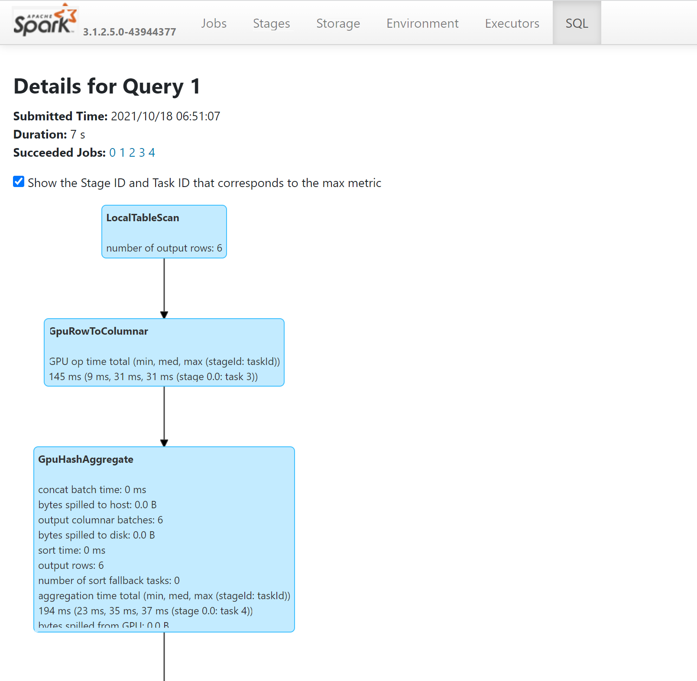

# <a name="apache-spark-gpu-accelerated-pools-in-azure-synapse-analytics"></a>Apache Spark-Pools mit GPU-Beschleunigung in Azure Synapse Analytics

Apache Spark ist ein Framework für die Parallelverarbeitung, das In-Memory-Verarbeitung unterstützt, um die Leistung von Big Data-Analyseanwendungen zu steigern. Apache Spark in Azure Synapse Analytics ist eine der cloudbasierten Apache Spark-Implementierungen von Microsoft. 

Azure Synapse ermöglicht jetzt die Erstellung von Azure Synapse GPU-fähigen Pools für die Ausführung von Spark-Workloads mithilfe von zugrunde liegenden [RAPIDS-Bibliotheken](https://nvidia.github.io/spark-rapids/). Hierbei wird die hohe Leistungsstärke in Bezug auf die Parallelverarbeitung der GPUs genutzt, um die Verarbeitung zu beschleunigen. Mit dem RAPIDS Accelerator für Apache Spark können Sie Ihre vorhandenen Spark-Anwendungen **ohne Codeänderung** ausführen, indem Sie lediglich eine Konfigurationseinstellung aktivieren, die für einen GPU-fähigen Pool vorkonfiguriert ist.
Sie können die RAPIDS-basierte GPU-Beschleunigung für Ihre Workload oder Teile davon aktivieren/deaktivieren, indem Sie diese Konfiguration festlegen:

```
spark.conf.set('spark.rapids.sql.enabled','true/false')
```

> [!NOTE]
> Azure Synapse GPU-fähige Pools befinden sich derzeit in Public Preview.

## <a name="rapids-accelerator-for-apache-spark"></a>RAPIDS Accelerator für Apache Spark

Der Spark RAPIDS Accelerator ist ein Plug-In, bei dem der physische Plan eines Spark-Auftrags durch unterstützte GPU-Vorgänge überschrieben wird. Diese Vorgänge werden dann auf den GPUs ausgeführt, um die Verarbeitung zu beschleunigen. Diese Bibliothek befindet sich derzeit in der Vorschauphase, und es werden nicht alle Spark-Vorgänge unterstützt. (Sehen Sie sich die [Liste mit den derzeit unterstützten Operatoren](https://nvidia.github.io/spark-rapids/docs/supported_ops.html) an. Weitere Unterstützung wird nach und nach in Form von Releases hinzugefügt.)

## <a name="cluster-configuration-options"></a>Konfigurationsoptionen für Cluster

Für das RAPIDS Accelerator-Plug-In wird nur eine 1:1-Zuordnung zwischen GPUs und Executors unterstützt. Dies bedeutet, dass ein Spark-Auftrag Executor- und Treiberressourcen anfordern muss, die durch die Poolressourcen abgedeckt werden können (basierend auf der Anzahl verfügbarer GPU- und CPU-Kerne). Um diese Bedingung zu erfüllen und eine optimale Auslastung aller Poolressourcen sicherzustellen, ist für eine Spark-Anwendung, die in GPU-fähigen Pools ausgeführt wird, die folgende Konfiguration der Treiber und Executors erforderlich:


|Poolgröße | Optionen für die Treibergröße | Treiberkerne | Treiberarbeitsspeicher (GB) | Executorkerne | Executorarbeitsspeicher (GB) | Anzahl von Executors |
| :------ | :-------------- | :---------- | :------------- | :------------- | :------------------- | :------------------ |
| GPU: Groß | Kleiner Treiber | 4 | 30 | 12 | 60 | Anzahl von Knoten im Pool |
| GPU: Groß | Mittlerer Treiber | 7 | 30 | 9 | 60 | Anzahl von Knoten im Pool |
| GPU: Sehr groß | Mittlerer Treiber | 8 | 40 | 14 | 80 | 4 * Anzahl von Knoten im Pool |
| GPU: Sehr groß | Großer Treiber | 12 | 40 | 13 | 80 | 4 * Anzahl von Knoten im Pool |


Workloads, die nicht einer der obigen Konfigurationen entsprechen, werden nicht akzeptiert. Hiermit wird sichergestellt, dass Spark-Aufträge mit der effizientesten und leistungsfähigsten Konfiguration und allen verfügbaren Ressourcen im Pool ausgeführt werden.

Der Benutzer kann die obige Konfiguration über seine Workload festlegen. Für Notebooks kann der Benutzer den Magic-Befehl `%%configure` verwenden, um eine der obigen Konfigurationen festzulegen (unten dargestellt).
Ein Beispiel hierfür ist die Verwendung eines großen Pools mit drei Knoten:

```
%%configure -f
{
    "driverMemory": "30g",
    "driverCores": 4,
    "executorMemory": "60g",
    "executorCores": 12,
    "numExecutors": 3
}
```

## <a name="run-a-sample-spark-job-through-notebook-on-an-azure-synapse-gpu-accelerated-pool"></a>Ausführen eines Spark-Beispielauftrags über ein Notebook in einem Azure Synapse-Pool mit GPU-Beschleunigung

Es ist hilfreich, wenn Sie sich vor dem Fortfahren mit diesem Abschnitt mit den [grundlegenden Konzepten der Nutzung eines Notebooks](apache-spark-development-using-notebooks.md) in Azure Synapse Analytics vertraut machen. Hier sind die Schritte zum Ausführen einer Spark-Anwendung mit GPU-Beschleunigung beschrieben. Sie können eine Spark-Anwendung in allen vier Sprachen schreiben, die in Synapse unterstützt werden: PySpark (Python), Spark (Scala), SparkSQL und .NET für Spark (C#).

1. Erstellen Sie einen GPU-fähigen Pool anhand der Beschreibung in [dieser Schnellstartanleitung](../quickstart-create-apache-gpu-pool-portal.md).

2. Erstellen Sie ein Notebook, und fügen Sie es an den GPU-fähigen Pool an, den Sie im ersten Schritt erstellt haben.

3. Legen Sie die Konfigurationen wie im vorherigen Abschnitt beschrieben fest.

4. Erstellen Sie einen Beispieldatenrahmen, indem Sie den folgenden Code in die erste Zelle Ihres Notebooks kopieren:

### <a name="scala"></a>[Scala](#tab/scala)

```scala
import org.apache.spark.sql.types.{IntegerType, StringType, StructField, StructType}
import org.apache.spark.sql.Row
import scala.collection.JavaConversions._

val schema = StructType( Array(
  StructField("emp_id", IntegerType),
  StructField("name", StringType),
  StructField("emp_dept_id", IntegerType),
  StructField("salary", IntegerType)
))

val emp = Seq(Row(1, "Smith", 10, 100000),
    Row(2, "Rose", 20, 97600),
    Row(3, "Williams", 20, 110000),
    Row(4, "Jones", 10, 80000),
    Row(5, "Brown", 40, 60000),
    Row(6, "Brown", 30, 78000)
  )

val empDF = spark.createDataFrame(emp, schema)
```

### <a name="python"></a>[Python](#tab/python)

```python
emp = [(1, "Smith", 10, 100000),
    (2, "Rose", 20, 97600),
    (3, "Williams", 20, 110000),
    (4, "Jones", 10, 80000),
    (5, "Brown", 40, 60000),
    (6, "Brown", 30, 78000)]

empColumns = ["emp_id", "name", "emp_dept_id", "salary"]

empDF = spark.createDataFrame(data=emp, schema=empColumns)
```

### <a name="c"></a>[C#](#tab/csharp)

```csharp
using Microsoft.Spark.Sql.Types;

var emp = new List<GenericRow>
{
    new GenericRow(new object[] { 1, "Smith", 10, 100000 }),
    new GenericRow(new object[] { 2, "Rose", 20, 97600 }),
    new GenericRow(new object[] { 3, "Williams", 20, 110000 }),
    new GenericRow(new object[] { 4, "Jones", 10, 80000 }),
    new GenericRow(new object[] { 5, "Brown", 40, 60000 }),
    new GenericRow(new object[] { 6, "Brown", 30, 78000 })
};

var schema = new StructType(new List<StructField>()
{
    new StructField("emp_id", new IntegerType()),
    new StructField("name", new StringType()),
    new StructField("emp_dept_id", new IntegerType()),
    new StructField("salary", new IntegerType())
});

DataFrame empDF = spark.CreateDataFrame(emp, schema);
```
---

5. Sie führen nun eine Aggregierung durch, indem Sie das höchste Gehalt nach Abteilungs-ID abrufen und das Ergebnis anzeigen:

### <a name="scala"></a>[Scala](#tab/scala1)

```scala
val resultDF = empDF.groupBy("emp_dept_id").max("salary")
resultDF.show()
```

### <a name="python"></a>[Python](#tab/python1)

```python
resultDF = empDF.groupBy("emp_dept_id").max("salary")
resultDF.show()
```

### <a name="c"></a>[C#](#tab/csharp1)

```csharp
DataFrame resultDF = empDF.GroupBy("emp_dept_id").Max("salary");
resultDF.Show();
```
---

6. Sie können die Vorgänge in Ihrer Abfrage verfolgen, die auf GPUs ausgeführt wurde, indem Sie sich den SQL-Plan auf dem Spark-Verlaufsserver ansehen: 

## <a name="how-to-tune-your-application-for-gpus"></a>Optimieren Ihrer Anwendung für GPUs

Für die meisten Spark-Aufträge kann die Leistung verbessert werden, indem die Standardwerte der Konfigurationseinstellungen optimiert werden. Dies gilt auch für Aufträge, für die das RAPIDS Accelerator-Plug-In für Apache Spark genutzt wird. Eine Anleitung zur Optimierung eines Spark-Auftrags für die Ausführung auf GPUs mit dem RAPIDS-Plug-In finden Sie in [dieser Dokumentation](https://nvidia.github.io/spark-rapids/docs/tuning-guide.html).

## <a name="quotas-and-resource-constraints-in-azure-synapse-gpu-enabled-pools"></a>Kontingente und Ressourceneinschränkungen in Azure Synapse GPU-fähigen Pools

### <a name="workspace-level"></a>Arbeitsbereichsebene

Jeder Azure Synapse-Arbeitsbereich verfügt über ein Standardkontingent von 50 virtuellen GPU-Kernen. Gehen Sie wie folgt vor, um für Ihr Kontingent an GPU-Kernen eine Erhöhung anzufordern: Senden Sie eine E-Mail an AzureSynapseGPU@microsoft.com, die den Namen Ihres Arbeitsbereichs, die Region und das insgesamt benötigte GPU-Kontingent für Ihre Workload enthält.

## <a name="next-steps"></a>Nächste Schritte
- [Azure Synapse Analytics](../overview-what-is.md)
