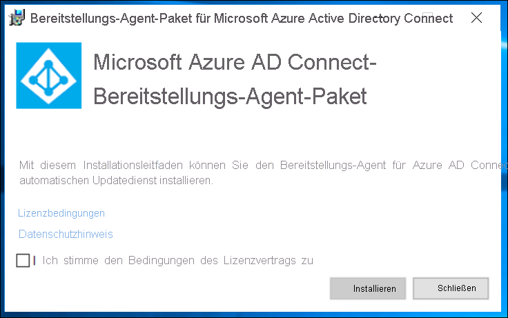

In diesem Dokument werden die Schritte beschrieben, die Sie ausführen müssen, um Benutzer aus Azure Active Directory (Azure AD) automatisch in einem LDAP-Verzeichnis bereitzustellen und deren Bereitstellungen wieder aufzuheben. Das Dokument konzentriert sich auf AD LDS, Sie können jedoch jedes der weiter unten erwähnten unterstützten LDAP-Verzeichnisse als Bereitstellungsziel verwenden. Über diese Lösung können keine Benutzer in Active Directory Domain Services bereitgestellt werden. 
 
Wichtige Details zum Zweck und zur Funktionsweise dieses Diensts sowie häufig gestellte Fragen finden Sie unter [Automatisieren der Bereitstellung und Bereitstellungsaufhebung von Benutzern für SaaS-Anwendungen mit Azure Active Directory](../articles/active-directory/app-provisioning/user-provisioning.md).

## <a name="prerequisites-for-provisioning-users-into-an-ldap-directory"></a>Voraussetzungen für die Bereitstellung von Benutzern in einem LDAP-Verzeichnis

>[!IMPORTANT]
> Die Vorschauversion zur lokalen Bereitstellung ist derzeit nur mit Einladung verfügbar. Um Zugriff auf die Funktion anzufordern, verwenden Sie das [Zugriffsanforderungsformular](https://aka.ms/onpremprovisioningpublicpreviewaccess). Wir öffnen die Vorschauversion im Rahmen der Vorbereitung auf die allgemeine Verfügbarkeit in den nächsten Monaten für weitere Kunden und Connectors. Die Bereitstellung von Benutzern in Active Directory Domain Services wird in dieser Vorschauversion nicht unterstützt. 


### <a name="on-premises-prerequisites"></a>Lokale Voraussetzungen

 - Ein Zielsystem wie Active Directory Lightweight Services (AD LDS), in dem Benutzer erstellt, aktualisiert und gelöscht werden können. Diese AD LDS-Instanz darf nicht zum Bereitstellen von Benutzern in Azure AD verwendet werden, da sonst möglicherweise eine Schleife mit Azure AD Connect entsteht. 
 - Ein Computer mit Windows Server 2016 oder höher, einer über das Internet zugänglichen TCP/IP-Adresse, Konnektivität mit dem Zielsystem und ausgehender Konnektivität mit login.microsoftonline.com. Ein Beispiel ist eine Windows Server 2016-VM, die in Azure IaaS oder hinter einem Proxy gehostet wird. Der Server sollte über mindestens 3 GB RAM verfügen.
 - Ein Computer mit .NET Framework 4.7.1
 - Optional: Es empfiehlt sich, [Microsoft Edge für Windows Server](https://www.microsoft.com/en-us/edge?r=1) herunterzuladen und anstelle von Internet Explorer zu verwenden. Dies ist jedoch nicht zwingend erforderlich.

Je nachdem, welche Optionen Sie auswählen, sind einige Bildschirme des Assistenten möglicherweise nicht verfügbar, und die Informationen können sich geringfügig unterscheiden. Für die Zwecke dieser Konfiguration wird der Objekttyp „Benutzer“ verwendet. Die folgenden Informationen können Ihnen bei der Konfiguration nützlich sein. 

#### <a name="supported-systems"></a>Unterstützte Systeme
* OpenLDAP
* Microsoft Active Directory Lightweight Directory Services
* 389 Directory Server
* Apache Directory Server
* IBM Tivoli DS
* Isode Directory
* NetIQ eDirectory
* Novell eDirectory
* Open DJ
* Open DS
* Open LDAP (openldap.org)
* Oracle (ehemals Sun) Directory Server Enterprise Edition
* RadiantOne Virtual Directory Server (VDS)
* Sun One Directory Server


### <a name="cloud-requirements"></a>Cloudanforderungen

 - Ein Azure AD-Mandant mit Azure AD Premium P1 oder Premium P2 (oder EMS E3 oder E5). 
 
    [!INCLUDE [active-directory-p1-license.md](active-directory-p1-license.md)]
 - Die Rolle „Hybridadministrator“ zum Konfigurieren des Bereitstellungs-Agents und die Rollen „Anwendungsadministrator“ oder „Cloudadministrator“ zum Konfigurieren der Bereitstellung im Azure-Portal.

### <a name="more-recommendations-and-limitations"></a>Weitere Empfehlungen und Einschränkungen
Bei den folgenden Punkten handelt es sich um weitere Empfehlungen und Einschränkungen.
- Für die Cloudsynchronisierung und die lokale App-Bereitstellung sollte nicht der gleiche Agent verwendet werden.  Microsoft empfiehlt die Verwendung separater Agents für die Cloudsynchronisierung und die lokale App-Bereitstellung.
- Für AD LDS können Benutzer derzeit nicht mit Kennwörtern bereitgestellt werden.  Daher müssen Sie entweder die Kennwortrichtlinie für AD LDS deaktivieren oder die Benutzer im deaktivierten Zustand bereitstellen.
- Die Bereitstellung von Benutzern aus Azure Active Directory in Active Directory Domain Services wird nicht unterstützt.
- Die Bereitstellung von Benutzern aus LDAP in Azure AD wird nicht unterstützt.

## <a name="prepare-the-ldap-directory"></a>Vorbereiten des LDAP-Verzeichnisses
Dieser Abschnitt enthält hilfreiche Informationen zur Erstellung einer AD LDS-Testumgebung.  In diesem Setup werden PowerShell und die Datei „ADAMInstall.exe“ mit einer Antwortdatei verwendet.  Dieses Dokument enthält keine ausführlichen Informationen zu AD LDS.  Weitere Informationen finden Sie in der [Übersicht über Active Directory Lightweight Directory Services](/previous-versions/windows/it-pro/windows-server-2012-r2-and-2012/hh831593(v=ws.11)). 

Wenn Sie AD LDS bereits in einer Testumgebung eingerichtet haben, können Sie die folgenden Abschnitte überspringen und direkt mit der Installation des ECMA-Hostconnectors fortfahren.

### <a name="create-an-ssl-certificate-a-test-directory-and-install-ad-lds"></a>Erstellen eines SSL-Zertifikats und eines Testverzeichnisses und Installieren von AD LDS
Verwenden Sie das PowerShell-Skript aus [Anhang A](#appendix-a---install-ad-lds-powershell-script). Das Skript führt die folgenden Aktionen aus:
  - Es erstellt ein selbstsigniertes Zertifikat, das später vom LDAP-Connector verwendet wird.
  - Es erstellt ein Verzeichnis für das Featureinstallationsprotokoll.
  - Es exportiert das Zertifikat aus dem persönlichen Speicher in das Verzeichnis.
  - Es importiert das Zertifikat in den vertrauenswürdigen Stamm des lokalen Computers.
  - Es installiert die AD LDS-Rolle auf dem virtuellen Computer. 

Führen Sie das Skript mithilfe von Windows PowerShell mit Administratorrechten auf dem virtuellen Windows Server-Computer aus, den Sie zum Testen des LDAP-Connectors verwenden.  

### <a name="create-an-instance-of-ad-lds"></a>Erstellen einer Instanz von AD LDS
Nach dem Installieren der Rolle muss eine Instanz von AD LDS erstellt werden.  Für die Instanzerstellung können Sie die weiter unten bereitgestellte Antwortdatei verwenden.  Mit dieser Datei wird die Instanz im Hintergrund ohne Verwendung der Benutzeroberfläche installiert.

Kopieren Sie den Inhalt aus [Anhang B](#appendix-b---answer-file) in den Editor, und speichern Sie das Ergebnis als **answer.txt** unter **C:\Windows\ADAM**.

Öffnen Sie als Nächstes eine Eingabeaufforderung mit Administratorrechten, und führen Sie den folgenden Befehl aus:

```
C:\Windows\ADAM> ADAMInstall.exe /answer:answer.txt
```

### <a name="create-containers-and-a-service-account-for-ad-lds"></a>Erstellen von Containern und eines Dienstkontos für AD LDS
Verwenden Sie nun das PowerShell-Skript aus [Anhang C](#appendix-c---populate-ad-lds-powershell-script). Das Skript führt die folgenden Aktionen aus:
  - Es erstellt einen Container für das Dienstkonto, das mit dem LDAP-Connector verwendet wird.
  - Es erstellt einen Container für die Cloudbenutzer.  In diesem Container werden Benutzer bereitgestellt.
  - Es erstellt das Dienstkonto in AD LDS.
  - Es aktiviert das Dienstkonto.
  - Es fügt das Dienstkonto der Rolle „AD LDS-Administratoren“ hinzu.

Führen Sie das Skript mithilfe von Windows PowerShell mit Administratorrechten auf dem virtuellen Windows Server-Computer aus, den Sie zum Testen des LDAP-Connectors verwenden.  

## <a name="grant-the-network-service-read-permissions-to-the-ssl-cert"></a>Erteilen von Netzwerkdienst-Leseberechtigungen für das SSL-Zertifikat
Damit SSL funktioniert, müssen Sie dem Netzwerkdienst Leseberechtigungen für das neu erstellte Zertifikat erteilen.  Gehen Sie zum Erteilen von Berechtigungen wie folgt vor:

 1. Navigieren Sie zu **C:\Program Data\Microsoft\Crypto\Keys**.
 2. Klicken Sie mit der rechten Maustaste auf die dort befindliche Systemdatei.  Sie ist mit einer GUID benannt.  In diesem Container wird das Zertifikat gespeichert.
    a. Eigenschaften auswählen
    b. Wählen Sie oben die Registerkarte **Sicherheit** aus c. Wählen Sie **Bearbeiten** aus.
    d. Klicken Sie auf **Hinzufügen**.
    e. Geben Sie **Netzwerkdienst** in das Feld ein, und wählen Sie **Namen überprüfen** aus.
    f. Wählen Sie in der Liste den Eintrag **NETZWERKDIENST** aus, und klicken Sie auf **OK**.
    g. Klicken Sie auf **OK**.
    h. Vergewissern Sie sich, dass das Netzwerkdienstkonto über Berechtigungen zum Lesen sowie zum Lesen und Ausführen verfügt, und klicken Sie anschließend auf **Übernehmen** und dann auf **OK**.

## <a name="verify-ssl-connectivity-with-ad-lds"></a>Überprüfen der SSL-Konnektivität mit AD LDS
Testen Sie nach dem Konfigurieren des Zertifikats und dem Erteilen von Berechtigungen für das Netzwerkdienstkonto die Konnektivität, um sich zu vergewissern, dass sie funktioniert.
 1. Öffnen Sie den Server-Manager, und wählen Sie links „AD LDS“ aus.
 2. Klicken Sie mit der rechten Maustaste auf Ihre Instanz von AD LDS, und wählen Sie im Kontextmenü die Option „Ldp.exe“ aus.
   [](media/active-directory-app-provisioning-ldap/ldp-1.png#lightbox)</br>
 3. Wählen Sie im oberen Bereich der Datei „Ldp.exe“ die Option **Verbindung** und anschließend **Verbinden** aus.
 4. Geben Sie die folgenden Informationen ein, und klicken Sie anschließend auf **OK**:
    - Server: APP3
    - Port: 636
    - Aktivieren Sie das Kontrollkästchen „SSL“. [</br>
 5.  Daraufhin sollten Sie eine Antwort wie die folgende erhalten:
   ](media/active-directory-app-provisioning-ldap/ldp-3.png#lightbox)</br>
 6.  Wählen Sie im oberen Bereich unter **Verbindung** die Option **Binden** aus.
 7. Übernehmen Sie die Standardwerte, und klicken Sie auf **OK**.
   [](media/active-directory-app-provisioning-ldap/ldp-4.png#lightbox)</br>
 8. Nun sollte eine Bindung mit der Instanz bestehen.
   [](media/active-directory-app-provisioning-ldap/ldp-5.png#lightbox)</br>


## <a name="download-install-and-configure-the-azure-ad-connect-provisioning-agent-package"></a>Herunterladen, Installieren und Konfigurieren des Azure AD Connect-Bereitstellungs-Agent-Pakets

 1. Melden Sie sich beim Azure-Portal an.
 2. Navigieren Sie zu **Unternehmensanwendungen** > **Neue Anwendung hinzufügen**.
 3. Suchen Sie nach der Anwendung **Lokale ECMA-App**, und fügen Sie sie Ihrem Mandanten hinzu.
 4. Wählen Sie die **lokale ECMA-App** aus, die hinzugefügt wurde.
 5. Wählen Sie unter **Erste Schritte** im Feld **3. Benutzerkonten bereitstellen** die Option **Erste Schritte** aus.
 6. Ändern Sie die Bereitstellung über die Dropdownliste im oberen Bereich in **Automatisch**.  Daraufhin wird unten **Lokale Konnektivität** angezeigt.
 7. Laden Sie unter **Lokale Konnektivität** das Agent-Installationsprogramm herunter.
 8. Führen Sie das Installationsprogramm für den Azure AD Connect-Bereitstellungs-Agent **AADConnectProvisioningAgentSetup.msi** aus.
 9. Akzeptieren Sie auf dem Bildschirm **Microsoft Azure AD Connect-Bereitstellungs-Agent-Paket** die Lizenzbedingungen, und wählen Sie **Installieren** aus.
     [](media/active-directory-app-provisioning-sql/install-1.png#lightbox)</br>
 10. Nach Abschluss dieses Vorgangs wird der Konfigurations-Assistent gestartet. Klicken Sie auf **Weiter**.
     [](media/active-directory-app-provisioning-sql/install-2.png#lightbox)</br>
 11. Wählen Sie auf dem Bildschirm **Erweiterung auswählen** die Option **Lokale Anwendungsbereitstellung (Azure AD in Anwendung)** aus. Klicken Sie auf **Weiter**.
     [](media/active-directory-app-provisioning-sql/install-3.png#lightbox)</br>
 12. Verwenden Sie Ihr globales Administratorkonto, um sich bei Azure AD anzumelden.
     [](media/active-directory-app-provisioning-sql/install-4.png#lightbox)</br>
 13. Wählen Sie auf dem Bildschirm **Agent-Konfiguration** die Option **Bestätigen** aus.
     [](media/active-directory-app-provisioning-sql/install-5.png#lightbox)</br>
 14. Nach Abschluss der Installation sollte im unteren Bereich des Assistenten eine Meldung angezeigt werden. Wählen Sie **Beenden** aus.
     [](media/active-directory-app-provisioning-sql/install-6.png#lightbox)</br>
 15. Wechseln Sie zurück zum Azure-Portal unter die Anwendung **lokale ECMA-App** und zurück zu **Bereitstellung bearbeiten**.
 16. Ändern Sie auf der Seite **Bereitstellung** den Modus in **Automatisch**.
     [](.\media\active-directory-app-provisioning-sql\configure-7.png#lightbox)</br>
 17. Wählen Sie im Abschnitt **Lokale Konnektivität** den Agent aus, den Sie gerade bereitgestellt haben, und wählen Sie dann **Agent(s) zuweisen** aus.
     [](.\media\active-directory-app-provisioning-ldap\assign-1.png#lightbox)</br>
     >[!NOTE]
     >Warten Sie nach dem Hinzufügen eines Agents 10 Minuten, bis die Registrierung abgeschlossen ist. Der Konnektivitätstest funktioniert erst, wenn die Registrierung abgeschlossen ist.
     >
     >Alternativ können Sie erzwingen, dass die Agent-Registrierung abgeschlossen wird, indem Sie den Bereitstellungs-Agent auf Ihrem Server neu starten. Navigieren Sie zu Ihrem Server, suchen Sie in der Windows-Suchleiste nach **Dienste** und dem **Bereitstellungs-Agent-Dienst von Azure AD Connect**, klicken Sie mit der rechten Maustaste auf den Dienst, und starten Sie ihn neu.

 ## <a name="configure-the-azure-ad-ecma-connector-host-certificate"></a>Konfigurieren des Azure AD-ECMA-Connectorhostzertifikats
 1. Wählen Sie auf dem Desktop die Verknüpfung „ECMA“ aus.
 2. Nachdem die Konfiguration des ECMA-Connectorhosts gestartet wurde, behalten Sie den Standardport **8585** bei, und wählen Sie **Generieren** aus, um ein Zertifikat zu generieren. Bei dem automatisch generierten Zertifikat handelt es sich um ein selbstsigniertes Zertifikat der vertrauenswürdigen Stammzertifizierungsstelle. Das SAN stimmt mit dem Hostnamen überein.
     [](.\media\active-directory-app-provisioning-sql\configure-1.png#lightbox)
 3. Wählen Sie **Speichern** aus.


## <a name="configure-a-generic-ldap-connector"></a>Konfigurieren eines generischen LDAP-Connectors
 1. Wählen Sie auf dem Desktop die Verknüpfung „ECMA-Connectorhost“ aus.
 2. Wählen Sie **Neuer Connector** aus.
     [](.\media\active-directory-app-provisioning-sql\sql-3.png#lightbox)</br>
 3. Füllen Sie auf der Seite **Eigenschaften** die Felder mit den Werten aus, die in der Tabelle unter dem Bild angegeben sind, und wählen Sie **Weiter** aus.
     [](.\media\active-directory-app-provisioning-ldap\create-1.png#lightbox)

     |Eigenschaft|Wert|
     |-----|-----|
     |Name|LDAP|
     |Zeitgeber für automatische Synchronisierung (Minuten)|120|
     |Geheimes Token|Geben Sie hier Ihren eigenen Schlüssel ein. Er sollte mindestens 12 Zeichen lang sein.|
     |Erweiterungs-DLL|Wählen Sie für einen generischen LDAP-Connector die Option **Microsoft.IAM.Connector.GenericLdap.dll** aus.|
4. Füllen Sie auf der Seite **Konnektivität** die Felder mit den Werten aus, die in der Tabelle unter dem Bild angegeben sind, und wählen Sie **Weiter** aus.
     [](.\media\active-directory-app-provisioning-ldap\create-2.png#lightbox)</br>
     
     |Eigenschaft|Wert|
     |-----|-----|
     |Host|APP3|
     |Port|636|
     |Verbindungstimeout|180|
     |Bindung|SSL|
     |Benutzername|CN=svcAccount,CN=ServiceAccounts,CN=App,DC=contoso,DC=lab|
     |Kennwort|Kennwort des angegebenen Benutzernamens|

     >[!NOTE]
     >Sollte bei der Verbindungsherstellung ein Problem auftreten, vergewissern Sie sich, dass das Dienstkonto in AD LDS aktiviert ist. 
     
 5. Klicken Sie auf der Seite **Global** auf **Weiter**.
 6. Lassen Sie die Seite **Partitionen** unverändert, und wählen Sie **Weiter** aus.
 7. Behalten Sie auf der Seite **Ausführungsprofile** die Aktivierung des Kontrollkästchens **Export** bei. Aktivieren Sie das Kontrollkästchen **Vollständiger Import**, und wählen Sie **Weiter** aus.
     [](.\media\active-directory-app-provisioning-ldap\create-3.png#lightbox)</br>
     
     |Eigenschaft|BESCHREIBUNG|
     |-----|-----|
     |Exportieren|Ausführungsprofil zum Exportieren von Daten in SQL. Dieses Ausführungsprofil ist erforderlich.|
     |Vollständiger Import|Ausführungsprofil zum Importieren aller Daten aus den zuvor angegebenen SQL-Quellen.|
     |Deltaimport|Ausführungsprofil, das nur Änderungen aus SQL seit dem letzten vollständigen oder Deltaimport importiert.|
 12. Übernehmen Sie auf der Seite **Export** die Standardwerte, und klicken Sie auf **Weiter**. 
 13. Übernehmen Sie auf der Seite **Vollständiger Import** die Standardwerte, und klicken Sie auf **Weiter**. 
 14. Füllen Sie die Felder auf der Seite **Objekttypen** aus, und wählen Sie **Weiter** aus. In der Tabelle unter der Abbildung finden Sie Anweisungen für die einzelnen Felder.
      - **Zielobjekt:** Das Zielobjekt im LDAP-Verzeichnis.
      - **Anker:** Dieses Attribut muss im Zielsystem eindeutig sein. Der Azure AD-Bereitstellungsdienst fragt nach dem ersten Zyklus mithilfe dieses Attributs den ECMA-Host ab. Dieser Ankerwert muss mit dem Ankerwert in Schema 3 identisch sein.
      - **Abfrageattribut:** wird vom ECMA-Host zum Abfragen des In-Memory-Caches verwendet. Dieses Attribut muss eindeutig sein.
      - **DN:** Der Distinguished Name des Zielobjekts.
     [](.\media\active-directory-app-provisioning-ldap\create-4.png#lightbox)</br>
     
     |Eigenschaft|BESCHREIBUNG|
     |-----|-----|
     |Zielobjekt|Benutzer|
     |Anchor|objectGUID|
     |Abfrageattribut|_distingusishedName|
     |DN|dn|
     |Automatisch generiert|unchecked|      
 15. Der ECMA-Host erkennt die vom Zielsystem unterstützten Attribute. Sie können wählen, welches dieser Attribute Sie für Azure AD verfügbar machen möchten. Diese Attribute können dann im Azure-Portal für die Bereitstellung konfiguriert werden. Fügen Sie auf der Seite **Attribute auswählen** alle Attribute in der Dropdownliste hinzu, und wählen Sie **Weiter** aus.
     [](.\media\active-directory-app-provisioning-ldap\create-5.png#lightbox)</br>
      In der Dropdownliste **Attribut** werden alle Attribute angezeigt, die im Zielsystem gefunden wurden und *nicht* auf der vorherigen Seite **Attribute auswählen** ausgewählt wurden. 
 
 16. Wählen Sie auf der Seite **Bereitstellung aufheben** unter **Flow deaktivieren** die Option **Löschen** aus. Die auf der vorherigen Seite ausgewählten Attribute können auf der Seite „Bereitstellung aufheben“ nicht ausgewählt werden. Wählen Sie **Fertig stellen** aus.

## <a name="ensure-ecma2host-service-is-running"></a>Sicherstellen, dass der ECMA2Host-Dienst ausgeführt wird
 1. Wählen Sie auf dem Server, auf dem der Azure AD-ECMA-Connectorhost ausgeführt wird, **Starten** aus.
 2. Geben Sie **run** (Ausführen) und **services.msc** in das Feld ein.
 3. Stellen Sie sicher, dass **Microsoft ECMA2Host** in der in der Liste **Dienste** enthalten ist und ausgeführt wird. Wählen Sie andernfalls **Starten** aus.
     [](.\media\active-directory-app-provisioning-sql\configure-2.png#lightbox)


## <a name="test-the-application-connection"></a>Testen der Verbindung zur Anwendung
 1. Melden Sie sich beim Azure-Portal an.
 2. Wechseln Sie zu **Unternehmensanwendungen** und der Anwendung **Lokale ECMA-App**.
 3. Wechseln Sie zu **Bereitstellung bearbeiten**.
 4. Geben Sie nach 10 Minuten im Abschnitt **Administratoranmeldeinformationen** die folgende URL ein. Ersetzen Sie den Teil `connectorName` durch den Namen des Connectors auf dem ECMA-Host. Sie können auch `localhost` durch den Hostnamen ersetzen.

    |Eigenschaft|Wert|
    |-----|-----|
    |Mandanten-URL|https://localhost:8585/ecma2host_connectorName/scim|
 
 5. Geben Sie den Wert des **geheimen Tokens** ein, das Sie beim Erstellen des Connectors definiert haben.
 6. Wählen Sie **Verbindung testen** aus, und warten Sie eine Minute.
     [](.\media\active-directory-app-provisioning-ldap\test-1.png#lightbox)
 7. Wenn der Verbindungstest erfolgreich war, wählen Sie **Speichern** aus.</br>
     [](.\media\active-directory-app-provisioning-sql\configure-9.png#lightbox)
## <a name="assign-users-to-an-application"></a>Zuweisen von Benutzern zu einer Anwendung
Da der Azure AD-ECMA-Connectorhost und Azure AD nun miteinander kommunizieren, können Sie mit der Konfiguration des Bereitstellungsbereichs fortfahren. 

 1. Wählen Sie im Azure-Portal die Option **Unternehmensanwendungen** aus.
 2. Wählen Sie die Anwendung **Lokale Bereitstellung** aus.
 3. Wählen Sie links unter **Verwalten** die Option **Benutzer und Gruppen** aus.
 4. Wählen Sie **Benutzer/Gruppe hinzufügen** aus.
     [](.\media\active-directory-app-provisioning-sql\app-2.png#lightbox)
5. Wählen Sie unter **Benutzer** die Option **Keine Elemente ausgewählt** aus.
     [](.\media\active-directory-app-provisioning-sql\app-3.png#lightbox)
 6. Wählen Sie auf der rechten Seite Benutzer und dann die Schaltfläche **Auswählen** aus.</br>
     [](.\media\active-directory-app-provisioning-sql\app-4.png#lightbox)
 7. Wählen Sie nun **Zuweisen** aus.
     [](.\media\active-directory-app-provisioning-sql\app-5.png#lightbox)


#### <a name="configure-attribute-mapping"></a>Konfigurieren von Attributzuordnungen
 1. Wählen Sie im Azure AD-Portal unter **Unternehmensanwendungen** die Seite **Bereitstellung** aus.
 2. Klicken Sie auf **Get started** (Los geht‘s).
 3. Erweitern Sie **Zuordnungen**, und wählen Sie **Azure Active Directory-Benutzer bereitstellen** aus.
 4. Wählen Sie **Neue Zuordnung hinzufügen** aus.
 5. Geben Sie die Quell- und Zielattribute an, und fügen Sie alle Zuordnungen in der folgenden Tabelle hinzu.

     |Zuordnungstyp|Quellattribut|Zielattribut|
     |-----|-----|-----|
     |Direkt|userPrincipalName|urn:ietf:params:scim:schemas:extension:ECMA2Host:2.0:User:userPrincipalName|
     |Ausdruck|Join("", "CN=", Word([userPrincipalName], 1, "@"), ",CN=CloudUsers,CN=App,DC=Contoso,DC=lab")|urn:ietf:params:scim:schemas:extension:ECMA2Host:2.0:User:-dn-|
     |Direkt|isSoftDeleted|urn:ietf:params:scim:schemas:extension:ECMA2Host:2.0:User:msDS-UserAccountDisabled|
     |Direkt|displayName|urn:ietf:params:scim:schemas:extension:ECMA2Host:2.0:User:displayName|
     |Direkt|objectId|urn:ietf:params:scim:schemas:extension:ECMA2Host:2.0:User:objectGUID|
  
     [](.\media\active-directory-app-provisioning-ldap\map-1.png#lightbox)
 
 6. Wählen Sie **Speichern** aus.

## <a name="disable-the-local-password-policy"></a>Deaktivieren der lokalen Kennwortrichtlinie
Derzeit werden Benutzer vom LDAP-Connector mit einem leeren Kennwort bereitgestellt.  Da diese Bereitstellung die lokale Kennwortrichtlinie auf dem Server nicht erfüllt, wird sie zu Testzwecken deaktiviert.  Gehen Sie zum Deaktivieren der Kennwortkomplexität wie folgt vor:

>[!IMPORTANT]
>Da die laufende Kennwortsynchronisierung kein Feature der lokalen LDAP-Bereitstellung ist, empfiehlt Microsoft, AD LDS speziell mit Verbundanwendungen, in Kombination mit AD DS oder beim Aktualisieren vorhandener Benutzer in einer Instanz von AD LDS zu verwenden.
 
 1. Klicken Sie auf dem Server auf **Start** > **Ausführen**, und führen Sie **gpedit.msc** aus.
 2. Navigieren Sie im **Editor für lokale Gruppenrichtlinien** zu „Computerkonfiguration“ > „Windows-Einstellungen“ > „Sicherheitseinstellungen“ > „Kontorichtlinien“ > „Kennwortrichtlinien“.
 3. Doppelklicken Sie auf der rechten Seite auf **Kennwort muss Komplexitätsvoraussetzungen entsprechen**, und wählen Sie **Deaktiviert** aus.
  [](.\media\active-directory-app-provisioning-ldap\local-1.png#lightbox)</br>
 5. Klicken Sie auf **Übernehmen** und anschließend auf **OK**.
 6. Schließen Sie den Editor für lokale Gruppenrichtlinien.
 
## <a name="test-provisioning"></a>Testen der Bereitstellung
Nachdem Ihre Attribute nun zugeordnet sind, können Sie die bedarfsorientierte Bereitstellung mit einem Ihrer Benutzer testen.
 
 1. Wählen Sie im Azure-Portal die Option **Unternehmensanwendungen** aus.
 2. Wählen Sie die Anwendung **Lokale Bereitstellung** aus.
 3. Wählen Sie links **Bereitstellung** aus.
 4. Klicken Sie auf **Bei Bedarf bereitstellen**.
 5. Suchen Sie nach einem Ihrer Testbenutzer, und wählen Sie **Bereitstellen** aus.
 [](.\media\active-directory-app-provisioning-ldap\test-2.png#lightbox)</br>

## <a name="start-provisioning-users"></a>Benutzerbereitstellung starten
 1. Nachdem die bedarfsorientierte Bereitstellung erfolgreich war, wechseln Sie zurück zur Konfigurationsseite der Bereitstellung. Stellen Sie sicher, dass der Bereich nur auf zugewiesene Benutzer und Gruppen festgelegt ist, aktivieren Sie die Bereitstellung (**On**), und wählen Sie **Speichern** aus.
 
 2. Warten Sie einige Minuten, bis die Bereitstellung gestartet wurde. Dies kann bis zu 40 Minuten dauern. Nachdem der Bereitstellungsauftrag wie im nächsten Abschnitt beschrieben abgeschlossen wurde, können Sie den Bereitstellungsstatus wieder deaktivieren (**Off**) und **Speichern** auswählen. Durch diese Aktion wird der Bereitstellungsdienst in Zukunft nicht mehr ausgeführt.

## <a name="check-that-users-were-successfully-provisioned"></a>Überprüfen der erfolgreichen Bereitstellung von Benutzern
Vergewissern Sie sich im Anschluss an die Wartezeit in AD LDS, dass neue Benutzer bereitgestellt werden.

 1. Öffnen Sie den Server-Manager, und wählen Sie links „AD LDS“ aus.
 2. Klicken Sie mit der rechten Maustaste auf Ihre Instanz von AD LDS, und wählen Sie im Kontextmenü die Option „Ldp.exe“ aus.
   [](media/active-directory-app-provisioning-ldap/ldp-1.png#lightbox)</br>
 3. Wählen Sie im oberen Bereich der Datei „Ldp.exe“ die Option **Verbindung** und anschließend **Verbinden** aus.
 4. Geben Sie die folgenden Informationen ein, und klicken Sie anschließend auf **OK**:
   - Server: APP3
   - Port: 636
   - Aktivieren Sie das Kontrollkästchen „SSL“. [](media/active-directory-app-provisioning-ldap/ldp-2.png#lightbox)</br>
 5. Wählen Sie im oberen Bereich unter **Verbindung** die Option **Binden** aus.
 6. Übernehmen Sie die Standardwerte, und klicken Sie auf **OK**.
 7. Wählen Sie im oberen Bereich die Option **Ansicht** und anschließend **Baum** aus.
 8. Geben Sie für den Basis-DN die Zeichenfolge **CN=App,DC=contoso,DC=lab** ein, und klicken Sie auf **OK**.
 9. Erweitern Sie auf der linken Seite den Distinguished Name, und klicken Sie auf **CN=CloudUsers,CN=App,DC=contoso,DC=lab**.  Daraufhin sollten Ihre Cloudbenutzer angezeigt werden.
  [](media/active-directory-app-provisioning-ldap/test-3.png#lightbox)</br>

## <a name="appendix-a---install-ad-lds-powershell-script"></a>Anhang A: PowerShell-Skript zum Installieren von AD LDS
PowerShell-Skript zum Automatisieren der Installation von Active Directory Lightweight Directory Services.


```powershell
# Filename:    1_SetupADLDS.ps1
# Description: Creates a certificate that will be used for SSL and installs Active Directory Lighetweight Directory Services.
#
# DISCLAIMER:
# Copyright (c) Microsoft Corporation. All rights reserved. This 
# script is made available to you without any express, implied or 
# statutory warranty, not even the implied warranty of 
# merchantability or fitness for a particular purpose, or the 
# warranty of title or non-infringement. The entire risk of the 
# use or the results from the use of this script remains with you.
#
#
#
#
#Declare variables
$DNSName = 'APP3'
$CertLocation = 'cert:\LocalMachine\MY'
$logpath = "c:\" 
$dirname = "test"
$dirtype = "directory"
$featureLogPath = "c:\test\featurelog.txt" 

#Create a new self-signed certificate
New-SelfSignedCertificate -DnsName $DNSName -CertStoreLocation $CertLocation

#Create directory
New-Item -Path $logpath -Name $dirname -ItemType $dirtype

#Export the certifcate from the local machine personal store
Get-ChildItem -Path cert:\LocalMachine\my | Export-Certificate -FilePath c:\test\allcerts.sst -Type SST

#Import the certificate in to the trusted root
Import-Certificate -FilePath "C:\test\allcerts.sst" -CertStoreLocation cert:\LocalMachine\Root


#Install AD LDS
start-job -Name addFeature -ScriptBlock { 
Add-WindowsFeature -Name "ADLDS" -IncludeAllSubFeature -IncludeManagementTools 
 } 
Wait-Job -Name addFeature 
Get-WindowsFeature | Where installed >>$featureLogPath


 ```

## <a name="appendix-b---answer-file"></a>Anhang B: Antwortdatei
Diese Datei dient zum Automatisieren und Erstellen einer Instanz von AD LDS.

>[!IMPORTANT]
> Dieses Skript verwendet den lokalen Administrator für das AD LDS-Dienstkonto, und das Kennwort ist in den Antworten hartcodiert.  Diese Aktion ist **ausschließlich zum Testen** vorgesehen und sollte niemals in einer Produktionsumgebung verwendet werden.

```
 [ADAMInstall]
 InstallType=Unique
 InstanceName=AD-APP-LDAP
 LocalLDAPPortToListenOn=51300
 LocalSSLPortToListenOn=51301
 NewApplicationPartitionToCreate=CN=App,DC=contoso,DC=lab
 DataFilesPath=C:\Program Files\Microsoft ADAM\AD-APP-LDAP\data
 LogFilesPath=C:\Program Files\Microsoft ADAM\AD-APP-LDAP\data
 ServiceAccount=APP3\Administrator
 ServicePassword=Pa$$Word1
 AddPermissionsToServiceAccount=Yes
 Administrator=APP3\Administrator
 ImportLDIFFiles="MS-User.LDF"
 SourceUserName=APP3\Administrator
 SourcePassword=Pa$$Word1
 ```
## <a name="appendix-c---populate-ad-lds-powershell-script"></a>Anhang C: PowerShell-Skript zum Auffüllen von AD LDS
PowerShell-Skript zum Auffüllen von AD LDS mit Containern und einem Dienstkonto.


```powershell
# Filename:    2_PopulateADLDS.ps1
# Description: Populates our AD LDS environment with 2 containers and a service account

# DISCLAIMER:
# Copyright (c) Microsoft Corporation. All rights reserved. This 
# script is made available to you without any express, implied or 
# statutory warranty, not even the implied warranty of 
# merchantability or fitness for a particular purpose, or the 
# warranty of title or non-infringement. The entire risk of the 
# use or the results from the use of this script remains with you.
#
#
#
#
# Create service accounts container
New-ADObject -Name "ServiceAccounts" -Type "container" -Path "CN=App,DC=contoso,DC=lab" -Server "APP3:389"
Write-Output "Creating ServiceAccounts container"

# Create cloud users container
New-ADObject -Name "CloudUsers" -Type "container" -Path "CN=App,DC=contoso,DC=lab" -Server "APP3:389"
Write-Output "Creating CloudUsers container"

# Create a new service account
New-ADUser -name "svcAccountLDAP" -accountpassword  (ConvertTo-SecureString -AsPlainText 'Pa$$1Word' -Force) -Displayname "LDAP Service Account" -server 'APP3:389' -path "CN=ServiceAccounts,CN=App,DC=contoso,DC=lab"
Write-Output "Creating service account"

# Enable the new service account
Enable-ADAccount -Identity "CN=svcAccountLDAP,CN=ServiceAccounts,CN=App,DC=contoso,DC=lab" -Server "APP3:389"
Write-Output "Enabling service account"

# Add the service account to the Administrators role
Get-ADGroup -Server "APP3:389" -SearchBase "CN=Administrators,CN=Roles,CN=App,DC=contoso,DC=lab" -Filter "name -like 'Administrators'" | Add-ADGroupMember -Members "CN=svcAccountLDAP,CN=ServiceAccounts,CN=App,DC=contoso,DC=lab"
Write-Output "Adding service accounnt to Administrators role"


 ```
