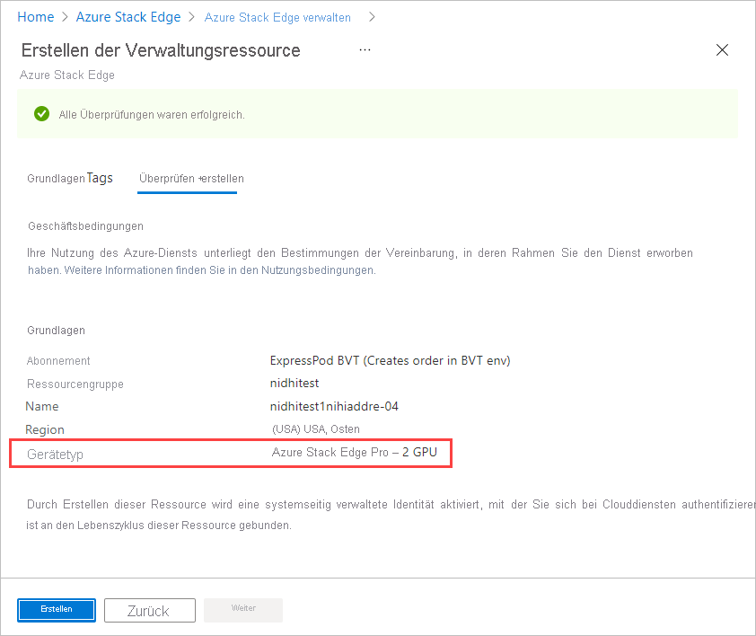

Gehen Sie wie folgt vor, um eine Verwaltungsressource für ein Gerät zu erstellen, das über Azure Edge Hardware Center bestellt wurde:

1. Melden Sie sich mit Ihren Microsoft Azure-Anmeldeinformationen beim Azure-Portal unter der folgenden URL an: [https://portal.azure.com](https://portal.azure.com).

1. Es gibt zwei Möglichkeiten, mit der Erstellung einer neuen Verwaltungsressource zu beginnen:

    - Über Azure Edge Hardware Center: Suchen Sie nach **Azure Edge Hardware Center**, und wählen Sie den Eintrag aus. Klicken Sie in Hardware Center auf **Alle Bestellartikel**. Aktivieren Sie das Element **Name**. Wählen Sie in der **Übersicht** der Elemente die Option **Hardware konfigurieren** aus.
    
       Die Option **Hardware konfigurieren** wird nach dem Versand eines Geräts angezeigt. 

        
    
    - In Azure Stack Edge: Suchen Sie nach **Azure Stack Edge**, und wählen Sie den Eintrag aus. Wählen Sie **+ Erstellen** aus. Wählen Sie dann **Create management resource** (Verwaltungsressource erstellen) aus.
    
        

    Der Assistent zum **Erstellen von Verwaltungsressourcen** wird geöffnet.

1. Legen Sie auf der Registerkarte **Grundlagen** die folgenden Einstellungen fest:

    |Einstellung                                  |Wert                                                                                       |
    |-----------------------------------------|--------------------------------------------------------------------------------------------|
    |**Ein Abonnement auswählen**1    |Wählen Sie das Abonnement aus, das Sie für die Verwaltungsressource verwenden möchten.                                 |
    |**Ressourcengruppe**1           |Wählen Sie die Ressourcengruppe aus, die Sie für die Verwaltungsressource verwenden möchten. |
    |**Name**                                 |Geben Sie einen Namen für die Verwaltungsressource an.                                                 |
    |**Azure-Ressourcen bereitstellen in**             |Wählen Sie das Land oder die Region aus, in dem bzw. der die Metadaten für die Verwaltungsressource gespeichert werden. Die Metadaten können sich an einem anderen Standort als das physische Gerät befinden. |
    |**Gerätetyp**2              |Wählen Sie den Gerätetyp aus. Diese Option entspricht der Konfiguration, die für das Hardwareprodukt in einer Azure Edge Hardware Center-Bestellung ausgewählt ist. Bei einem Gerät vom Typ „Azure Stack Edge Pro – GPU“ lautet der Gerätetyp beispielsweise entweder **Azure Stack Edge Pro – 1 GPU** oder **Azure Stack Edge Pro – 1 GPU**.|       

    1 Eine Organisation verwendet für die Bestellung von Geräten unter Umständen andere Abonnements und Ressourcengruppen als für ihre Verwaltung.

    2 Wenn Sie **Hardware konfigurieren** für den Bestellartikel verwenden, wird der Gerätetyp vom Bestellartikel abgeleitet, und es werden keine **GERÄTEDETAILS** angezeigt. 

    

    Wählen Sie zum Fortfahren **Überprüfen + erstellen** aus.

5. Überprüfen Sie auf der Registerkarte **Überprüfen + erstellen** die grundlegenden Einstellungen für die Verwaltungsressource und die Nutzungsbedingungen. Klicken Sie anschließend auf **Erstellen**.

    - Wenn Sie diesen Vorgang gestartet haben, indem Sie für einen zugestellten Artikel in Azure Edge Hardware Center auf **Hardware konfigurieren** geklickt haben, werden das Gerät, der Name der Auftragsressource und der Bestellstatus oben auf dem Bildschirm aufgeführt. 

      

    - Wenn Sie den Vorgang in Azure Stack Edge gestartet haben, wird anstelle der Informationen zur Gerätebestellung der Gerätetyp unter **Grundlagen** aufgeführt. 

        

    Die Schaltfläche **Erstellen** ist erst verfügbar, wenn alle Überprüfungen erfolgreich waren.

6. Nach Abschluss des Prozesses wird der Bereich „Übersicht“ für die neue Ressource geöffnet.

     
