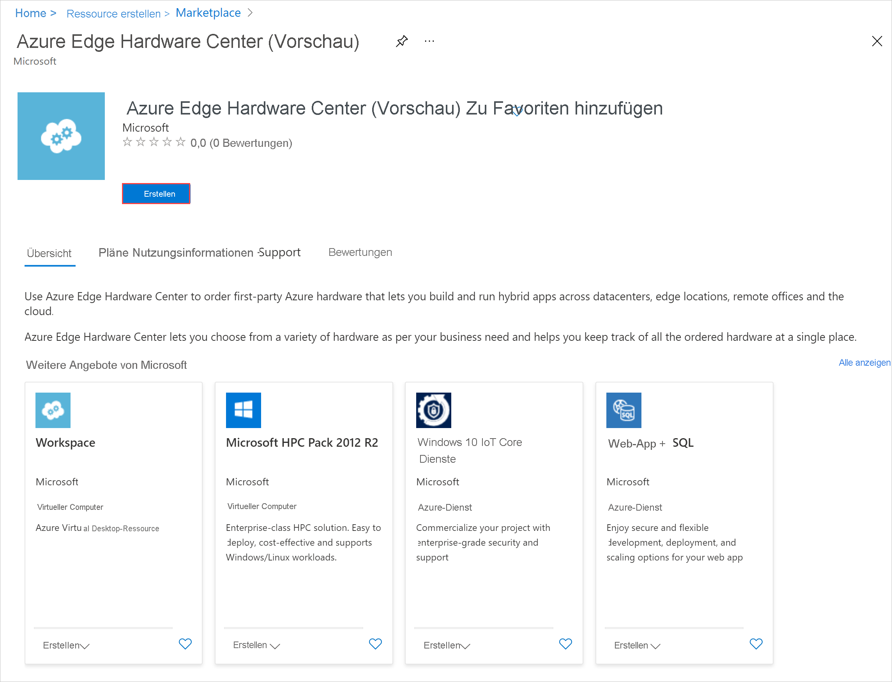
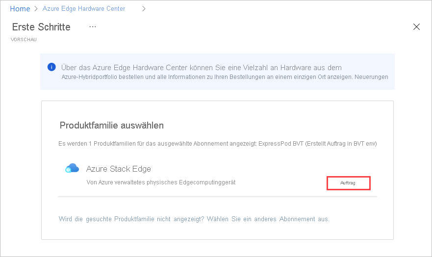
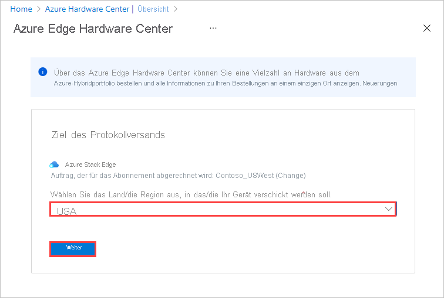
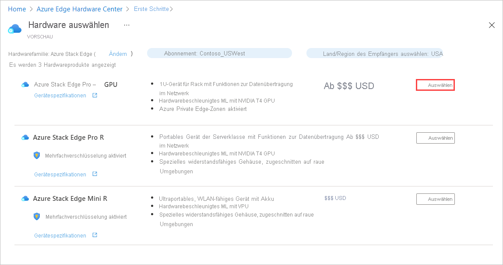
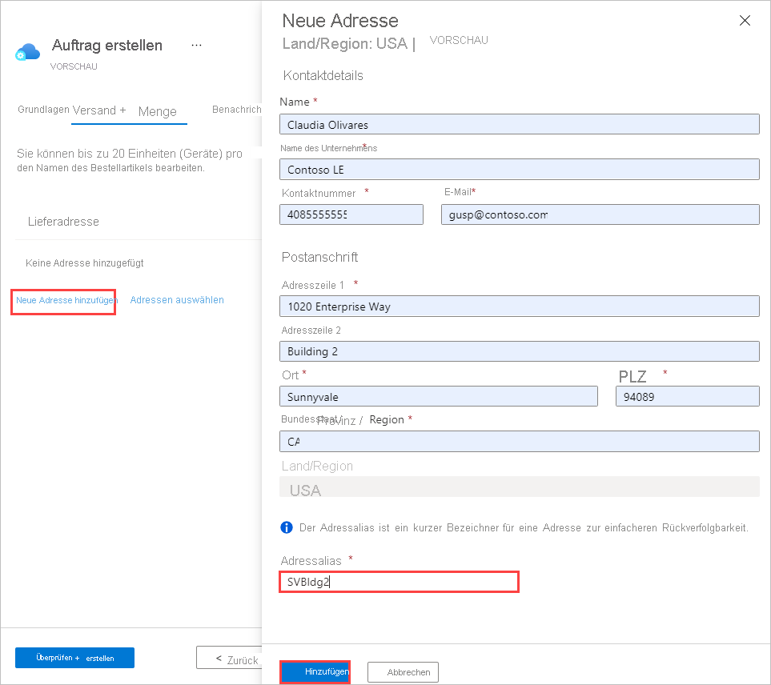
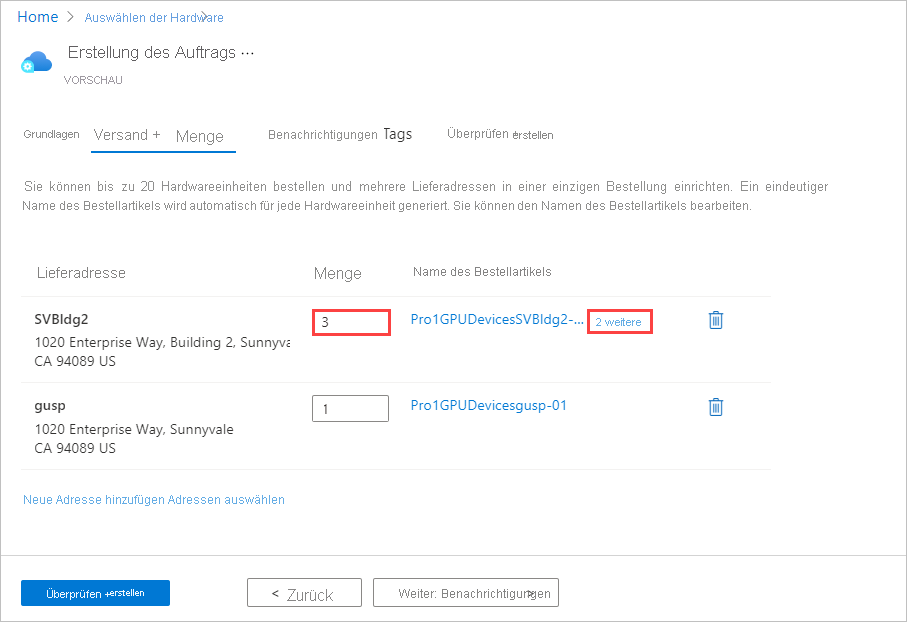
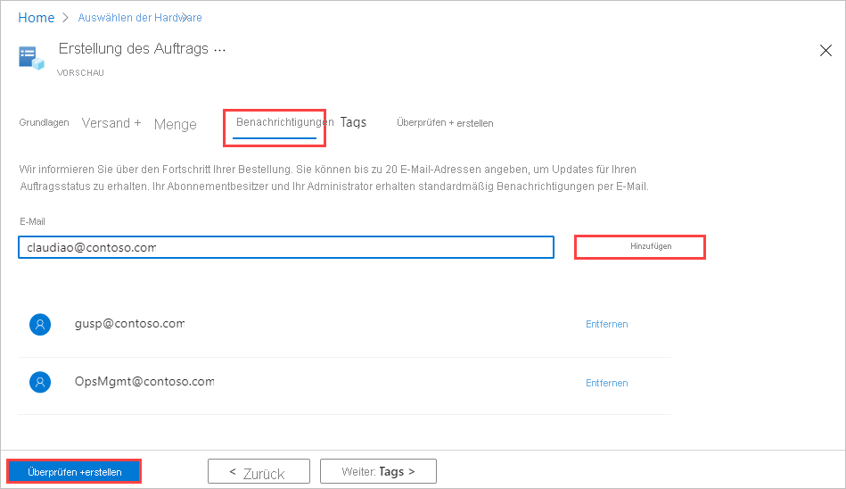
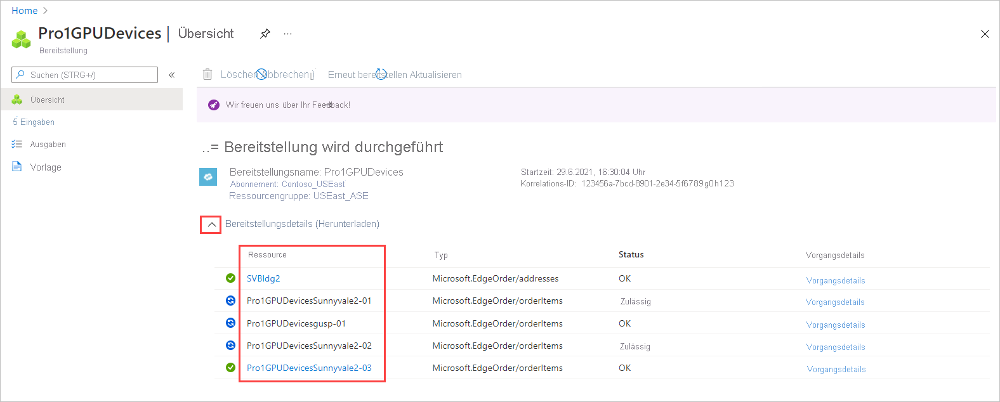

Führen Sie zum Aufgeben einer Bestellung über Azure Edge Hardware Center die folgenden Schritte aus:

1. Melden Sie sich mit Ihren Microsoft Azure-Anmeldeinformationen beim Azure-Portal unter der folgenden URL an: [https://portal.azure.com](https://portal.azure.com).

2. Wählen Sie **+ Ressource erstellen**. Suchen Sie nach **Azure Edge Hardware Center**, und wählen Sie den Eintrag aus. Wählen Sie in Azure Edge Hardware Center die Option **Erstellen** aus.

    

3. Wählen Sie ein Abonnement und dann **Weiter** aus.

    

4. Wählen Sie zum Starten der Bestellung die Option **Bestellung** neben der gewünschten Produktfamilie aus, etwa **Azure Stack Edge**. Wird die Produktfamilie nicht angezeigt, müssen Sie unter Umständen ein anderes Abonnement verwenden. Wählen Sie den Link **Wählen Sie ein anderes Abonnement aus.** aus. 

     

5. Wählen Sie das Versandziel für Ihre Bestellung aus.

    

6. Wählen Sie auf der Seite **Hardware auswählen** die Schaltfläche **Auswählen** aus, um das Hardwareprodukt für die Bestellung auszuwählen. Wählen Sie beispielsweise **Azure Stack Edge Pro – GPU** aus. 

    

    Wählen Sie nach dem Auswählen eines Hardwareprodukts die zu bestellende Gerätekonfiguration aus. Die folgenden Hardwareprodukte und Gerätekonfigurationen sind in Azure Edge Hardware Center (Vorschauversion) verfügbar.

    |Hardwareprodukt              |Konfigurationen                                                                                              |
    |------------------------------|------------------------------------------------------------------------------------------------------------|
    |Azure Stack Edge Pro: GPU    |<ul><li>Azure Stack Edge Pro – 1 GPU</li><li>Azure Stack Edge Pro – 2 GPU</li><ul>                          |
    |Azure Stack Edge Pro R        |<ul><li>Azure Stack Edge Pro R – Single Node</li><li>Azure Stack Edge Pro R – Single Node with UPS</li></ul>|
    |Azure Stack Edge Mini R       |Eine Konfiguration, die automatisch ausgewählt wird                 |

7. Wählen Sie die Gerätekonfiguration und dann **Auswählen** aus. Auf dem folgenden Bildschirm werden die verfügbaren Konfigurationen für Geräte vom Typ „Azure Stack Edge Pro – GPU“ angezeigt.

    Bei der Bestellung von Azure Stack Edge Mini R-Geräten, die alle über die gleiche Konfiguration verfügen, wird dieser Bildschirm nicht angezeigt. 

    

    Der Assistent zum **Erstellen einer Bestellung** wird geöffnet.

8.  Geben Sie auf der Registerkarte **Grundlagen** Werte für **Auftragsname**, **Ressourcengruppe** und **Region** ein. Wählen Sie dann **Weiter: Versand + Menge >** aus.

    
  
    Als Nächstes fügen Sie Lieferadressen für die Geräte hinzu und geben dann an, wie viele Geräte jeweils an die einzelnen Adressen gesendet werden sollen. Sie können bis zu 20 Einheiten (Geräte) pro Auftrag bestellen.

9. Fügen Sie auf der Registerkarte **Versand + Menge** die einzelnen Lieferadressen für den Versand der Geräte hinzu: 

    - Wählen Sie **Neue Adresse hinzufügen** aus, um eine neue Lieferadresse hinzuzufügen. 

       Im Feld **Adressalias** auf dem Bildschirm **Neue Adresse** wird die Adresse zur späteren Verwendung angegeben. Dieses Feld ist erforderlich. Wählen Sie **Hinzufügen** aus, wenn Sie die Adressfelder ausgefüllt haben. Verwenden Sie dann **Adressen auswählen**, um die Adresse Ihrer Bestellung hinzuzufügen.

       

    - Wählen Sie **Adressen auswählen** aus, um eine Lieferadresse aus einer vorherigen Bestellung oder eine soeben hinzugefügte Adresse zu verwenden. Wählen Sie dann auf dem Bildschirm **Adressen auswählen** mindestens eine Adresse und anschließend **Auswählen** aus.

       

    Die Registerkarte **Versand + Menge** enthält nun separate Elemente für jede Lieferadresse.

    Die einzelnen Namen der Bestellartikel enthalten ein Namenspräfix (der Bestellname gefolgt vom Adressalias) sowie eine Artikelnummer für jedes Gerät, das an die jeweilige Adresse gesendet wird.

    

10. Fügen Sie auf der Registerkarte **Versand + Menge** für jede Adresse die **Menge** der zu versendenden Geräte hinzu.

    Wenn Sie für die Menge einen anderen Wert als „1“ eingeben, wird nach dem Namen des Bestellartikels eine Bezeichnung vom Typ **+n weitere** angezeigt.

     

11. Wenn Sie die Namen von Bestellartikeln ändern möchten, wählen Sie den Namen des Bestellartikels aus, und klicken Sie darauf, um den Bereich **Rename order item** (Namen des Bestellartikels ändern) zu öffnen. Wenn Sie mehrere Artikel an eine Adresse versenden, wählen Sie **+n weitere** aus.

    Es gibt zwei Möglichkeiten zum Ändern des Namens:
 
    * Wenn Sie ein anderes Namenspräfix für alle Bestellartikel verwenden möchten, bearbeiten Sie den Wert unter **Namenspräfix**, und wählen Sie dann **Anwenden** aus, wie auf dem folgenden Bildschirm gezeigt.

    * Sie können auch die einzelnen Namen der Bestellartikel ändern. 

    Wählen Sie abschließend **Fertig** aus.

    

    Wählen Sie **Weiter: Benachrichtigungen >** aus, um den Vorgang fortzusetzen.

12. Wenn Sie Statusbenachrichtigungen zu Ihrer Bestellung erhalten möchten, geben Sie auf der Registerkarte **Benachrichtigungen** die E-Mail-Adressen der einzelnen Empfänger an. 

    Geben Sie zum Hinzufügen einer E-Mail-Adresse die Adresse ein, und wählen Sie **Hinzufügen** aus. Sie können bis zu 20 E-Mail-Adressen hinzufügen.

    

    Wenn Sie fertig sind, wählen Sie zum Fortfahren **Überprüfen + erstellen** aus.

13. Auf der Registerkarte **Überprüfen und erstellen**:

    1. Überprüfen Sie Ihre Bestellung. Die Bestellung wird automatisch überprüft, wenn Sie diesen Bildschirm öffnen. Wird das Banner **Fehler bei Überprüfung** angezeigt, müssen Sie die Probleme beheben, bevor Sie die Bestellung erstellen.
    
    1. Lesen Sie die **Datenschutzrichtlinien**, und aktivieren Sie das Kontrollkästchen, dass Sie sie akzeptieren.
 
    1. Klicken Sie auf **Erstellen**.

    

    Während der Bereitstellung wird die Bestellung mit dem Status der einzelnen Bestellartikel im Portal geöffnet. Nach Abschluss der Bereitstellung müssen Sie ggf. neben **Bereitstellungsdetails** auf den Pfeil nach unten klicken, um den Status einzelner Artikel anzuzeigen.

    

14. Wenn Sie Details für den Bestellartikel anzeigen möchten, wählen Sie den Artikel in der Spalte **Ressource** der Bereitstellungsdetails wie nachfolgend gezeigt aus:

    

15. Nach dem Versand eines Geräts (grünes Tag **Versendet**) wird den Artikeldetails die Option **Hardware konfigurieren** hinzugefügt. Wählen Sie diese Option aus, um eine Verwaltungsressource für das Gerät in Azure Stack Edge zu erstellen.    

    <!--Requested from Anam: Screenshot of an Azure Edge Hardware Center resource with Shipped status, with the Configure hardware option displayed. Graphical display of tags.-->

    Die Bereiche für Abonnement, Ressourcengruppe und Bereitstellung werden basierend auf der Bestellung ausgefüllt, Sie können diese Angaben jedoch ändern.

    

    Nach der Aktivierung des Geräts können Sie die Verwaltungsressource über den Artikel und den Bestellartikel über die Verwaltungsressource öffnen.<!--Detailed procedure to be provided in an article on managing Hardware Center orders.-->
