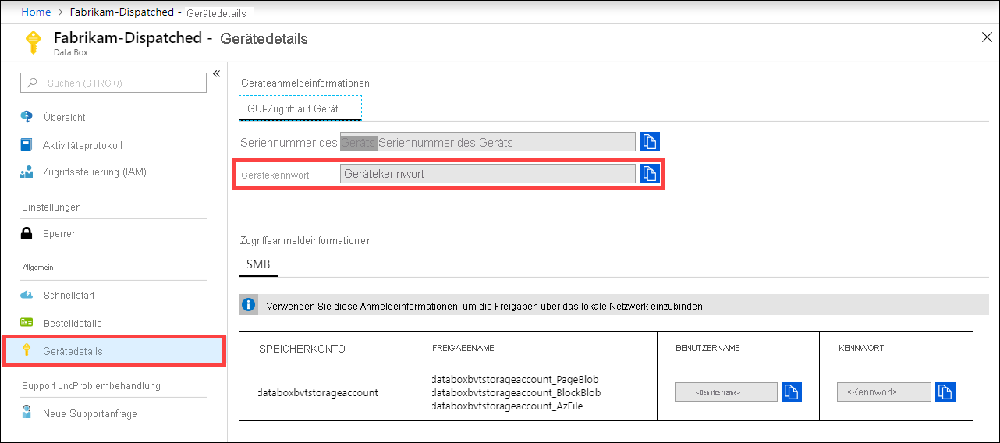

Melden Sie sich zum Abrufen des Gerätekennworts beim [Azure-Portal](https://portal.azure.com) an, und öffnen Sie Ihre Bestellung. Navigieren Sie zu **Allgemein > Gerätedetails**. Kopieren Sie das **Gerätekennwort**. 

