Führen Sie im Azure-Portal die folgenden Schritte aus, um ein Gerät zu bestellen:

1. Melden Sie sich mit Ihren Microsoft Azure-Anmeldeinformationen unter folgender URL an: [https://portal.azure.com](https://portal.azure.com).
2. Wählen Sie **+ Ressource erstellen** aus, und suchen Sie nach *Azure Data Box*. Wählen Sie **Azure Data Box** aus.

   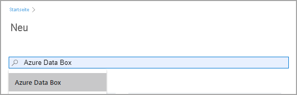

3. Klicken Sie auf **Erstellen**.  

   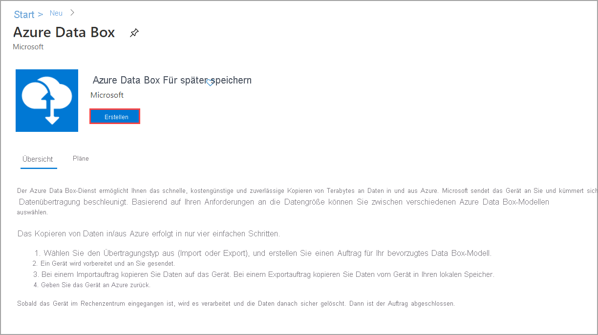

4. Überprüfen Sie, ob der Data Box-Dienst in Ihrer Region verfügbar ist. Geben Sie die folgenden Informationen ein (oder wählen Sie sie aus), und klicken Sie anschließend auf **Anwenden**:

    |Einstellung  |Wert  |
    |---------|---------|
    |Übertragungstyp     | Wählen Sie **Import in Azure** aus.        |
    |Subscription     | Wählen Sie ein EA-, CSP- oder Azure Sponsorship-Abonnement für den Data Box-Dienst aus.   Das Abonnement ist mit Ihrem Abrechnungskonto verknüpft.       |
    |Resource group | Wählen Sie eine vorhandene Ressourcengruppe aus. Eine Ressourcengruppe ist ein logischer Container für die Ressourcen, die zusammen verwaltet oder bereitgestellt werden können. |
    |Quellland/Quellregion    |    Wählen Sie das Land/die Region aus, in dem/der sich Ihre Daten zurzeit befinden.         |
    |Azure-Zielregion     |     Wählen Sie die Azure-Region aus, in die Daten übertragen werden sollen.   Weitere Informationen finden Sie unter [Regionale Verfügbarkeit](../articles/databox/data-box-overview.md#region-availability) (Data Box) bzw. unter [Regionale Verfügbarkeit](../articles/databox/data-box-heavy-overview.md#region-availability) (Data Box Heavy).  |

    

5. Wählen Sie aus, welches Data Box-Produkt Sie bestellen möchten: **Data Box** (wie unten dargestellt) oder Data Box Heavy. 

    

    Bei Data Box beträgt die maximal nutzbare Kapazität für eine einzelne Bestellung 80 TB. Bei Data Box Heavy beträgt die maximal nutzbare Kapazität für eine einzelne Bestellung 770 TB. Sie können mehrere Bestellungen für größere Datenmengen erstellen.

    Wenn Sie **Data Box Heavy** auswählen, überprüft das Data Box-Team die Geräteverfügbarkeit in Ihrer Region. Sie werden benachrichtigt, wenn Sie mit der Bestellung fortfahren können.

6. Navigieren Sie unter **Bestellung** zur Registerkarte **Allgemeine Informationen**, und geben Sie die folgenden Informationen ein, oder wählen Sie sie aus. Wählen Sie anschließend **Weiter: Datenziel>** aus.

    |Einstellung  |Wert  |
    |---------|---------|
    |Subscription      | Das Abonnement wird auf der Grundlage Ihrer zuvor getroffenen Auswahl automatisch eingetragen.|
    |Resource group    | Die Ressourcengruppe, die Sie zuvor ausgewählt haben. |
    |Name des Importauftrags | Geben Sie einen Anzeigenamen an, um die Bestellung nachzuverfolgen. <ul><li>Der Name kann zwischen drei und 24 Zeichen lang sein und Buchstaben, Zahlen und Bindestriche enthalten.</li><li>Der Name muss mit einem Buchstaben oder einer Zahl beginnen und enden.</li></ul>    |

    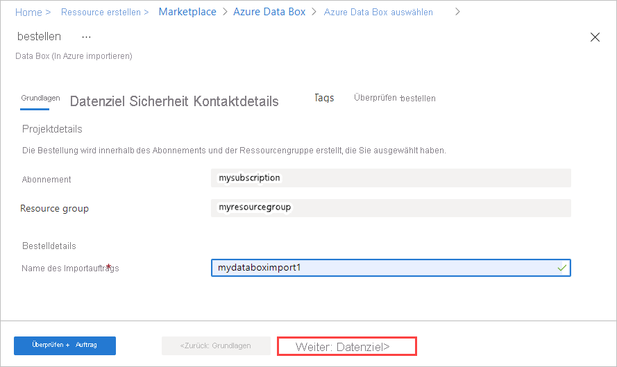

7. Wählen Sie auf dem Bildschirm **Datenziel** das **Datenziel** aus: entweder Speicherkonten oder verwaltete Datenträger.

    Wenn Sie als Speicherziel ein oder mehrere **Speicherkonten** verwenden, wird Folgendes angezeigt:

    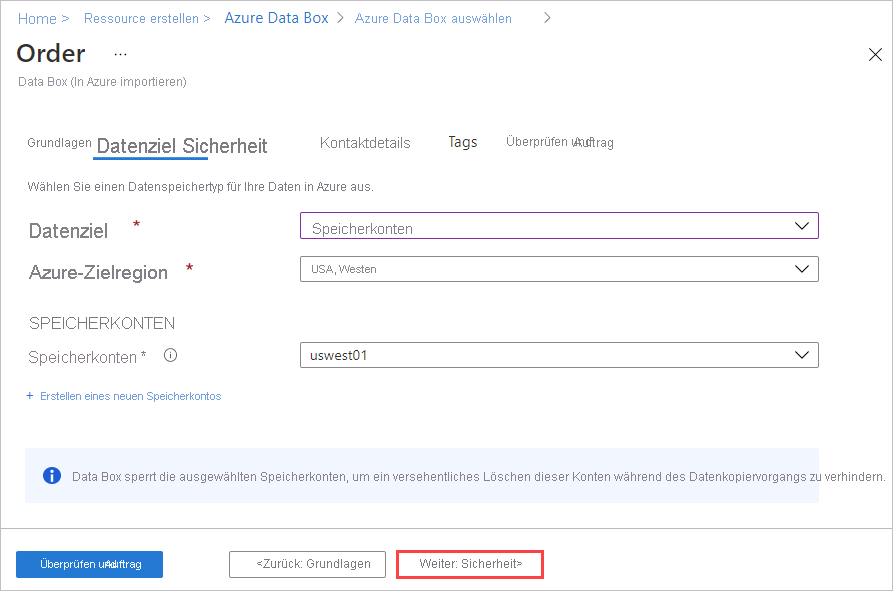

    Wählen Sie basierend auf der angegebenen Azure-Region mindestens ein Speicherkonto in der gefilterten Liste vorhandener Speicherkonten aus. Data Box kann mit bis zu zehn Speicherkonten verknüpft werden. Sie können auch ein neues Speicherkonto vom Typ **Universell V1** oder **Universell V2** oder ein **Blob Storage-Konto** erstellen.

   > [!NOTE]
   > - Bei der Auswahl von Azure-Premium-FileStorage-Konten wird das bereitgestellte Kontingent für die Azure-Speicherkontofreigabe auf die Größe der Daten erhöht, die auf die Dateifreigaben kopiert werden. Nach der Erhöhung des Kontingents wird es nicht erneut angepasst, wenn die Data Box beispielsweise aus irgendeinem Grund die Daten nicht kopieren kann.
   > - Dieses Kontingent wird für die Abrechnung verwendet. Nachdem die Daten in das Rechenzentrum hochgeladen wurden, sollten Sie das Kontingent an Ihre Anforderungen anpassen. Weitere Informationen finden Sie unter [Grundlegendes zur Abrechnung für Azure Files](../articles/storage/files/understanding-billing.md).

    Speicherkonten mit virtuellen Netzwerken werden unterstützt. Aktivieren Sie in den Netzwerkfirewalleinstellungen des Speicherkontos die vertrauenswürdigen Dienste, um dem Data Box-Dienst die Verwendung geschützter Speicherkonten zu ermöglichen. Weitere Informationen zum Hinzufügen von Azure Data Box als vertrauenswürdiger Dienst finden Sie [hier](../articles/storage/common/storage-network-security.md#exceptions).

    Wenn Sie Data Box verwenden, um auf der Grundlage lokaler virtueller Festplatten (VHDs) **verwaltete Datenträger** zu erstellen, sind außerdem folgende Informationen erforderlich:

    |Einstellung  |Wert  |
    |---------|---------|
    |Ressourcengruppen     | Erstellen Sie neue Ressourcengruppen, wenn Sie verwaltete Datenträger auf der Grundlage lokaler VHDs erstellen möchten. Eine bereits vorhandene Ressourcengruppe kann nur verwendet werden, wenn diese zuvor beim Erstellen eines Data Box-Auftrags für verwaltete Datenträger durch den Data Box-Dienst erstellt wurde.   Bei Angabe mehrerer Ressourcengruppen müssen diese jeweils durch ein Semikolon getrennt werden. Es werden maximal zehn Ressourcengruppen unterstützt.|

    

    Das für verwaltete Datenträger angegebene Speicherkonto wird als Stagingspeicherkonto verwendet. Der Data Box-Dienst lädt die VHDs als Seitenblobs in das Stagingspeicherkonto hoch, konvertiert es in verwaltete Datenträger und verschiebt es in die Ressourcengruppen. Weitere Informationen finden Sie unter [Überprüfen des Datenuploads in Azure](../articles/databox/data-box-deploy-picked-up.md#verify-data-upload-to-azure-8).

   > [!NOTE]
   > Wird ein Seitenblob nicht in einen verwalteten Datenträger konvertiert, bleibt es im Speicherkonto, und Ihnen wird der Speicher in Rechnung gestellt.

8. Wählen Sie **Weiter: Sicherheit>** aus, um den Vorgang fortzusetzen.

    Auf dem Bildschirm **Sicherheit** können Sie Ihren eigenen Verschlüsselungsschlüssel und Ihre eigenen Geräte- und Freigabekennwörter verwenden und die doppelte Verschlüsselung aktivieren.

    Alle Einstellungen auf dem Bildschirm **Sicherheit** sind optional. Wenn Sie keine der Einstellungen ändern, werden die Standardeinstellungen verwendet.

    

9. Erweitern Sie die Option **Verschlüsselungstyp**, wenn Sie Ihren eigenen kundenseitig verwalteten Schlüssel nutzen möchten, um den Hauptschlüssel zum Entsperren Ihrer neuen Ressource zu schützen.

    Das Konfigurieren eines kundenseitig verwalteten Schlüssels für Azure Data Box ist optional. Standardmäßig verwendet Data Box einen von Microsoft verwalteten Schlüssel zum Schützen des Hauptschlüssels für die Entsperrung.

    Ein kundenseitig verwalteter Schlüssel wirkt sich nicht darauf aus, wie Daten auf dem Gerät verschlüsselt werden. Der Schlüssel wird nur verwendet, um den Hauptschlüssel zum Entsperren des Geräts zu verschlüsseln.

    Springen Sie zu Schritt 15, falls Sie keinen kundenseitig verwalteten Schlüssel verwenden möchten.

   

10. Wenn Sie einen kundenseitig verwalteten Schlüssel verwenden möchten, wählen Sie **Kundenseitig verwalteter Schlüssel** als Schlüsseltyp aus. Wählen Sie anschließend die Option **Schlüsseltresor und Schlüssel auswählen** aus.
   
    

11. Gehen Sie auf dem Blatt **Schlüssel auswählen** wie folgt vor:

    - Der Wert für **Abonnement** wird automatisch aufgefüllt.

    - Für **Schlüsseltresor** können Sie einen vorhandenen Schlüsseltresor aus der Dropdownliste auswählen.

      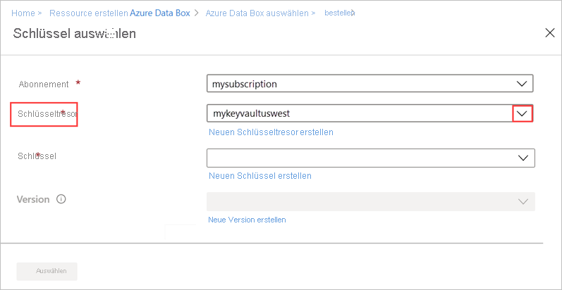

      Alternativ können Sie **Neuen Schlüsseltresor erstellen** auswählen, um einen neuen Schlüsseltresor zu erstellen. 
    
      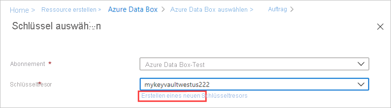      

      Geben Sie anschließend auf dem Bildschirm **Schlüsseltresor erstellen** die Ressourcengruppe und einen Schlüsseltresornamen ein. Stellen Sie sicher, dass die Optionen **Vorläufiges Löschen** und **Löschschutz** aktiviert sind. Übernehmen Sie für alle anderen Einstellungen die Standardwerte, und wählen Sie dann **Überprüfen und erstellen** aus.

      

      Überprüfen Sie die Informationen für Ihren Schlüsseltresor, und wählen Sie **Erstellen** aus. Warten Sie einige Minuten, bis die Erstellung des Schlüsseltresors abgeschlossen ist.

      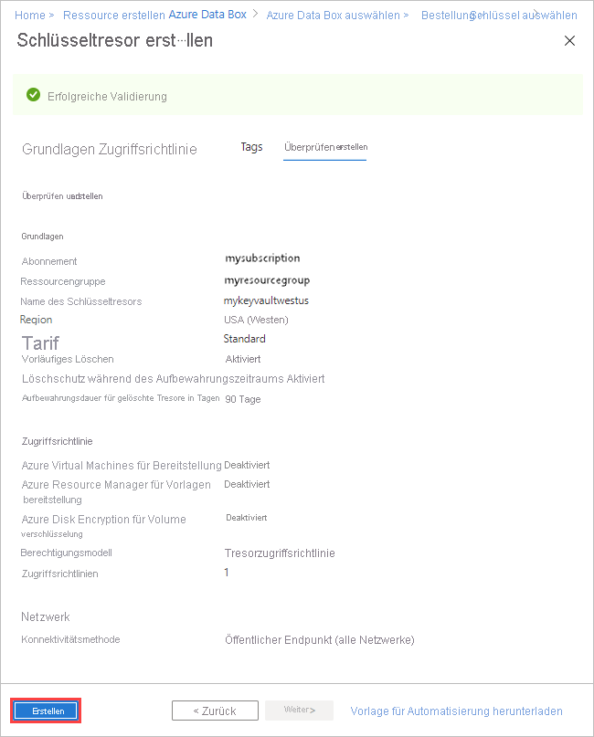

12. Auf dem Blatt **Schlüssel auswählen** wird Ihr ausgewählter Schlüsseltresor angezeigt.

    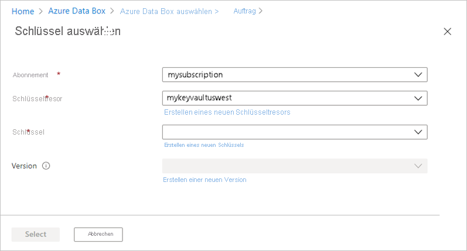

    Falls Sie einen neuen Schlüssel erstellen möchten, wählen Sie **Neuen Schlüssel erstellen** aus. Sie müssen einen RSA-Schlüssel verwenden. Der Wert für die Größe kann „2048“ oder höher lauten. Geben Sie einen Namen für Ihren neuen Schlüssel ein, behalten Sie ansonsten die Standardeinstellungen bei, und wählen Sie **Erstellen** aus.

      

      Sie werden benachrichtigt, wenn der Schlüssel in Ihrem Schlüsseltresor erstellt wurde. Ihr neuer Schlüssel wird ausgewählt und auf dem Blatt **Schlüssel auswählen** angezeigt.

13. Wählen Sie die **Version** des zu verwendenden Schlüssels und dann die Option **Auswählen** aus.

      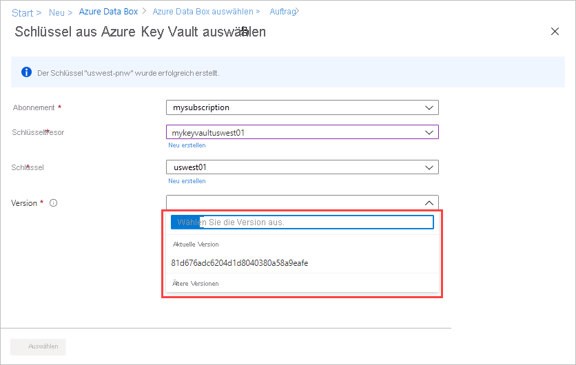

    Falls Sie eine neue Schlüsselversion erstellen möchten, wählen Sie die Option **Neue Version erstellen** aus.

    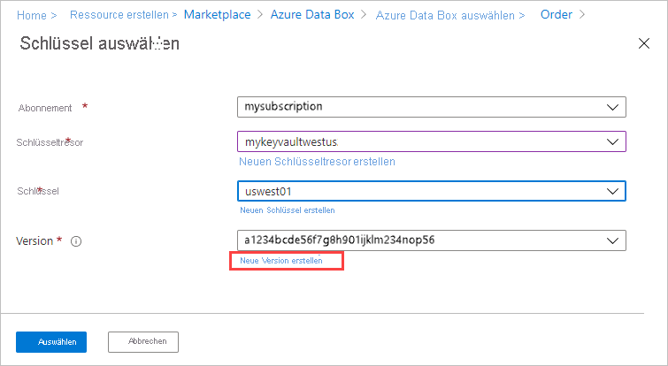

    Wählen Sie Einstellungen für die neue Schlüsselversion und dann die Option **Erstellen** aus.

    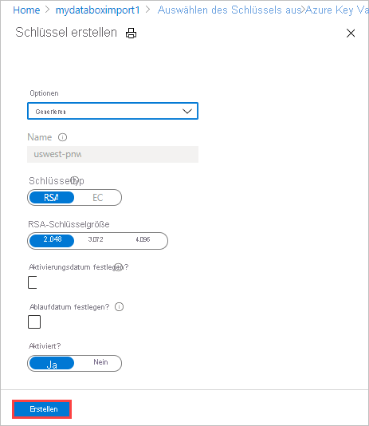

    Auf dem Bildschirm **Sicherheit** werden in den Einstellungen unter **Verschlüsselungstyp** Ihr Schlüsseltresor und der Schlüssel angezeigt.

    

14. Wählen Sie eine Benutzeridentität aus, die Sie zum Verwalten des Zugriffs auf diese Ressource verwenden. Wählen Sie die Option **Benutzeridentität auswählen** aus. Wählen Sie im Bereich auf der rechten Seite das zu verwendende Abonnement und die verwaltete Identität aus. Wählen Sie anschließend **Auswählen** aus.

    Eine vom Benutzer zugewiesene verwaltete Identität ist eine eigenständige Azure-Ressource, die zum Verwalten mehrerer Ressourcen verwendet werden kann. Weitere Informationen finden Sie unter [Arten von verwalteten Identitäten](../articles/active-directory/managed-identities-azure-resources/overview.md).  

    Befolgen Sie die Anleitung unter [Erstellen, Auflisten, Löschen oder Zuweisen einer Rolle zu einer vom Benutzer zugewiesenen verwalteten Identität über das Azure-Portal](../articles/active-directory/managed-identities-azure-resources/how-to-manage-ua-identity-portal.md), wenn Sie eine neue verwaltete Identität erstellen müssen.
    
    

    Die Benutzeridentität wird in den Einstellungen unter **Verschlüsselungstyp** angezeigt.

    

15. Wenn Sie nicht die systemseitig generierten Kennwörter verwenden möchten, die standardmäßig von Azure Data Box genutzt werden, erweitern Sie auf dem Bildschirm **Sicherheit** den Bereich **Bring Your Own Password** (Eigenes Kennwort verwenden).

    Die systemseitig generierten Kennwörter sind sicher und werden empfohlen, sofern in Ihrer Organisation keine anderen Vorgaben gelten.

    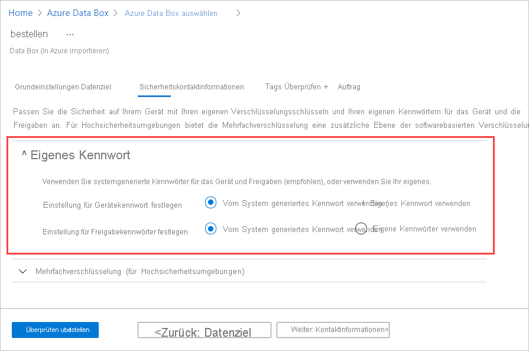 

   - Wenn Sie für Ihr neues Gerät ein eigenes Kennwort verwenden möchten, wählen Sie unter **Set preference for the device password** (Einstellung für das Gerätekennwort festlegen) die Option **Use your own password** (Eigenes Kennwort verwenden) aus, und geben Sie ein Kennwort ein, das die Sicherheitsanforderungen erfüllt.
     
     Das Kennwort muss alphanumerisch und 12 bis 15 Zeichen lang sein und mindestens einen Großbuchstaben, einen Kleinbuchstaben, ein Sonderzeichen und eine Ziffer enthalten.

     - Zulässige Sonderzeichen: @ # - $ % ^ ! + = ; : _ ( )
     - Nicht zulässige Zeichen: I i L o O 0
   
     

 - So verwenden Sie Ihre eigenen Kennwörter für Freigaben:

   1. Wählen Sie unter **Set preference for share passwords** (Einstellung für Freigabekennwörter festlegen) die Option **Use your own passwords** (Eigene Kennwörter verwenden) und anschließend **Select passwords for the shares** (Kennwörter für die Freigaben auswählen) aus.
     
       

    1. Geben Sie ein Kennwort für jedes im Auftrag enthaltene Speicherkonto ein. Das Kennwort wird für alle Freigaben für das Speicherkonto verwendet.
    
       Das Kennwort muss alphanumerisch und 12 bis 64 Zeichen lang sein und mindestens einen Großbuchstaben, einen Kleinbuchstaben, ein Sonderzeichen und eine Ziffer enthalten.

       - Zulässige Sonderzeichen: @ # - $ % ^ ! + = ; : _ ( )
       - Nicht zulässige Zeichen: I i L o O 0
     
    1. Wenn Sie das gleiche Kennwort für alle Speicherkonten verwenden möchten, wählen Sie **In alle kopieren** aus. 

    1. Wählen Sie abschließend **Speichern** aus.
     
       

    Auf dem Bildschirm **Sicherheit** können Sie mithilfe von **View or change passwords** (Kennwörter anzeigen oder ändern) die Kennwörter ändern.

16. Wenn Sie die softwarebasierte doppelte Verschlüsselung aktivieren möchten, erweitern Sie auf dem Bildschirm **Sicherheit** den Bereich **Double-encryption (for highly secure environments)**  (Doppelte Verschlüsselung (für Hochsicherheitsumgebungen)), und wählen Sie die Option **Doppelte Verschlüsselung für den Auftrag aktivieren** aus.

    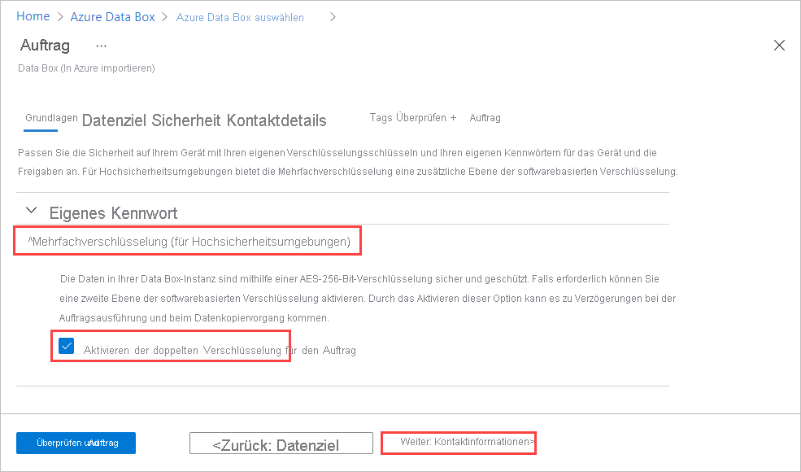

    Die softwarebasierte Verschlüsselung wird zusätzlich zur AES-256-Bit-Verschlüsselung der Daten auf der Data Box ausgeführt.

    > [!NOTE]
    > Wenn Sie diese Option aktivieren, können die Auftragsverarbeitung und das Kopieren von Daten länger dauern. Nach dem Erstellen des Auftrags können Sie diese Option nicht mehr ändern.

    Wählen Sie **Weiter: Kontaktdetails>** aus, um fortzufahren.

17. Wählen Sie unter **Kontaktdetails** die Option **+ Adresse hinzufügen** aus.

    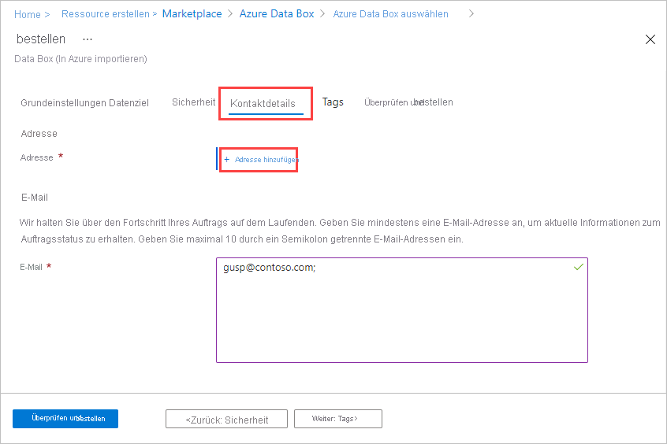

18. Geben Sie auf dem Bildschirm **Adresse hinzufügen** Ihren Vor- und Nachnamen, den Namen und die Postanschrift des Unternehmens sowie eine gültige Telefonnummer an. Wählen Sie **Adresse überprüfen** aus. Der Dienst überprüft die Adresse auf Dienstverfügbarkeit und benachrichtigt Sie, ob der Dienst für diese Adresse verfügbar ist.

    

    Wenn Sie den selbstverwalteten Versand ausgewählt haben, erhalten Sie nach der erfolgreichen Auftragserteilung eine E-Mail-Benachrichtigung. Weitere Informationen zum selbstverwalteten Versand finden Sie unter [Verwenden des selbstverwalteten Versands](../articles/databox/data-box-portal-customer-managed-shipping.md).

19. Wählen Sie **Weiter** aus, wenn die Versanddetails erfolgreich überprüft wurden. Sie kehren zur Registerkarte **Kontaktdetails** zurück.

20. Fügen Sie neben **E-Mail** mindestens eine E-Mail-Adresse hinzu. Der Dienst sendet E-Mail-Benachrichtigungen in Bezug auf Aktualisierungen des Auftragsstatus an die angegebenen E-Mail-Adressen.

    Es wird empfohlen, eine E-Mail-Gruppenadresse zu verwenden, damit Sie weiterhin Benachrichtigungen erhalten, wenn ein Administrator die Gruppe verlässt.

    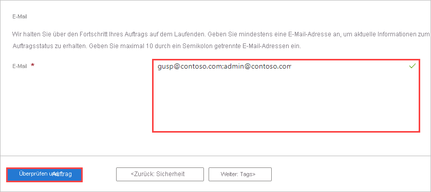

21. Überprüfen Sie die Informationen in **Überprüfen + bestellen** im Zusammenhang mit der Bestellung, den Kontakt, die Benachrichtigungen und die Datenschutzbestimmungen. Aktivieren Sie das Kontrollkästchen für die Zustimmung zu den Datenschutzbestimmungen.

22. Wählen Sie **Bestellen** aus. Die Erstellung des Auftrags dauert einige Minuten.

    