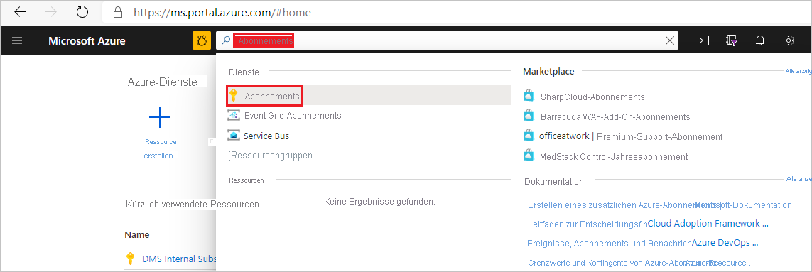

## Registrieren des Ressourcenanbieters „Microsoft.DataMigration“

1. Melden Sie sich beim Azure-Portal an. Suchen Sie nach **Abonnements**, und wählen Sie diese Option aus.

   

2. Wählen Sie das Abonnement aus, in dem Sie die Azure Database Migration Service-Instanz erstellen möchten, und klicken Sie dann auf **Ressourcenanbieter**.

    

3. Suchen Sie nach „Migration“, und wählen Sie dann **Registrieren** für **Microsoft.DataMigration** aus.

        
