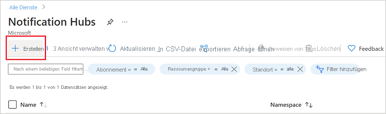

1. Melden Sie sich beim [Azure-Portal](https://portal.azure.com) an.

1. Wählen Sie im Menü auf der linken Seite die Option **Alle Dienste** und dann im Abschnitt **Mobil** die Option **Notification Hubs** aus. Wählen Sie das Sternsymbol neben dem Dienstnamen aus, um den Dienst im linken Menü zum Abschnitt **FAVORITEN** hinzuzufügen. Nachdem **Notification Hubs** unter **FAVORITEN** hinzugefügt wurde, können Sie diesen Eintrag im Menü auf der linken Seite auswählen.

      

1. Wählen Sie auf der Seite **Notification Hubs** in der Symbolleiste die Option **Erstellen** aus.

      

1. Führen Sie auf der Registerkarte **Grundlagen** der Seite **Notification Hub** die folgenden Schritte aus:

    1. Wählen Sie unter **Abonnement** den Namen des Azure-Abonnements aus, das Sie verwenden möchten, und wählen Sie dann eine vorhandene Ressourcengruppe aus, oder erstellen Sie eine neue Ressourcengruppe.  

    1. Geben Sie unter **Namespacedetails** einen eindeutigen Namen für den neuen Namespace ein. 
    
    1. Ein Namespace enthält mindestens einen Notification Hub. Geben Sie daher unter **Notification Hub-Details** einen Namen für den Hub ein. Alternativ können Sie in der Dropdownliste einen vorhandenen Namespace auswählen.

    1. Wählen Sie im Dropdown-Listenfeld **Standort** einen Wert aus. Dieser Wert gibt den Standort an, an dem der Hub erstellt werden soll.

    1. Klicken Sie auf **Erstellen**.

        

1. Wählen Sie **Benachrichtigungen** (Glockensymbol) und dann **Zu Ressource wechseln** aus. Sie können auch die Liste auf der Seite **Notification Hubs** aktualisieren und Ihren Hub auswählen.

      

1. Wählen Sie in der Liste die Option **Zugriffsrichtlinien** aus. Notieren Sie sich die beiden Verbindungszeichenfolgen, die für Sie verfügbar sind. Sie werden später für die Behandlung von Pushbenachrichtigungen benötigt.

      >[!IMPORTANT]
      >Verwenden Sie *nicht* die Richtlinie **DefaultFullSharedAccessSignature** in Ihrer Anwendung. Diese ist nur für die Verwendung in Ihrem Back-End vorgesehen.
      >

      
